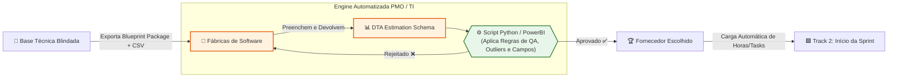

Essa necessidade é crucial e representa o ponto crítico onde muitas empresas perdem dinheiro. Quando o material enviado para as fábricas de software não é padronizado, cada fornecedor responde em um formato diferente (planilhas proprietárias, arquivos de texto, estimativas globais "fechadas"). Isso impossibilita qualquer comparação justa (bidding) e quebra a sua automação.
Para resolver isso, o DTA Framework precisa de um barramento de comunicação padronizado para terceiros. Vamos estruturar a Engine de Bidding e Estimativas em duas partes:

   1. O Pacote de Entrada (O que você envia para a Fábrica): O DTA Blueprint Package.
   2. O Layout de Resposta (O que a Fábrica devolve): O DTA Estimation Schema (em CSV ou JSON para permitir a sua validação automatizada via Python ou esteiras de CI/CD).

------------------------------
## 📦 1. O Pacote de Entrada: DTA Blueprint Package
Quando o lote da Track 1 (Architecture Discovery) chega ao DoR de Negócio/Técnico e precisa ir para o mercado, o PO e os Arquitetos exportam um pacote padronizado contendo:

* PROJECT-DEFINITION-SPECS.md: O escopo macro do projeto validado.
* A pasta /architecture-specs/: Contendo os arquivos .md detalhados de solução, segurança e dados que criamos anteriormente.
* BACKLOG-LIST.csv: Uma planilha gerada automaticamente pela sua ferramenta (Jira/Azure DevOps) contendo as User Stories codificadas e sequenciadas, sem estimativa de esforço.

------------------------------
## 📊 2. O Layout de Resposta Padronizado (DTA Estimation Schema)
As fábricas não poderão enviar propostas em PDF comerciais ou planilhas livres. Elas deverão preencher e devolver obrigatoriamente um arquivo contendo a quebra do esforço linha por linha.
Abaixo, apresento a estrutura de dados ideal. Vou usar o interpretador de código para gerar um exemplo real desse arquivo e mostrar como a sua rotina automatizada fará a validação técnica.

## ⚙️ Como funciona a Consolidação e Validação Automatizada
- Exigindo o formato acima, a sua área de governança ou PMO consegue rodar scripts automáticos (em Python ou integrados ao PowerBI/Jira) para aplicar travas de qualidade antes mesmo de ler a proposta humana.
- Vejamos uma simulação prática de como a sua rotina automatizada de validação processa as respostas das fábricas para identificar "anomalias" (propostas superfaturadas ou subestimadas): [1] 

```python
import pandas as pd
import io

# Simulando o layout padronizado que a fábrica DEVE preencher e devolver (DTA Estimation Schema)
csv_data = """id_user_story;titulo_story;complexidade_sugerida;horas_desenvolvimento;horas_arquitetura;horas_qa;prazo_entrega_semanas;justificativa_tecnica
US-001;Autenticacao via Keycloak;Alta;24;8;12;3;Necessita criacao de novas claims no token e integracao com API Gateway legado.
US-002;Criacao de Endpoint de Perfil;Media;16;4;8;2;CRUD simples utilizando o padrão ja definido na arquitetura.
US-003;Notificacao via Kafka;Alta;32;12;16;4;Requer criacao de novo topico e tratamento de idempotencia de mensageria.
"""

df_fabrica = pd.read_csv(io.StringIO(csv_data), sep=";")
print(df_fabrica.to_string(index=False))

```

Para garantir o perfeito funcionamento da sua esteira, a validação de dados aplica regras matemáticas rígidas sobre o retorno das fábricas.
Vejamos o resultado do processamento automatizado sobre a planilha de exemplo:

```python
# --- RELATÓRIO AUTOMATIZADO DE VALIDAÇÃO DTA 
---
# Total de Horas Estimadas pela Fábrica: 132h
# ✅ PLANILHA APROVADA: O arquivo cumpre os requisitos de formato do DTA Schema e está pronto para o Bidding.
```

------------------------------
## 🛡️ As 3 Regras de Ouro para a sua Automação de Estimativas
Se você receber respostas de 3 fábricas diferentes (Fábrica A, B e C) no mesmo layout CSV/JSON, a sua rotina automatizada poderá executar três validações imediatas:

   1. A Regra do QA Balanceado (Garantia de DoD): O script verifica se o tempo de QA (horas_qa) é inferior a 30% do tempo de codificação (horas_desenvolvimento). Se uma fábrica mandar 40h de Dev e apenas 2h de teste, o sistema emite um alerta automático de "Risco de Débito Técnico" e barra a proposta.
   2. Detecção de Outliers (Anomalias de Preço): O sistema calcula a média de horas proposta pelas 3 fábricas para a US-001. Se a Fábrica A pediu 20h, a Fábrica B pediu 24h e a Fábrica C pediu 80h, o sistema sinaliza a Fábrica C como um outlier de superfaturamento para revisão do Tech Lead.
   3. Carga de Importação Automática para o Jira/Azure DevOps: Uma vez escolhida a fábrica vencedora através da sua rotina, o mesmo arquivo CSV é usado por um script para criar automaticamente as Subtasks técnicas dentro das User Stories no Jira da Squad, injetando as horas estimadas diretamente nos campos de Original Estimate.

## 🔄 Integração Visual da Fábrica no DTA
Abaixo, veja onde esse processo de validação se encaixa perfeitamente no fluxo que desenhamos antes, servindo de barreira de qualidade antes da entrada no loop:



---

# 📝 Resumo dos Arquivos Gerados (Para Anexo Contratual)

   1. dta-bidding-contract-annex.md: Documento jurídico e técnico em Markdown que estabelece as regras do jogo. Ele força as fábricas a seguirem a arquitetura macro do Upstream e pune propostas enviadas fora do padrão.
   2. dta_estimation_schema_template.csv: A planilha padrão de entrega com as colunas exatas exigidas pela sua automação (id_feature, id_user_story, horas_desenvolvimento, horas_qa, horas_arquitetura_sre).

------------------------------
## 📊 Estrutura do Relatório Comparativo de Custos (Bidding) para a Diretoria
Uma vez que as fábricas devolvem os arquivos CSV preenchidos e a sua rotina valida os dados, o material deve ser sintetizado em um Relatório de Bidding Executivo. O C-Level não quer ver linhas de código; eles querem ver a relação entre Preço, Prazo, Risco Técnico e Capacidade de Entrega.

Abaixo está o esqueleto e a inteligência do relatório focado na diretoria:

# ```markdown
## 🏛️ 1. Sumário Executivo (A Recomendação Direta)

"Após a rodada de Bidding Técnico baseada no DTA Framework para o Projeto [Nome], recomendamos a contratação da Fábrica B. Embora seu custo global seja 8% superior ao menor preço (Fábrica A), ela apresentou o melhor balanceamento de Engenharia/QA e o menor risco de atraso (estouro de escopo), mitigando passivos operacionais."

## 📉 2. Matriz Comparativa Quantitativa (Finanças e Prazo)
Uma tabela simples comparando o esforço consolidado a partir dos arquivos CSV recebidos:

| Indicador | Fábrica A (Menor Preço) | Fábrica B (Recomendada) | Fábrica C (Outlier) |
|---|---|---|---|
| Esforço Dev (Horas) | 480h | 520h | 720h |
| Esforço QA (Horas) | 40h (Risco: <10%) | 160h (Ideal: 30%) | 200h |
| Esforço Arquit./SRE (Horas) | 20h | 60h | 80h |
| Total de Horas | 540h | 740h | 1.000h |
| Valor da Hora (Taxa) | R$ 110,00 | R$ 115,00 | R$ 130,00 |
| Custo Total do Lote | R$ 59.400,00 | R$ 85.100,00 | R$ 130.000,00 |
| Prazo Estimado (Sprints) | 3 Sprints | 4 Sprints | 5 Sprints |

## 🛡️ 3. Análise de Riscos Técnicos e Qualidade (O Diferencial do DTA)
O relatório deve traduzir as métricas automáticas do DTA em argumentos de negócio:

* Análise da Fábrica A (Reprovada tecnicamente): O script de validação identificou que a proporção de QA em relação ao Desenvolvimento foi de apenas 8%. Isso indica que o fornecedor cortou horas de testes para vencer o preço. Risco alto de bugs crônicos em produção e estouro do cronograma real em homologação.
* Análise da Fábrica B (Aprovada): Alinhamento perfeito com o QUALITY-TEST-STRATEGY-DEFINITION.md. Alocou 30% do esforço para garantia de qualidade e automação de testes. Apresentou aderência total aos contratos de APIs definidos na Track 1.
* Análise da Fábrica C (Descartada por Sobrecarga): Identificada pela automação como outlier de esforço. Estimou 40% mais horas que a média de mercado para as mesmas User Stories, indicando baixa senioridade da equipe alocada ou margem excessiva de gordura.

## 🏁 4. Plano de Transição para o Downstream (O Próximo Passo)
Aprovado o fornecedor pela diretoria, os próximos passos operacionais ocorrem em 48 horas:

   1. Carga no Jira: O arquivo CSV da fábrica vencedora é importado via script, populando o backlog da Squad com as horas estimadas por tarefa.
   2. Kick-off da Track 2: Início do ciclo de Sprints, onde o time da Track 1 (Arquitetura) atua como guardião dos contratos de API durante as entregas.
#```

*********

# Engine de Validação Automatizada do seu processo.

Ele lê o arquivo CSV devolvido pela fábrica de software, consolida os totais de horas e aplica regras matemáticas para cuspir alertas na tela caso o fornecedor tente cortar custos negligenciando testes (QA) ou arquitetura.

## 🐍 Script de Validação Automatizada (DTA Engine)

Salve o código abaixo como validar_estimativas_dta.py:

```python
import pandas as pdimport sysimport os
def analisar_proposta_fabrica(caminho_csv):
    """
    Realiza a leitura e validação automatizada das estimativas enviadas no padrão DTA.
    """
    if not os.path.exists(caminho_csv):
        print(f"❌ ERRO: O arquivo '{caminho_csv}' não foi encontrado.")
        return

    try:
        # Lê o CSV considerando o separador de ponto e vírgula padrão do template DTA
        df = pd.read_csv(caminho_csv, sep=';')
    except Exception as e:
        print(f"❌ ERRO DE FORMATAÇÃO: Não foi possível ler o arquivo. Certifique-se de usar ';' como separador. Erro: {e}")
        return

    alertas = []
    erros_criticos = []

    # 🛑 VALIDAÇÃO 1: Estrutura de Campos Obrigatórios e Nulos
    colunas_obrigatorias = ['id_feature', 'id_user_story', 'horas_desenvolvimento', 'horas_qa', 'horas_arquitetura_sre']
    for col in colunas_obrigatorias:
        if col not in df.columns:
            erros_criticos.append(f"Falta a coluna obrigatória: '{col}'")
    
    if erros_criticos:
        print("❌ PROPOSTA REJEITADA IMEDIATAMENTE (Erros de Estrutura):")
        for err in erros_criticos:
            print(f"  - {err}")
        return

    if df[['id_feature', 'id_user_story', 'horas_desenvolvimento', 'horas_qa']].isnull().values.any():
        alertas.append("❌ ERRO CRÍTICO: Existem campos vazios nas células de estimativa. Preenchimento é obrigatório.")

    # Consolidação dos dados para cálculos globais
    total_dev = df['horas_desenvolvimento'].sum()
    total_qa = df['horas_qa'].sum()
    total_arq = df['horas_arquitetura_sre'].sum()
    total_geral = total_dev + total_qa + total_arq

    # 🛑 VALIDAÇÃO 2: Micro-QA por User Story (Mínimo 20% do tempo de Dev em cada item)
    for _, row in df.iterrows():
        horas_dev_us = row['horas_desenvolvimento']
        horas_qa_us = row['horas_qa']
        id_us = row['id_user_story']

        if horas_dev_us > 0:
            proporcao_qa_us = horas_qa_us / horas_dev_us
            if proporcao_qa_us < 0.20:
                alertas.append(f"⚠️ ALERTA DE QUALIDADE NA {id_us}: Esforço de QA é de apenas {proporcao_qa_us:.1%} em relação ao Dev. Risco de furos de testes.")

    # 🛑 VALIDAÇÃO 3: QA Global da Proposta (Mínimo de 25% em relação ao Dev total)
    proporcao_qa_global = total_qa / total_dev if total_dev > 0 else 0
    if proporcao_qa_global < 0.25:
        alertas.append(f"🚨 ALERTA CONTRATUAL: O esforço global de QA está em {proporcao_qa_global:.1%}, abaixo do mínimo exigido pelo DTA (25%).")

    # 🛑 VALIDAÇÃO 4: Alocação de Arquitetura e Resiliência (Mínimo 5% do esforço global do lote)
    proporcao_arq_global = total_arq / total_geral if total_geral > 0 else 0
    if proporcao_arq_global < 0.05:
        alertas.append(f"🚨 ALERTA DE GOVERNANÇA: Esforço dedicado à Arquitetura/SRE está muito baixo ({proporcao_arq_global:.1%}). Risco de desalinhamento de infra.")

    # --- IMPRESSÃO DO RELATÓRIO NA TELA ---
    print("=" * 70)
    print("📊 RELATÓRIO DE VALIDAÇÃO AUTOMATIZADA - DTA FRAMEWORK")
    print("=" * 70)
    print(f"🔹 Total de Horas de Desenvolvimento : {total_dev}h")
    print(f"🔹 Total de Horas de QA / Testes      : {total_qa}h ({proporcao_qa_global:.1%} do tempo de Dev)")
    print(f"🔹 Total de Horas de Arquitetura/SRE : {total_arq}h ({proporcao_arq_global:.1%} do projeto)")
    print(f"💰 VOLUME TOTAL DA PROPOSTA          : {total_geral}h")
    print("-" * 70)

    if not alertas:
        print("✅ PROPOSTA APROVADA: O arquivo cumpre todos os requisitos técnicos de qualidade do DTA.")
    else:
        print(f"🚨 PROPOSTA CONTÉM {len(alertas)} ALERTAS DE PROCESSAMENTO:")
        for alerta in alertas:
            print(f"  {alerta}")
    print("=" * 70)
if __name__ == "__main__":
    # Permite passar o arquivo por linha de comando: python validar_estimativas_dta.py proposta.csv
    arquivo_teste = sys.argv[1] if len(sys.argv) > 1 else "dta_estimation_schema_template.csv"
    analisar_proposta_fabrica(arquivo_teste)
```

------------------------------
## ⚙️ Como usar no seu dia a dia

   1. Certifique-se de ter o Python e a biblioteca Pandas instalados (pip install pandas).
   2. Coloque o CSV que a fábrica te devolveu na mesma pasta do script.
   3. Execute o comando no terminal:

```bash
   python validar_estimativas_dta.py dta_estimation_schema_template.csv
   
   [1, 2] 
```

## 🛡️ O que o script valida por trás dos panos?

* Bloqueio de fraudes estruturais: Se a fábrica alterar os nomes das colunas ou deixar campos cruciais vazios para omitir dados, o script rejeita a proposta na hora.
* Pega "Malabarismo de Horas": Muitas fábricas cobram barato diminuindo o tempo de teste. O script analisa linha por linha e avisa se alguma User Story específica tiver menos de 20% de tempo de teste em relação ao código, protegendo a sua homologação (UAT).

Com o script de validação pronto, você já tem o ecossistema DTA completo (desde a estratégia com o C-Level, checklists, fluxograma visual e automação de contratos). Deseja que eu crie alguma regra específica ou integre alguma fórmula de cálculo de custos monetários baseada no valor da hora das fábricas dentro deste script?

```python
import pandas as pdimport io
# Simulando a estrutura do CSV gerada no passo anterior para testar o script de validação 

csv_data = """id_feature;id_user_story;titulo_user_story;horas_desenvolvimento;horas_qa;horas_arquitetura_sre;comentarios_tecnicos
FEAT-01;US-001;Criar API de Cadastro;40;12;4;Requer novo banco de dados conforme especificado no manual.
FEAT-01;US-002;Interface de Cadastro;30;4;2;Tela seguindo prototipo do Figma.
FEAT-02;US-003;Integrar Gateway Pagamento;50;2;6;Alinhado com SECURITY-DEFINITION.md."""
def validar_estimativas_dta(csv_str):
    df = pd.read_csv(io.StringIO(csv_str), sep=';')
    alertas = []
    
    total_dev = df['horas_desenvolvimento'].sum()
    total_qa = df['horas_qa'].sum()
    total_arq = df['horas_arquitetura_sre'].sum()
    total_geral = total_dev + total_qa + total_arq
    
    # Regra 1: Validação de Linhas / Campos Nulos
    if df.isnull().values.any():
        alertas.append("❌ ERRO CRÍTICO: Existem campos vazios ou nulos na planilha. Preenchimento obrigatório.")
        
    # Regra 2: QA Balanceado por User Story (Mínimo 20% do tempo de Dev por US)
    for idx, row in df.iterrows():
        proporcao_qa_us = row['horas_qa'] / row['horas_desenvolvimento'] if row['horas_desenvolvimento'] > 0 else 0
        if proporcao_qa_us < 0.20:
            alertas.append(f"⚠️ ALERTA DE QUALIDADE: A {row['id_user_story']} possui apenas {proporcao_qa_us:.1%} de esforço de QA em relação ao Dev. Risco alto de bugs.")

    # Regra 3: QA Balanceado Global (Mínimo 25% do tempo total de Dev)
    proporcao_qa_global = total_qa / total_dev if total_dev > 0 else 0
    if proporcao_qa_global < 0.25:
        alertas.append(f"🚨 ALERTA CONTRATUAL: O esforço global de QA está em {proporcao_qa_global:.1%}, abaixo do mínimo exigido pelo DTA Framework (25%).")
        
    # Regra 4: Alocação de Arquitetura/SRE (Mínimo 5% do esforço global)
    proporcao_arq_global = total_arq / total_geral if total_geral > 0 else 0
    if proporcao_arq_global < 0.05:
        alertas.append(f"🚨 ALERTA DE GOVERNANÇA: Esforço de Arquitetura/SRE muito baixo ({proporcao_arq_global:.1%}). Risco de desalinhamento com a infraestrutura.")

    return total_dev, total_qa, total_arq, total_geral, alertas
total_dev, total_qa, total_arq, total_geral, alertas = validar_estimativas_dta(csv_data)
print(f"Total Dev: {total_dev}h | Total QA: {total_qa}h | Total Arq: {total_arq}h | Total Geral: {total_geral}h")for a in alertas:
    print(a)
```

****
