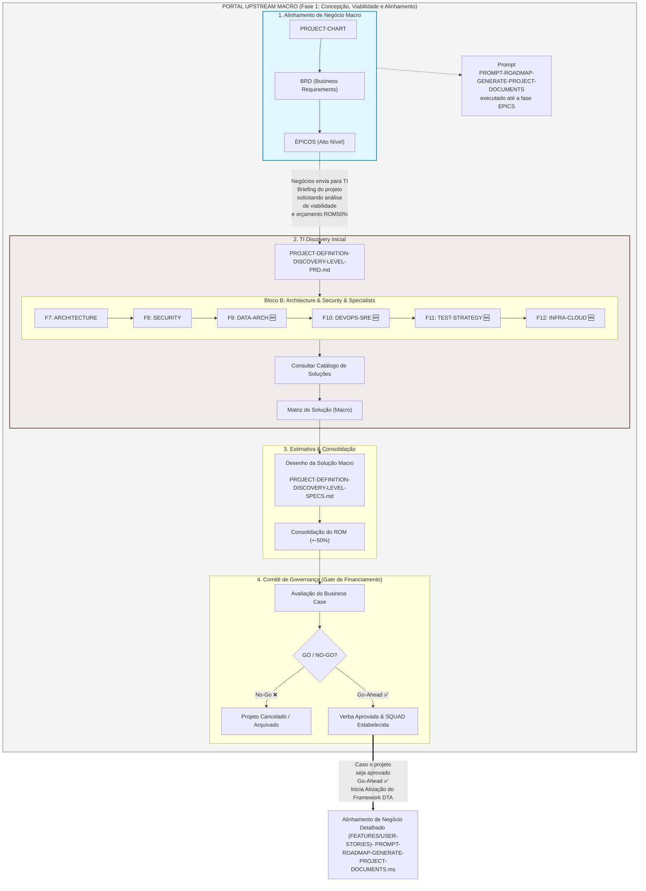

# IDEAÇÃO DE FLUXO DE DISCOVERY UPSTREAM ENGINEERING AND ARCHITECTURE

```mermaid
flowchart TD
    %% =========================================================================
    %% DESIGN DE CORES E ESTILOS OFICIAIS DTA
    %% =========================================================================
    classDef upstreamStyle fill:#f5f5f5,stroke:#9e9e9e,stroke-width:2px;
    classDef negoStyle fill:#e1f5fe,stroke:#0288d1,stroke-width:2px;
    classDef discStyle fill:#efebe9,stroke:#5d4037,stroke-width:2px;
    
    classDef track1Style fill:#fff3e0,stroke:#e65100,stroke-width:2px,stroke-dasharray: 5 5;
    classDef track2Style fill:#f3e5f5,stroke:#7b1fa2,stroke-width:2px;
    classDef deliveryStyle fill:#e8f5e9,stroke:#2e7d32,stroke-width:2px;
    
    %% =========================================================================
    %% PORTAL UPSTREAM MACRO: GOVERNANÇA E VIABILIDADE (Roda uma única vez)
    %% =========================================================================
    subgraph GATEWAY ["PORTAL UPSTREAM MACRO (Fase 1: Concepção, Viabilidade e Alinhamento)"]
        direction TB
        
        subgraph G_NEGO ["1. Alinhamento de Negócio Macro"]
            PROJECT-CHART["PROJECT-CHART"] --> BRD["BRD (Business Requirements)"] --> EPICS["ÉPICOS (Alto Nível)"]
        end
        G_NEGO .-> PROMPT-ROADMAP-GENERATE-PROJECT-DOCUMENTS["Prompt<br>PROMPT-ROADMAP-GENERATE-PROJECT-DOCUMENTS<br>executado até a fase EPICS"]
        
        subgraph G_TECH ["2. TI Discovery Inicial"]
            DISCOVERY-PRD["PROJECT-DEFINITION-DISCOVERY-LEVEL-PRD.md"] 
            
            subgraph BLOCO_B[Bloco B: Architecture & Security & Specialists]
                F7[F7: ARCHITECTURE] --> F8[F8: SECURITY]
                F8 --> F9[F9: DATA-ARCH 🆕]
                F9 --> F10[F10: DEVOPS-SRE 🆕]
                F10 --> F11[F11: TEST-STRATEGY 🆕]
                F11 --> F12[F12: INFRA-CLOUD 🆕]
            end
                   
            
            DISCOVERY-PRD --> BLOCO_B --> CATALOGO["Consultar Catálogo de Soluções"] --> MATRIZ_MACRO["Matriz de Solução (Macro)"]
        end
        
        subgraph G_ESTI ["3. Estimativa & Consolidação"]
            entrega_docum["Desenho da Solução Macro<br><br>PROJECT-DEFINITION-DISCOVERY-LEVEL-SPECS.md<br>"] --> consolidacao["Consolidação do ROM (+-50%)"]
        end
        
        subgraph G_COMITE ["4. Comitê de Governança (Gate de Financiamento)"]
            AVALIA_BC["Avaliação do Business Case"] --> DECISAO{"GO / NO-GO?"}
            DECISAO -- "No-Go ❌" --> CANCELADO["Projeto Cancelado / Arquivado"]
            DECISAO -- "Go-Ahead ✅" --> GATILHO_SQUAD["Verba Aprovada & SQUAD Estabelecida"]
        end
        
        %% Conexões do Gateway
        EPICS -- "<br>Negócios envia para TI<br>Briefing do projeto<br>solicitando análise<br>de viabilidade<br>e orçamento ROM50%<br><br>" --> DISCOVERY-PRD
        MATRIZ_MACRO --> entrega_docum
        consolidacao --> AVALIA_BC
    end
    class GATEWAY upstreamStyle;
    class G_NEGO negoStyle;
    class G_TECH discStyle;

    %% GATILHO PARA ENTRADA NO MODELO DTA DUAL-TRACK
    GATILHO_SQUAD ==> |"Caso o projeto<br>seja aprovado<br>Go-Ahead ✅<br>Inicia Ativação do Framework DTA"| PROMPT-ROADMAP-GENERATE-PROJECT-DOCUMENTS-EVOLUCAO["Alinhamento de Negócio Detalhado (FEATURES/USER-STORIES)- PROMPT-ROADMAP-GENERATE-PROJECT-DOCUMENTS.ms"]

```
