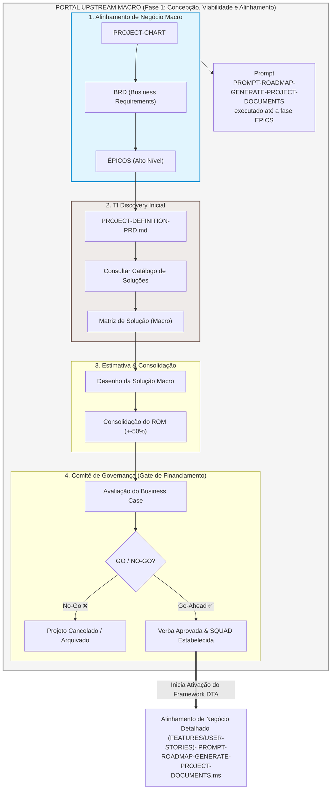

Aqui está o diagrama Mermaid definitivo do DTA Framework (DualTrack Architecture & Agile).
Este desenho consolida visualmente toda a inteligência do seu processo: separa a governança inicial (Upstream Macro) do modelo de execução contínuo em paralelo (Fase 2). Ele destaca como o Track 1 (Architecture Discovery) e o Track 2 (Agile Delivery) trabalham sintonizados em lotes para alimentar o ciclo de Sprints.
## 📊 Código Mermaid Definitivo: DTA Framework

```mermaid
flowchart TD
    %% =========================================================================
    %% DESIGN DE CORES E ESTILOS OFICIAIS DTA
    %% =========================================================================
    classDef upstreamStyle fill:#f5f5f5,stroke:#9e9e9e,stroke-width:2px;
    classDef negoStyle fill:#e1f5fe,stroke:#0288d1,stroke-width:2px;
    classDef discStyle fill:#efebe9,stroke:#5d4037,stroke-width:2px;
    
    classDef track1Style fill:#fff3e0,stroke:#e65100,stroke-width:2px,stroke-dasharray: 5 5;
    classDef track2Style fill:#f3e5f5,stroke:#7b1fa2,stroke-width:2px;
    classDef deliveryStyle fill:#e8f5e9,stroke:#2e7d32,stroke-width:2px;
    
    %% =========================================================================
    %% PORTAL UPSTREAM MACRO: GOVERNANÇA E VIABILIDADE (Roda uma única vez)
    %% =========================================================================
    subgraph GATEWAY ["PORTAL UPSTREAM MACRO (Fase 1: Concepção, Viabilidade e Alinhamento)"]
        direction TB
        
        subgraph G_NEGO ["1. Alinhamento de Negócio Macro"]
            PROJECT-CHART["PROJECT-CHART"] --> BRD["BRD (Business Requirements)"] --> EPICS["ÉPICOS (Alto Nível)"]
        end
        
        subgraph G_TECH ["2. TI Discovery Inicial"]
            DISCOVERY-PRD["PROJECT-DEFINITION-PRD.md"] --> CATALOGO["Consultar Catálogo de Soluções"] --> MATRIZ_MACRO["Matriz de Solução (Macro)"]
        end
        
        subgraph G_ESTI ["3. Estimativa & Consolidação"]
            entrega_docum["Desenho da Solução Macro"] --> consolidacao["Consolidação do ROM (+-50%)"]
        end
        
        subgraph G_COMITE ["4. Comitê de Governança (Gate de Financiamento)"]
            AVALIA_BC["Avaliação do Business Case"] --> DECISAO{"GO / NO-GO?"}
            DECISAO -- "No-Go ❌" --> CANCELADO["Projeto Cancelado / Arquivado"]
            DECISAO -- "Go-Ahead ✅" --> GATILHO_SQUAD["Verba Aprovada & SQUAD Estabelecida"]
        end
        
        %% Conexões do Gateway
        EPICS --> DISCOVERY-PRD
        MATRIZ_MACRO --> entrega_docum
        consolidacao --> AVALIA_BC
    end
    class GATEWAY upstreamStyle;
    class G_NEGO negoStyle;
    class G_TECH discStyle;

    %% GATILHO PARA ENTRADA NO MODELO DTA DUAL-TRACK
    GATILHO_SQUAD ==> |"Inicia Ativação do Framework DTA"| TRACK_1_INGESTION

    %% =========================================================================
    %% 🔄 MODELO DE EXECUÇÃO EM PARALELO: DUAL-TRACK ARCHITECTURE & AGILE (Fase 2)
    %% =========================================================================
    subgraph DTA_EXECUTION ["🔄 FRAMEWORK DTA (Fase 2: Execução Contínua e Iterativa em Ondas)"]
        
        %% 🟧 TRACK 1: ARCHITECTURE DISCOVERY & PRODUCT INGESTION
        subgraph TRACK_1 ["TRACK 1: ARCHITECTURE DISCOVERY (O Escudo Técnico - Um passo à frente)"]
            direction TB
            TRACK_1_INGESTION["🆕 Novas Features / Ideias (Lotes de Ingestão)"]
            PRODUCT_REFINEMENT["📐 Refinamento de Negócio (PO/PM)<br>• Aplicação do DoR de Negócio"]
            PRODUCT_BACKLOG["📋 PRODUCT BACKLOG LIST (Pronto para TI)"]
            
            DETALHAMENTO_MD["🔍 Discovery Técnico Contínuo de User Stories<br>• Incremento dos Arquivos de Definição (.md)<br>• Contratos de API, Dados, Segurança e SRE"]
            
            TRACK_1_INGESTION --> PRODUCT_REFINEMENT --> PRODUCT_BACKLOG
            PRODUCT_BACKLOG --> DETALHAMENTO_MD
        end
        class TRACK_1 track1Style;

        %% 🟪 TRACK 2: AGILE DELIVERY
        subgraph TRACK_2 ["TRACK 2: AGILE DELIVERY (O Motor da Squad - Execução das Sprints)"]
            direction TB
            SQUAD_REFINEMENT["🛠️ Refinamento Técnico & Estimativa (Squad)<br>• Análise contra as Definições Técnicas (.md)<br>• Aplicação do DoR Técnico (Story Points)"]
            SPRINT_BACKLOG["🎯 SPRINT BACKLOG (Ready for Dev)"]
            
            SQUAD_REFINEMENT --> SPRINT_BACKLOG
        end
        class TRACK_2 track2Style;

        %% 🟩 CICLO DE EXECUÇÃO DA SPRINT (DOWNSTREAM)
        subgraph SPRINT_CYCLE ["7. Sprint Development Cycle"]
            direction LR
            STATUS_DEV["🏃 Em Dev<br>(Coding)"] --> STATUS_PR["👀 Code Review<br>(PR)"] --> STATUS_QA["🧪 Em Teste / QA<br>(Homologação)"] --> STATUS_UAT["🤝 Em UAT<br>(PO/Cliente)"] --> STATUS_PROD["🚀 Em Produção<br>(Live)"]
        end
        class SPRINT_CYCLE deliveryStyle;

    end

    %% 🔀 CONEXÕES DE SINCRONISMO DE ENGENHARIA (O CORAÇÃO DO DTA)
    
    %% O Discovery Técnico da Track 1 alimenta e blinda o Refinamento da Squad na Track 2
    DETALHAMENTO_MD ==> |"Insumos Técnicos e Contratos Blindados<br>(Garante Velocidade e Padrão)"| SQUAD_REFINEMENT
    
    %% O Sprint Backlog alimenta o ciclo de desenvolvimento
    SPRINT_BACKLOG ==> |"Puxado para a Sprint Ativa"| STATUS_DEV
    
    %% O Feedback Loop Contínuo: Itens em produção geram novos aprendizados e o ciclo recomeça
    STATUS_PROD -. "Próxima Onda / Próximo Lote do Backlog" .-> TRACK_1_INGESTION
```

------------------------------
## 🎨 Destaques Visuais do Diagrama DTA

   1. O Gateway (Portal Superior): Representa a governança tradicional que roda apenas uma vez. Ela é fundamental para dar visibilidade financeira e jurídica à diretoria (ROM) sem engessar a Squad.
   2. Track 1 (Borda Tracejada Laranja): Mostra que o trabalho do PO/PM e dos Arquitetos seniores corre em paralelo ao desenvolvimento. Eles funcionam como o "Escudo Técnico" que limpa os trilhos, detalhando as especificações (.md) apenas para o lote atual de histórias.
   3. Track 2 & Sprint Cycle (Borda Roxa e Verde): A esteira de desenvolvimento ágil focada em execução pura. Ela consome o conteúdo já mastigado pela Track 1, gerando o Sprint Backlog com previsibilidade altíssima (atendendo ao DoR Técnico) e sem interrupções.
   4. Linha Pontilhada de Retorno: Cria o ciclo infinito do ecossistema do produto, puxando novos lotes de valor continuamente à medida que as entregas chegam em produção.

Com o DTA Framework completamente estruturado com seu Nome, Checklists de DoR, KPIs, Pitch para Diretoria e o Diagrama Visual Definitivo, finalizamos o mapeamento do seu roadmap de governança técnica viva. Há algum outro artefato, regra de transição ou política que você gostaria de explorar para fechar esse processo com chave de ouro?

******

