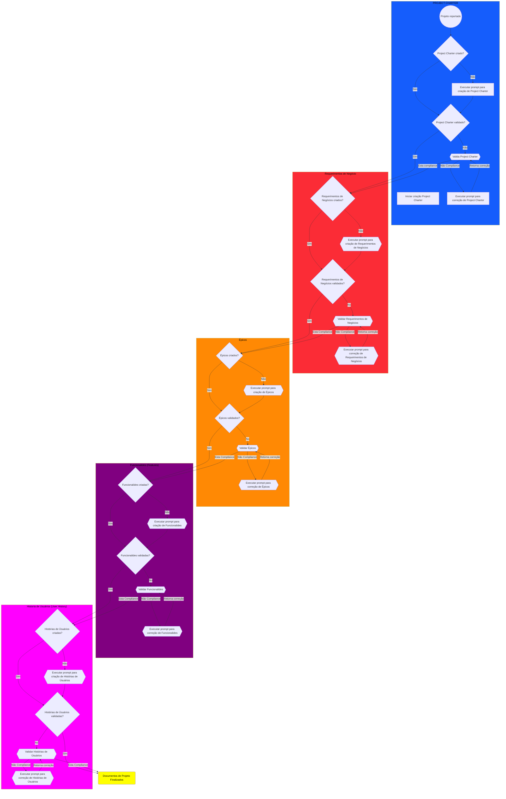

#ROADMAP - DESENVOLVIMENTO SOLUÇÃO TÉCNICA

```mermaid
flowchart TB

%% top do bottom TB
%% bootom to topo BT
%% left to right LR
%% right to left RL

  DOCS_PROJECT_FINALIZADOS("Documentos de Projeto Finalizados")
  subgraph project_charter["PROJECT CHARTER"]

    PC_PROJECT_REPORTADO(("Projeto reportado"))
    PC_INICIAR_CRIACAO_PROJECT_CHARTER["Iniciar criação Project Charter"]
    PC_PROJECT_CHARTER_CRIADO{"Project Charter criado?"}
    PC_EXECUTAR_PROMPT_CRIACAO_PROJECT_CHARTER["Executar prompt para criação de Project Charter"]
    PC_PROJECT_CHARTER_VALIDADO{"Project Charter validado?"}
    PC_GATE_PROJECT_CHARTER{{"Valida Project Charter"}}
    PC_FIX_PROJECT_CHARTER["Executar prompt para correção de Project Charter"]

  end

  subgraph business_requirements["Requerimentos de Negócio"]
    BR_CRIADO{"Requerimentos de Negócios criados?"}
    BR_PROMPT_PARA_CRIACAO{{"Executar prompt para criação de Requerimentos de Negócios"}}
    BR_VALIDADO{"Requerimentos de Negócios validados?"}
    BR_GATE{{"Validar Requerimentos de Negócios"}}
    BR_FIX{{"Executar prompt para correção de Requerimentos de Negócios"}}
  end

  subgraph epics["Épicos"]
    EPIC_CRIADO{"Épicos criados?"}
    EPIC_PROMPT_PARA_CRIACAO{{"Executar prompt para criação de Épicos"}}
    EPIC_VALIDADO{"Épicos validados?"}
    EPIC_GATE{{"Validar Épicos"}}
    EPIC_FIX{{"Executar prompt para correção de Épicos"}}
  end

  subgraph features["Funcionalides (Features)"]
    FEATURE_CRIADO{"Funcionalides criadas?"}
    FEATURE_PROMPT_PARA_CRIACAO{{"Executar prompt para criação de Funcionalides"}}
    FEATURE_VALIDADO{"Funcionalides validadas?"}
    FEATURE_GATE{{"Validar Funcionalides"}}
    FEATURE_FIX{{"Executar prompt para correção de Funcionalides"}}
  end

  subgraph user_history["Historia de Usuários (User History)"]
    US_CRIADO{"Histórias de Úsuários criadas?"}
    US_PROMPT_PARA_CRIACAO{{"Executar prompt para criação de Histórias de Úsuários"}}
    US_VALIDADO{"Histórias de Úsuários validadas?"}
    US_GATE{{"Validar Histórias de Úsuários"}}
    US_FIX{{"Executar prompt para correção de Histórias de Úsuários"}}
  end

  PC_PROJECT_REPORTADO --> PC_PROJECT_CHARTER_CRIADO
  PC_PROJECT_CHARTER_CRIADO -- "Não" --> PC_EXECUTAR_PROMPT_CRIACAO_PROJECT_CHARTER
  PC_PROJECT_CHARTER_CRIADO -- "Sim" --> PC_PROJECT_CHARTER_VALIDADO
  PC_EXECUTAR_PROMPT_CRIACAO_PROJECT_CHARTER --> PC_PROJECT_CHARTER_VALIDADO
  PC_PROJECT_CHARTER_VALIDADO -- "Não" --> PC_GATE_PROJECT_CHARTER
  PC_PROJECT_CHARTER_VALIDADO -- "Sim" --> BR_CRIADO
  PC_GATE_PROJECT_CHARTER -- "Esta compliance" --> BR_CRIADO
  PC_GATE_PROJECT_CHARTER -- "Não Compliance" --> PC_FIX_PROJECT_CHARTER
  PC_FIX_PROJECT_CHARTER -- "Retorna correção" --> PC_GATE_PROJECT_CHARTER

  BR_CRIADO -- "Não" --> BR_PROMPT_PARA_CRIACAO
  BR_CRIADO -- "Sim" --> BR_VALIDADO
  BR_PROMPT_PARA_CRIACAO --> BR_VALIDADO
  BR_VALIDADO -- "Sim" --> EPIC_CRIADO
  BR_VALIDADO -- "No" --> BR_GATE
  BR_GATE -- "Esta Compliance" --> EPIC_CRIADO
  BR_GATE -- "Não Compliance" --> BR_FIX
  BR_FIX -- "Retorna correção" --> BR_GATE

  EPIC_CRIADO -- "Não" --> EPIC_PROMPT_PARA_CRIACAO
  EPIC_CRIADO -- "Sim" --> EPIC_VALIDADO
  EPIC_PROMPT_PARA_CRIACAO --> EPIC_VALIDADO
  EPIC_VALIDADO -- "Sim" --> FEATURE_CRIADO
  EPIC_VALIDADO -- "No" --> EPIC_GATE
  EPIC_GATE -- "Esta Compliance" --> FEATURE_CRIADO
  EPIC_GATE -- "Não Compliance" --> EPIC_FIX
  EPIC_FIX -- "Retorna correção" --> EPIC_GATE

  FEATURE_CRIADO -- "Não" --> FEATURE_PROMPT_PARA_CRIACAO
  FEATURE_CRIADO -- "Sim" --> FEATURE_VALIDADO
  FEATURE_PROMPT_PARA_CRIACAO --> FEATURE_VALIDADO
  FEATURE_VALIDADO -- "Sim" --> US_CRIADO
  FEATURE_VALIDADO -- "No" --> FEATURE_GATE
  FEATURE_GATE -- "Esta Compliance" --> US_CRIADO
  FEATURE_GATE -- "Não Compliance" --> FEATURE_FIX
  FEATURE_FIX -- "Retorna correção" --> FEATURE_GATE

  US_CRIADO -- "Não" --> US_PROMPT_PARA_CRIACAO
  US_CRIADO -- "Sim" --> US_VALIDADO
  US_PROMPT_PARA_CRIACAO --> US_VALIDADO
  US_VALIDADO -- "Sim" --> DOCS_PROJECT_FINALIZADOS
  US_VALIDADO -- "No" --> US_GATE
  US_GATE -- "Esta Compliance" --> DOCS_PROJECT_FINALIZADOS
  US_GATE -- "Não Compliance" --> US_FIX
  US_FIX -- "Retorna correção" --> US_GATE

  project_charter:::blueSubgraph
  business_requirements:::redSubgraph
  epics:::yellowSubgraph
  features:::purpleSubgraph
  user_history:::fucsiaSubgraph
  DOCS_PROJECT_FINALIZADOS:::yellow2Finish

  classDef redSubgraph fill:#FB2C36,color:#000000
  classDef blueSubgraph fill:#155DFC,color:#000000
  classDef yellowSubgraph fill:#FF8904,color:#000000
  classDef purpleSubgraph fill:#800080,color:#000000
  classDef fucsiaSubgraph fill:#FF00FF,color:#000000
  classDef yellow2Finish fill:#FFFF00,color:#000000

```
