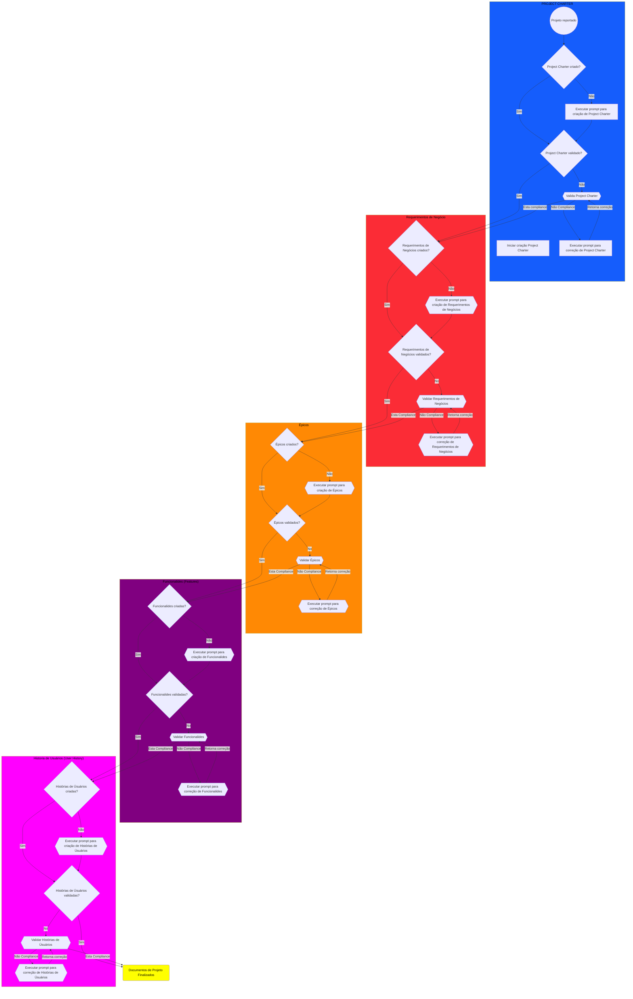

#ROADMAP - DESENVOLVIMENTO SOLUÇÃO TÉCNICA

---

# Plano: Criação do SPRINT-BACKLOG.md + Evolução do 05-USER-STORIES

## Contexto

O projeto PRJ-FIN-2026-0003 está com documentação 100% compliance mas **não existe backlog estruturado**. Os diretórios `sprint-00/` a `sprint-10/` estão vazios. O backend está ~90% completo, o frontend no zero. Após revisão das ideias iniciais, concluiu-se que:

- **NÃO** é necessário criar um novo `BACKLOG-PRODUCT-LIST.md` — o arquivo `05-USER-STORIES-PRJ-FIN-2026-0003-SAAS-FBSO-ORG.md` já é a matriz de rastreabilidade com USER-STORY-ID, FEATURE-ID, EPIC-ID, e ID-ENTREGA. Basta **enxugá-lo** e adicionar coluna de STATUS.
- O nome correto do backlog técnico é **`SPRINT-BACKLOG.md`** — linka TAREFA ↔ USER-STORY com status de desenvolvimento.

---

## Análise: Ciclo de Vida da User Story

O fluxo de uma User Story no projeto FBSO segue 4 fases e 12 status:

### Phase 1 — Concepção e Negócio (Upstream / Discovery)
*Engenharia de requisitos e alinhamento com stakeholders. Foco: O QUE e POR QUE construir.*

| Status | Código | Descrição |
|---|---|---|
| 🆕 Novo | `NEW` | Ideia ou necessidade surge do BRD, Canvas ou demanda de mercado. Título + descrição breve. |
| 📐 Em Refinamento de Negócio | `BIZ-REFINE` | PO/PM detalha: persona, valor, regras de negócio, critérios de aceite. |
| 📋 Pronto para Refinamento Técnico | `READY-TECH` | Negócio concluiu. Atende ao DoR de Negócio. Aguardando agenda com engenharia. |

### Phase 2 — Refinamento Técnico e Planejamento
*Time técnico assume. Foco: COMO construir e QUANTO custa.*

| Status | Código | Descrição |
|---|---|---|
| 🛠️ Em Refinamento Técnico | `TECH-REFINE` | Time debate solução. Valida arquitetura, segurança, engenharia. Estima Story Points. |
| 🎯 Pronto para Desenvolvimento | `READY-DEV` | Atende ao DoR Técnico. 100% clara, estimada, sem impedimentos. Entra na fila do Sprint Backlog. |

### Phase 3 — Execução (Downstream / Delivery)
*Sprint ativa. Foco: CONSTRUÇÃO e VALIDAÇÃO.*

| Status | Código | Descrição |
|---|---|---|
| 🏃 Em Desenvolvimento | `IN-PROGRESS` | Desenvolvedores codificando + testes unitários. |
| 👀 Em Revisão de Código | `CODE-REVIEW` | Código em Peer Review. PR aberto. |
| 🧪 Em Teste / QA | `QA` | Feature em Staging. QA valida critérios de aceite. |
| 🤝 Em Homologação / UAT | `UAT` | PO ou cliente final valida a entrega. |

### Phase 4 — Encerramento

| Status | Código | Descrição |
|---|---|---|
| ✅ Pronto / Concluído | `DONE` | 100% do DoD cumprido. Mergeado, testado, aprovado em UAT. |
| 🚀 Em Produção | `DEPLOYED` | Funcionalidade disponível ao usuário final. |
| ❌ Cancelado / Arquivado | `CANCELLED` | Perdeu valor de negócio, premissa inviável, ou prioridade mudou. Arquivado para métricas. |

---

## Plano de Ação

### Etapa 1: Evoluir `05-USER-STORIES-PRJ-FIN-2026-0003-SAAS-FBSO-ORG.md`

**O que fazer:**
- Enxugar a "Matriz de Rastreabilidade Completa": remover colunas descritivas de Feature e Épico (manter apenas os IDs), liberando espaço horizontal
- Adicionar coluna **STATUS** com o ciclo de vida de 12 status descrito acima
- Manter: D# (Entrega), EPIC-ID, FEATURE-ID, US-ID, US Descrição, RNs

**Nova estrutura da matriz:**

| D# | EPIC-ID | FEATURE-ID | US-ID | US Descrição | STATUS | FASE | RNs |
|---|---|---|---|---|---|---|---|
| D2 | EP-0001 | FEAT-EP-0001-0001 | US-001 | Dashboard com indicadores principais | 🟢 | `READY-DEV` | RN01-01 |

- **STATUS:** Compliance Gate — indica se a user-story passou pela validação de negócio (🔴🟡🟢). Equivale à coluna de status atual do documento.
- **FASE:** Ciclo de vida — indica em qual etapa do fluxo a user-story se encontra (NEW → DEPLOYED). Definida pelo time de negócio e atualizada conforme a US avança.
- **Valor inicial sugerido:** STATUS = 🟢 (as US já passaram pelo gate de compliance em 26-27/07). FASE = `NEW` para a maioria; US do EP-0001 e EP-0002 podem estar em `BIZ-REFINE` ou `READY-TECH`.

#### Status de Compliance (coluna STATUS)

| Ícone | Código | Descrição |
|---|---|---|
| 🔴 | `NON-COMPLIANCE` | User-Story não passou no Gate de Compliance — reprovada |
| 🟡 | `PENDING-REVIEW` | User-Story pendente de revisão — aguardando correções (FIX) |
| 🟢 | `COMPLIANCE` | User-Story aprovada no Gate de Compliance |

#### Fase do Ciclo de Vida (coluna FASE)

| Ícone | Código | Fase | Descrição |
|---|---|---|---|
| 🆕 | `NEW` | Discovery | Ideia ou necessidade surge do BRD, Canvas ou demanda de mercado |
| 📐 | `BIZ-REFINE` | Discovery | PO/PM detalha: persona, valor, regras de negócio, critérios de aceite |
| 📋 | `READY-TECH` | Discovery | Negócio concluiu. Atende ao DoR. Aguardando refinamento técnico |
| 🛠️ | `TECH-REFINE` | Planejamento | Time debate solução, valida arquitetura/segurança, estima Story Points |
| 🎯 | `READY-DEV` | Planejamento | Atende ao DoR Técnico. Entra na fila do Sprint Backlog |
| 🏃 | `IN-PROGRESS` | Execução | Desenvolvedores codificando + testes unitários |
| 👀 | `CODE-REVIEW` | Execução | Código em Peer Review. PR aberto |
| 🧪 | `QA` | Execução | Feature em Staging. QA valida critérios de aceite |
| 🤝 | `UAT` | Execução | PO ou cliente final valida a entrega |
| ✅ | `DONE` | Encerramento | 100% do DoD cumprido. Mergeado, testado, aprovado em UAT |
| 🚀 | `DEPLOYED` | Encerramento | Funcionalidade disponível ao usuário final |
| ❌ | `CANCELLED` | Encerramento | Perdeu valor de negócio ou premissa inviável. Arquivado para métricas |

---

### Etapa 2: Criar `SPRINT-BACKLOG.md`

**Arquivo:** `technical-definitions/sprints/SPRINT-BACKLOG.md`

**Público:** Time técnico — índice mestre que vincula TAREFA → USER-STORY (que por sua vez referencia FEATURE e ÉPICO no `05-USER-STORIES-PRJ-FIN-2026-0003-SAAS-FBSO-ORG.md`).

**Estrutura da tabela:**

| TASK-ID | TASK-DESCRIÇÃO | SPRINT-ALVO | US-ID | STATUS | DATA-INCIO | DATA-ENTREGA |
|---|---|---|---|---|---|---|
| T-001 | Auditar backend vs SPECS-DEFINITION §6.1 | Sprint 00 | — | `TODO` | | |
| T-002 | Mover Docker Compose → infra/docker/ | Sprint 00 | — | `TODO` | | |
| T-005 | Scaffold Frontend Next.js | Sprint 00 | — | `TODO` | | |
| T-010 | Implementar endpoint GET /dashboard/admin/summary | Sprint 01 | US-001 | `TODO` | | |

**Status de Tarefa (Scrum/Kanban):**

| Status | Código | Descrição |
|---|---|---|
| 📋 A Fazer | `TODO` | Tarefa identificada, aguardando sprint ativa |
| 🏃 Em Progresso | `IN-PROGRESS` | Em execução pelo responsável |
| 👀 Em Revisão | `IN-REVIEW` | Code review ou revisão de artefato |
| 🧪 Em Teste | `IN-TESTING` | Validação pelo QA |
| ✅ Concluído | `DONE` | Tarefa finalizada |
| 🚫 Bloqueado | `BLOCKED` | Impedimento externo |

---

### Etapa 3: Criar estrutura base para cada sprint

Cada `technical-definitions/sprints/sprint-NN/` recebe **3 arquivos base**:

| Arquivo | Conteúdo | Quando |
|---|---|---|
| `SPRINT-CARD.md` | Goal, escopo, DoD, datas, US vinculadas | Planejamento |
| `SPRINT-REVIEW.md` | Entregue vs pendente, métricas, lições | Review |
| `SPRINT-TEST-SUITE.md` | Cenários de teste por feature/US | Planejamento |

**Arquivos gerados durante a sprint** (dinâmicos):
- `SPRINT-DEVELOPMENT-PLANNING-*.md`
- `IDENTIFIED-TECHNICAL-DEBT-*.md`
- `SPRINT-N-EXECUTION-REPORT-*.md`

---

### Etapa 4: Sincronizar com backend `.specs/`

O backend já possui `.specs/business-projects/` com TASKS.md (176 tasks, 78% done), sprints docs (01-07). Esses artefatos são **internos ao backend** e complementam o SPRINT-BACKLOG.md do projeto. Referenciar sem duplicar.

---

## Arquivos a Criar/Modificar

| # | Arquivo | Localização | Ação |
|---|---|---|---|
| 1 | `05-USER-STORIES-PRJ-FIN-2026-0003-SAAS-FBSO-ORG.md` | Raiz do projeto | **MODIFICAR** — enxugar matriz, adicionar STATUS com 12 fases |
| 2 | `SPRINT-BACKLOG.md` | `technical-definitions/sprints/` | **NOVO** — índice TAREFA ↔ US com status Scrum/Kanban |
| 3 | `SPRINT-CARD.md` | `sprints/sprint-00/` | **NOVO** |
| 4 | `SPRINT-REVIEW.md` | `sprints/sprint-00/` | **NOVO** |
| 5 | `SPRINT-TEST-SUITE.md` | `sprints/sprint-00/` | **NOVO** |
| 6 | `EXECUTION-HISTORY.md` | `technical-definitions/` | Atualizar Fase 14 |

---

## Verificação

1. `05-USER-STORIES-*.md` tem 58 linhas com STATUS preenchido (ciclo de 12 fases)
2. `SPRINT-BACKLOG.md` linka tarefas técnicas a US-ID (que referencia FEATURE e ÉPICO no 05-USER-STORIES)
3. `sprint-00/` contém SPRINT-CARD.md + SPRINT-REVIEW.md + SPRINT-TEST-SUITE.md
4. Nomenclatura de status consistente entre os 2 arquivos (US: 12 fases, Tarefa: 6 status Scrum/Kanban)