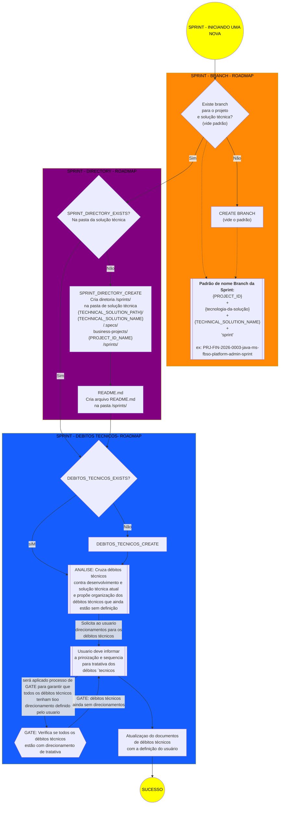

#ROADMAP - DESENVOLVIMENTO SOLUÇÃO TÉCNICA

```mermaid
flowchart TB

%% top do bottom TB
%% bootom to topo BT
%% left to right LR
%% right to left RL

  SUCESSO(("SUCESSO"))
  
  SPRINT_START(("SPRINT - INICIANDO UMA NOVA"))

  %% sprint branch -- PRJ-FIN-2026-0003-java-ms-fbso-platform-admin-sprint-05-portal-cliente
  subgraph sprint_branch_roadmap["SPRINT - BRANCH - ROADMAP"]


    SPRINT_BRANCH_EXISTS{"Existe branch<br>para o projeto<br>e solução técnica?<br>(vide padrão)"}
    SPRINT_BRANCH_NAME[["<b>Padrão de nome Branch da Sprint:</b><br>{PROJECT_ID}<br>+<br>{tecnologia-da-solução}<br>+{TECHNICAL_SOLUTION_NAME}<br>+<br>'sprint'<br><br>ex: PRJ-FIN-2026-0003-java-ms-fbso-platform-admin-sprint"]]
    SPRINT_BRANCH_CREATE["CREATE BRANCH<br>(vide o padrão)"]

  end
  SPRINT_START --> SPRINT_BRANCH_EXISTS
  SPRINT_BRANCH_EXISTS -- "Não" --> SPRINT_BRANCH_CREATE
  SPRINT_BRANCH_EXISTS -- "Sim" --> SPRINT_DIRECTORY_EXISTS
  SPRINT_BRANCH_EXISTS .-> SPRINT_BRANCH_NAME
  SPRINT_BRANCH_CREATE .-> SPRINT_BRANCH_NAME


  %% ============================================================================================================================================================
  %% sprint directorys
  subgraph sprint_directory_roadmap["SPRINT - DIRECTORY - ROADMAP"]

    SPRINT_DIRECTORY_EXISTS{"SPRINT_DIRECTORY_EXISTS?<br>Na pasta da solução técnica"}
    SPRINT_DIRECTORY_CREATE["SPRINT_DIRECTORY_CREATE<br>Cria diretoria /sprints/<br>na pasta de solução técnica<br>{TECHNICAL_SOLUTION_PATH}/<br>{TECHNICAL_SOLUTION_NAME}<BR>/.specs/<br>business-projects/<BR>{PROJECT_ID_NAME}<BR>/sprints/"]
    SPRINT_DIRECTORY_README["README.md<br>Cria arquivo README.md<br>na pasta /sprints/"]

  end
  SPRINT_DIRECTORY_EXISTS -- "Não" --> SPRINT_DIRECTORY_CREATE
  SPRINT_DIRECTORY_EXISTS -- "Sim" --> DEBITOS_TECNICOS_EXISTS
  SPRINT_DIRECTORY_CREATE --> SPRINT_DIRECTORY_README
  SPRINT_DIRECTORY_README --> DEBITOS_TECNICOS_EXISTS


  %% ============================================================================================================================================================
  %% DEBITOS TECNICOS
  subgraph debitos_tecnicos_roadmap["SPRINT - DEBITOS TECNICOS- ROADMAP"]

    DEBITOS_TECNICOS_EXISTS{"DEBITOS_TECNICOS_EXISTS?"}
    DEBITOS_TECNICOS_CREATE
    DEBITOS_TECNICOS_GATE{{GATE: Verifica se todos os débitos técnicos<br>estão com direcionamento de tratativa}}
    DEBITOS_TECNICOS_ANALISE[["ANALISE: Cruza débitos técnicos<br>contra desenvolvimento e solução técnica atual<br>e propõe organização dos débitos técnicos que ainda estão sem definição"]]
    DEBITOS_TECNICOS_USER_DEFINE[["Usuario deve informar<br>a priroização e sequencia<br>para tratativa dos<br>débitos ´tecnicos"]]
    DEBITOS_TECNICOS_CONSOLIDATE["Atualizaçao do documentos<br>de débitos técnicos<br>com a definição do usuário"]
    
  end
  DEBITOS_TECNICOS_EXISTS -- "Não" --> DEBITOS_TECNICOS_CREATE
  DEBITOS_TECNICOS_EXISTS -- "sIM" --> DEBITOS_TECNICOS_ANALISE

  DEBITOS_TECNICOS_CREATE --> DEBITOS_TECNICOS_ANALISE
  DEBITOS_TECNICOS_ANALISE -- "Solicita ao usuario<br>direcionamentos para os<br>débitos técnicos" --> DEBITOS_TECNICOS_USER_DEFINE
  DEBITOS_TECNICOS_USER_DEFINE -- "será aplicado processo de GATE para garantir que todos os débitos técnicos tenham tioo direcionamento definido pelo usuario" --> DEBITOS_TECNICOS_GATE


  DEBITOS_TECNICOS_GATE -- "GATE: débitos técnicos<br>ainda sem direcionamentos" --> DEBITOS_TECNICOS_USER_DEFINE
  DEBITOS_TECNICOS_USER_DEFINE --> DEBITOS_TECNICOS_CONSOLIDATE

  DEBITOS_TECNICOS_CONSOLIDATE --> SUCESSO


  %% ============================================================================================================================================================

  %% TEMPORARIO

  SPRINT_START:::yellow2Finish
  SUCESSO:::yellow2Finish

  debitos_tecnicos_roadmap:::blueSubgraph
  sprint_branch_roadmap:::yellowSubgraph
  sprint_directory_roadmap:::purpleSubgraph

  classDef redSubgraph fill:#FB2C36,color:#000000
  classDef blueSubgraph fill:#155DFC,color:#000000
  classDef yellowSubgraph fill:#FF8904,color:#000000
  classDef purpleSubgraph fill:#800080,color:#000000
  classDef fucsiaSubgraph fill:#FF00FF,color:#000000
  classDef yellow2Finish fill:#FFFF00,color:#000000

```
