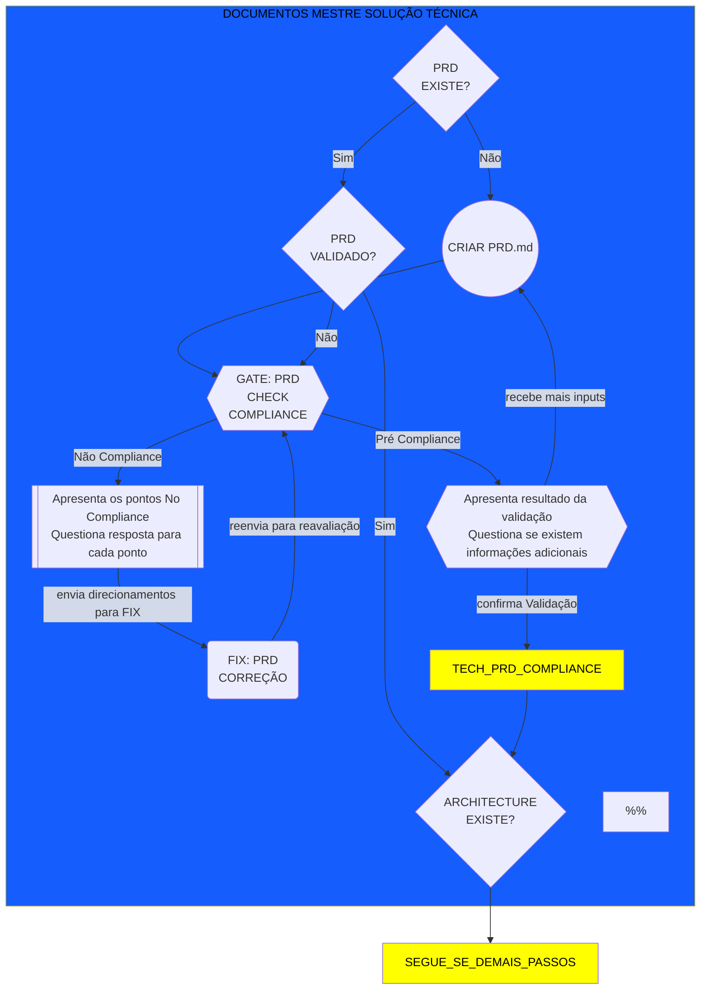

#ROADMAP - DESENVOLVIMENTO SOLUÇÃO TÉCNICA

```mermaid
flowchart TB

%% top do bottom TB
%% bootom to topo BT
%% left to right LR
%% right to left RL

  SEGUE_SE_DEMAIS_PASSOS
  
  subgraph solucao_tecnica["DOCUMENTOS MESTRE SOLUÇÃO TÉCNICA"]

    TECH_PRD_EXIST{"PRD<br>EXISTE?"}
    TECH_PRD_VALIDADO{"PRD<br>VALIDADO?"}
    TECH_PRD_CRIAR(("CRIAR PRD.md"))
    TECH_PRD_GATE{{"GATE: PRD<br>CHECK<br>COMPLIANCE"}}
    TECH_PRD_FIX("FIX: PRD<br>CORREÇÃO")
    TECH_PRD_GATE_NO_COMPLIANCE[["Apresenta os pontos No Compliance<br>Questiona resposta para cada ponto"]]
    TECH_PRD_GATE_PRE_COMPLIANCE{{"Apresenta resultado da validação<br>Questiona se existem informações adicionais"}}
    TECH_PRD_COMPLIANCE

    TECH_ARCHITECTURE_EXIST{"ARCHITECTURE<br>EXISTE?"}
    %%%%TECH_ARCHITECTURE(("ARCHITECTURE.md"))
    %%%%TECH_ARCHITECTURE_GATE
    %%%%TECH_ARCHITECTURE_FIX
%%%%
    %%%%TECH_SPECS_EXIST{"SPECS EXISTE?"}
    %%%%TECH_SPECS(("SPECS.md"))
    %%%%TECH_SPECS_GATE
    %%%%TECH_SPECS_FIX
%%%%
    %%%%TECH_TASKS_EXIST{"TASKS<br>EXISTE?"}
    %%%%TECH_TASKS(("TASKS.md"))
    %%%%TECH_TASKS_GATE
    %%%%TECH_TASKS_FIX
%%%%
    %%%%TECH_TEST_PLAN_EXIST{"TEST_PLAN<br>EXISTE?"}
    %%%%TECH_TEST_PLAN(("TEST_PLAN.md"))
    %%%%TECH_TEST_PLAN_GATE
    %%%%TECH_TEST_PLAN_FIX
%%
  end

  TECH_PRD_EXIST -- "Não" --> TECH_PRD_CRIAR
  TECH_PRD_EXIST -- "Sim" --> TECH_PRD_VALIDADO

  TECH_PRD_CRIAR --> TECH_PRD_GATE

  TECH_PRD_VALIDADO -- "Não" --> TECH_PRD_GATE
  TECH_PRD_VALIDADO -- "Sim" --> TECH_ARCHITECTURE_EXIST
  


  TECH_PRD_GATE -- "Pré Compliance" --> TECH_PRD_GATE_PRE_COMPLIANCE
  TECH_PRD_GATE_PRE_COMPLIANCE -- "confirma Validação" --> TECH_PRD_COMPLIANCE
  TECH_PRD_COMPLIANCE --> TECH_ARCHITECTURE_EXIST
  TECH_PRD_GATE_PRE_COMPLIANCE -- "recebe mais inputs" --> TECH_PRD_CRIAR

  TECH_PRD_GATE -- "Não Compliance" --> TECH_PRD_GATE_NO_COMPLIANCE
  TECH_PRD_GATE_NO_COMPLIANCE -- "envia direcionamentos para FIX" --> TECH_PRD_FIX
  TECH_PRD_FIX -- "reenvia para reavaliação" --> TECH_PRD_GATE


  %% TEMPORARIO
  TECH_ARCHITECTURE_EXIST --> SEGUE_SE_DEMAIS_PASSOS

  TECH_PRD_COMPLIANCE:::yellow2Finish
  SEGUE_SE_DEMAIS_PASSOS:::yellow2Finish

  solucao_tecnica:::blueSubgraph

  classDef redSubgraph fill:#FB2C36,color:#000000
  classDef blueSubgraph fill:#155DFC,color:#000000
  classDef yellowSubgraph fill:#FF8904,color:#000000
  classDef purpleSubgraph fill:#800080,color:#000000
  classDef fucsiaSubgraph fill:#FF00FF,color:#000000
  classDef yellow2Finish fill:#FFFF00,color:#000000

```
