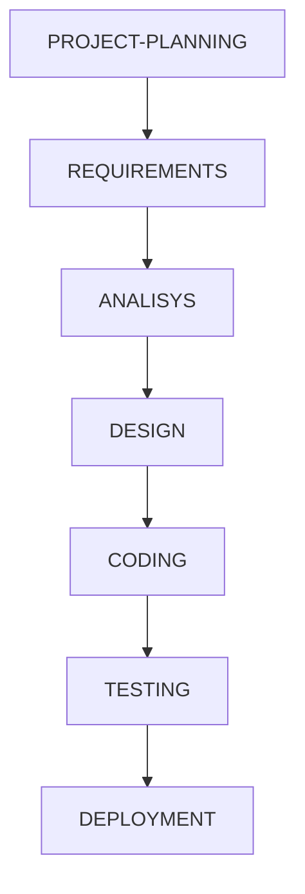
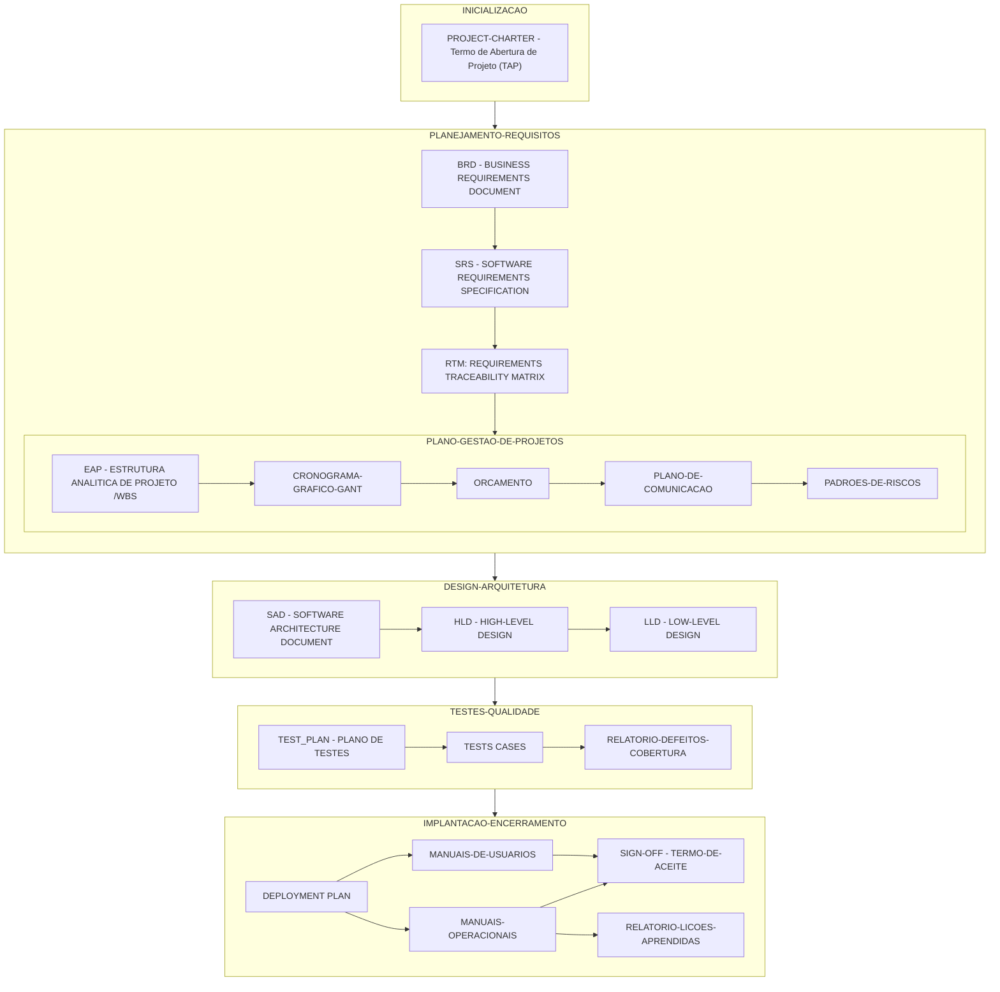

# FLUXO MACRO - WATERFALL

## WATERFALL-MODEL

```mermaid
graph TD
    direction TB

    PROJECT-PLANNING
    REQUIREMENTS
    ANALISYS
    DESIGN
    CODING
    TESTING
    DEPLOYMENT

    PROJECT-PLANNING --> REQUIREMENTS --> ANALISYS --> DESIGN --> CODING --> TESTING --> DEPLOYMENT

```

---

# DOCUMENTOS BASE METODOLOGIA: WATERFALL

```mermaid
graph TD
    direction TB

    subgraph INICIALIZACAO
        PROJECT-CHARTER["PROJECT-CHARTER - Termo de Abertura de Projeto (TAP)"]
    end

    subgraph PLANEJAMENTO-REQUISITOS

        direction TB

        BRD["BRD - BUSINESS REQUIREMENTS DOCUMENT"]
        SRS["SRS - SOFTWARE REQUIREMENTS SPECIFICATION"]
        RTM["RTM: REQUIREMENTS TRACEABILITY MATRIX"]

        subgraph PLANO-GESTAO-DE-PROJETOS

            direction LR

            EAP["EAP - ESTRUTURA ANALITICA DE PROJETO /WBS"]
            CRONOGRAMA-GRAFICO-GANT
            ORCAMENTO
            PLANO-DE-COMUNICACAO
            PADROES-DE-RISCOS

            EAP --> CRONOGRAMA-GRAFICO-GANT --> ORCAMENTO --> PLANO-DE-COMUNICACAO --> PADROES-DE-RISCOS
        end
        BRD --> SRS --> RTM --> PLANO-GESTAO-DE-PROJETOS
    end

    subgraph DESIGN-ARQUITETURA
        direction LR
        SAD["SAD - SOFTWARE ARCHITECTURE DOCUMENT"]
        HLD["HLD - HIGH-LEVEL DESIGN"]
        LLD["LLD - LOW-LEVEL DESIGN"]
        SAD --> HLD --> LLD
    end

    subgraph TESTES-QUALIDADE
        direction LR
        TEST-PLAN["TEST_PLAN - PLANO DE TESTES"]
        CASOS-DE-TESTES["TESTS CASES"]
        RELATORIO-DEFEITOS-COBERTURA
        TEST-PLAN --> CASOS-DE-TESTES --> RELATORIO-DEFEITOS-COBERTURA
    end
    
    subgraph IMPLANTACAO-ENCERRAMENTO
        direction LR
        DEPLOYMENT-PLAN["DEPLOYMENT PLAN"]
        MANUAIS-DE-USUARIOS
        MANUAIS-OPERACIONAIS
        TERMO-DE-ACEITE["SIGN-OFF - TERMO-DE-ACEITE"]
        RELATORIO-LICOES-APRENDIDAS
        DEPLOYMENT-PLAN --> MANUAIS-DE-USUARIOS
        DEPLOYMENT-PLAN --> MANUAIS-OPERACIONAIS
        MANUAIS-DE-USUARIOS     --> TERMO-DE-ACEITE
        MANUAIS-OPERACIONAIS    --> TERMO-DE-ACEITE
        MANUAIS-OPERACIONAIS    --> RELATORIO-LICOES-APRENDIDAS
    end


    INICIALIZACAO --> PLANEJAMENTO-REQUISITOS --> DESIGN-ARQUITETURA --> TESTES-QUALIDADE --> IMPLANTACAO-ENCERRAMENTO

```
