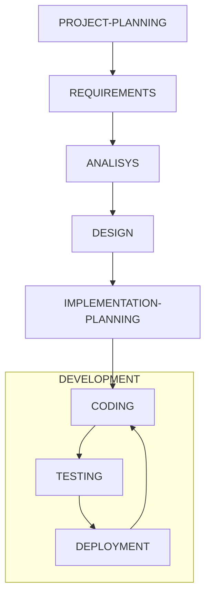
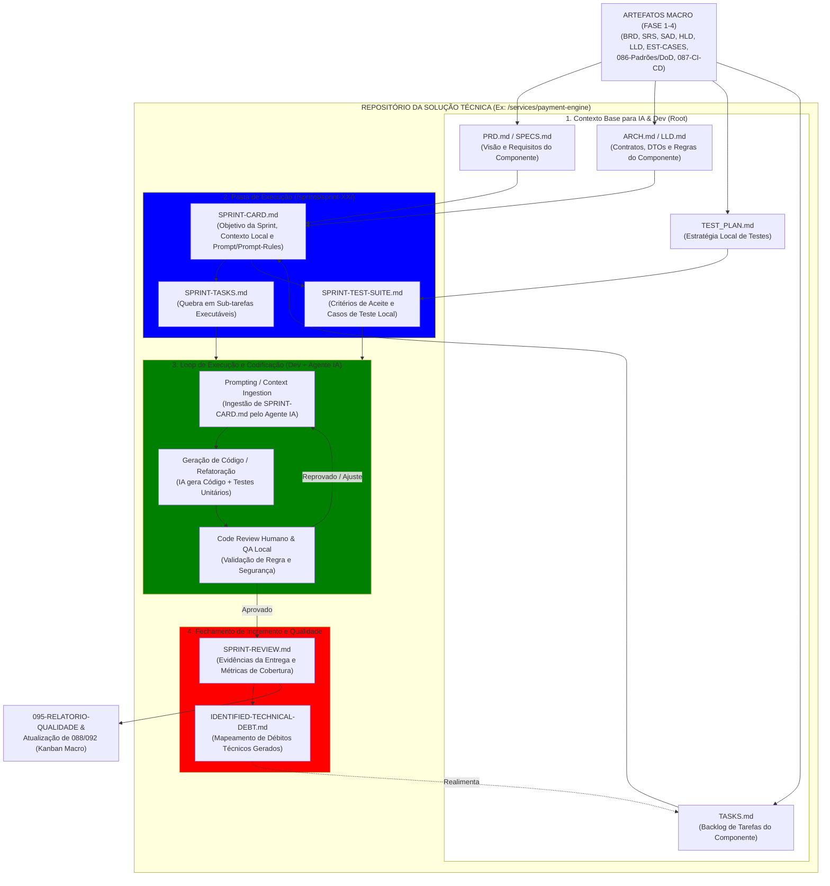

# FLUXO MACRO - WATERFALL

## WATERFALL-MODEL

---

# DOCUMENTOS BASE METODOLOGIA: WATERFALL

# 3. Diagrama Mermaid Atualizado com Disciplinas Especializadas

### 1. Separação de Responsabilidades (SoD) e Escopo por Disciplina

| Disciplina Técnica | Foco Principal | Entregáveis Macro no SAD (Fase 2) | Entregáveis Detalhados / Operacionais (Fase 3) |
| --- | --- | --- | --- |
| **Software Architecture** *(Tech Lead / Arq. Software)* | Padrões de código, frameworks, contratos de microsserviços, Clean Arch. | Visão Lógica, ADRs de Linguagem/Framework, C4 Containers. | **040-LLD**: Modelos de classe, plugins Kong, interceptores, DTOs e APIs. |
| **Security Architecture / AppSec** | Ameaças, LGPD, identidades (OAuth2/OIDC), criptografia e conformidade. | Visão de Segurança, Modelagem de Ameaças (STRIDE), ADRs de AuthN/AuthZ. | **SEC-ENGINEERING**: Setup de SAST/DAST, políticas mTLS, Secret Management, Scanners (Semgrep/Gitleaks). |
| **Data Architecture / DBA** | Modelagem relacional/NoSQL, particionamento, retenção, RLS e concorrência. | Estratégia de Dados, ADR de Bancos (ex: PostgreSQL vs. NoSQL), isolamento Multi-Tenant. | **DATA-ENGINEERING**: DDL final, triggers RLS, migrations Flyway/Liquibase, índices e Redis schemas. |
| **Infra & Cloud Architecture** | Topologia cloud, redes corporativas (VPC, Peering, DNS), custos (FinOps) e SLAs. | Visão de Implantação, ADR Cloud Provider (DigitalOcean/AWS), topologia DOKS. | **INFRA-PROVISIONING**: Terraform/IaC para clusters, redes, IPs estáticos, Gateways e Buckets. |
| **DevOps / SRE** | Automação de entrega, observabilidade, resiliência (KEDA), escalabilidade e GitOps. | Diretrizes de CI/CD, GitOps (Argo CD), estratégia de monitoramento (Prometheus/Grafana). | **DEVOPS-SETUP**: Helm Charts, pipelines GitHub Actions, alertas, dashboards e auto-scaling. |

---

### 2. Ciclo de Vida: Participação Antecipada vs. Consolidação na Fase 3

Assim como a Arquitetura de Software inicia o *fast-tracking* no BRD:

* **Na Fase 2 (SAD / HLD):** Todos esses especialistas participam das reuniões de especificação para definir as **ADRs (Architecture Decision Records)**, diretrizes de segurança, desenho de topologia e restrições de infraestrutura/banco.
* **Na Fase 3 (Engenharia Detalhada & Setup Técnico):** Cada especialista consolida suas entregas técnicas em paralelo logo após o gate **Go-Upstream**:
    * **Solution Architecture:** Consolida as definições de arquitetura para a soluçao (`040-LLD`).
    * **Data Architecture:** Fecha os scripts DDL/RLS e modelo físico (`042-DATA-SETUP`).
    * **Security:** Configura regras de autenticação, scanners e secrets (`043-SEC-SETUP`).
    * **Infra & Cloud:** Provisiona a infraestrutura via Terraform (`044-INFRA-SETUP`).
    * **DevOps / SRE:** Monta os pipelines de CI/CD e Helm Charts (`041-DEVOPS-SETUP`).

```mermaid
flowchart TB
    %% MILESTONE 1
    MILESTONE-1(("🚩 M1: PROJECT INITIATED\n(Sponsor + PM + BA/PO)"))

    subgraph FASE-1["FASE 1: INICIAÇÃO E REQUISITOS DE NEGÓCIO"]
        001-PROJECT-CHARTER["001-PROJECT-CHARTER - START/KICK-OFF"]
        002-STAKEHOLDER-MAP["002-STAKEHOLDER-MAP"]
        FASE-1-TIMEBOX["(PM/PO)<br>TIMEBOX FASE-1<br>DEFINIÇÃO PRAZO (semanas)<br>PARA ENTREGA<br>ESPECIFICAÇÕES"]
        005-BRD["005-BRD - Requisitos de Negócio (REQ-**)"]
        010-FRD["010-FRD - Requisitos Funcionais (FEAT-**, RN-**, UC-**)"]
        015-RTM-FASE-1["015-RTM-FASE-1 - Rastreabilidade (Charter × BRD × FRD)"]
    end

    subgraph FASE-2["FASE 2: ESPECIFICAÇÃO DE SISTEMA E ARQUITETURA MULTIDISCIPLINAR"]
        FASE-2-TIMEBOX["(PM/PO)DEFINIÇÃO PRAZO (semanas)<br>PARA ENTREGA<br>ESPECIFICAÇÕES<br>FASE-2"]
        020-SRS["020-SRS - Especificação de Sistema + NFRs"]
        025-RTM-FASE-2["025-RTM-FASE-2 - Rastreabilidade (RTM-1 × SRS)"]
        030-SAD["030-SAD - Visão Arquitetural Macro & ADRs\n(Software, Segurança, Dados, Infra & DevOps)"]
        035-HLD["035-HLD - Componentes, Topologia, Contratos e Integradores"]
    end

    %% MILESTONE 2 & GATE 1
    MILESTONE-2(("🚩 M2: ARCHITECTURE & SCOPE APPROVED\n(Aprovação do Sizing Upstream)"))
    %% NOTA: os três nós de estimativa representam momentos distintos do fluxo upstream (ROM ±50%):
    %% 1) HIGH-LEVEL FAST-TRACKING (saída da FASE 1) · 2) FAST-TRACKING (saída da FASE 2) · 3) fluxo normal (após M2).
    %% Todos executam o mesmo roadmap WATERFALL-ESTIMATION em modo UPSTREAM/DISCOVERY.
    ESTIMATIVA-HIGH-LEVEL-FAST-TRACKING-UPSTREAM-DISCOVERY["ESTIMATIVA HIGH-LEVEL-FAST-TRACKING <br> UPSTREAM / DISCOVERY (ROM ±50%)"]
    ESTIMATIVA-FAST-TRACKING-UPSTREAM-DISCOVERY["ESTIMATIVA-FAST-TRACKING <br> UPSTREAM / DISCOVERY (ROM ±50%)"]
    ESTIMATIVA-UPSTREAM-DISCOVERY["ESTIMATIVA UPSTREAM / DISCOVERY (ROM ±50%)"]

    subgraph FASE-3["FASE 3: ENGENHARIA DETALHADA, QUALIDADE E ENGENHARIAS TÉCNICAS"]

        FASE-3-TIMEBOX["(PM/PO)DEFINIÇÃO PRAZO (DIAS)<br>PARA ENTREGA<br>ESPECIFICAÇÕES<br>FASE-3"]

        subgraph FASE-3-ESTEIRA-ARCHITECTURE-ENGINEERING["ESTEIRA DE ENGENHARIA E ESPECIALIDADES"]
            direction TB
            040-LLD["040-LLD - Engenharia de Software\n(APIs, Schemas, Redis, PKCE)"]
            042-DMD["042-DATA-SETUP (DMD) - Physical Data Model & Design"]

            043-SRD["043-SEC-SETUP (SRD) - Security Architecture & Controls"]
            044-IDD["044-INFRA-SETUP (IDD) - Infrastructure & Cloud Design"]
            041-DED["041-DEVOPS-SETUP (DED) - Deployment & DevOps Engineering"]

            040-LLD --> 042-DMD --> 043-SRD --> 044-IDD --> 041-DED --> 040-LLD
        end
        %% NOTA: a numeração 041–044 identifica a família de criação, NÃO a ordem de execução.
        %% Ordem da esteira (ciclo fechado): 040-LLD → 042-DATA-SETUP → 043-SEC-SETUP → 044-INFRA-SETUP → 041-DEVOPS-SETUP.
        %% O 041 (DevOps) integra as especialidades e só inicia após 042/043/044 em COMPLIANCE (validado pelo GATE-041).

        subgraph FASE-3-ESTEIRA-QUALIDADE["ESTEIRA DE QUALIDADE (QA)"]
            045-EST-PLAN["045-EST-PLAN - Software Test Plan (IEEE 829)"]
            050-EST-CASES["050-EST-CASES - Especificação de Casos de Teste"]
        end
        
        060-EAP-WBS["060-EAP-WBS - Estrutura Analítica do Projeto"]
    end

    %% MILESTONE 3 & GATE 2
    MILESTONE-3(("🚩 M3: TECHNICAL BASELINE READY\n(Esforço Técnico Mapeado em Horas)"))
    ESTIMATIVA-DOWNSTREAM-REFINEMENT["ESTIMATIVA DOWNSTREAM / REFINEMENT (PERT ±15-25%)"]

    subgraph FASE-4["FASE 4: BASELINE E GOVERNANÇA (EM PARALELO)"]

        direction TB

        062-STAFFING-PLAN["062-STAFFING-PLAN\n(Mapeamento de Perfis, Skills, RACI e Alocação por Período)"]
        065-CRONOGRAMA-GANTT["065-CRONOGRAMA\n(Gantt, Prazos & Leveling)"]
        070-ORCAMENTO["070-ORCAMENTO\n(Custos, Burn Rate & Cloud)"]
        075-PLANO-COMUNICACAO["075-COMUNICAÇÃO\n(Rituais & Reporting)"]
        080-PLANO-RISCOS["080-RISCOS\n(Matriz & Contingências)"]
        085-PLANO-GESTAO-MUDANCAS["085-MUDANÇAS\n(Controle de Escopo/Prazo)"]
        086-PADROES-CODIGO-DOD["086-PADROES-CODIGO-DOD\n(Padrões de Código & DoD)"]
        087-PLANO-CI-CD-AMBIENTES["087-PLANO-CI-CD-AMBIENTES\n(Pipelines, Ambientes & Branches)"]
        088-PRODUCT-BACKLOG-LIST["088-PRODUCT-BACKLOG-LIST\n(Backlog Priorizado — Baseline M4)"]
        090-STRATEGIC-IMPLEMENTATION-AND-DEPLOYMENT-PLAN["090-STRATEGIC-IMPLEMENTATION-AND-DEPLOYMENT-PLAN"]

        062-STAFFING-PLAN --> 065-CRONOGRAMA-GANTT --> 070-ORCAMENTO
        070-ORCAMENTO --> 075-PLANO-COMUNICACAO --> 080-PLANO-RISCOS --> 085-PLANO-GESTAO-MUDANCAS
        085-PLANO-GESTAO-MUDANCAS --> 086-PADROES-CODIGO-DOD --> 087-PLANO-CI-CD-AMBIENTES --> 088-PRODUCT-BACKLOG-LIST --> 090-STRATEGIC-IMPLEMENTATION-AND-DEPLOYMENT-PLAN --> 062-STAFFING-PLAN

    end

    %% MILESTONE 4
    MILESTONE-4(("🚩 M4: PROJECT BASELINE LOCKED\n(Cronograma & Orçamento Selados)"))

    subgraph FASE-5["FASE-5 : FASE DE EXECUÇÃO E CONSTRUÇÃO"]
        %%BUILD-QA["CONSTRUÇÃO, EXECUÇÃO E QUALIDADE (MÃO NA MASSA) & TESTES (Sprints / Slices de Código)"]
        direction LR

        subgraph GESTAO-E-RITUAIS["1. Gestão diária & Operacional"]
            direction TB
            092-KANBAN-BACKLOG["092-BACKLOG & KANBAN\n(Gestão de Tasks, Sub-tasks e Rituais Dailies/Sprints)"]
            093-GESTAO-TIMES["093-GESTAO-DE-TIMES\n(Capacidade, Impedimentos e Alocação)"]
            092-KANBAN-BACKLOG --> 093-GESTAO-TIMES --> 092-KANBAN-BACKLOG
        end

        subgraph JANELAS-EXECUCAO["2. Janelas de Entrega (Ciclos/Sprints) — TBD/FORA DE ESCOPO"]
            direction TB
            JANELA-DEV["Janela de Desenvolvimento (DEV)\n(Code, Unit Tests, Code Review)"]
            JANELA-QA["Janela de Testes (QA)\n(Testes Funcionais, Carga e Pentest)"]
            JANELA-UAT["Janela de Homologação (UAT)\n(Validação de Negócio com Key Users)"]
            JANELA-DEPLOY["Janela de Deploy (PROD)\n(Execução do Deployment Plan / GMUD)"]

            JANELA-DEV --> JANELA-QA
            JANELA-QA --> JANELA-UAT
            JANELA-UAT --> JANELA-DEPLOY
            JANELA-DEPLOY --> JANELA-DEV
        end
        %% TBD: a sub-fase 2 (Janelas de Entrega) está FORA DE ESCOPO nesta revisão (evolução aprovada em 14/08/2026).
        %% A esteira da FASE 5 executa por ciclo de entrega (FILA-NN do 092) sem depender da definição das janelas.

        subgraph ARTEFATOS-SUPORTE["3. Documentação de Suporte e Evidências"]
            %% NOTA: 095-RELATORIO-QUALIDADE tem a estrutura criada na F3 e é alimentado com evidências na F5 (via 092/093).
            095-RELATORIO-QUALIDADE["095-RELATORIO-QUALIDADE\n(Evidências de QA (Testes e Homologação)"]
            097-MANUAIS-USUARIO["097-MANUAIS-USUARIO\n(Documentação de Treinamento e Negócio)"]
            100-MANUAIS-OPERACIONAIS["100-MANUAIS-OPERACIONAIS\n(Runbooks e Guias de Sustentação/SRE)"]

            095-RELATORIO-QUALIDADE --> 097-MANUAIS-USUARIO
            097-MANUAIS-USUARIO --> 100-MANUAIS-OPERACIONAIS
            100-MANUAIS-OPERACIONAIS --> 095-RELATORIO-QUALIDADE
        end

        GESTAO-E-RITUAIS --> JANELAS-EXECUCAO --> ARTEFATOS-SUPORTE --> GESTAO-E-RITUAIS
    end

    subgraph FASE-6["FASE 6: ENCERRAMENTO E OPERAÇÃO"]
        105-TERMO-ACEITE["105-TERMO-ACEITE - Homologação do Cliente"]
        MILESTONE-5(("🚩 M5: GO-LIVE & HANDOVER"))
        110-LICOES-APRENDIDAS["110-LICOES-APRENDIDAS"]
        115-TERMO-ENCERRAMENTO-PROJETO["115-TERMO-ENCERRAMENTO-PROJETO"]
    end

    %% MILESTONE 5
    MILESTONE-END(("FIM DO PROJETO"))
    PROJETO-CANCELADO["🛑 PROJETO CANCELADO / REVISÃO SOLICITADA"]

    %%--------------------------------------------------------------------------------------------------------------------------------------------------------
    %% Conexões Fase 1
    MILESTONE-1 --> 001-PROJECT-CHARTER
    001-PROJECT-CHARTER .-> 002-STAKEHOLDER-MAP
    001-PROJECT-CHARTER -- ""PM/PO<BR>Primeira atividade<br>Pós START--> FASE-1-TIMEBOX
    001-PROJECT-CHARTER --> 005-BRD
    005-BRD --> 010-FRD
    010-FRD --> 015-RTM-FASE-1
    010-FRD -- "PM/PO<br>Primeira atividade" --> FASE-2-TIMEBOX

    %% Conexões Fase 2 & Fast-Tracking das Arquiteturas
    015-RTM-FASE-1 --> 020-SRS
    020-SRS --> 025-RTM-FASE-2

    005-BRD -.->|"Fast-Tracking Arquiteturas"| 030-SAD
    010-FRD -.->|"Protótipos UX/UI"| 020-SRS
    010-FRD -.->|"Fast-Tracking Arquiteturas"| 030-SAD
    015-RTM-FASE-1 -.->|"Fast-Tracking Arquiteturas"| 030-SAD
    020-SRS -.->|"Fast-Tracking Arquiteturas"| 030-SAD

    025-RTM-FASE-2 -->|"Consolidação Final / Baseline"| 030-SAD
    030-SAD --> 035-HLD
    %%035-HLD --> ESTIMATIVA-UPSTREAM-DISCOVERY

    %% Gate Upstream
    FASE-1 -.-> |"Estimativa Fast-Tracking (Alto Nivel)"| ESTIMATIVA-HIGH-LEVEL-FAST-TRACKING-UPSTREAM-DISCOVERY
    ESTIMATIVA-HIGH-LEVEL-FAST-TRACKING-UPSTREAM-DISCOVERY --> GO-NO-GO-HIGH-LEVEL-FAST-TRACKING-UPSTREAM{"Go/No-Go Upstream?"}
    GO-NO-GO-HIGH-LEVEL-FAST-TRACKING-UPSTREAM -.-> |"GO"| FASE-1
    GO-NO-GO-HIGH-LEVEL-FAST-TRACKING-UPSTREAM -- "NO-GO" --> PROJETO-CANCELADO

    FASE-2 -.-> |"Estimativa Fast-Tracking"| ESTIMATIVA-FAST-TRACKING-UPSTREAM-DISCOVERY
    ESTIMATIVA-FAST-TRACKING-UPSTREAM-DISCOVERY --> GO-NO-GO-ESTIMATIVA-FAST-TRACKING-UPSTREAM-DISCOVERY{"Go/No-Go Upstream?"}
    GO-NO-GO-ESTIMATIVA-FAST-TRACKING-UPSTREAM-DISCOVERY -.-> |"GO"| FASE-2
    GO-NO-GO-ESTIMATIVA-FAST-TRACKING-UPSTREAM-DISCOVERY -- "NO-GO" --> PROJETO-CANCELADO


    035-HLD --> MILESTONE-2
    MILESTONE-2 -- "Estimativa no Fluxo Normal" --> ESTIMATIVA-UPSTREAM-DISCOVERY
    ESTIMATIVA-UPSTREAM-DISCOVERY --> GO-NO-GO-UPSTREAM{"Go/No-Go Upstream?"}
    GO-NO-GO-UPSTREAM -- "GO (ARQUITETURA / ENGENHARIA / ESPECIALIDADES)" --> FASE-3-ESTEIRA-ARCHITECTURE-ENGINEERING
    GO-NO-GO-UPSTREAM -- "GO (QUALIDADE)" --> 045-EST-PLAN
    GO-NO-GO-UPSTREAM -- "TIMEBOX FASE-3" --> FASE-3-TIMEBOX
    GO-NO-GO-UPSTREAM -- "NO-GO" --> PROJETO-CANCELADO

    %% Consulta técnica sem travamento sequencial
    045-EST-PLAN --> 050-EST-CASES
    FASE-3-ESTEIRA-ARCHITECTURE-ENGINEERING -.->|"Alimenta / Consulta Técnica"| 050-EST-CASES

    %% Consolidação Final na WBS
    FASE-3-ESTEIRA-ARCHITECTURE-ENGINEERING --> 060-EAP-WBS
    050-EST-CASES --> 060-EAP-WBS

    060-EAP-WBS --> MILESTONE-3
    MILESTONE-3 --> ESTIMATIVA-DOWNSTREAM-REFINEMENT

    %% Gate Downstream
    ESTIMATIVA-DOWNSTREAM-REFINEMENT --> GO-NO-GO-DOWNSTREAM{"Go/No-Go Downstream?"}
    GO-NO-GO-DOWNSTREAM -- "GO" --> FASE-4
    %%GO-NO-GO-DOWNSTREAM -- "GO" --> 062-STAFFING-PLAN
    %%GO-NO-GO-DOWNSTREAM -- "GO" --> 065-CRONOGRAMA-GANTT
    %%GO-NO-GO-DOWNSTREAM -- "GO" --> 070-ORCAMENTO
    GO-NO-GO-DOWNSTREAM -- "NO-GO" --> PROJETO-CANCELADO

    %% Conexões Fase 4
    %%PLANEJAMENTO-RECURSOS-TEMPO --> PLANOS-GOVERNANCA
    %%070-ORCAMENTO --> 075-PLANO-COMUNICACAO
    %%070-ORCAMENTO --> 080-PLANO-RISCOS
    %%070-ORCAMENTO --> 085-PLANO-GESTAO-MUDANCAS
    %%PLANOS-GOVERNANCA --> 090-STRATEGIC-IMPLEMENTATION-AND-DEPLOYMENT-PLAN
    %%075-PLANO-COMUNICACAO --> 090-STRATEGIC-IMPLEMENTATION-AND-DEPLOYMENT-PLAN
    %%080-PLANO-RISCOS --> 090-STRATEGIC-IMPLEMENTATION-AND-DEPLOYMENT-PLAN
    %%085-PLANO-GESTAO-MUDANCAS --> 090-STRATEGIC-IMPLEMENTATION-AND-DEPLOYMENT-PLAN

    %% Transição para Execução
    FASE-4 --> MILESTONE-4
    %%090-STRATEGIC-IMPLEMENTATION-AND-DEPLOYMENT-PLAN --> MILESTONE-4
    MILESTONE-4 --> GESTAO-E-RITUAIS
    %%GESTAO-E-RITUAIS --> 095-RELATORIO-QUALIDADE
    %%GESTAO-E-RITUAIS --> 097-MANUAIS-USUARIO
    %%GESTAO-E-RITUAIS --> 100-MANUAIS-OPERACIONAIS
    %%GESTAO-E-RITUAIS --> JANELAS-EXECUCAO
    %%JANELAS-EXECUCAO --> ARTEFATOS-SUPORTE
    %%ARTEFATOS-SUPORTE --> MILESTONE-5

    %% Conexões Fase 5
    %%095-RELATORIO-QUALIDADE --> 105-TERMO-ACEITE
    %%097-MANUAIS-USUARIO --> 105-TERMO-ACEITE
    %%100-MANUAIS-OPERACIONAIS --> 105-TERMO-ACEITE
    ARTEFATOS-SUPORTE --> 105-TERMO-ACEITE
    105-TERMO-ACEITE --> MILESTONE-5
    MILESTONE-5 --> 110-LICOES-APRENDIDAS
    110-LICOES-APRENDIDAS --> 115-TERMO-ENCERRAMENTO-PROJETO
    115-TERMO-ENCERRAMENTO-PROJETO --> MILESTONE-END

    %% ========================================================
    %% DEFINIÇÃO DE ESTILO REUTILIZÁVEL (CLASSES)
    %% ========================================================
    classDef StartEndStyle fill:#FFFFFF,stroke:#0000FF,stroke-width:4px,color:#000000; %% branco, azul, preto
    classDef milestoneStyle fill:#FFFF00,stroke:#0000FF,stroke-width:4px,color:#000000; %% amarelo, azul, preto
    classDef estimateStyle fill:#008000,stroke:#ff0000,stroke-width:4px,color:#f8e0d0; %% verde, vermelho, branco
    classDef canceledStyle fill:#ff0000,stroke:#0000FF,stroke-width:4px,color:#FFFF00; %% vermelho, azul, amarelo
    classDef questionEstimateStyle fill:#CCFFCC,stroke:#0000FF,stroke-width:4px,color:#008000 %% verdinho, azul, verde-escuro

    %% ========================================================
    %% APLICAÇÃO DA CLASSE NOS MILESTONES
    %% ========================================================
    class MILESTONE-1,MILESTONE-END StartEndStyle;
    class MILESTONE-2,MILESTONE-3,MILESTONE-4,MILESTONE-5 milestoneStyle;
    class ESTIMATIVA-HIGH-LEVEL-FAST-TRACKING-UPSTREAM-DISCOVERY,ESTIMATIVA-FAST-TRACKING-UPSTREAM-DISCOVERY,ESTIMATIVA-UPSTREAM-DISCOVERY,ESTIMATIVA-DOWNSTREAM-REFINEMENT estimateStyle;
    class PROJETO-CANCELADO canceledStyle;
    class GO-NO-GO-DOWNSTREAM questionEstimateStyle;
    class GO-NO-GO-UPSTREAM questionEstimateStyle;
    class GO-NO-GO-HIGH-LEVEL-FAST-TRACKING-UPSTREAM questionEstimateStyle;
    class GO-NO-GO-ESTIMATIVA-FAST-TRACKING-UPSTREAM-DISCOVERY questionEstimateStyle;

    style FASE-1 fill:#000000 %% preto

    style FASE-2 fill:#E17000 %% orange/laranja

    style FASE-3 fill:#800080 %% purple/roxo
    %%style FASE-3-ESTEIRA-QUALIDADE fill:#800080 %% purple/roxo
    %%style FASE-3-ESTEIRA-ARCHITECTURE-ENGINEERING fill:#800080 %% purple/roxo

    style FASE-4 fill:#800000 %% maroom/marrom
    %%style PLANEJAMENTO-RECURSOS-TEMPO fill:#800000 %% maroom/marrom
    %%style PLANOS-GOVERNANCA fill:#800000 %% maroom/marrom

    style FASE-5 fill:#333333 %% gray/cinza
    %%style GESTAO-E-RITUAIS fill:#333333 %% gray/cinza
    style FASE-6 fill:#000080 %% navy/azul-escuro

```

-------------------------
------------------------------
--------------------------------------
---------------------------------------------------

# Diagrama 2: Esteira "Mão-na-Massa" (IA + Dev Execution Flow)

