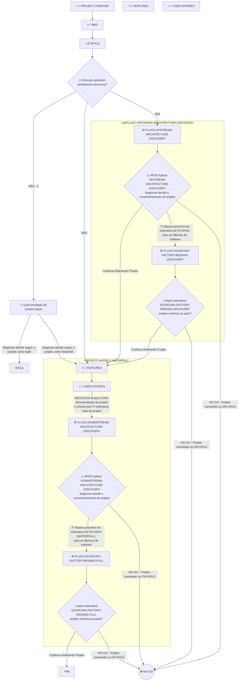

# FLUXO MACRO

```mermaid
graph TD

    FIM-NO-GO(("❌ NO-GO"))

    %%subgraph FLUXO-PROJECT-DOCUMENTS
        direction LR
        PROJECT-CHARTER["⭐💡 PROJECT-CHARTER"]
        BRD["⭐💡 BRD"]
        EPICS["⭐📋 EPICS"]
        FEATURES["⭐🧩 FEATURES"]
        USER-STORIES["⭐📝 USER-STORIES"]

        subgraph WATEFALL["PROJETO MODELO WATERFALL"]
            WATERFALL-FEATURES["⭐🧩 FEATURES"]
            WATERFALL-USER-STORIES["⭐📝 USER-STORIES"]
            WATERFALL-FEATURES --> WATERFALL-USER-STORIES

            FLUXO-DOWNSTREAM-ARCHITECTURE-DISCOVERY["⚙️ FLUXO-DOWNSTREAM-ARCHITECTURE-DISCOVERY"]
            FLUXO-SOURCING-FACTORY-BIDDING-FULL["⚙️ FLUXO-SOURCING-FACTORY-BIDDING-FULL"]
            DECISAO_APOS-downstream-architecture-refinament{"⚠️ APOS Aplicar DOWNSTREAM-ARCHITECTURE-DISCOVERY<br>Negócios decide o encaminhamento do projeto"}
            DECISAO_APOS_sourcing-factory-bidding-FULL{"⚠️Após estimativa SOURCING-FACTORY-BIDDING-FULL<br>projeto continua ou para?"}
        end

        QUAL-ESTRATEGIA-SEGUIR["⚠️ Qual estratégia de projeto seguir"]
        
    %%end

    subgraph subFLUXO-UPSTREAM-ARCHITECTURE-DISCOVERY
        FLUXO-UPSTREAM-ARCHITECTURE-DISCOVERY["⚙️ FLUXO-UPSTREAM-ARCHITECTURE-DISCOVERY"]
        FLUXO-SOURCING-FACTORY-BIDDING-DISCOVERY["⚙️ FLUXO-SOURCING-FACTORY-BIDDING-DISCOVERY"]
        DECISAO_sourcing-factory-bidding{"⚠️ APOS Aplicar UPSTREAM-ARCHITECTURE-DISCOVERY<br>Negócios decide o encaminhamento do projeto"}
        DECISAO_APOS_sourcing-factory-bidding{"⚠️Após estimativa SOURCING-FACTORY-BIDDING-DISCOVERY<br>projeto continua ou para?"}
    end

    %%subgraph subFLUXO-DOWNSTREAM-ARCHITECTURE-DISCOVERY
        %%FLUXO-DOWNSTREAM-ARCHITECTURE-DISCOVERY["⚙️ FLUXO-DOWNSTREAM-ARCHITECTURE-DISCOVERY"]
        %%FLUXO-SOURCING-FACTORY-BIDDING-FULL["⚙️ FLUXO-SOURCING-FACTORY-BIDDING-FULL"]
    %%end

    %%subgraph subFLUXO-TECNICO
    %%    FLUXO-PROJECT-TECHNICAL-DEFINITIONS
    %%    FLUXO-TECHNICAL-SOLUTIONS
    %%    FLUXO-ARTEFACTS
    %%    FLUXO-PROJECT-TECHNICAL-DEFINITIONS --> FLUXO-TECHNICAL-SOLUTIONS
    %%    FLUXO-TECHNICAL-SOLUTIONS --> FLUXO-ARTEFACTS
    %%end

    PROJECT-CHARTER --> BRD --> EPICS
    EPICS --> EXECUTA_upstream-architecture-discovery{"⚠️ Executa upstream-architecture-discovery?"}
    EXECUTA_upstream-architecture-discovery -- "NÃO - 2" --> QUAL-ESTRATEGIA-SEGUIR
    EXECUTA_upstream-architecture-discovery -- "NÃO" --> WATERFALL-FEATURES
    %% FEATURES --> USER-STORIES
    
    EXECUTA_upstream-architecture-discovery -- "SIM" --> FLUXO-UPSTREAM-ARCHITECTURE-DISCOVERY

    QUAL-ESTRATEGIA-SEGUIR -- "Negócios decide seguir o projeto como Agile" --> AGILE
    QUAL-ESTRATEGIA-SEGUIR -- "Negócios decide seguir o projeto como Waterfall" --> WATERFALL-FEATURES
    

    %% ESTIMATIVA - UPSTREAM DISCOVERY
    FLUXO-UPSTREAM-ARCHITECTURE-DISCOVERY --> DECISAO_sourcing-factory-bidding
    DECISAO_sourcing-factory-bidding -- "Continua Refinando Projeto" --> WATERFALL-FEATURES
    DECISAO_sourcing-factory-bidding -- "TI dispara processo de <br>estimativa ALTO-NIVEL <br>para as fábricas de software" --> FLUXO-SOURCING-FACTORY-BIDDING-DISCOVERY
    DECISAO_sourcing-factory-bidding -- "NO-GO - Projeto cancelado ou ON-HOLD" --> FIM-NO-GO
    FLUXO-SOURCING-FACTORY-BIDDING-DISCOVERY --> DECISAO_APOS_sourcing-factory-bidding
    DECISAO_APOS_sourcing-factory-bidding -- "Continua Refinando Projeto" --> WATERFALL-FEATURES
    DECISAO_APOS_sourcing-factory-bidding -- "NO-GO - Projeto cancelado ou ON-HOLD" --> FIM-NO-GO
    


    WATERFALL-USER-STORIES -- "NEGÓCIOS finaliza TODA documentação do projeto<br>e solicita para TI estimativa total do projeto"--> FLUXO-DOWNSTREAM-ARCHITECTURE-DISCOVERY

    FLUXO-DOWNSTREAM-ARCHITECTURE-DISCOVERY --> DECISAO_APOS-downstream-architecture-refinament
    DECISAO_APOS-downstream-architecture-refinament -- "TI dispara processo de <br>estimativa DETALHADA (WATERFALL) <br>para as fábricas de software" --> FLUXO-SOURCING-FACTORY-BIDDING-FULL
    DECISAO_APOS-downstream-architecture-refinament -- "NO-GO - Projeto cancelado ou ON-HOLD" --> FIM-NO-GO

    FLUXO-SOURCING-FACTORY-BIDDING-FULL --> DECISAO_APOS_sourcing-factory-bidding-FULL
    DECISAO_APOS_sourcing-factory-bidding-FULL -- "Continua Refinando Projeto" --> FIM
    DECISAO_APOS_sourcing-factory-bidding-FULL -- "NO-GO - Projeto cancelado ou ON-HOLD" --> FIM-NO-GO


    %% USER-STORIES -- "Negocios envia Backlog-Product-List para TI" --> FLUXO-PROJECT-TECHNICAL-DEFINITIONS

```

---
