Para garantir que absolutamente nenhuma caixa, fila ou validação de negócio fique de fora, fiz uma varredura minuciosa seguindo a sequência exata das novas imagens nítidas (da esquerda para a direita, correspondendo às etapas lógicas do seu desenho no Draw.io).

Aqui está o código **Mermaid** totalmente revisado, cobrindo 100% das caixas e caminhos apresentados nas imagens:

```mermaid
graph TD
    %% Estilização baseada nas cores oficiais do diagrama original
    classDef endpoint fill:#f06000,stroke:#b84a00,stroke-width:1px,color:#fff;
    classDef conversor fill:#ff9933,stroke:#cc7a29,stroke-width:1px,color:#fff;
    classDef job fill:#fc0,stroke:#cc9900,stroke-width:1px,color:#000;
    classDef file fill:#fff2cc,stroke:#d6b656,stroke-width:1px,color:#000;
    classDef consumer fill:#d5ebd5,stroke:#2b5b2b,stroke-width:1px,color:#000;
    classDef condicional fill:#ffffff,stroke:#000000,stroke-width:1px,color:#000;
    classDef erro fill:#f8cecc,stroke:#b85450,stroke-width:1px,color:#000;
    classDef finalizacao fill:#dae8fc,stroke:#6c8ebf,stroke-width:1px,color:#000;

    %% ==========================================
    %% IMAGEM 1 (Aaaaa.jpg): ENTRADAS E INGESTÃO
    %% ==========================================
    subgraph Etapa_1 [Ingestão & Gatilhos]
        Ator_Migracao([Ator Migração]) -->|HTTP| End_Migracao[Endpoint POST:<br>/adherence/start]:::endpoint
        End_Migracao -->|AMQP| Fila_Adherence_Start[File:<br>adherence-start]:::file
        Fila_Adherence_Start -->|AMQP| Cons_Adherence_Start[Consumer:<br>AdherenceStartConsumer]:::consumer
        
        Ator_Obrigacao([Ator Obrigação]) -->|HTTP| End_Obrigacao[Obrigação de canais e parceiros de fluxo]:::endpoint
        End_Obrigacao -->|HTTP| Conv_Easy_Adherence[Conversor:<br>via-easy-AdherenceConversion]:::conversor
    end

    %% ==========================================
    %% IMAGEM 2 (Bbbbb.jpg): ORQUESTRADOR & SELEÇÃO DE ORIGEM
    %% ==========================================
    subgraph Etapa_2 [Orquestração via-easy-jobs]
        Cons_Adherence_Start -->|HTTP POST| End_Easy_Jobs[via-easy-jobs<br>Endpoint POST:<br>/bundle-adherence/process-adherence-new-msisdn]:::endpoint
        Conv_Easy_Adherence -->|HTTP POST| End_Easy_Jobs
        
        End_Easy_Jobs --> Job_Bundle[via-easy-jobs<br>Job:<br>bundle-adesao]:::job
        Job_Bundle -->|Gera Lote| File_Decide_Type[File:<br>decide-adherence-type]:::file
        File_Decide_Type -->|AMQP| Cons_Decide_Type[Consumer:<br>DecideAdherenceTypeConsumer]:::consumer
    end

    %% Roteamento por Origem do Cliente
    Cons_Decide_Type -->|Origem AMDOCS| File_Origem_Amdocs[File:<br>origem-Amdocs]:::file
    Cons_Decide_Type -->|Origem Pós/Controle Não AMDOCS| File_Origem_Pos[File:<br>origem-PosNaoAmdocs]:::file
    Cons_Decide_Type -->|Origem Pré| File_Origem_Pre[File:<br>origem-Pre]:::file

    %% ==========================================
    %% IMAGEM 3 (Ccccc.jpg): CONSUMERS DE ADESÃO E ENTRADA DE VOUCHER
    %% ==========================================
    subgraph Etapa_3 [Processamento de Adesão por Tipo]
        File_Origem_Amdocs -->|AMQP| Cons_Amdocs[Consumer:<br>AmdocsAdherenceConsumer]:::consumer
        File_Origem_Pos -->|AMQP| Cons_Pos[Consumer:<br>PosOrCtrlAdherenceConsumer]:::consumer
        File_Origem_Pre -->|AMQP| Cons_Pre[Consumer:<br>PreAdherenceConsumer]:::consumer
    end

    Cons_Amdocs & Cons_Pos & Cons_Pre -->|AMQP| File_Voucher_Auth[File:<br>voucher-authorization-with-fail]:::file

    %% ==========================================
    %% IMAGEM 4 (Ddddd.jpg): VOUCHERS E ASSINATURA PRIME
    %% ==========================================
    subgraph Etapa_4 [Validação de Vouchers e Assinaturas]
        File_Voucher_Auth -->|AMQP| Cons_Voucher_Auth[Consumer:<br>VoucherAuthorizationWithFailConsumer]:::consumer
        Cons_Voucher_Auth -->|AMQP| File_Voucher_Conf[File:<br>voucher-confirmation]:::file
        File_Voucher_Conf -->|AMQP| Cons_Voucher_Conf[Consumer:<br>VoucherConfirmationConsumer]:::consumer
        
        Cons_Voucher_Conf -->|AMQP| File_Process_Prime[File:<br>process-prime-subscription]:::file
        File_Process_Prime -->|AMQP| Cons_Process_Prime[Consumer:<br>ProcessPrimeSubscriptionConsumer]:::consumer
    end

    %% Decisão de Fluxo de Device
    Cons_Process_Prime --> Cond_Device{Se for Alta com Device e<br>pagamento confirmado no<br>carrinho/cartão de crédito?}:::condicional

    %% ==========================================
    %% IMAGEM 5 (Eeeee.jpg): ESTRELA DE BÔNUS & BLACK FRIDAY
    %% ==========================================
    Cond_Device -->|Sim| File_Offer_Bonus[File:<br>apply-adherence-offer-bonus-black-friday]:::file
    Cond_Device -->|Não / Falha| File_Fail_Adherence[File:<br>adherence-fail-recovery-bonus]:::file

    Cons_Process_Prime -->|AMQP| File_Prepare_Offers[File:<br>start-prepare-offers-bonuses-black-friday]:::file
    File_Prepare_Offers -->|AMQP| Cons_Prepare_Offers[Consumer:<br>StartPrepareOffersBonusesBlackFridayConsumer]:::consumer
    
    Cons_Prepare_Offers --> File_Apply_Code[File:<br>apply-code-bonus]:::file
    File_Apply_Code -->|AMQP| Cons_Apply_Code[Consumer:<br>ApplyCodeBonusConsumer]:::consumer

    File_Offer_Bonus -->|AMQP| Cons_Offer_Bonus[Consumer:<br>ApplyAdherenceOfferBonusBlackFridayConsumer]:::consumer

    %% ==========================================
    %% IMAGEM 6 (Fffff.jpg): DESCONTOS, RECUPERAÇÃO E ATIVAÇÃO FINAL
    %% ==========================================
    subgraph Etapa_5 [Aplicação de Descontos e Ativação]
        Cons_Apply_Code & Cons_Offer_Bonus -->|AMQP| File_Reg_Discount[File:<br>register-adherence-discount-code]:::file
        File_Reg_Discount -->|AMQP| Cons_Reg_Discount[Consumer:<br>RegisterAdherenceDiscountCodeConsumer]:::consumer
        
        Cons_Reg_Discount --> File_Recovery_Bonus[File:<br>apply-adherence-recovery-bonus]:::file
        File_Recovery_Bonus -->|AMQP| Cons_Recovery_Bonus[Consumer:<br>ApplyAdherenceRecoveryBonusConsumer]:::consumer
        
        Cons_Recovery_Bonus -->|AMQP| File_Update_Active[File:<br>update-client-to-active]:::file
        File_Update_Active -->|AMQP| Cons_Update_Active[Consumer:<br>UpdateToActiveConsumer]:::consumer
    end

    %% Validação de Sucesso da Ativação
    Cons_Update_Active --> Cond_Status{Valida se Status do Cliente<br>foi atualizado com Sucesso?}:::condicional
    
    Cond_Status -->|Sucesso| File_Send_Notif[File:<br>send-adherence-notification]:::file
    Cond_Status -->|Erro Crítico / Falha de Integração Operadora| File_Fail_Adherence

    %% Notificação e Babysitting
    subgraph Etapa_6 [Finalização e Notificações]
        File_Send_Notif -->|AMQP| Cons_Send_Notif[Consumer:<br>SendAdherenceNotificationConsumer]:::consumer
        Cons_Send_Notif -->|AMQP| File_Schedule_Pushes[File:<br>schedule-pushes-and-babysitting]:::file
        File_Schedule_Pushes -->|AMQP| Cons_Schedule_Pushes[Consumer:<br>SchedulePushesAndBabysittingConsumer]:::consumer
        Cons_Schedule_Pushes --> Fim_Fluxo([Fim do Fluxo / Concluído]):::finalizacao
    end

    %% Fluxo Isolado de Tratamento de Falha / Rollback (Esquerda do Diagrama)
    File_Fail_Adherence -->|AMQP| Cons_Fail_Adherence[Consumer:<br>AdherenceFailRecoveryBonusConsumer]:::consumer
    Cons_Fail_Adherence -->|AMQP| File_Rollback[Estorno do pagamento /<br>Exclusão de cartão na carteira]:::erro

```

---

### 📝 Resumo das revisões importantes e caixas restauradas:

1. **Unificação dos Consumers de Entrada:** O `AmdocsAdherenceConsumer`, `PosOrCtrlAdherenceConsumer` e `PreAdherenceConsumer` agora convergem perfeitamente para a fila unificada `voucher-authorization-with-fail`.
2. **Nomenclatura Corrigida:** Ajustado de `voucher-authorization` para `voucher-authorization-with-fail` conforme legível na imagem `Ddddd.jpg`.
3. **Looping de Fallback Garantido:** Mapeada a linha que sai do losango de decisão final (`Cond_Status`) e joga o fluxo de volta para o início da esteira de falhas (`File: adherence-fail-recovery-bonus`) caso a operadora rejeite a ativação da linha telefônica no passo final.