> **🚀 PONTO DE ENTRADA:** O fluxo abaixo é orquestrado pelo prompt `PROMPT-ORCHESTRATOR-GENERATE-ALL-ARTEFACTS.md`, que automatiza a geração e validação de todos os 5 artefatos com gates de qualidade e loop de correção limitado a 3 iterações. Veja o [mapeamento completo](#mapeamento-agentes-do-fluxo--prompts) abaixo.

```mermaid
graph TD

  subgraph ORCHESTRATOR [🚀 ORCHESTRATOR — PONTO DE ENTRADA]
    ORCH[Orquestrador: PROMPT-ORCHESTRATOR-GENERATE-ALL-ARTEFACTS.md<br/>Coordena geração, gates e correções com max 3 loops]
  end

  subgraph GLOBAL_SECURITY [1.0. INPUT GLOBAL]
    A_GLOBAL[Agentes geradores de documentos globais]
  end

  subgraph PROJECT [1. PROJECT INPUTS]
    A_INICIO[Agentes geradores de documentos de projeto]
  end

  subgraph DOCS_BASE_FEATURE [2. DEFINIÇÃO DA FEATURE]
    A_PRD["Agente PRD: Lê documentos e gera PRD.md"]
    A_ARCHITECT["Agente Arquiteto: Gera ARCHITEC.md"]
  end

  subgraph GATE_ESCOPO [2.1 GATE DE ALINHAMENTO DE ESCOPO]
    GE1[Agente Validador: Scope Creep Check no PRD.md]
    GATE_PRD{PRD.md validado?}
    GE2[Agente Validador: Gera PRD_SCOPE_FAIL_REPORT.md]

    GE3[Agente Validador: Scope Creep Check no ARCHITECT.md]
    GATE_ARCHITECT{ARCHITECT.md validado?}
    GE4[Agente Validador: Gera ARCHITECT_SCOPE_FAIL_REPORT.md]
  end

  subgraph DOCS_TECNIDOS_FEATURE [3. ESPECIFICAÇÃO TÉCNICA]
    A_SPECS[Agente de Specs: Gera SPECS.md]
    A_TASKS[Agente de Tarefas: Gera TASKS.md]
    A_TEST_PLAN[Agente de Testes: Gera TEST_PLAN.md]
  end

  subgraph GATE_TECNICO [3.1 GATE DE VIABILIDADE E COMPLETUDE TÉCNICA]
    GT1[Agente Validador: Checa SPECS.md]
    GATE_SPECS{SPECS.md validado?}
    GT1_1[Agente Validador: Gerar TECHNICAL_SPECS_FAIL_REPORT.md]

    GT2[Agente Validador: Checa TASKS.md]
    GATE_TASKS{TASKS.md validado?}
    GT2_1[Agente Validador: Gerar TECHNICAL_TASKS_FAIL_REPORT.md]

    GT3[Agente Validador: Checa TEST_PLAN.md]
    GATE_TEST_PLAN{TEST_PLAN.md validado?}
    GT3_1[Agente Validador: Gerar TECHNICAL_TEST_PLAN_FAIL_REPORT.md]
  end

  subgraph AGENTE_DEVELOPER [4. EXECUÇÃO]
    A[Agente Dev: Lê documentos validados]
    B[Agente Dev: Codifica via claude-code]
  end

  subgraph AGENTE_QA [5. QUALITY GATE: TESTES]
    C[Agente QA: Roda TEST_PLAN]
    D[Agente QA: Gera Bug Report]
    QA_REPORT_OK[Agente QA: Gera Detail Success Report]
  end

  %% NOVO SUB-GRÁFICO OU ADIÇÃO NO REVISOR
  subgraph AGENTE_SIMPLIFICADOR [5.1 REFINAMENTO E KISS]
      SIMP1[Agente Simplificador: Executa Skill Ponytail]
      SIMP2[Agente Simplificador: Executa Skill Caveman]
      SIMP_OK[Código Simplificado e Enxuto]
  end

  subgraph AGENTE_REVISOR [6. QUALITY GATE: ARQUITETURA]
    E[Agente Revisor: Valida Código vs ARCHITECT e PRD]
    FA[Agente Revisor: Gera Revisor Design Architect Fail Report]
    FC[Agente Revisor: Gera Revisor Development Fail Report]
    R[Agente Revisor: Gera Detail Success Revisor]
  end

  subgraph PULL_REQUEST [7. ENTREGA GITOPS]
    P1[Agente PR: Lê relatórios de sucesso]
    P2[Agente PR: Cria PULL-REQUEST-REPORT.md]
    P3[Agente PR: Git Local]
    P4[Agente PR: Git Push]
    P5[Agente PR: Cria PR via gh]
  end

  subgraph CODE_REVIEW [8. CODE REVIEW]
    CR1[Agente CodeReview: Analise o código desenvolvido<br>recebendo como input o documento<br>PULL-REQUEST-REPORT.md<br>usando a skill: coderabbitai]
    CR2[Agente CodeReview: Gera documento CODE-REVIEW.md]
    CR3[Agente CodeReview: Adiciona ao documento PULL-REQUEST-REPORT.md os retornos do CODE-REVIEW.md]
  end

    %% Fluxo Inicial
    ORCH --> A_GLOBAL
    ORCH --> A_INICIO
    A_GLOBAL --> A_PRD
    A_INICIO --> A_PRD
    A_PRD --> A_ARCHITECT

    %% CORREÇÃO 2.A: A_ARCHITECT sempre aponta para o GE1 para garantir re-validação se houver re-escrita
    A_ARCHITECT --> GE1
    GE1 --> GATE_PRD
    GATE_PRD -- "Inválido" --> GE2
    GE2 --> A_PRD
    GATE_PRD -- "Valido" --> GE3
    
    GE3 --> GATE_ARCHITECT
    GATE_ARCHITECT -- "Inválido" --> GE4
    GE4 --> A_ARCHITECT
    GATE_ARCHITECT -- "Válido" --> A_SPECS

    %% Sequência da Fase 3
    A_SPECS --> A_TASKS
    A_TASKS --> A_TEST_PLAN
    
    %% CORREÇÃO 1: Conexão adicionada para entrar no Gate Técnico
    A_TEST_PLAN --> GT1

    %% Validações do Gate Técnico
    GT1 --> GATE_SPECS
    GATE_SPECS -- "Invalido" --> GT1_1
    GT1_1 --> A_SPECS

    GATE_SPECS -- "Valido" --> GT2
    GT2 --> GATE_TASKS
    GATE_TASKS -- "Inválido" --> GT2_1
    GT2_1 --> A_TASKS

    GATE_TASKS -- "Válido" --> GT3
    GT3 --> GATE_TEST_PLAN
    GATE_TEST_PLAN -- "Inválido" --> GT3_1
    GT3_1 --> A_TEST_PLAN
    GATE_TEST_PLAN -- "Válido" --> A

    %% Execução e Testes de Código
    A --> B
    B --> C
    C -- "Falhou" --> D
    D --> B
    C -- "Passou" --> QA_REPORT_OK

%% O relatório de sucesso do QA dispara o motor de simplificação
    QA_REPORT_OK --> SIMP1
    SIMP1 --> SIMP2
    SIMP2 --> SIMP_OK
    %% O código já simplificado entra na validação de arquitetura do Revisor
    SIMP_OK --> E

    %% Validações do Revisor
    E -- "Aprovado" --> R
    
    %% CORREÇÃO 2.B: Quando falha o design, volta para o Arquiteto e o fluxo re-valida as etapas
    E -- "Desalinhado: DESIGN ARCHITECT" --> FA
    FA --> A_ARCHITECT
    
    E -- "Desalinhado: DEVELOPMENT" --> FC
    FC --> B

    %% Publicação e GitOps
    R --> P1
    P1 --> P2

    P2 -- "envia para Code-Review" --> CR1
    CR1 --> CR2
    CR2 --> CR3
    CR3 --> P3

    P3 --> P4
    P4 --> P5
    P5 --> FINALIZADA_A_FEATURE

```



---

## Mapeamento: Agentes do Fluxo → Prompts

Cada nó do diagrama acima é orquestrado por um prompt documentado na pasta `.specs/prompts/`. A tabela abaixo mapeia agente a agente.

### 🚀 Orquestrador (Ponto de Entrada)

| Nó | Agente | Prompt | Status |
|---|---|---|---|
| `ORCH` | Orquestrador de Artefatos | `PROMPT-ORCHESTRATOR-GENERATE-ALL-ARTEFACTS.md` | 🟢 Criado |

O orquestrador automatiza todo o pipeline abaixo: geração dos 5 artefatos → gates de validação → correção pós-gate → loop limitado a 3 iterações. Consulte o prompt para o fluxo detalhado.

### Fase 1 — INPUT GLOBAL e PROJECT INPUTS

| Nó | Agente | Prompt | Status |
|---|---|---|---|
| `A_GLOBAL` | Gerador de documentos globais | *(a definir)* | 🔴 Pendente |
| `A_INICIO` | Gerador de documentos de projeto | *(a definir)* | 🔴 Pendente |

### Fase 2 — DEFINIÇÃO DA FEATURE

| Nó | Agente | Prompt | Artefato Gerado | Status |
|---|---|---|---|---|
| `A_PRD` | Gerador de PRD | `PROMPT-GENERATE-PRD-ARTEFACT.md` | `PRD.md` | 🟢 Criado |
| `A_ARCHITECT` | Gerador de Arquitetura | `PROMPT-GENERATE-ARCHITECTURE-ARTEFACT.md` | `ARCHITECTURE.md` | 🟢 Criado |

### Fase 2.1 — GATE DE ALINHAMENTO DE ESCOPO

| Nó | Agente | Prompt | Input | Output (se reprovado) | Status |
|---|---|---|---|---|---|
| `GE1` | Validador: Scope Creep no PRD.md | `PROMPT-GATE-PRD-SCOPE.md` | `PRD.md` + docs do projeto | — | 🟢 Criado |
| `GATE_PRD` | Decisão: PRD.md validado? | *(automático — veredito do GE1)* | — | — | — |
| `GE2` | Gerador de Relatório de Falha (PRD) | *(mesmo prompt: PROMPT-GATE-PRD-SCOPE.md, passo 4)* | — | `PRD_SCOPE_FAIL_REPORT.md` | 🟢 Criado |
| `A_PRD` | Corretor de PRD (pós-gate) | `PROMPT-FIX-PRD-FROM-GATE.md` | `PRD_SCOPE_FAIL_REPORT.md` | `PRD.md` (corrigido) | 🟢 Criado |
| `GE3` | Validador: Scope Creep no ARCHITECTURE.md | `PROMPT-GATE-ARCHITECTURE-SCOPE.md` | `ARCHITECTURE.md` + `PRD.md` | — | 🟢 Criado |
| `GATE_ARCHITECT` | Decisão: ARCHITECTURE.md validado? | *(automático — veredito do GE3)* | — | — | — |
| `GE4` | Gerador de Relatório de Falha (ARCHITECTURE) | *(mesmo prompt: PROMPT-GATE-ARCHITECTURE-SCOPE.md, passo 4)* | — | `ARCHITECTURE_SCOPE_FAIL_REPORT.md` | 🟢 Criado |
| `A_ARCHITECT` | Corretor de Arquitetura (pós-gate) | `PROMPT-FIX-ARCHITECTURE-FROM-GATE.md` | `ARCHITECTURE_SCOPE_FAIL_REPORT.md` | `ARCHITECTURE.md` (corrigido) | 🟢 Criado |

### Fase 3 — ESPECIFICAÇÃO TÉCNICA

| Nó | Agente | Prompt | Artefato Gerado | Status |
|---|---|---|---|---|
| `A_SPECS` | Gerador de Specs | `PROMPT-GENERATE-SPECS-ARTEFACT.md` | `SPECS.md` | 🟢 Criado |
| `A_TASKS` | Gerador de Tarefas | `PROMPT-GENERATE-TASKS-ARTEFACT.md` | `TASKS.md` | 🟢 Criado |
| `A_TEST_PLAN` | Gerador de Plano de Testes | `PROMPT-GENERATE-TEST_PLAN-ARTEFACT.md` | `TEST_PLAN.md` | 🟢 Criado |

### Fase 3.1 — GATE DE VIABILIDADE E COMPLETUDE TÉCNICA

| Nó | Agente | Prompt | Input | Output (se reprovado) | Status |
|---|---|---|---|---|---|
| `GT1` | Validador: SPECS.md | `PROMPT-GATE-SPECS-TECHNICAL.md` | `SPECS.md` + `PRD.md` + `ARCHITECTURE.md` | — | 🟢 Criado |
| `GATE_SPECS` | Decisão: SPECS.md validado? | *(automático — veredito do GT1)* | — | — | — |
| `GT1_1` | Gerador de Relatório de Falha (SPECS) | *(mesmo prompt: PROMPT-GATE-SPECS-TECHNICAL.md, passo 4)* | — | `TECHNICAL_SPECS_FAIL_REPORT.md` | 🟢 Criado |
| `A_SPECS` | Corretor de Specs (pós-gate) | `PROMPT-FIX-SPECS-FROM-GATE.md` | `TECHNICAL_SPECS_FAIL_REPORT.md` | `SPECS.md` (corrigido) | 🟢 Criado |
| `GT2` | Validador: TASKS.md | `PROMPT-GATE-TASKS-TECHNICAL.md` | `TASKS.md` + `SPECS.md` + `ARCHITECTURE.md` | — | 🟢 Criado |
| `GATE_TASKS` | Decisão: TASKS.md validado? | *(automático — veredito do GT2)* | — | — | — |
| `GT2_1` | Gerador de Relatório de Falha (TASKS) | *(mesmo prompt: PROMPT-GATE-TASKS-TECHNICAL.md, passo 4)* | — | `TECHNICAL_TASKS_FAIL_REPORT.md` | 🟢 Criado |
| `A_TASKS` | Corretor de Tarefas (pós-gate) | `PROMPT-FIX-TASKS-FROM-GATE.md` | `TECHNICAL_TASKS_FAIL_REPORT.md` | `TASKS.md` (corrigido) | 🟢 Criado |
| `GT3` | Validador: TEST_PLAN.md | `PROMPT-GATE-TEST_PLAN-TECHNICAL.md` | `TEST_PLAN.md` + `SPECS.md` + `TASKS.md` | — | 🟢 Criado |
| `GATE_TEST_PLAN` | Decisão: TEST_PLAN.md validado? | *(automático — veredito do GT3)* | — | — | — |
| `GT3_1` | Gerador de Relatório de Falha (TEST_PLAN) | *(mesmo prompt: PROMPT-GATE-TEST_PLAN-TECHNICAL.md, passo 4)* | — | `TECHNICAL_TEST_PLAN_FAIL_REPORT.md` | 🟢 Criado |
| `A_TEST_PLAN` | Corretor de Testes (pós-gate) | `PROMPT-FIX-TEST_PLAN-FROM-GATE.md` | `TECHNICAL_TEST_PLAN_FAIL_REPORT.md` | `TEST_PLAN.md` (corrigido) | 🟢 Criado |

### Fase 4 — EXECUÇÃO

| Nó | Agente | Prompt | Status |
|---|---|---|---|
| `A` | Agente Dev: Lê documentos validados | `PROMPT-EXECUTE-TASK.md` | 🟢 Criado |
| `B` | Agente Dev: Codifica via claude-code | *(mesmo prompt acima)* | 🟢 Criado |

### Fase 5 — QUALITY GATE: TESTES

| Nó | Agente | Prompt | Status |
|---|---|---|---|
| `C` | Agente QA: Roda TEST_PLAN | `PROMPT-AGENTE-QA-ATUALIZA-TEST_PLAN.md` | 🟢 Criado |
| `D` | Agente QA: Gera Bug Report | *(mesmo prompt acima)* | 🟢 Criado |
| `QA_REPORT_OK` | Agente QA: Gera Detail Success Report | *(mesmo prompt acima)* | 🟢 Criado |

### Fase 5.1 — REFINAMENTO E KISS

| Nó | Agente | Prompt | Status |
|---|---|---|---|
| `SIMP1` | Simplificador: Skill Ponytail | *(skill inline — sem prompt dedicado)* | 🟢 Skill disponível |
| `SIMP2` | Simplificador: Skill Caveman | *(skill inline — sem prompt dedicado)* | 🟢 Skill disponível |

### Fase 6 — QUALITY GATE: ARQUITETURA

| Nó | Agente | Prompt | Status |
|---|---|---|---|
| `E` | Agente Revisor: Valida Código vs ARCHITECT e PRD | `PROMPT-REVISOR-QA-SECURITY.md` | 🟢 Criado |
| `FA` | Agente Revisor: Design Architect Fail Report | *(a definir — especialização do revisor)* | 🔴 Pendente |
| `FC` | Agente Revisor: Development Fail Report | *(a definir — especialização do revisor)* | 🔴 Pendente |
| `R` | Agente Revisor: Detail Success Report | *(mesmo prompt do revisor)* | 🟢 Criado |

### Fase 7 — ENTREGA GITOPS

| Nó | Agente | Prompt | Status |
|---|---|---|---|
| `P1` | Agente PR: Lê relatórios de sucesso | `PROMPT-GENERATE-PULL-REQUEST.md` | 🟢 Criado |
| `P2` | Agente PR: Cria PULL-REQUEST-REPORT.md | *(mesmo prompt acima)* | 🟢 Criado |
| `P3` | Agente PR: Git Local | `PROMPT-02-ATUALIZAR-REPOSITORIO-E-ABRIR-PULL-REQUEST.md` | 🟢 Criado |
| `P4` | Agente PR: Git Push | *(mesmo prompt acima)* | 🟢 Criado |
| `P5` | Agente PR: Cria PR via gh | *(mesmo prompt acima)* | 🟢 Criado |

### Fase 8 — CODE REVIEW

| Nó | Agente | Prompt | Status |
|---|---|---|---|
| `CR1` | Agente CodeReview: Analisa código | *(skill `coderabbit:code-review` — sem prompt dedicado)* | 🟢 Skill disponível |
| `CR2` | Agente CodeReview: Gera CODE-REVIEW.md | *(mesmo skill acima)* | 🟢 Skill disponível |
| `CR3` | Agente CodeReview: Atualiza PULL-REQUEST-REPORT.md | *(mesmo skill acima)* | 🟢 Skill disponível |

---

## Índice de Artefatos por Fase

A tabela abaixo lista todos os artefatos gerados e consumidos ao longo do fluxo, no diretório `{SOLUTION_PATH}/.specs/business-projects/{PROJECT_NAME}/`.

| Artefato | Gerado por | Validado por | Corrigido por (se reprovado) |
|---|---|---|---|
| `PRD.md` | *(prompt a definir)* | `PROMPT-GATE-PRD-SCOPE.md` → `PRD_SCOPE_FAIL_REPORT.md` | `PROMPT-FIX-PRD-FROM-GATE.md` |
| `ARCHITECTURE.md` | `PROMPT-GENERATE-ARCHITECTURE-ARTEFACT.md` | `PROMPT-GATE-ARCHITECTURE-SCOPE.md` → `ARCHITECTURE_SCOPE_FAIL_REPORT.md` | `PROMPT-FIX-ARCHITECTURE-FROM-GATE.md` |
| `SPECS.md` | `PROMPT-GENERATE-SPECS-ARTEFACT.md` | `PROMPT-GATE-SPECS-TECHNICAL.md` → `TECHNICAL_SPECS_FAIL_REPORT.md` | `PROMPT-FIX-SPECS-FROM-GATE.md` |
| `TASKS.md` | `PROMPT-GENERATE-TASKS-ARTEFACT.md` | `PROMPT-GATE-TASKS-TECHNICAL.md` → `TECHNICAL_TASKS_FAIL_REPORT.md` | `PROMPT-FIX-TASKS-FROM-GATE.md` |
| `TEST_PLAN.md` | `PROMPT-GENERATE-TEST_PLAN-ARTEFACT.md` | `PROMPT-GATE-TEST_PLAN-TECHNICAL.md` → `TECHNICAL_TEST_PLAN_FAIL_REPORT.md` | `PROMPT-FIX-TEST_PLAN-FROM-GATE.md` |

---

## Estrutura de Diretórios dos Prompts

```
.specs/prompts/
├── FLUXO-SPEC-DRIVEN-DEVELOPMENT-V1.md          ← Este documento
├── PROMPT-ORCHESTRATOR-GENERATE-ALL-ARTEFACTS.md ← 🚀 Orquestrador (ponto de entrada)
│
├── 📁 Geração de Artefatos (Fases 2 e 3)
│   ├── PROMPT-GENERATE-ARCHITECTURE-ARTEFACT.md
│   ├── PROMPT-GENERATE-SPECS-ARTEFACT.md
│   ├── PROMPT-GENERATE-TASKS-ARTEFACT.md
│   └── PROMPT-GENERATE-TEST_PLAN-ARTEFACT.md
│
├── 📁 GATE — Alinhamento de Escopo (Fase 2.1)
│   ├── PROMPT-GATE-PRD-SCOPE.md
│   └── PROMPT-GATE-ARCHITECTURE-SCOPE.md
│
├── 📁 GATE — Viabilidade Técnica (Fase 3.1)
│   ├── PROMPT-GATE-SPECS-TECHNICAL.md
│   ├── PROMPT-GATE-TASKS-TECHNICAL.md
│   └── PROMPT-GATE-TEST_PLAN-TECHNICAL.md
│
├── 📁 FIX — Correção Pós-GATE
│   ├── PROMPT-FIX-PRD-FROM-GATE.md
│   ├── PROMPT-FIX-ARCHITECTURE-FROM-GATE.md
│   ├── PROMPT-FIX-SPECS-FROM-GATE.md
│   ├── PROMPT-FIX-TASKS-FROM-GATE.md
│   └── PROMPT-FIX-TEST_PLAN-FROM-GATE.md
│
├── 📁 Execução e QA (Fases 4, 5, 6)
│   ├── PROMPT-EXECUTE-TASK.md
│   ├── PROMPT-AGENTE-QA-ATUALIZA-TEST_PLAN.md
│   └── PROMPT-REVISOR-QA-SECURITY.md
│
├── 📁 GitOps e PR (Fase 7)
│   ├── PROMPT-GENERATE-PULL-REQUEST.md
│   ├── PROMPT-GENERATE-IMPLEMENTATION-REPORT.md
│   └── PROMPT-02-ATUALIZAR-REPOSITORIO-E-ABRIR-PULL-REQUEST.md
│
└── 📁 Outros
    ├── PROMPT-01-PROCESSAR-TASKS-E-GERAR-DOCUMENTO-DE-EXECUCAO.md
    ├── PROMPT-MINING-SPECIFICATION.md
    ├── PROMPT-MINING-FRONTEND-SPECIFICATION.md
    ├── PROMPT-MINING-MOBILE-APP-SPECIFICATION.md
    ├── PROMPT-AGENTE-TRIAGEM-FORENSE.md
    ├── PROMPT--UNIFIAR-REVISOR-QA-E-SECURITY.md
    └── PROMTP-ATUALIZACAO-DE-CHANGELOG.md
```

---

## Registro de Alterações do Documento

| Versão | Data | Alteração | Autor |
|:---|:---|:---|:---|
| 1.0 | 13/07/2026 | Criação inicial: diagrama Mermaid do fluxo Spec-Driven Development com 8 fases | Time de Arquitetura |
| 1.1 | 13/07/2026 | Adicionado mapeamento completo: agentes → prompts, índice de artefatos, estrutura de diretórios, status de cada prompt | Time de Arquitetura |
| 1.2 | 14/07/2026 | Adicionado Orquestrador (`PROMPT-ORCHESTRATOR-GENERATE-ALL-ARTEFACTS.md`) como ponto de entrada do fluxo, com loop de correção limitado a 3 | Time de Arquitetura |

---

🤖 *Documentação gerada de forma automatizada pelo Agente: Analista de Negócios/Claude. Foram utilizados os skills: writing-skills, agile-ba-practices.*
