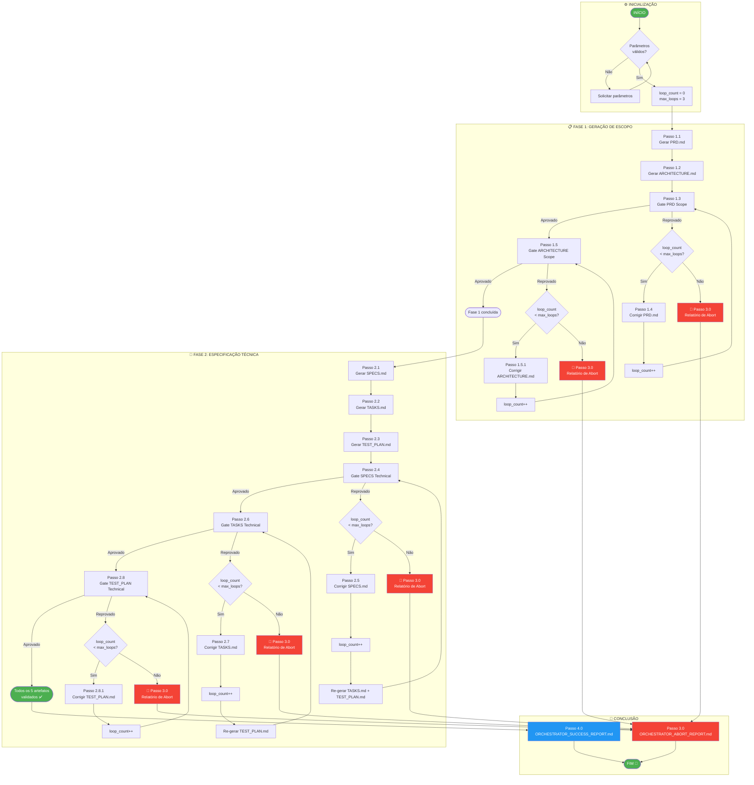

# PROMPT-ORCHESTRATOR-GENERATE-ALL-ARTEFACTS

## Contexto

Este prompt implementa o **Orquestrador de Geração de Artefatos** do fluxo Spec-Driven Development, responsável por coordenar a criação e validação de todos os 5 artefatos do projeto (PRD.md, ARCHITECTURE.md, SPECS.md, TASKS.md, TEST_PLAN.md) em duas fases, com gates de qualidade e loop de correção limitado a 3 iterações.

O orquestrador atua como o **controlador central** do pipeline de documentação — ele não gera nem valida artefatos diretamente, mas delega cada etapa para o prompt especializado correspondente, monitora os resultados e decide se o fluxo avança, repete ou aborta.

**Princípio fundamental:** Cada artefato deve passar pelo seu respectivo gate de validação antes que o próximo artefato seja gerado. Se um gate falhar, o artefato é corrigido e revalidado. Após 3 tentativas sem sucesso, o pipeline é interrompido com um relatório de diagnóstico.

---

## Parâmetros de Entrada

> **Instrução:** No momento de invocar este prompt, o agente deve solicitar ao humano os valores abaixo. Se algum não for informado, perguntar antes de prosseguir.

| Parâmetro | Descrição | Exemplo |
|---|---|---|
| `{SOLUTION_PATH}` | Caminho absoluto da pasta da solução técnica (microsserviço ou frontend) | `/home/user/work/backend/go/fiber/microservices/ms-billing-engine-tax-rates` |
| `{PROJECT_PATH}` | Caminho absoluto da pasta do projeto de negócio | `/home/user/work/business-inputs/business-projects/PRJ-FIN-2026-0001-REFORMA-TRIBUTARIA-2026-CORPORATIVO` |
| `{PROJECT_NAME}` | Nome/código do projeto | `PRJ-FIN-2026-0001-REFORMA-TRIBUTARIA-2026-CORPORATIVO` |
| `{SOLUTION_NAME}` | Nome da solução/microsserviço | `ms-billing-engine-tax-rates` |
| `{MAX_LOOPS}` | Número máximo de loops de correção (default: 3) | `3` |

---

## Fluxo de Execução

### Passo 0 — Validação de Parâmetros

Antes de qualquer ação, verificar se TODOS os 5 parâmetros foram informados. Se algum estiver ausente, perguntar ao humano antes de prosseguir.

Se `{MAX_LOOPS}` não for informado, assumir valor padrão `3`.

### Passo 0.1 — Inicializar Contador de Loops

```
INICIALIZAR:
    loop_count = 0
    max_loops = {MAX_LOOPS}
    artefactos_gerados = []
    artefactos_validados = []
    artefactos_reprovados = []
```

---

## FASE 1 — GERAÇÃO DE ESCOPO (PRD.md + ARCHITECTURE.md)

### Passo 1.1 — Gerar PRD.md

**Delegar para:** `PROMPT-GENERATE-PRD-TECHNICAL_SOLUTION.md`

```
INVOCAR o prompt PROMPT-GENERATE-PRD-TECHNICAL_SOLUTION.md com os parâmetros:
    {SOLUTION_PATH}, {PROJECT_PATH}, {PROJECT_NAME}, {SOLUTION_NAME}, SCOPE=full

VERIFICAR saída:
    ├── PRD.md gerado com sucesso → Registrar em artefactos_gerados, avançar para Passo 1.2
    └── ERRO na geração → Registrar falha, pular para Passo 1.6 (Relatório de Erro)
```

**Artefato esperado:** `{SOLUTION_PATH}/.specs/business-projects/{PROJECT_NAME}/PRD.md`

### Passo 1.2 — Gerar ARCHITECTURE.md

**Delegar para:** `PROMPT-GENERATE-ARCHITECTURE-TECHNICAL_SOLUTION.md`

```
INVOCAR o prompt PROMPT-GENERATE-ARCHITECTURE-TECHNICAL_SOLUTION.md com os parâmetros:
    {SOLUTION_PATH}, {PROJECT_PATH}, {PROJECT_NAME}, {SOLUTION_NAME}, SCOPE=full

PRÉ-CONDIÇÃO: PRD.md deve existir (gerado no passo 1.1)

VERIFICAR saída:
    ├── ARCHITECTURE.md gerado com sucesso → Registrar em artefactos_gerados, avançar para Passo 1.3
    └── ERRO na geração → Registrar falha, pular para Passo 1.6 (Relatório de Erro)
```

**Artefato esperado:** `{SOLUTION_PATH}/.specs/business-projects/{PROJECT_NAME}/ARCHITECTURE.md`

---

## FASE 1.1 — GATE DE ALINHAMENTO DE ESCOPO

### Passo 1.3 — Validar PRD.md (Gate de Escopo)

**Delegar para:** `PROMPT-GATE-PRD-TECHNICAL_SOLUTION.md`

```
INVOCAR o prompt PROMPT-GATE-PRD-TECHNICAL_SOLUTION.md com os parâmetros:
    {SOLUTION_PATH}, {PROJECT_PATH}, {PROJECT_NAME}, {SOLUTION_NAME}

VERIFICAR veredito:
    ├── APROVADO (todas as dimensões verdes) → Registrar em artefactos_validados, avançar para Passo 1.5
    ├── RESSALVA (aprovação condicional) → Registrar em artefactos_validados com observações, avançar para Passo 1.5
    └── REPROVADO (1+ dimensões vermelhas) → Registrar em artefactos_reprovados, executar Passo 1.4
```

**Relatório de falha (se reprovado):** `{SOLUTION_PATH}/.specs/business-projects/{PROJECT_NAME}/PRD_SCOPE_FAIL_REPORT.md`

### Passo 1.4 — Corrigir PRD.md (pós-gate)

**Delegar para:** `PROMPT-FIX-PRD-TECHNICAL_SOLUTION.md`

```
INCREMENTAR loop_count

SE loop_count > max_loops:
    → ABORTAR com relatório de estouro de loops (Passo 3.0)

INVOCAR o prompt PROMPT-FIX-PRD-TECHNICAL_SOLUTION.md com os parâmetros:
    {SOLUTION_PATH}, {PROJECT_PATH}, {PROJECT_NAME}, {SOLUTION_NAME}

VERIFICAR correção:
    ├── PRD.md corrigido → RETORNAR ao Passo 1.3 (revalidar)
    │   NOTA: A revalidação do PRD.md (Passo 1.3) força também a revalidação do ARCHITECTURE.md
    │   (Passo 1.5), pois mudanças de escopo podem impactar a arquitetura.
    └── ERRO na correção → ABORTAR com relatório de falha crítica
```

**IMPORTANTE — Efeito cascata:** Após corrigir o PRD.md, o fluxo DEVE:
1. Revalidar PRD.md (Passo 1.3)
2. Se PRD.md aprovado, REVALIDAR ARCHITECTURE.md (Passo 1.5), pois alterações de escopo podem invalidar decisões de arquitetura
3. Se PRD.md aprovado e ARCHITECTURE.md reprovado, corrigir ARCHITECTURE.md (Passo 1.5.1)

### Passo 1.5 — Validar ARCHITECTURE.md (Gate de Escopo)

**Delegar para:** `PROMPT-GATE-ARCHITECTURE-TECHNICAL_SOLUTION.md`

```
INVOCAR o prompt PROMPT-GATE-ARCHITECTURE-TECHNICAL_SOLUTION.md com os parâmetros:
    {SOLUTION_PATH}, {PROJECT_PATH}, {PROJECT_NAME}, {SOLUTION_NAME}

PRÉ-CONDIÇÃO: PRD.md deve estar validado (Passo 1.3 com APROVADO ou RESSALVA)

VERIFICAR veredito:
    ├── APROVADO (todas as dimensões verdes) → Registrar em artefactos_validados, avançar para FASE 2
    ├── RESSALVA (aprovação condicional) → Registrar em artefactos_validados com observações, avançar para FASE 2
    └── REPROVADO (1+ dimensões vermelhas) → Registrar em artefactos_reprovados, executar Passo 1.5.1
```

**Relatório de falha (se reprovado):** `{SOLUTION_PATH}/.specs/business-projects/{PROJECT_NAME}/ARCHITECTURE_SCOPE_FAIL_REPORT.md`

### Passo 1.5.1 — Corrigir ARCHITECTURE.md (pós-gate)

**Delegar para:** `PROMPT-FIX-ARCHITECTURE-TECHNICAL_SOLUTION.md`

```
INCREMENTAR loop_count

SE loop_count > max_loops:
    → ABORTAR com relatório de estouro de loops (Passo 3.0)

INVOCAR o prompt PROMPT-FIX-ARCHITECTURE-TECHNICAL_SOLUTION.md com os parâmetros:
    {SOLUTION_PATH}, {PROJECT_PATH}, {PROJECT_NAME}, {SOLUTION_NAME}

VERIFICAR correção:
    ├── ARCHITECTURE.md corrigido → RETORNAR ao Passo 1.5 (revalidar)
    └── ERRO na correção → ABORTAR com relatório de falha crítica
```

### Passo 1.6 — Relatório de Término da Fase 1

```
GERAR resumo da Fase 1:
    - Artefatos gerados e validados
    - Número de loops consumidos (loop_count)
    - Vereditos dos gates
    - Pendências ou observações (ressalvas)

Se PRD.md e ARCHITECTURE.md APROVADOS → Avançar para FASE 2
Se qualquer artefato REPROVADO após max_loops → ABORTAR (Passo 3.0)
```

---

## FASE 2 — ESPECIFICAÇÃO TÉCNICA (SPECS.md + TASKS.md + TEST_PLAN.md)

### Passo 2.1 — Gerar SPECS.md

**Delegar para:** `PROMPT-GENERATE-SPECS-TECHNICAL_SOLUTION.md`

```
INVOCAR o prompt PROMPT-GENERATE-SPECS-TECHNICAL_SOLUTION.md com os parâmetros:
    {SOLUTION_PATH}, {PROJECT_PATH}, {PROJECT_NAME}, {SOLUTION_NAME}, SCOPE=full

PRÉ-CONDIÇÕES: PRD.md e ARCHITECTURE.md validados (FASE 1 concluída)

VERIFICAR saída:
    ├── SPECS.md gerado com sucesso → Registrar em artefactos_gerados, avançar para Passo 2.2
    └── ERRO na geração → Registrar falha, pular para Passo 2.9 (Relatório de Erro)
```

**Artefato esperado:** `{SOLUTION_PATH}/.specs/business-projects/{PROJECT_NAME}/SPECS.md`

### Passo 2.2 — Gerar TASKS.md

**Delegar para:** `PROMPT-GENERATE-TASKS-TECHNICAL_SOLUTION.md`

```
INVOCAR o prompt PROMPT-GENERATE-TASKS-TECHNICAL_SOLUTION.md com os parâmetros:
    {SOLUTION_PATH}, {PROJECT_PATH}, {PROJECT_NAME}, {SOLUTION_NAME}

PRÉ-CONDIÇÃO: SPECS.md deve existir (gerado no passo 2.1)

VERIFICAR saída:
    ├── TASKS.md gerado com sucesso → Registrar em artefactos_gerados, avançar para Passo 2.3
    └── ERRO na geração → Registrar falha, pular para Passo 2.9 (Relatório de Erro)
```

**Artefato esperado:** `{SOLUTION_PATH}/.specs/business-projects/{PROJECT_NAME}/TASKS.md`

### Passo 2.3 — Gerar TEST_PLAN.md

**Delegar para:** `PROMPT-GENERATE-TEST_PLAN-TECHNICAL_SOLUTION.md`

```
INVOCAR o prompt PROMPT-GENERATE-TEST_PLAN-TECHNICAL_SOLUTION.md com os parâmetros:
    {SOLUTION_PATH}, {PROJECT_PATH}, {PROJECT_NAME}, {SOLUTION_NAME}

PRÉ-CONDIÇÃO: TASKS.md deve existir (gerado no passo 2.2)

VERIFICAR saída:
    ├── TEST_PLAN.md gerado com sucesso → Registrar em artefactos_gerados, avançar para Passo 2.4
    └── ERRO na geração → Registrar falha, pular para Passo 2.9 (Relatório de Erro)
```

**Artefato esperado:** `{SOLUTION_PATH}/.specs/business-projects/{PROJECT_NAME}/TEST_PLAN.md`

---

## FASE 2.1 — GATE DE VIABILIDADE E COMPLETUDE TÉCNICA

### Passo 2.4 — Validar SPECS.md (Gate Técnico)

**Delegar para:** `PROMPT-GATE-SPECS-TECHNICAL_SOLUTION.md`

```
INVOCAR o prompt PROMPT-GATE-SPECS-TECHNICAL_SOLUTION.md com os parâmetros:
    {SOLUTION_PATH}, {PROJECT_PATH}, {PROJECT_NAME}, {SOLUTION_NAME}

PRÉ-CONDIÇÃO: PRD.md e ARCHITECTURE.md devem existir (inputs do gate)

VERIFICAR veredito:
    ├── APROVADO → Registrar em artefactos_validados, avançar para Passo 2.6
    ├── RESSALVA → Registrar em artefactos_validados com observações, avançar para Passo 2.6
    └── REPROVADO → Registrar em artefactos_reprovados, executar Passo 2.5
```

**Relatório de falha (se reprovado):** `{SOLUTION_PATH}/.specs/business-projects/{PROJECT_NAME}/TECHNICAL_SPECS_FAIL_REPORT.md`

### Passo 2.5 — Corrigir SPECS.md (pós-gate)

**Delegar para:** `PROMPT-FIX-SPECS-TECHNICAL_SOLUTION.md`

```
INCREMENTAR loop_count

SE loop_count > max_loops:
    → ABORTAR com relatório de estouro de loops (Passo 3.0)

INVOCAR o prompt PROMPT-FIX-SPECS-TECHNICAL_SOLUTION.md com os parâmetros:
    {SOLUTION_PATH}, {PROJECT_PATH}, {PROJECT_NAME}, {SOLUTION_NAME}

VERIFICAR correção:
    ├── SPECS.md corrigido → RETORNAR ao Passo 2.4 (revalidar)
    │   NOTA: Mudanças em SPECS.md podem invalidar TASKS.md e TEST_PLAN.md.
    │   Após correção e revalidação bem-sucedida de SPECS.md:
    │   - Se TASKS.md já foi gerado → RE-GERAR TASKS.md (Passo 2.2)
    │   - Se TEST_PLAN.md já foi gerado → RE-GERAR TEST_PLAN.md (Passo 2.3)
    └── ERRO na correção → ABORTAR com relatório de falha crítica
```

**IMPORTANTE — Efeito cascata:** Após corrigir o SPECS.md, o fluxo DEVE:
1. Revalidar SPECS.md (Passo 2.4)
2. Se TASKS.md ou TEST_PLAN.md já existirem → Regenerá-los a partir do SPECS.md atualizado
3. Revalidar TASKS.md e TEST_PLAN.md também

### Passo 2.6 — Validar TASKS.md (Gate Técnico)

**Delegar para:** `PROMPT-GATE-TASKS-TECHNICAL_SOLUTION.md`

```
INVOCAR o prompt PROMPT-GATE-TASKS-TECHNICAL_SOLUTION.md com os parâmetros:
    {SOLUTION_PATH}, {PROJECT_PATH}, {PROJECT_NAME}, {SOLUTION_NAME}

PRÉ-CONDIÇÃO: SPECS.md deve estar validado (Passo 2.4 com APROVADO ou RESSALVA)

VERIFICAR veredito:
    ├── APROVADO → Registrar em artefactos_validados, avançar para Passo 2.8
    ├── RESSALVA → Registrar em artefactos_validados com observações, avançar para Passo 2.8
    └── REPROVADO → Registrar em artefactos_reprovados, executar Passo 2.7
```

**Relatório de falha (se reprovado):** `{SOLUTION_PATH}/.specs/business-projects/{PROJECT_NAME}/TECHNICAL_TASKS_FAIL_REPORT.md`

### Passo 2.7 — Corrigir TASKS.md (pós-gate)

**Delegar para:** `PROMPT-FIX-TASKS-TECHNICAL_SOLUTION.md`

```
INCREMENTAR loop_count

SE loop_count > max_loops:
    → ABORTAR com relatório de estouro de loops (Passo 3.0)

INVOCAR o prompt PROMPT-FIX-TASKS-TECHNICAL_SOLUTION.md com os parâmetros:
    {SOLUTION_PATH}, {PROJECT_PATH}, {PROJECT_NAME}, {SOLUTION_NAME}

VERIFICAR correção:
    ├── TASKS.md corrigido → RETORNAR ao Passo 2.6 (revalidar)
    │   NOTA: Mudanças em TASKS.md podem impactar TEST_PLAN.md.
    │   Após correção e revalidação bem-sucedida de TASKS.md:
    │   - Se TEST_PLAN.md já foi gerado → RE-GERAR TEST_PLAN.md (Passo 2.3)
    └── ERRO na correção → ABORTAR com relatório de falha crítica
```

### Passo 2.8 — Validar TEST_PLAN.md (Gate Técnico)

**Delegar para:** `PROMPT-GATE-TEST_PLAN-TECHNICAL_SOLUTION.md`

```
INVOCAR o prompt PROMPT-GATE-TEST_PLAN-TECHNICAL_SOLUTION.md com os parâmetros:
    {SOLUTION_PATH}, {PROJECT_PATH}, {PROJECT_NAME}, {SOLUTION_NAME}

PRÉ-CONDIÇÃO: TASKS.md deve estar validado (Passo 2.6 com APROVADO ou RESSALVA)

VERIFICAR veredito:
    ├── APROVADO → Registrar em artefactos_validados, avançar para Passo 2.9
    ├── RESSALVA → Registrar em artefactos_validados com observações, avançar para Passo 2.9
    └── REPROVADO → Registrar em artefactos_reprovados, executar Passo 2.8.1
```

**Relatório de falha (se reprovado):** `{SOLUTION_PATH}/.specs/business-projects/{PROJECT_NAME}/TECHNICAL_TEST_PLAN_FAIL_REPORT.md`

### Passo 2.8.1 — Corrigir TEST_PLAN.md (pós-gate)

**Delegar para:** `PROMPT-FIX-TEST_PLAN-TECHNICAL_SOLUTION.md`

```
INCREMENTAR loop_count

SE loop_count > max_loops:
    → ABORTAR com relatório de estouro de loops (Passo 3.0)

INVOCAR o prompt PROMPT-FIX-TEST_PLAN-TECHNICAL_SOLUTION.md com os parâmetros:
    {SOLUTION_PATH}, {PROJECT_PATH}, {PROJECT_NAME}, {SOLUTION_NAME}

VERIFICAR correção:
    ├── TEST_PLAN.md corrigido → RETORNAR ao Passo 2.8 (revalidar)
    └── ERRO na correção → ABORTAR com relatório de falha crítica
```

### Passo 2.9 — Relatório de Término da Fase 2

```
GERAR resumo da Fase 2:
    - Artefatos gerados e validados
    - Número de loops consumidos (loop_count)
    - Vereditos dos gates
    - Pendências ou observações (ressalvas)

Se SPECS.md, TASKS.md e TEST_PLAN.md APROVADOS → Avançar para CONCLUSÃO (Passo 4.0)
Se qualquer artefato REPROVADO após max_loops → ABORTAR (Passo 3.0)
```

---

## PASSO 3.0 — RELATÓRIO DE ABORT (ESTURO DE LOOPS)

Este passo é acionado quando `loop_count > max_loops` e ainda existem artefatos reprovados.

```
GERAR relatório de abort:

📄 {SOLUTION_PATH}/.specs/business-projects/{PROJECT_NAME}/ORCHESTRATOR_ABORT_REPORT.md

Conteúdo:

# 🚨 Relatório de Interrupção — Orquestrador de Artefatos

* **Data e Hora:** [AAAA-MM-DD HH:MM:SS]
* **Projeto:** {PROJECT_NAME}
* **Solução:** {SOLUTION_NAME}
* **Loops consumidos:** {loop_count} de {max_loops}
* **Motivo da interrupção:** Estouro do limite máximo de loops de correção

---

## 📊 Resumo da Execução

| Fase | Artefato | Status Final | Gate | Loops Consumidos |
|------|----------|-------------|------|------------------|
| Fase 1 | PRD.md | [APROVADO/REPROVADO] | GATE-PRD-SCOPE | [N] |
| Fase 1 | ARCHITECTURE.md | [APROVADO/REPROVADO] | GATE-ARCHITECTURE-SCOPE | [N] |
| Fase 2 | SPECS.md | [APROVADO/REPROVADO] | GATE-SPECS-TECHNICAL | [N] |
| Fase 2 | TASKS.md | [APROVADO/REPROVADO] | GATE-TASKS-TECHNICAL | [N] |
| Fase 2 | TEST_PLAN.md | [APROVADO/REPROVADO] | GATE-TEST_PLAN-TECHNICAL | [N] |

## 🔴 Artefatos Reprovados (Após 3 Tentativas)

[Listar cada artefato reprovado com:]
- Nome do artefato
- Gate que reprovou
- Dimensões críticas que falharam (extraídas do fail report)
- Número de tentativas de correção
- Relatório de falha associado

## 🔍 Diagnóstico

[Análise da causa raiz dos bloqueios: escopo mal definido, requisitos ambíguos, conflitos de arquitetura, etc.]

## 🛠️ Ações Recomendadas

[Sugestões para destravar o fluxo: refinar docs de projeto, revisar Project Charter, consultar stakeholders, etc.]

---
🤖 *Relatório gerado de forma automatizada pelo Orquestrador de Artefatos (Claude).*
```

---

## PASSO 4.0 — CONCLUSÃO: RELATÓRIO DE SUCESSO

Este passo é acionado quando TODOS os 5 artefatos foram gerados e validados com sucesso.

```
GERAR relatório de sucesso:

📄 {SOLUTION_PATH}/.specs/business-projects/{PROJECT_NAME}/ORCHESTRATOR_SUCCESS_REPORT.md

Conteúdo:

# ✅ Relatório de Sucesso — Orquestrador de Artefatos

* **Data e Hora:** [AAAA-MM-DD HH:MM:SS]
* **Projeto:** {PROJECT_NAME}
* **Solução:** {SOLUTION_NAME}
* **Loops consumidos:** {loop_count} de {max_loops}
* **Status final:** 🟩 TODOS OS ARTEFATOS VALIDADOS

---

## 📊 Pipeline Completo

| # | Artefato | Gate | Veredito | Tentativas |
|---|----------|------|----------|-------------|
| 1 | PRD.md | GATE-PRD-SCOPE | ✅ APROVADO | [N] |
| 2 | ARCHITECTURE.md | GATE-ARCHITECTURE-SCOPE | ✅ APROVADO | [N] |
| 3 | SPECS.md | GATE-SPECS-TECHNICAL | ✅ APROVADO | [N] |
| 4 | TASKS.md | GATE-TASKS-TECHNICAL | ✅ APROVADO | [N] |
| 5 | TEST_PLAN.md | GATE-TEST_PLAN-TECHNICAL | ✅ APROVADO | [N] |

## ⚠️ Ressalvas e Observações

[Listar quaisquer ressalvas emitidas pelos gates que mereçam atenção.]

## 📁 Artefatos Entregues

- `{SOLUTION_PATH}/.specs/business-projects/{PROJECT_NAME}/PRD.md`
- `{SOLUTION_PATH}/.specs/business-projects/{PROJECT_NAME}/ARCHITECTURE.md`
- `{SOLUTION_PATH}/.specs/business-projects/{PROJECT_NAME}/SPECS.md`
- `{SOLUTION_PATH}/.specs/business-projects/{PROJECT_NAME}/TASKS.md`
- `{SOLUTION_PATH}/.specs/business-projects/{PROJECT_NAME}/TEST_PLAN.md`

## 🔗 Próximos Passos

1. Revisar ressalvas (se houver) com o time de negócio
2. Iniciar a Fase de Execução: executar `PROMPT-EXECUTE-TASK.md`
3. Após execução, acionar o QA Gate e o Revisor de Arquitetura

---
🤖 *Relatório gerado de forma automatizada pelo Orquestrador de Artefatos (Claude).*
```

---

## Resumo do Controle de Loops

```
┌──────────────────────────────────────────────────────────┐
│           CONTROLE DE LOOPS DO ORQUESTRADOR               │
├──────────────────────────────────────────────────────────┤
│                                                          │
│  loop_count = 0 (inicial)                                │
│  max_loops = {MAX_LOOPS} (default: 3)                    │
│                                                          │
│  Um loop é COMPUTADO quando:                             │
│    - Um artefato é reprovado no gate                      │
│    - E uma correção (FIX) é iniciada                      │
│                                                          │
│  O loop é GLOBAL — um único artefato reprovado 3 vezes   │
│  consome os 3 loops e o pipeline é interrompido.         │
│                                                          │
│  ⚠️  Se um artefato NUNCA é reprovado, loop_count = 0.  │
│     O fluxo avança linearmente até a conclusão.          │
│                                                          │
│  ⚠️  EFEITO CASCATA:                                     │
│     - Corrigir PRD.md → revalidar ARCHITECTURE.md        │
│     - Corrigir SPECS.md → regenerar TASKS.md e           │
│       TEST_PLAN.md                                       │
│     - Corrigir TASKS.md → regenerar TEST_PLAN.md         │
│                                                          │
└──────────────────────────────────────────────────────────┘
```

---

## Mapeamento: Passos do Orquestrador → Prompts

| Passo | Ação | Prompt Delegado |
|---|---|---|
| 1.1 | Gerar PRD.md | `PROMPT-GENERATE-PRD-TECHNICAL_SOLUTION.md` |
| 1.2 | Gerar ARCHITECTURE.md | `PROMPT-GENERATE-ARCHITECTURE-TECHNICAL_SOLUTION.md` |
| 1.3 | Validar PRD.md (Gate Escopo) | `PROMPT-GATE-PRD-TECHNICAL_SOLUTION.md` |
| 1.4 | Corrigir PRD.md | `PROMPT-FIX-PRD-TECHNICAL_SOLUTION.md` |
| 1.5 | Validar ARCHITECTURE.md (Gate Escopo) | `PROMPT-GATE-ARCHITECTURE-TECHNICAL_SOLUTION.md` |
| 1.5.1 | Corrigir ARCHITECTURE.md | `PROMPT-FIX-ARCHITECTURE-TECHNICAL_SOLUTION.md` |
| 2.1 | Gerar SPECS.md | `PROMPT-GENERATE-SPECS-TECHNICAL_SOLUTION.md` |
| 2.2 | Gerar TASKS.md | `PROMPT-GENERATE-TASKS-TECHNICAL_SOLUTION.md` |
| 2.3 | Gerar TEST_PLAN.md | `PROMPT-GENERATE-TEST_PLAN-TECHNICAL_SOLUTION.md` |
| 2.4 | Validar SPECS.md (Gate Técnico) | `PROMPT-GATE-SPECS-TECHNICAL_SOLUTION.md` |
| 2.5 | Corrigir SPECS.md | `PROMPT-FIX-SPECS-TECHNICAL_SOLUTION.md` |
| 2.6 | Validar TASKS.md (Gate Técnico) | `PROMPT-GATE-TASKS-TECHNICAL_SOLUTION.md` |
| 2.7 | Corrigir TASKS.md | `PROMPT-FIX-TASKS-TECHNICAL_SOLUTION.md` |
| 2.8 | Validar TEST_PLAN.md (Gate Técnico) | `PROMPT-GATE-TEST_PLAN-TECHNICAL_SOLUTION.md` |
| 2.8.1 | Corrigir TEST_PLAN.md | `PROMPT-FIX-TEST_PLAN-TECHNICAL_SOLUTION.md` |
| 3.0 | Relatório de Abort | *(gerado pelo próprio orquestrador)* |
| 4.0 | Relatório de Sucesso | *(gerado pelo próprio orquestrador)* |

---

## Diagrama do Fluxo



---

## Registro de Alterações do Documento

| Versão | Data | Alteração | Autor |
|:---|:---|:---|:---|
| 1.0 | 14/07/2026 | Criação inicial: orquestrador completo de geração de artefatos com gates e loop limitado a 3 | Time de Arquitetura |

---

🤖 *Documentação gerada de forma automatizada pelo Agente: Arquiteto de Soluções/Claude. Foram utilizados os skills: writing-skills, agile-ba-practices, brainstorming.*
