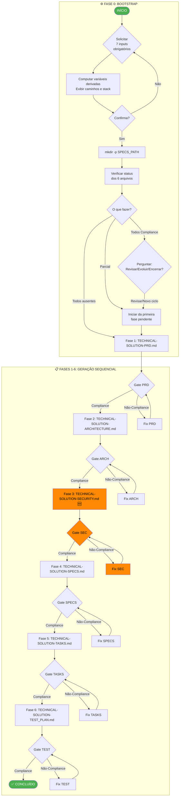

# PROMPT: ROADMAP DE EXECUÇÃO MACRO E GUIA DE ORQUESTRAÇÃO DE DOCUMENTOS — SOLUÇÕES TÉCNICAS
## Versão: 1.1 — Bootstrap Inteligente + Validação Soberana Humana (Human-in-the-Loop) + Organização de Prompts

Atue como um Especialista em Gestão de Processos (BPM) e Arquiteto de Soluções Ágeis, especializado em Auditoria de Escopo de Projetos Técnicos e Engenharia de Prompts.

Preciso que você crie um roadmap de execução detalhado e um guia de orquestração para o seguinte processo: Criação, revisão, evolução e validação dos documentos mestre de uma **solução técnica** (microsserviço, frontend, batch, mobile).

Objetivo Principal: Garantir que todos os documentos técnicos estejam criados, revisados e 100% alinhados conceitualmente entre si (rastreabilidade vertical de ponta a ponta — do PRD ao TEST_PLAN), mitigando desvios de escopo (scope creep) e garantindo a qualidade da entrega técnica.

Regra Crítica de Execução (Gating Rule): O processo é estritamente sequencial. Nenhuma fase subsequente pode ser iniciada sem a aprovação formal, soberana e explícita do usuário humano na fase anterior.

---

## VARIÁVEIS DE ENTRADA E BOOTSTRAP DA SOLUÇÃO TÉCNICA (FASE 0)

Antes de iniciar qualquer fase de geração de documentos, o prompt deve obrigatoriamente executar o ritual de bootstrap descrito abaixo. Esta fase garante que o escopo da solução está corretamente parametrizado, que a estrutura de diretórios existe e que o estado atual dos artefatos é conhecido.

### Tabela de Inputs

| Variável | Obrig. | Descrição | Exemplo |
|---|---|---|---|
| `PROJECT_PATH` | ✅ * | Caminho base onde os projetos de negócio residem | `/home/bolismar/work/workspace-fbso/business-inputs/business-projects` |
| `PROJECT_ID_NAME` | ✅ * | Identificador completo do projeto (ID + Nome) | `PRJ-FIN-2026-0003-SAAS-FBSO-ORG` |
| `TECHNICAL_SOLUTION_PATH` | ✅ * | Caminho base onde as soluções técnicas residem | `/home/bolismar/work/workspace-fbso/backend/java/spring/microservices` |
| `TECHNICAL_SOLUTION_NAME` | ✅ * | Nome da solução técnica (microsserviço, frontend, etc.) | `ms-fbso-platform-admin` |
| `TECHNICAL_SOLUTION_STACK_FILE_INPUT` | ✅ * † | Lista de caminhos para arquivos com definição da stack tecnológica | `[]` (ex: `[/tmp/stack-definition.md]`) |
| `TECHNICAL_SOLUTION_STACK_PROMPT_INPUT` | ✅ * † | Texto inline com definição da stack tecnológica | `"Java 25 + Spring Boot + PostgreSQL"` |
| `ARCHITECTURE_GLOBAL` | ✅ * | Caminho para a pasta de arquitetura global (ADRs, blueprints, padrões) | `/home/bolismar/work/workspace-fbso/architecture/` |
| `SECURITY_GLOBAL` | ✅ * | Caminho para o documento de segurança global (GLOBAL-SECURITY.md) | `/home/bolismar/work/workspace-fbso/.specs/security/GLOBAL-SECURITY.md` |
| `TECHNICAL_SOLUTION_DOCUMENTS_INPUTS` | ❌ | Lista de caminhos para documentos brutos de entrada (atas, PDFs, especificações) usados como insumo adicional | `[]` |
| `TECHNICAL_SOLUTION_PROMPT_INPUTS` | ❌ | Lista de caminhos para prompts auxiliares ou contextos adicionais a serem carregados | `[]` |

> † **Regra de OU-exclusivo para STACK:** Fornecer `TECHNICAL_SOLUTION_STACK_FILE_INPUT` **OU** `TECHNICAL_SOLUTION_STACK_PROMPT_INPUT`. Não é necessário fornecer ambos. Se ambos forem fornecidos, o `STACK_PROMPT_INPUT` tem precedência.

### Variáveis Derivadas (calculadas automaticamente)

A partir dos inputs acima, o prompt deve computar:

```
TECHNICAL_SOLUTION_COMPLETE_PATH_NAME = TECHNICAL_SOLUTION_PATH + "/" + TECHNICAL_SOLUTION_NAME
PROJECT_COMPLETE_PATH_NAME           = PROJECT_PATH + "/" + PROJECT_ID_NAME
SPECS_PATH                           = TECHNICAL_SOLUTION_COMPLETE_PATH_NAME + "/.specs/business-projects/" + PROJECT_ID_NAME
STACK_DEFINITION                     = conteúdo de STACK_PROMPT_INPUT OU conteúdo dos arquivos em STACK_FILE_INPUT
```

**Exemplo concreto:**
```
TECHNICAL_SOLUTION_COMPLETE_PATH_NAME = "/home/bolismar/work/workspace-fbso/backend/java/spring/microservices/ms-fbso-platform-admin"
PROJECT_COMPLETE_PATH_NAME            = "/home/bolismar/work/workspace-fbso/business-inputs/business-projects/PRJ-FIN-2026-0003-SAAS-FBSO-ORG"
SPECS_PATH                            = "/home/bolismar/work/workspace-fbso/backend/java/spring/microservices/ms-fbso-platform-admin/.specs/business-projects/PRJ-FIN-2026-0003-SAAS-FBSO-ORG"
STACK_DEFINITION                      = "Java 25 + Spring Boot + PostgreSQL"
```

### Workflow de Bootstrap (Execução Obrigatória)

Execute os passos abaixo em ordem estrita. Não prossiga para a Fase 1 sem completar todos eles.

---

#### Passo 0.1 — Solicitar Inputs ao Usuário

Se alguma das 7 variáveis obrigatórias não tiver sido fornecida no contexto, pergunte ao usuário de forma clara e objetiva:

> "Para iniciar o Roadmap de Documentos da Solução Técnica, preciso das seguintes informações:
> 1. **PROJECT_PATH** — Caminho base dos projetos de negócio (ex: `/home/bolismar/work/workspace-fbso/business-inputs/business-projects`)
> 2. **PROJECT_ID_NAME** — Identificador do projeto (ex: `PRJ-FIN-2026-0003-SAAS-FBSO-ORG`)
> 3. **TECHNICAL_SOLUTION_PATH** — Caminho base das soluções técnicas (ex: `/home/bolismar/work/workspace-fbso/backend/java/spring/microservices`)
> 4. **TECHNICAL_SOLUTION_NAME** — Nome da solução (ex: `ms-fbso-platform-admin`)
> 5. **TECHNICAL_SOLUTION_STACK** — Stack tecnológica. Pode informar como:
>    - **Arquivo:** caminho para um arquivo com a definição da stack
>    - **Texto:** descreva inline a stack (ex: `Java 25 + Spring Boot + PostgreSQL`)
> 6. **ARCHITECTURE_GLOBAL** — Caminho da pasta de arquitetura global (ex: `/home/bolismar/work/workspace-fbso/architecture/`)
> 7. **SECURITY_GLOBAL** — Caminho do GLOBAL-SECURITY.md (ex: `/home/bolismar/work/workspace-fbso/.specs/security/GLOBAL-SECURITY.md`)
>
> Opcionais:
> 8. **TECHNICAL_SOLUTION_DOCUMENTS_INPUTS** — Documentos de entrada adicionais (deixe vazio `[]` se não houver)
> 9. **TECHNICAL_SOLUTION_PROMPT_INPUTS** — Prompts auxiliares (deixe vazio `[]` se não houver)"

---

#### Passo 0.2 — Exibir Caminhos Derivados e Solicitar Confirmação

Após receber os inputs, compute as variáveis derivadas e exiba ao usuário:

> **🏷️ Projeto:** `{PROJECT_ID_NAME}`
> **📁 Projeto de Negócio:** `{PROJECT_COMPLETE_PATH_NAME}`
> **⚙️ Solução Técnica:** `{TECHNICAL_SOLUTION_NAME}`
> **📁 Caminho da Solução:** `{TECHNICAL_SOLUTION_COMPLETE_PATH_NAME}`
> **📁 Pasta de Especificações:** `{SPECS_PATH}`
> **🛠️ Stack:** `{STACK_DEFINITION}`
> **🏗️ Arquitetura Global:** `{ARCHITECTURE_GLOBAL}`
> **🛡️ Segurança Global:** `{SECURITY_GLOBAL}`
>
> **📄 Documentos de Entrada Adicionais:** `{N}` arquivo(s)
> **📝 Prompts Auxiliares:** `{M}` arquivo(s)
>
> Confirma que estas informações estão corretas?
> - **SIM** → Prosseguir para criação/verificação da estrutura de diretórios
> - **NÃO** → Solicitar correção dos inputs e repetir o Passo 0.2

**Regra:** Não avance sem a confirmação explícita do humano.

---

#### Passo 0.3 — Criar Estrutura de Diretórios

Uma vez confirmado, execute:

```bash
mkdir -p {SPECS_PATH}
```

Este comando:
- Cria a árvore completa de pastas se não existir: `.specs/business-projects/{PROJECT_ID_NAME}/`
- É idempotente — não tem efeito colateral se as pastas já existirem
- centraliza toda a documentação técnica da solução para este projeto específico

---

#### Passo 0.4 — Verificar Status dos Arquivos Mestre da Solução

Verifique na ordem a existência de cada artefato do roadmap. **Para cada arquivo existente, leia as primeiras 20 linhas e busque pelos marcadores `[STATUS: COMPLIANCE]`, `[COMPLIANCE]`, `Validado`, `✅` associado a status final.**

Reporte o status:

| # | Arquivo | Caminho Esperado | Status | Compliance? |
|---|---------|------------------|--------|-------------|
| 1 | TECHNICAL-SOLUTION-PRD.md | `{SPECS_PATH}/TECHNICAL-SOLUTION-PRD.md` | ✅ Existe (N linhas) / ❌ Não existe | ✅ Compliance / ⚠️ Pendente / — |
| 2 | TECHNICAL-SOLUTION-ARCHITECTURE.md | `{SPECS_PATH}/TECHNICAL-SOLUTION-ARCHITECTURE.md` | ✅ Existe (N linhas) / ❌ Não existe | ✅ Compliance / ⚠️ Pendente / — |
| 3 | TECHNICAL-SOLUTION-SECURITY.md | `{SPECS_PATH}/TECHNICAL-SOLUTION-SECURITY.md` | ✅ Existe (N linhas) / ❌ Não existe | ✅ Compliance / ⚠️ Pendente / — |
| 4 | TECHNICAL-SOLUTION-SPECS.md | `{SPECS_PATH}/TECHNICAL-SOLUTION-SPECS.md` | ✅ Existe (N linhas) / ❌ Não existe | ✅ Compliance / ⚠️ Pendente / — |
| 5 | TECHNICAL-SOLUTION-TASKS.md | `{SPECS_PATH}/TECHNICAL-SOLUTION-TASKS.md` | ✅ Existe (N linhas) / ❌ Não existe | ✅ Compliance / ⚠️ Pendente / — |
| 6 | TECHNICAL-SOLUTION-TEST_PLAN.md | `{SPECS_PATH}/TECHNICAL-SOLUTION-TEST_PLAN.md` | ✅ Existe (N linhas) / ❌ Não existe | ✅ Compliance / ⚠️ Pendente / — |

**Lógica de decisão com base no status:**

- Se **todos** os arquivos estão marcados como ❌ Não existe → Solução nova. Iniciar da Fase 1 (TECHNICAL-SOLUTION-PRD.md).
- Se **alguns** arquivos existem → Solução em andamento. Identificar o **primeiro arquivo ausente** ou o **primeiro arquivo com status diferente de Compliance** na ordem sequencial (1→6) e iniciar desta fase. Apresentar o status completo e informar: "Iniciando da Fase N — {Nome da Fase} (primeiro artefato pendente)".
- Se **todos** os 6 arquivos existem E estão marcados como ✅ Compliance → Solução completa. Perguntar: "Todos os 6 documentos mestre estão com status COMPLIANCE. Deseja: (A) Revisar uma fase específica, (B) Iniciar um novo ciclo de evolução com novos inputs, ou (C) Encerrar?"

---

#### Passo 0.5 — Apresentar Resumo e Iniciar

Exiba um resumo final antes de iniciar a primeira fase pendente:

> **📊 Resumo da Solução Técnica**
> **🏷️ Projeto:** `{PROJECT_ID_NAME}`
> **⚙️ Solução:** `{TECHNICAL_SOLUTION_NAME}`
> **📁 Especificações:** `{SPECS_PATH}`
> **🛠️ Stack:** `{STACK_DEFINITION}`
> **📝 Próxima Fase:** Fase N — {Nome da Fase}
> **📄 Artefatos Existentes:** X de 6 ({Y} com Compliance)
>
> Iniciando a Fase N...

---

## MECANISMO DE ORQUESTRAÇÃO DINÂMICA (LOOPS DE VALIDAÇÃO SOBERANA)

Toda fase deve rodar sob um ecossistema trifásico de prompts (Gerador, Auditor/Portão e Corretor), mas com controle final obrigatório do Humano. O fluxo segue estritamente esta máquina de estados:

1. **Geração / Evolução:** A IA recebe os inputs disponíveis e executa o prompt gerador (`PROMPT-GENERATE-{FASE}.md`), enriquecido com os parâmetros globais (`ARCHITECTURE_GLOBAL`, `SECURITY_GLOBAL`, `STACK_DEFINITION`).
2. **Auditoria Interna da IA:** O artefato é enviado para o portão (`PROMPT-GATE-{FASE}.md`).
   - SE A IA ENCONTRAR ERROS: Emite o status `[NÃO COMPLIANCE]`, coleta o feedback do humano para cada ponto de não-conformidade, aciona o `PROMPT-FIX-{FASE}.md` de forma cirúrgica (reparando apenas as seções afetadas) e retorna ao passo 2.
   - SE A IA NÃO ENCONTRAR ERROS: Avança para o passo 3 (Portão de Validação Humana).
3. **Portão de Validação Humana (Pré-Compliance):** A IA apresenta o sumário do documento e emite o status `[PRÉ-COMPLIANCE INTERNO - AGUARDANDO VALIDAÇÃO HUMANA]`, fazendo **3 perguntas obrigatórias**:
   - **P1:** "O conteúdo deste documento está aderente às necessidades de negócio e aos requisitos técnicos da solução?"
   - **P2:** "Existem novos documentos de entrada ou artefatos que devem ser incorporados a esta fase?"
   - **P3:** "Há novas informações textuais, mudanças de escopo ou ajustes técnicos a serem considerados?"
4. **Lógica de Decisão Baseada nas Respostas do Humano:**
   - **CENÁRIO DE SUCESSO (Aprovação):** Se o humano validar o documento e NÃO enviar novos arquivos ou inputs → A fase é dada por encerrada (`[STATUS: COMPLIANCE]`), o marcador `[STATUS: COMPLIANCE]` é gravado no cabeçalho do arquivo, e a próxima fase é destravada.
   - **CENÁRIO DE RETROCESSO (Evolução Incremental):** Se o humano fornecer novos documentos ou novas informações de texto → O orquestrador DEVE retroceder ao passo 1 (`PROMPT-GENERATE-{FASE}.md`), injetando o documento gerado até o momento + os novos insumos para uma atualização incremental e viva (sem descartar o histórico).

---

## EFEITOS CASCATA (CASCADE RULES)

Quando um artefato é modificado após já ter sido marcado como COMPLIANCE, os artefatos downstream devem ser regenerados e revalidados:

| Se modificar... | Regenerar e revalidar... |
|---|---|
| TECHNICAL-SOLUTION-PRD.md | TECHNICAL-SOLUTION-ARCHITECTURE.md → TECHNICAL-SOLUTION-SECURITY.md → TECHNICAL-SOLUTION-SPECS.md → TECHNICAL-SOLUTION-TASKS.md → TECHNICAL-SOLUTION-TEST_PLAN.md |
| TECHNICAL-SOLUTION-ARCHITECTURE.md | TECHNICAL-SOLUTION-SECURITY.md → TECHNICAL-SOLUTION-SPECS.md → TECHNICAL-SOLUTION-TASKS.md → TECHNICAL-SOLUTION-TEST_PLAN.md |
| TECHNICAL-SOLUTION-SECURITY.md | TECHNICAL-SOLUTION-SPECS.md → TECHNICAL-SOLUTION-TASKS.md → TECHNICAL-SOLUTION-TEST_PLAN.md |
| TECHNICAL-SOLUTION-SPECS.md | TECHNICAL-SOLUTION-TASKS.md → TECHNICAL-SOLUTION-TEST_PLAN.md |
| TECHNICAL-SOLUTION-TASKS.md | TECHNICAL-SOLUTION-TEST_PLAN.md |

**Regra:** Se um artefato upstream for modificado durante uma fase de retrocesso, o orquestrador DEVE alertar sobre o efeito cascata e perguntar ao humano se deseja: (A) prosseguir com a regeneração completa dos downstreams, ou (B) apenas atualizar o artefato corrente e sinalizar os downstreams como "potencialmente desatualizados".

---

## FASES DO ROADMAP COM CHECKPOINTS E PIPELINES DE PROMPTS

### Fase 1 — TECHNICAL-SOLUTION-PRD.md (Product Requirements Document)

- **Objetivo:** Criar o documento de requisitos de produto da solução — sumário executivo de alto nível que referencia os documentos-fonte do projeto de negócio (Project Charter, BRD, Épicos, Features, User Stories) e serve como baseline de escopo para toda a cadeia downstream.
- **Inputs:**
  - Documentos do projeto de negócio em `{PROJECT_COMPLETE_PATH_NAME}` (obrigatório)
  - `TECHNICAL_SOLUTION_DOCUMENTS_INPUTS` (se fornecidos)
  - `TECHNICAL_SOLUTION_PROMPT_INPUTS` (se fornecidos)
- **Responsáveis:** Product Owner / Business Analyst / Tech Lead
- **Entregável:** Arquivo `TECHNICAL-SOLUTION-PRD.md` em `{SPECS_PATH}/TECHNICAL-SOLUTION-PRD.md` validado pelo humano com marcador `[STATUS: COMPLIANCE]`
- **Pipeline Sequencial:**
  1. Executar `technical-solutions/PROMPT-GENERATE-PRD-TECHNICAL_SOLUTION.md` com parâmetros: `{SOLUTION_PATH=TECHNICAL_SOLUTION_COMPLETE_PATH_NAME}`, `{PROJECT_PATH=PROJECT_COMPLETE_PATH_NAME}`, `{PROJECT_NAME=PROJECT_ID_NAME}`, `{SOLUTION_NAME=TECHNICAL_SOLUTION_NAME}`, `{STACK=STACK_DEFINITION}`, `{SCOPE=full}`
  2. Validar via `technical-solutions/PROMPT-GATE-PRD-TECHNICAL_SOLUTION.md`
  3. Aplicar loops de correção (`technical-solutions/PROMPT-FIX-PRD-TECHNICAL_SOLUTION.md`) ou loops de retrocesso por novos insumos conforme o Mecanismo de Orquestração até o aceite final e explícito do humano.

---

### Fase 2 — TECHNICAL-SOLUTION-ARCHITECTURE.md (Documento de Arquitetura)

- **Objetivo:** Definir a arquitetura da solução técnica — estilo arquitetural (package-by-layer como default), estrutura de pacotes, pipeline de segurança, cross-cutting concerns (AOP), estratégia de persistência, tratamento de erros, ADRs específicos e changelog.
- **Inputs:**
  - `TECHNICAL-SOLUTION-PRD.md` validado (Fase 1 — obrigatório)
  - `{ARCHITECTURE_GLOBAL}` — ADRs globais, blueprints, governança, data standards (obrigatório)
  - `TECHNICAL-PLAN.md` e `TECHNICAL-SOLUTION-ARCHITECTURE.md` do projeto de negócio (se existirem)
- **Checkpoint de Rastreabilidade:** Validar se cada decisão arquitetural (ADR) atende diretamente a um requisito não-funcional (NFR) ou funcionalidade declarada no TECHNICAL-SOLUTION-PRD.md.
- **Responsáveis:** Tech Lead / Arquiteto de Solução
- **Entregável:** Arquivo `TECHNICAL-SOLUTION-ARCHITECTURE.md` em `{SPECS_PATH}/TECHNICAL-SOLUTION-ARCHITECTURE.md` validado pelo humano com marcador `[STATUS: COMPLIANCE]`
- **Pipeline Sequencial:**
  1. Executar `technical-solutions/PROMPT-GENERATE-ARCHITECTURE-TECHNICAL_SOLUTION.md` com parâmetros: `{SOLUTION_PATH=TECHNICAL_SOLUTION_COMPLETE_PATH_NAME}`, `{PROJECT_PATH=PROJECT_COMPLETE_PATH_NAME}`, `{PROJECT_NAME=PROJECT_ID_NAME}`, `{SOLUTION_NAME=TECHNICAL_SOLUTION_NAME}`, `{STACK=STACK_DEFINITION}`
  2. Validar via `technical-solutions/PROMPT-GATE-ARCHITECTURE-TECHNICAL_SOLUTION.md`
  3. Aplicar loops de correção (`technical-solutions/PROMPT-FIX-ARCHITECTURE-TECHNICAL_SOLUTION.md`) ou retrocesso até o aceite humano final.

---

### Fase 3 — TECHNICAL-SOLUTION-SECURITY.md (Documento de Segurança) 🆕

- **Objetivo:** Definir o plano de segurança específico da solução — threat model (STRIDE), controles de autenticação/autorização (RBAC, OAuth2, 2FA), proteção de dados (criptografia em repouso e trânsito, mascaramento), segurança de API (rate limiting, CORS, input validation), cobertura OWASP Top 10, gestão de dependências (SCA), pipeline de segurança (SAST, secret scanning) e checklist de verificação.
- **Inputs:**
  - `TECHNICAL-SOLUTION-PRD.md` validado (Fase 1 — obrigatório)
  - `TECHNICAL-SOLUTION-ARCHITECTURE.md` validado (Fase 2 — obrigatório)
  - `{SECURITY_GLOBAL}` — Política e Checklist de Segurança Global (GLOBAL-SECURITY.md) com Regras de Ouro e SDD (obrigatório)
- **Checkpoint de Rastreabilidade:** Validar se cada controle de segurança cobre um risco identificado no threat model e se está alinhado com as regras de ouro e checklist do GLOBAL-SECURITY.md.
- **Responsáveis:** Security Engineer / Tech Lead
- **Entregável:** Arquivo `TECHNICAL-SOLUTION-SECURITY.md` em `{SPECS_PATH}/TECHNICAL-SOLUTION-SECURITY.md` validado pelo humano com marcador `[STATUS: COMPLIANCE]`
- **Pipeline Sequencial:**
  1. Executar `technical-solutions/PROMPT-GENERATE-SECURITY-TECHNICAL_SOLUTION.md` com parâmetros: `{SOLUTION_PATH=TECHNICAL_SOLUTION_COMPLETE_PATH_NAME}`, `{PROJECT_PATH=PROJECT_COMPLETE_PATH_NAME}`, `{PROJECT_NAME=PROJECT_ID_NAME}`, `{SOLUTION_NAME=TECHNICAL_SOLUTION_NAME}`, `{STACK=STACK_DEFINITION}`, `{SECURITY_GLOBAL=SECURITY_GLOBAL}`
  2. Validar via `technical-solutions/PROMPT-GATE-SECURITY-TECHNICAL_SOLUTION.md`
  3. Aplicar loops de correção (`technical-solutions/PROMPT-FIX-SECURITY-TECHNICAL_SOLUTION.md`) ou retrocesso até o aceite humano final.

---

### Fase 4 — TECHNICAL-SOLUTION-SPECS.md (Especificações Técnicas)

- **Objetivo:** Criar a ponte entre requisitos de negócio e implementação — traduzir user stories, regras de negócio e critérios de aceitação em especificações acionáveis para o time de desenvolvimento (APIs, componentes, modelo de dados, NFRs, restrições).
- **Inputs:**
  - `TECHNICAL-SOLUTION-PRD.md` validado (Fase 1 — obrigatório)
  - `TECHNICAL-SOLUTION-ARCHITECTURE.md` validado (Fase 2 — obrigatório)
  - `TECHNICAL-SOLUTION-SECURITY.md` validado (Fase 3 — obrigatório)
- **Checkpoint de Rastreabilidade:** Cada especificação funcional deve rastrear de volta a uma feature ou user story do TECHNICAL-SOLUTION-PRD.md. Cada NFR deve estar vinculado a um ADR do TECHNICAL-SOLUTION-ARCHITECTURE.md.
- **Responsáveis:** Tech Lead / Equipe de Desenvolvimento
- **Entregável:** Arquivo `TECHNICAL-SOLUTION-SPECS.md` em `{SPECS_PATH}/TECHNICAL-SOLUTION-SPECS.md` validado pelo humano com marcador `[STATUS: COMPLIANCE]`
- **Pipeline Sequencial:**
  1. Executar `technical-solutions/PROMPT-GENERATE-SPECS-TECHNICAL_SOLUTION.md` com parâmetros: `{SOLUTION_PATH=TECHNICAL_SOLUTION_COMPLETE_PATH_NAME}`, `{PROJECT_PATH=PROJECT_COMPLETE_PATH_NAME}`, `{PROJECT_NAME=PROJECT_ID_NAME}`, `{SOLUTION_NAME=TECHNICAL_SOLUTION_NAME}`, `{SOLUTION_TYPE=backend}`, `{SCOPE=full}`
  2. Validar via `technical-solutions/PROMPT-GATE-SPECS-TECHNICAL_SOLUTION.md`
  3. Aplicar loops de correção (`technical-solutions/PROMPT-FIX-SPECS-TECHNICAL_SOLUTION.md`) ou retrocesso até o aceite humano final.
  4. ⚠️ **Atenção ao efeito cascata:** Se TECHNICAL-SOLUTION-SPECS.md for modificado, TECHNICAL-SOLUTION-TASKS.md e TECHNICAL-SOLUTION-TEST_PLAN.md devem ser regenerados.

---

### Fase 5 — TECHNICAL-SOLUTION-TASKS.md (Tarefas de Implementação)

- **Objetivo:** Decompor as especificações em tarefas atômicas, acionáveis e rastreáveis — cada tarefa deve ter estimativa (≤ 3 dias), responsável, prioridade (MoSCoW), dependências e critérios de conclusão.
- **Inputs:**
  - `TECHNICAL-SOLUTION-PRD.md` validado (Fase 1)
  - `TECHNICAL-SOLUTION-ARCHITECTURE.md` validado (Fase 2)
  - `TECHNICAL-SOLUTION-SPECS.md` validado (Fase 4 — obrigatório)
- **Checkpoint de Rastreabilidade:** Toda tarefa deve rastrear de volta a uma especificação do TECHNICAL-SOLUTION-SPECS.md. Nenhuma tarefa "órfã" (sem especificação correspondente) é permitida.
- **Responsáveis:** Tech Lead / Equipe de Desenvolvimento
- **Entregável:** Arquivo `TECHNICAL-SOLUTION-TASKS.md` em `{SPECS_PATH}/TECHNICAL-SOLUTION-TASKS.md` validado pelo humano com marcador `[STATUS: COMPLIANCE]`
- **Pipeline Sequencial:**
  1. Executar `technical-solutions/PROMPT-GENERATE-TASKS-TECHNICAL_SOLUTION.md` com parâmetros: `{SOLUTION_PATH=TECHNICAL_SOLUTION_COMPLETE_PATH_NAME}`, `{PROJECT_PATH=PROJECT_COMPLETE_PATH_NAME}`, `{PROJECT_NAME=PROJECT_ID_NAME}`, `{SOLUTION_NAME=TECHNICAL_SOLUTION_NAME}`, `{SCOPE=full}`
  2. Validar via `technical-solutions/PROMPT-GATE-TASKS-TECHNICAL_SOLUTION.md`
  3. Aplicar loops de correção (`technical-solutions/PROMPT-FIX-TASKS-TECHNICAL_SOLUTION.md`) ou retrocesso até o aceite humano final.
  4. ⚠️ **Atenção ao efeito cascata:** Se TECHNICAL-SOLUTION-TASKS.md for modificado, TECHNICAL-SOLUTION-TEST_PLAN.md deve ser regenerado.

---

### Fase 6 — TECHNICAL-SOLUTION-TEST_PLAN.md (Plano de Testes)

- **Objetivo:** Definir a estratégia de testes completa — pirâmide de testes (unidade, integração, E2E), cenários por feature/user story, testes de segurança (RBAC, Multi-Tenant, OWASP), testes de performance (carga, concorrência), suite de regressão e critérios de aceitação.
- **Inputs:**
  - `TECHNICAL-SOLUTION-PRD.md` validado (Fase 1)
  - `TECHNICAL-SOLUTION-ARCHITECTURE.md` validado (Fase 2)
  - `TECHNICAL-SOLUTION-SPECS.md` validado (Fase 4)
  - `TECHNICAL-SOLUTION-TASKS.md` validado (Fase 5 — obrigatório)
- **Checkpoint de Rastreabilidade Mestre:** Executar uma validação cruzada completa — cada cenário de teste deve rastrear de volta a uma user story do TECHNICAL-SOLUTION-PRD.md, e cada controle de segurança testado deve corresponder a um item do TECHNICAL-SOLUTION-SECURITY.md. A cadeia completa é: `TEST_PLAN → TASKS → SPECS → SECURITY → ARCHITECTURE → PRD → Project Charter`.
- **Responsáveis:** QA Engineer / Tech Lead
- **Entregável:** Arquivo `TECHNICAL-SOLUTION-TEST_PLAN.md` em `{SPECS_PATH}/TECHNICAL-SOLUTION-TEST_PLAN.md` validado pelo humano com marcador `[STATUS: COMPLIANCE]`
- **Pipeline Sequencial:**
  1. Executar `technical-solutions/PROMPT-GENERATE-TEST_PLAN-TECHNICAL_SOLUTION.md` com parâmetros: `{SOLUTION_PATH=TECHNICAL_SOLUTION_COMPLETE_PATH_NAME}`, `{PROJECT_PATH=PROJECT_COMPLETE_PATH_NAME}`, `{PROJECT_NAME=PROJECT_ID_NAME}`, `{SOLUTION_NAME=TECHNICAL_SOLUTION_NAME}`, `{STACK=STACK_DEFINITION}`, `{SCOPE=full}`
  2. Validar via `technical-solutions/PROMPT-GATE-TEST_PLAN-TECHNICAL_SOLUTION.md`
  3. Aplicar loops de correção (`technical-solutions/PROMPT-FIX-TEST_PLAN-TECHNICAL_SOLUTION.md`) ou retrocesso até o aceite humano final.

---

## MAPEAMENTO DE RASTREABILIDADE (FASE 6 vs FASES 1-5)

Antes de aprovar a conclusão da Fase 6 (TECHNICAL-SOLUTION-TEST_PLAN.md), a IA deverá obrigatoriamente executar uma validação cruzada completa:

1. **Mapeamento de Dependências:** Cada cenário de teste deve, obrigatoriamente, estar vinculado retroativamente: Cenário de Teste → Tarefa (TECHNICAL-SOLUTION-TASKS.md) → Especificação (TECHNICAL-SOLUTION-SPECS.md) → Controle de Segurança (TECHNICAL-SOLUTION-SECURITY.md) → Decisão Arquitetural (TECHNICAL-SOLUTION-ARCHITECTURE.md) → Requisito de Produto (TECHNICAL-SOLUTION-PRD.md) → Objetivo de Negócio (Project Charter).
2. **Identificação de Órfãos:** Alertar o usuário se existir algum cenário de teste que NÃO possua um requisito correspondente no TECHNICAL-SOLUTION-PRD.md (evitando escopo oculto).
3. **Verificação de Cobertura:** Garantir que 100% dos requisitos funcionais e não-funcionais definidos no TECHNICAL-SOLUTION-PRD.md e TECHNICAL-SOLUTION-SPECS.md foram cobertos por pelo menos um cenário de teste.
4. **Verificação de Segurança:** Garantir que 100% dos controles definidos no TECHNICAL-SOLUTION-SECURITY.md possuem cenários de teste correspondentes no TECHNICAL-SOLUTION-TEST_PLAN.md.

---

## RESUMO DO PIPELINE DE PROMPTS

| Fase | Artefato | Gerar | Validar (Gate) | Corrigir (Fix) |
|:---|:---|:---|:---|:---|
| 1 | TECHNICAL-SOLUTION-PRD.md | `technical-solutions/PROMPT-GENERATE-PRD-TECHNICAL_SOLUTION.md` | `technical-solutions/PROMPT-GATE-PRD-TECHNICAL_SOLUTION.md` | `technical-solutions/PROMPT-FIX-PRD-TECHNICAL_SOLUTION.md` |
| 2 | TECHNICAL-SOLUTION-ARCHITECTURE.md | `technical-solutions/PROMPT-GENERATE-ARCHITECTURE-TECHNICAL_SOLUTION.md` | `technical-solutions/PROMPT-GATE-ARCHITECTURE-TECHNICAL_SOLUTION.md` | `technical-solutions/PROMPT-FIX-ARCHITECTURE-TECHNICAL_SOLUTION.md` |
| 3 | TECHNICAL-SOLUTION-SECURITY.md | `technical-solutions/PROMPT-GENERATE-SECURITY-TECHNICAL_SOLUTION.md` 🆕 | `technical-solutions/PROMPT-GATE-SECURITY-TECHNICAL_SOLUTION.md` 🆕 | `technical-solutions/PROMPT-FIX-SECURITY-TECHNICAL_SOLUTION.md` 🆕 |
| 4 | TECHNICAL-SOLUTION-SPECS.md | `technical-solutions/PROMPT-GENERATE-SPECS-TECHNICAL_SOLUTION.md` | `technical-solutions/PROMPT-GATE-SPECS-TECHNICAL_SOLUTION.md` | `technical-solutions/PROMPT-FIX-SPECS-TECHNICAL_SOLUTION.md` |
| 5 | TECHNICAL-SOLUTION-TASKS.md | `technical-solutions/PROMPT-GENERATE-TASKS-TECHNICAL_SOLUTION.md` | `technical-solutions/PROMPT-GATE-TASKS-TECHNICAL_SOLUTION.md` | `technical-solutions/PROMPT-FIX-TASKS-TECHNICAL_SOLUTION.md` |
| 6 | TECHNICAL-SOLUTION-TEST_PLAN.md | `technical-solutions/PROMPT-GENERATE-TEST_PLAN-TECHNICAL_SOLUTION.md` | `technical-solutions/PROMPT-GATE-TEST_PLAN-TECHNICAL_SOLUTION.md` | `technical-solutions/PROMPT-FIX-TEST_PLAN-TECHNICAL_SOLUTION.md` |

---

## DIAGRAMA DO FLUXO



---

## LOCALIZAÇÃO DOS PROMPTS

Os prompts de geração, gate e correção de cada fase estão na pasta `technical-solutions/`:

```
.specs/prompts/technical-solutions/
├── PROMPT-ROADMAP-GENERATE-TECHNICAL_SOLUTIONS.md         ← Este orquestrador
├── PROMPT-GENERATE-PRD-TECHNICAL_SOLUTION.md              ← Fase 1
├── PROMPT-GATE-PRD-TECHNICAL_SOLUTION.md
├── PROMPT-FIX-PRD-TECHNICAL_SOLUTION.md
├── PROMPT-GENERATE-ARCHITECTURE-TECHNICAL_SOLUTION.md     ← Fase 2
├── PROMPT-GATE-ARCHITECTURE-TECHNICAL_SOLUTION.md
├── PROMPT-FIX-ARCHITECTURE-TECHNICAL_SOLUTION.md
├── PROMPT-GENERATE-SECURITY-TECHNICAL_SOLUTION.md        ← Fase 3
├── PROMPT-GATE-SECURITY-TECHNICAL_SOLUTION.md
├── PROMPT-FIX-SECURITY-TECHNICAL_SOLUTION.md
├── PROMPT-GENERATE-SPECS-TECHNICAL_SOLUTION.md           ← Fase 4
├── PROMPT-GATE-SPECS-TECHNICAL_SOLUTION.md
├── PROMPT-FIX-SPECS-TECHNICAL_SOLUTION.md
├── PROMPT-GENERATE-TASKS-TECHNICAL_SOLUTION.md           ← Fase 5
├── PROMPT-GATE-TASKS-TECHNICAL_SOLUTION.md
├── PROMPT-FIX-TASKS-TECHNICAL_SOLUTION.md
├── PROMPT-GENERATE-TEST_PLAN-TECHNICAL_SOLUTION.md       ← Fase 6
├── PROMPT-GATE-TEST_PLAN-TECHNICAL_SOLUTION.md
└── PROMPT-FIX-TEST_PLAN-TECHNICAL_SOLUTION.md
```

**Total:** 1 orquestrador + 6 geradores + 6 gates + 6 fixers = **19 prompts**.

---

## REGISTRO DE ALTERAÇÕES DO DOCUMENTO

| Versão | Data | Alteração | Autor |
|:---|:---|:---|:---|
| 1.1 | 25/07/2026 | Renomeado para plural (SOLUTIONS), prompts movidos para pasta `technical-solutions/`, adicionada seção de localização de prompts | Time de Arquitetura |
| 1.0 | 21/07/2026 | Criação inicial: roadmap completo de 6 fases com bootstrap inteligente, TECHNICAL-SOLUTION-SECURITY.md como novo artefato, integração com GLOBAL-SECURITY.md e ARCHITECTURE_GLOBAL, efeitos cascata documentados | Time de Arquitetura |

---

🤖 *Documentação gerada de forma automatizada pelo Agente: Arquiteto de Soluções/Claude. Foram utilizados os skills: writing-skills, agile-ba-practices, brainstorming, architecture-patterns.*
