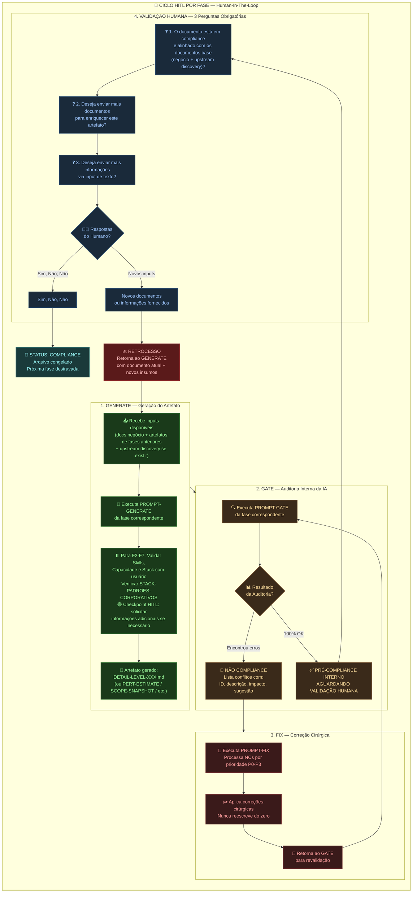
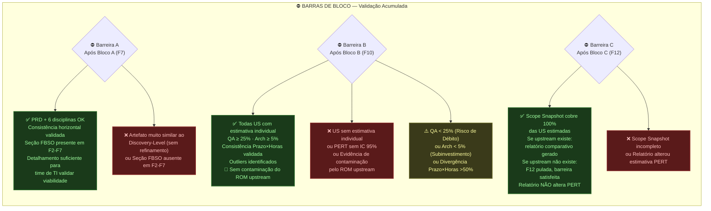
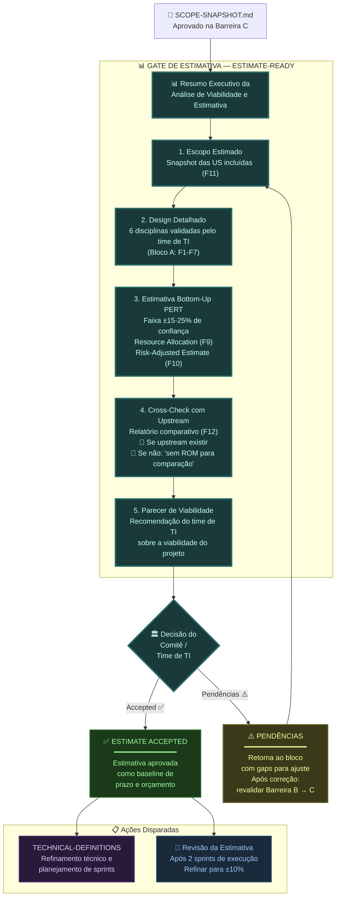

# Flowchart: Downstream Architecture Refinement

> Versão: 2.3 — Baseado no roadmap v2.3 (Skills Map + Team Capacity + Stack Validation + Checkpoint HITL)
> Este documento contém os diagramas de fluxo do processo de Downstream Architecture Refinement.

---

## 1. Diagrama Macro: Blocos, Fases e Barreiras

```mermaid
flowchart TB
    %% ═══════════════════════════════════════════
    %% ESTILOS GLOBAIS
    %% ═══════════════════════════════════════════
    classDef bootstrap fill:#1a1a2e,stroke:#16213e,color:#e0e0ff,stroke-width:2px
    classDef blocoA fill:#1a2a3a,stroke:#2a4a6a,color:#c8e0ff,stroke-width:2px
    classDef blocoB fill:#2a1a3a,stroke:#4a2a6a,color:#e0c8ff,stroke-width:2px
    classDef blocoC fill:#3a2a1a,stroke:#6a4a2a,color:#ffe0c8,stroke-width:2px
    classDef barreira fill:#5a1a1a,stroke:#8a2a2a,color:#ffc8c8,stroke-width:3px
    classDef gate fill:#1a3a3a,stroke:#2a6a6a,color:#c8ffff,stroke-width:3px
    classDef decisao fill:#3a3a1a,stroke:#6a6a2a,color:#ffffc8,stroke-width:2px
    classDef condicional fill:#1a2a2a,stroke:#2a4a4a,color:#a0c8c8,stroke-width:2px,stroke-dasharray: 5 5
    classDef downstream fill:#1a3a1a,stroke:#2a6a2a,color:#a0ffa0,stroke-width:2px

    %% ═══════════════════════════════════════════
    %% PRÉ-CONDIÇÕES E BOOTSTRAP
    %% ═══════════════════════════════════════════
    subgraph PRECOND[" 📋 Pré-condições de Entrada (Negócio) "]
        direction TB
        CH[Project Charter<br/>01-PROJECT-CHARTER.md]
        BRD[BRD<br/>02-BRD.md]
        EP[Épicos<br/>03-EPICS.md + epics/*.md]
        FEAT[Features<br/>04-FEATURES.md + features/*.md]
        US[User Stories<br/>05-USER-STORIES.md + user-stories/*.md]
        INPUTS["Inputs do Usuário<br/>PROJECT_PATH, PROJECT_ID_NAME<br/>TECHNICAL_SOLUTION_PATH, etc."]
        STACK[Stack Corporativa FBSO<br/>STACK-PADROES-CORPORATIVOS.md<br/>DigitalOcean, Cloudflare, Kong<br/>Keycloak, PostgreSQL, K8s/Istio]
        HITL_IN["🟢 Checkpoint HITL<br/>PROJECT_PROMPT_INPUTS<br/>Sempre perguntar ao usuário<br/>se deseja adicionar informações"]
    end

    subgraph PRECOND_OPT[" 📂 Pré-condição Opcional (Referência) "]
        direction TB
        UPSTREAM["Upstream Architecture Discovery<br/>upstream-architecture-discovery/<br/>🔹 Referência para design (Bloco A)<br/>🔹 Comparação na F12 (condicional)<br/>🚫 NUNCA usado na estimativa"]
    end

    %% ═══════════════════════════════════════════
    %% FASE 0: BOOTSTRAP
    %% ═══════════════════════════════════════════
    subgraph F0[" 🔧 FASE 0: Bootstrap Inteligente "]
        direction TB
        F0A["1. Solicitar inputs ao usuário"] --> F0B["2. Validar pré-condição de negócio<br/>(Charter, BRD, Épicos, Features, US)"]
        F0B --> F0C["3. Detectar upstream (informativo)<br/>Se existir: listar artefatos<br/>Se não: prossegue sem referência"]
        F0C --> F0D{"4. project-document-discovery<br/>Classificar projeto em 10 dimensões<br/>(4-signal algorithm)"}
        F0D --> F0E["5. discovery-process<br/>Framing → Synthesis → Experiments"]
        F0E --> F0F["6. Auditar User Stories<br/>Contar US por épico/feature<br/>Verificar distribuição e gaps"]
        F0F --> F0G["7. Exibir caminhos derivados<br/>e solicitar confirmação"]
        F0G --> F0H["8. Criar estrutura:<br/>mkdir -p {DOWNSTREAM_REFINEMENT_PATH}"]
        F0H --> F0I["9. Auditar artefatos existentes<br/>em downstream-architecture-refinement/"]
        F0I --> F0J["10. Apresentar resumo da situação<br/>e iniciar primeira fase pendente"]
        F0J --> F0K["11. Coletar Skills, Capacidade e Stack<br/>📋 PROJECT-TEAM-SKILLS-MAP<br/>👥 PROJECT-TEAM-CAPACITY<br/>🔧 PROJECT-STACK<br/>⏸️ Validar contra Stack Corporativa<br/>⏸️ Aguardar confirmação do usuário"]
    end

    %% ═══════════════════════════════════════════
    %% BLOCO A: ARCHITECTURE DEEP-DIVE (F1-F7)
    %% ═══════════════════════════════════════════
    subgraph BA[" 🏗️ BLOCO A: Architecture Deep-Dive (Detail-Level) "]
        direction LR
        F1["🏷️ F1<br/>DETAIL-LEVEL<br/>PRD<br/>⏸️ Alinhamento Negócio↔TI"]
        F2["🏗️ F2<br/>ARCHITECTURE<br/>DEFINITION<br/>⏸️ Validar Stack"]
        F3["🔒 F3<br/>SECURITY<br/>DEFINITION<br/>⏸️ Validar Stack"]
        F4["🗄️ F4<br/>DATA<br/>DEFINITION<br/>⏸️ Validar Stack"]
        F5["🚀 F5<br/>DEVOPS-SRE<br/>DEFINITION<br/>⏸️ Validar Stack"]
        F6["🧪 F6<br/>TEST-STRATEGY<br/>DEFINITION<br/>⏸️ Validar Stack"]
        F7["☁️ F7<br/>INFRA-CLOUD<br/>DEFINITION<br/>⏸️ Validar Stack"]
        F1 --> F2 --> F3 --> F4 --> F5 --> F6 --> F7
    end

    %% ═══════════════════════════════════════════
    %% BARREIRA A
    %% ═══════════════════════════════════════════
    BARRA{"⛔ BARREIRA A<br/>PRD + 6 disciplinas OK?<br/>Consistência horizontal?<br/>Seção FBSO presente em F2-F7?<br/>Detalhamento suficiente para<br/>time de TI validar viabilidade?"}

    %% ═══════════════════════════════════════════
    %% BLOCO B: BOTTOM-UP ESTIMATION (F8-F10)
    %% ═══════════════════════════════════════════
    subgraph BB[" ⭐ BLOCO B: Bottom-Up Estimation — INDEPENDENTE (PERT ±15-25%) "]
        direction LR
        F8["📐 F8<br/>BOTTOM-UP<br/>PERT-ESTIMATE<br/>⭐ Three-point estimation<br/>62 US individuais<br/>O/ML/P → PERT ±15-25%"]
        F9["👥 F9<br/>RESOURCE<br/>ALLOCATION<br/>Time Necessário<br/>Alocação por épico"]
        F10["⚠️ F10<br/>RISK-ADJUSTED<br/>ESTIMATE<br/>3 cenários<br/>Conservador/PERT/Pessimista"]
        F8 --> F9 --> F10
    end

    %% REGRA DE INDEPENDÊNCIA
    INDEP["🚫 REGRA CRÍTICA<br/>Estimativa 100% INDEPENDENTE<br/>NUNCA usa ROM upstream<br/>como baseline ou referência<br/>Calculada do zero, US por US"]

    %% ═══════════════════════════════════════════
    %% BARREIRA B
    %% ═══════════════════════════════════════════
    BARRB{"⛔ BARREIRA B<br/>Todas US estimadas individualmente?<br/>QA ≥ 25%? Arch ≥ 5%?<br/>Consistência Prazo×Horas?<br/>Outliers identificados?<br/>🚫 Evidência de contaminação<br/>pelo ROM upstream?"}

    %% ═══════════════════════════════════════════
    %% BLOCO C: SCOPE SNAPSHOT + CROSS-CHECK (F11-F12)
    %% ═══════════════════════════════════════════
    subgraph BC[" 📸 BLOCO C: Scope Snapshot + Cross-Check "]
        direction LR
        F11["📸 F11<br/>SCOPE<br/>SNAPSHOT<br/>Foto imutável do<br/>escopo estimado"]
        F12{"🔗 F12<br/>UPSTREAM<br/>COMPARISON<br/>Condicional:<br/>só se upstream existir"}
        F11 --> F12
    end

    %% ═══════════════════════════════════════════
    %% BARREIRA C
    %% ═══════════════════════════════════════════
    BARRC{"⛔ BARREIRA C<br/>Scope Snapshot cobre 100%<br/>das US estimadas?<br/>Se upstream existe:<br/>relatório comparativo gerado?<br/>Relatório NÃO altera PERT?"}

    %% ═══════════════════════════════════════════
    %% GATE DE ESTIMATIVA
    %% ═══════════════════════════════════════════
    GATE["📊 GATE DE ESTIMATIVA<br/>ESTIMATE-READY<br/><br/>Resumo Executivo:<br/>1. Escopo Estimado (Snapshot)<br/>2. Design Detalhado (6 disciplinas)<br/>3. Estimativa PERT ±15-25%<br/>4. Cross-Check com Upstream<br/>5. Parecer de Viabilidade Técnica"]
    
    DECISAO{"🏛️ Decisão do<br/>Comitê / Time de TI"}
    
    APPROVED["✅ ESTIMATE ACCEPTED<br/>━━━━━━━━━━━━━━<br/>Estimativa aprovada<br/>como baseline de<br/>prazo e orçamento"]
    
    PENDING["⚠️ PENDÊNCIAS<br/>━━━━━━━━━━━━━━<br/>Retorna ao bloco<br/>com gaps para ajuste"]
    
    DWN1["📋 Dispara Roadmap:<br/>TECHNICAL-DEFINITIONS<br/>(Refinamento técnico e<br/>planejamento de sprints)"]
    DWN2["🔄 Dispara Revisão:<br/>Re-estimar após<br/>2 sprints de execução<br/>(refinar para ±10%)"]

    %% ═══════════════════════════════════════════
    %% CONEXÕES PRINCIPAIS
    %% ═══════════════════════════════════════════
    INPUTS --> F0A
    CH --> F0B
    BRD --> F0B
    EP --> F0B
    FEAT --> F0B
    US --> F0B
    STACK --> F0K
    HITL_IN --> F0A
    UPSTREAM -.->|"referência (design)"| F2
    UPSTREAM -.->|"comparação (F12)"| F12

    F0K --> F1
    F7 --> BARRA
    BARRA -->|"✅ COMPLIANCE"| F8
    BARRA -->|"❌ NÃO COMPLIANCE"| F1

    INDEP -.->|"vigia"| F8

    F10 --> BARRB
    BARRB -->|"✅ COMPLIANCE"| F11
    BARRB -->|"❌ NÃO COMPLIANCE"| F8

    F12 --> BARRC
    BARRC -->|"✅ COMPLIANCE"| GATE
    BARRC -->|"❌ NÃO COMPLIANCE"| F11

    GATE --> DECISAO
    DECISAO -->|"Accepted ✅"| APPROVED
    DECISAO -->|"Pendências ⚠️"| PENDING
    PENDING --> F8
    APPROVED --> DWN1
    APPROVED --> DWN2

    %% ═══════════════════════════════════════════
    %% APLICAÇÃO DE ESTILOS
    %% ═══════════════════════════════════════════
    class F0,F0A,F0B,F0C,F0D,F0E,F0F,F0G,F0H,F0I,F0J,F0K bootstrap
    class BA,F1,F2,F3,F4,F5,F6,F7 blocoA
    class BB,F8,F9,F10 blocoB
    class BC,F11,F12 blocoC
    class BARRA,BARRB,BARRC barreira
    class GATE,APPROVED,PENDING gate
    class DECISAO decisao
    class F12 condicional
    class DWN1,DWN2 downstream
    class PRECOND,CH,BRD,EP,FEAT,US,INPUTS,STACK,HITL_IN bootstrap
    class PRECOND_OPT,UPSTREAM condicional
    class INDEP barreira
```

---

## 2. Ciclo HITL por Fase (Generate → Gate → Fix → Human Validation)

Este ciclo se repete em **todas as 12 fases** (F1 a F12). Cada fase gera um artefato, que passa pelo gate, e se necessário pelo fix, até atingir COMPLIANCE com validação humana.

---

## 3. Barreiras de Bloco (Gating Rules)

Fluxo de decisão de cada barreira entre blocos:

---

## 4. Gate de Estimativa (ESTIMATE-READY)

Decisão final após a Barreira C — validação da estimativa como baseline de prazo e orçamento:

---

## 5. Visão Consolidada: Entradas, Processo e Saídas (SIPOC)

```mermaid
flowchart LR
    classDef suppliers fill:#1a2a3a,stroke:#2a4a6a,color:#c8e0ff
    classDef inputs fill:#2a1a3a,stroke:#4a2a6a,color:#e0c8ff
    classDef process fill:#3a2a1a,stroke:#6a4a2a,color:#ffe0c8
    classDef outputs fill:#1a3a2a,stroke:#2a6a4a,color:#c8ffe0
    classDef customers fill:#2a3a1a,stroke:#4a6a2a,color:#e0ffc8

    subgraph SIPOC[" SIPOC: Downstream Architecture Refinement "]
        direction TB
        
        S["👥 SUPPLIERS<br/>━━━━━━━━━━<br/>Product Manager / PO<br/>Business Analyst<br/>Tech Lead / Arquiteto<br/>SQUAD de Desenvolvimento<br/>Security Architect<br/>Data Architect<br/>DevOps/SRE Architect<br/>QA/Test Specialist<br/>Infra/Cloud Specialist"]
        
        I["📥 INPUTS<br/>━━━━━━━━━━<br/>Project Charter + BRD + Épicos<br/>Features + User Stories (62 US)<br/>PROJECT_PATH / PROJECT_ID_NAME<br/>TECHNICAL_SOLUTION_PATH / NAMES<br/>ARCHITECTURE_GLOBAL<br/>SECURITY_GLOBAL<br/>🟢 PROJECT_PROMPT_INPUTS (Checkpoint HITL)<br/>📋 PROJECT-TEAM-SKILLS-MAP<br/>👥 PROJECT-TEAM-CAPACITY<br/>🔧 PROJECT-STACK<br/>📚 STACK-PADROES-CORPORATIVOS.md<br/>🔹 upstream-architecture-discovery/ (opcional)"]
        
        P["⚙️ PROCESS<br/>━━━━━━━━━━<br/>Fase 0: Bootstrap Inteligente<br/>Bloco A: 7 artefatos Detail-Level (F1-F7)<br/>  PRD + 6 disciplinas técnicas<br/>Bloco B: Estimativa PERT Independente (F8-F10)<br/>  ⭐ Three-point estimation por US<br/>  Resource Allocation + Risk Adjustment<br/>Bloco C: Scope Snapshot + Cross-Check (F11-F12)<br/>  📸 Foto imutável do escopo estimado<br/>  🔗 Comparação com ROM upstream (condicional)<br/>Ciclo HITL em cada fase (Generate→Gate→Fix)<br/>3 Barreiras de Bloco (A, B, C)<br/>Gate ESTIMATE-READY"]
        
        O["📤 OUTPUTS<br/>━━━━━━━━━━<br/>DETAIL-LEVEL-PRD.md (F1)<br/>DETAIL-LEVEL-ARCHITECTURE-DEFINITION.md (F2)<br/>DETAIL-LEVEL-SECURITY-DEFINITION.md (F3)<br/>DETAIL-LEVEL-DATA-ARCHITECTURE-DEFINITION.md (F4)<br/>DETAIL-LEVEL-DEVOPS-SRE-DEFINITION.md (F5)<br/>DETAIL-LEVEL-TEST-STRATEGY-DEFINITION.md (F6)<br/>DETAIL-LEVEL-INFRA-CLOUD-DEFINITION.md (F7)<br/>⭐ BOTTOM-UP-PERT-ESTIMATE.md (F8) ±15-25%<br/>RESOURCE-ALLOCATION-PLAN.md (F9)<br/>RISK-ADJUSTED-ESTIMATE.md (F10)<br/>📸 SCOPE-SNAPSHOT.md (F11)<br/>🔗 UPSTREAM-COMPARISON-REPORT.md (F12, condicional)"]
        
        C["🎯 CUSTOMERS<br/>━━━━━━━━━━<br/>Time de TI (validação de viabilidade)<br/>Comitê de Governança<br/>SQUAD de Desenvolvimento<br/>Tech Lead / Arquiteto<br/>Product Manager / PO<br/>Stakeholders do Projeto"]
    end
    
    S --> I --> P --> O --> C
    
    class S suppliers
    class I inputs
    class P process
    class O outputs
    class C customers
```

---

## Registro de Alterações

| Versão | Data | Alteração | Autor |
|:---|:---|:---|:---|
| 1.0 | 02/08/2026 | Criação inicial: 5 diagramas Mermaid cobrindo fluxo macro, ciclo HITL, barreiras, gate de estimativa e SIPOC. Baseado no roadmap v2.3 (Skills Map + Team Capacity + Stack Validation). Adaptado do FLOWCHART-UPSTREAM-ARCHITECTURE-DISCOVERY.md. | Time de Arquitetura |

---

🤖 *Diagramas gerados com Mermaid. Renderize em qualquer visualizador compatível (GitHub, Mermaid Live, VS Code).*
