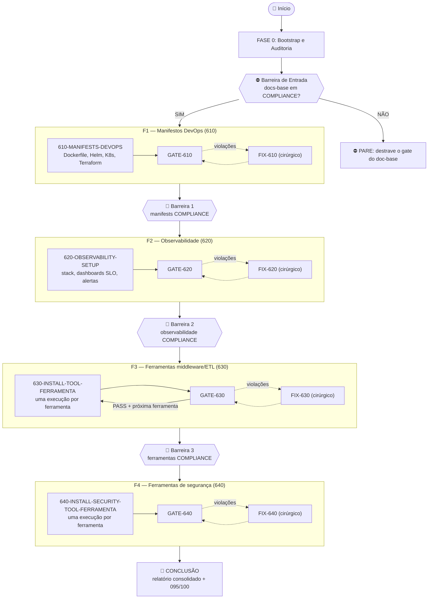
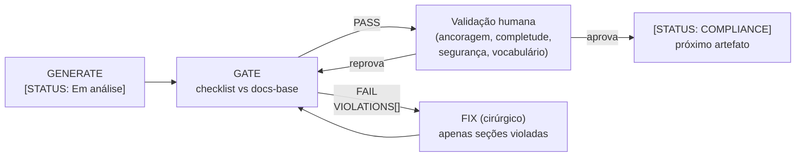
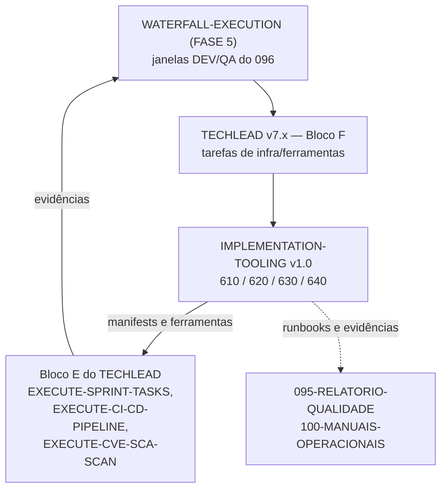

# FLOWCHART: ROADMAP DE IMPLEMENTAÇÃO DE AMBIENTE E FERRAMENTAS

## Versão: 1.0 — 4 Fases, 4 Trios (610/620/630/640), Barreiras e Gates HITL

> **Documento de referência:** `PROMPT-ROADMAP-GENERATE-IMPLEMENTATION-TOOLING.md` v1.0
>
> Este documento complementa o roadmap textual com diagramas Mermaid que visualizam o fluxo de execução, a arquitetura de fases com barreiras, o loop GENERATE→GATE→FIX por artefato e a integração com os roadmaps TECHLEAD/WATERFALL.

---

## 1. Visão Macro do Roadmap

---

## 2. Loop GENERATE → GATE → FIX por Artefato

---

## 3. Integração com os Roadmaps Existentes

> **Legenda:** `{{⛔}}` = barreira estrutural com decisão; `-.->` = fluxo condicional/de correção; em contexto WATERFALL, HMG/PROD via GMUD (090); em contexto ágil, approval gates do pipeline — sempre com aprovação humana por ambiente.
