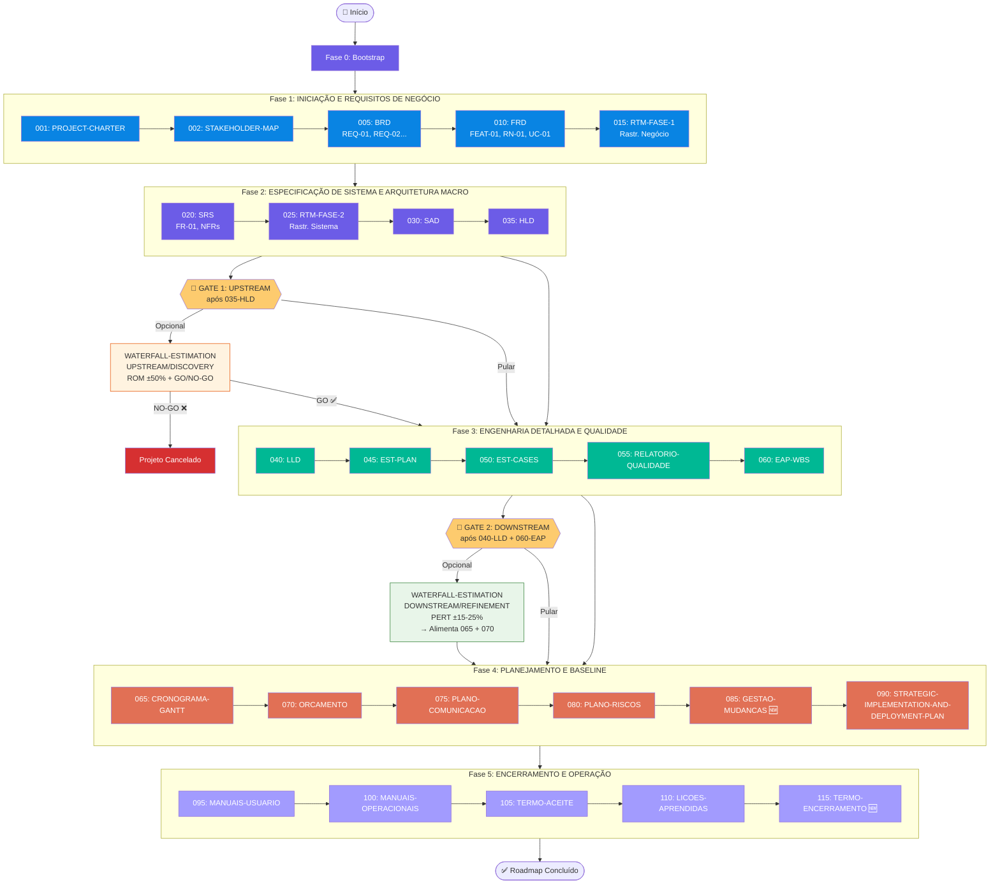
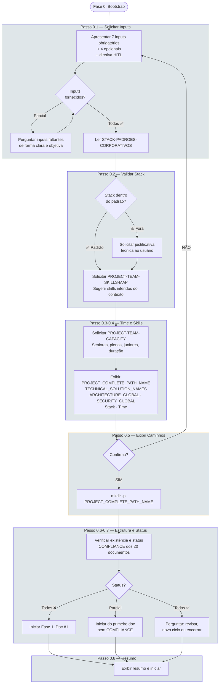
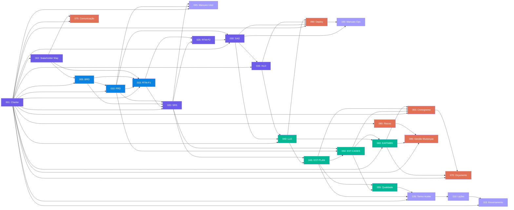
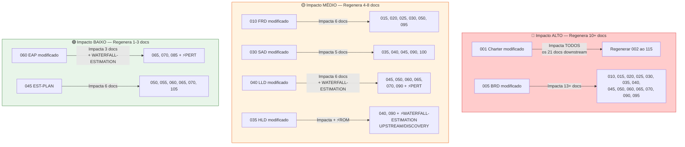
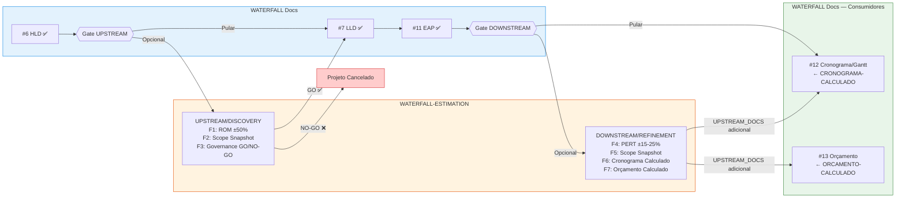
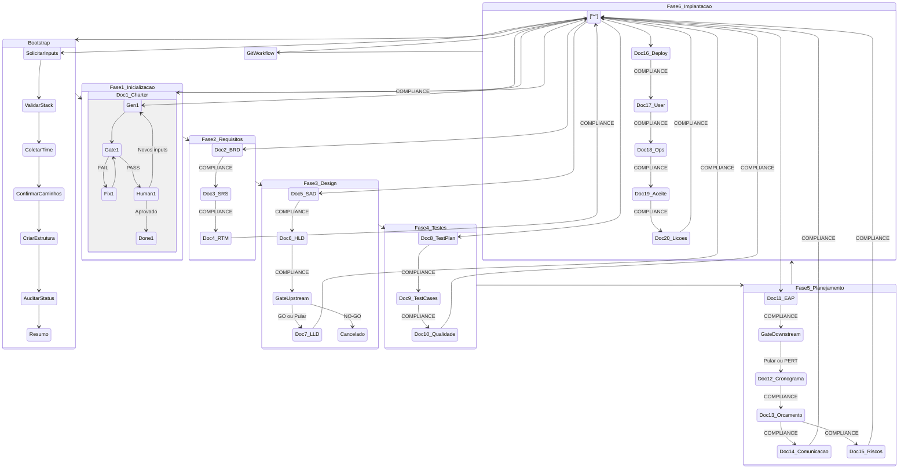

# FLOWCHART: ROADMAP DE DOCUMENTOS WATERFALL

## Versão: 2.0 — Visualização Gráfica das 5 Fases, 22 Documentos, Dupla RTM e Gates Estruturais

> ⚠️ **VISUALIZAÇÃO LEGADA (histórica):** este diagrama reflete a versão original do roadmap (5 fases, 22 documentos). A estrutura vigente é a do roadmap master — **6 fases, 38 documentos** (`PROMPT-ROADMAP-GENERATE-PROJECT-DOCUMENTS-WATERFALL.md`) e do `flowchart-WATERFALL.md` atualizado.

> **Documento de referência:** `PROMPT-ROADMAP-GENERATE-PROJECT-DOCUMENTS-WATERFALL.md` v2.0
>
> Este documento complementa o roadmap textual com diagramas Mermaid que visualizam o fluxo de execução das **5 fases WATERFALL**, os **22 documentos**, o mecanismo de orquestração Generate→Gate→Fix, a dupla RTM (Negócio + Sistema) e a integração com WATERFALL-ESTIMATION.

---

## 1. Visão Macro — 5 Fases WATERFALL (22 Documentos)

---

## 2. Fase 0 — Bootstrap Inteligente (Detalhado)

---

## 3. Fases 1-3 — Inicialização, Requisitos e Design

```mermaid
flowchart TD
    subgraph F1["Fase 1: INICIALIZAÇÃO"]
        direction TB
        D01_GEN["GENERATE #1<br/>PROJECT-CHARTER<br/>Skills: draft-project-charter, senior-pm"] --> D01_GATE["GATE #1<br/>Valida seções:<br/>Escopo, Cronograma Macro,<br/>Orçamento Macro, Riscos, RACI"]
        D01_GATE -->|FAIL| D01_FIX["FIX #1<br/>Corrige seções<br/>com VIOLATIONS"]
        D01_FIX -.->|loop| D01_GATE
        D01_GATE -->|PASS| D01_HUMAN["Validação Humana<br/>4 perguntas HITL"]
        D01_HUMAN -->|Aprovado| D01_OK["#1: COMPLIANCE ✅"]
        D01_HUMAN -->|Novos inputs| D01_GEN
    end

    D01_OK --> F2_START

    subgraph F2["Fase 2: REQUISITOS"]
        direction TB
        D02_GEN["GENERATE #2: BRD<br/>Skills: brd-creation, business-analyst"] --> D02_GATE["GATE #2"]
        D02_GATE -->|FAIL| D02_FIX["FIX #2"]
        D02_FIX -.->|loop| D02_GATE
        D02_GATE -->|PASS| D02_OK["#2: COMPLIANCE ✅"]

        D02_OK --> D03_GEN["GENERATE #3: SRS<br/>Skills: frs-creation, requirements-engineering"] --> D03_GATE["GATE #3"]
        D03_GATE -->|FAIL| D03_FIX["FIX #3"]
        D03_FIX -.->|loop| D03_GATE
        D03_GATE -->|PASS| D03_OK["#3: COMPLIANCE ✅"]

        D03_OK --> D04_GEN["GENERATE #4: RTM<br/>Skills: requirements-modeling, requirements-validation"] --> D04_GATE["GATE #4"]
        D04_GATE -->|FAIL| D04_FIX["FIX #4"]
        D04_FIX -.->|loop| D04_GATE
        D04_GATE -->|PASS| D04_OK["#4: COMPLIANCE ✅"]
    end

    F2_START --> D02_GEN

    D04_OK --> F3_START

    subgraph F3["Fase 3: DESIGN E ARQUITETURA"]
        direction TB
        D05_GEN["GENERATE #5: SAD<br/>Skills: software-architecture, architecture-designer"] --> D05_GATE["GATE #5"]
        D05_GATE -->|FAIL| D05_FIX["FIX #5"]
        D05_FIX -.->|loop| D05_GATE
        D05_GATE -->|PASS| D05_OK["#5: COMPLIANCE ✅"]

        D05_OK --> D06_GEN["GENERATE #6: HLD<br/>Skills: c4-container, system-design, ADRs"] --> D06_GATE["GATE #6"]
        D06_GATE -->|FAIL| D06_FIX["FIX #6"]
        D06_FIX -.->|loop| D06_GATE
        D06_GATE -->|PASS| D06_OK["#6: COMPLIANCE ✅"]

        D06_OK --> EST_CHECK_UP{{🎯 Após #6 HLD:<br/>Executar WATERFALL-ESTIMATION<br/>UPSTREAM/DISCOVERY?}}

        D06_OK --> D07_GEN["GENERATE #7: LLD<br/>Skills: c4-component, ddd-tactical-patterns"] --> D07_GATE["GATE #7"]
        D07_GATE -->|FAIL| D07_FIX["FIX #7"]
        D07_FIX -.->|loop| D07_GATE
        D07_GATE -->|PASS| D07_OK["#7: COMPLIANCE ✅"]
    end

    F3_START --> D05_GEN

    D07_OK --> F4_START

    style D01_GEN fill:#0984e3,color:#fff
    style D02_GEN fill:#0984e3,color:#fff
    style D03_GEN fill:#0984e3,color:#fff
    style D04_GEN fill:#0984e3,color:#fff
    style D05_GEN fill:#0984e3,color:#fff
    style D06_GEN fill:#0984e3,color:#fff
    style D07_GEN fill:#0984e3,color:#fff
    style D01_OK fill:#00b894,color:#fff
    style D02_OK fill:#00b894,color:#fff
    style D03_OK fill:#00b894,color:#fff
    style D04_OK fill:#00b894,color:#fff
    style D05_OK fill:#00b894,color:#fff
    style D06_OK fill:#00b894,color:#fff
    style D07_OK fill:#00b894,color:#fff
    style EST_CHECK_UP fill:#fdcb6e,color:#333
```

---

## 4. Fases 4-6 — Testes, Planejamento e Implantação

```mermaid
flowchart TD
    F4_START(["Após #7 LLD COMPLIANCE"])

    subgraph F4["Fase 4: TESTES E QUALIDADE"]
        direction TB
        D08_GEN["GENERATE #8: TEST-PLAN<br/>Skills: test-strategy-design, qa-test-planner"] --> D08_GATE["GATE #8"]
        D08_GATE -->|FAIL| D08_FIX["FIX #8"]
        D08_FIX -.->|loop| D08_GATE
        D08_GATE -->|PASS| D08_OK["#8: COMPLIANCE ✅"]

        D08_OK --> D09_GEN["GENERATE #9: TEST-CASES<br/>Skills: test-case-creation, acceptance-criteria"] --> D09_GATE["GATE #9"]
        D09_GATE -->|FAIL| D09_FIX["FIX #9"]
        D09_FIX -.->|loop| D09_GATE
        D09_GATE -->|PASS| D09_OK["#9: COMPLIANCE ✅"]

        D09_OK --> D10_GEN["GENERATE #10: Relatório Qualidade<br/>Skills: quality-documentation-manager, qa"] --> D10_GATE["GATE #10"]
        D10_GATE -->|FAIL| D10_FIX["FIX #10"]
        D10_FIX -.->|loop| D10_GATE
        D10_GATE -->|PASS| D10_OK["#10: COMPLIANCE ✅"]
    end

    F4_START --> D08_GEN

    D10_OK --> F5_START

    subgraph F5["Fase 5: PLANEJAMENTO"]
        direction TB
        D11_GEN["GENERATE #11: EAP/WBS<br/>Skills: decomposition-planning-roadmap"] --> D11_GATE["GATE #11"]
        D11_GATE -->|FAIL| D11_FIX["FIX #11"]
        D11_FIX -.->|loop| D11_GATE
        D11_GATE -->|PASS| D11_OK["#11: COMPLIANCE ✅"]

        D11_OK --> EST_CHECK_DOWN{{🎯 Após #7 LLD + #11 EAP:<br/>Executar WATERFALL-ESTIMATION<br/>DOWNSTREAM/REFINEMENT?}}

        D11_OK --> D12_GEN["GENERATE #12: Cronograma/Gantt<br/>+ CRONOGRAMA-CALCULADO se disponível<br/>Skills: roadmap-planning, project-estimation"] --> D12_GATE["GATE #12"]
        D12_GATE -->|FAIL| D12_FIX["FIX #12"]
        D12_FIX -.->|loop| D12_GATE
        D12_GATE -->|PASS| D12_OK["#12: COMPLIANCE ✅"]

        D12_OK --> D13_GEN["GENERATE #13: Orçamento<br/>+ ORCAMENTO-CALCULADO se disponível<br/>Skills: project-estimation"] --> D13_GATE["GATE #13"]
        D13_GATE -->|FAIL| D13_FIX["FIX #13"]
        D13_FIX -.->|loop| D13_GATE
        D13_GATE -->|PASS| D13_OK["#13: COMPLIANCE ✅"]

        D13_OK --> D14_GEN["GENERATE #14: Plano Comunicação<br/>Skills: stakeholder-analysis"] --> D14_GATE["GATE #14"]
        D14_GATE -->|PASS| D14_OK["#14: COMPLIANCE ✅"]

        D13_OK --> D15_GEN["GENERATE #15: Plano Riscos<br/>Skills: risk-manager"] --> D15_GATE["GATE #15"]
        D15_GATE -->|PASS| D15_OK["#15: COMPLIANCE ✅"]
    end

    F5_START --> D11_GEN

    D14_OK --> F6_START
    D15_OK --> F6_START

    subgraph F6["Fase 6: IMPLANTAÇÃO E ENCERRAMENTO"]
        direction TB
        D16_GEN["GENERATE #16: STRATEGIC-IMPLEMENTATION-AND-DEPLOYMENT-PLAN<br/>Skills: deployment-engineer, devops-rollout-plan"] --> D16_GATE["GATE #16"]
        D16_GATE -->|PASS| D16_OK["#16: COMPLIANCE ✅"]

        D16_OK --> D17_GEN["GENERATE #17: Manuais Usuário<br/>Skills: documentation-generation-doc-generate"] --> D17_GATE["GATE #17"]
        D17_GATE -->|PASS| D17_OK["#17: COMPLIANCE ✅"]

        D17_OK --> D18_GEN["GENERATE #18: Manuais Operacionais"] --> D18_GATE["GATE #18"]
        D18_GATE -->|PASS| D18_OK["#18: COMPLIANCE ✅"]

        D18_OK --> D19_GEN["GENERATE #19: Termo Aceite<br/>Skills: contract-and-proposal-writer"] --> D19_GATE["GATE #19"]
        D19_GATE -->|PASS| D19_OK["#19: COMPLIANCE ✅"]

        D19_OK --> D20_GEN["GENERATE #20: Lições Aprendidas<br/>Consolida todos os 19 docs anteriores"] --> D20_GATE["GATE #20"]
        D20_GATE -->|PASS| D20_OK["#20: COMPLIANCE ✅"]
    end

    F6_START --> D16_GEN

    D20_OK --> GIT["Git Workflow:<br/>commit → push → PR → merge"]

    style D08_GEN fill:#00b894,color:#fff
    style D09_GEN fill:#00b894,color:#fff
    style D10_GEN fill:#00b894,color:#fff
    style D11_GEN fill:#e17055,color:#fff
    style D12_GEN fill:#e17055,color:#fff
    style D13_GEN fill:#e17055,color:#fff
    style D14_GEN fill:#e17055,color:#fff
    style D15_GEN fill:#e17055,color:#fff
    style D16_GEN fill:#a29bfe,color:#fff
    style D17_GEN fill:#a29bfe,color:#fff
    style D18_GEN fill:#a29bfe,color:#fff
    style D19_GEN fill:#a29bfe,color:#fff
    style D20_GEN fill:#a29bfe,color:#fff
    style D08_OK fill:#00b894,color:#fff
    style D09_OK fill:#00b894,color:#fff
    style D10_OK fill:#00b894,color:#fff
    style D11_OK fill:#00b894,color:#fff
    style D12_OK fill:#00b894,color:#fff
    style D13_OK fill:#00b894,color:#fff
    style D14_OK fill:#00b894,color:#fff
    style D15_OK fill:#00b894,color:#fff
    style D16_OK fill:#00b894,color:#fff
    style D17_OK fill:#00b894,color:#fff
    style D18_OK fill:#00b894,color:#fff
    style D19_OK fill:#00b894,color:#fff
    style D20_OK fill:#00b894,color:#fff
    style EST_CHECK_DOWN fill:#fdcb6e,color:#333
    style GIT fill:#6c5ce7,color:#fff
```

---

## 5. Mecanismo de Orquestração — Loop Generate→Gate→Fix por Documento

---

## 6. Matriz de UPSTREAM_DOCS — Fluxo de Dependências (v2.0)

---

## 7. Efeitos Cascata — Impacto de Modificações (v2.0)

---

## 8. Integração com WATERFALL-ESTIMATION

---

## 9. Diagrama de Estados — Visão Unificada

---

## 10. Git Workflow de Finalização

---

## 11. Tabela de Símbolos e Convenções

| Símbolo/Cor | Significado |
|-------------|-------------|
| 🟣 Roxo (`#6c5ce7`) | Bootstrap / Validação Humana / Git Workflow / Fase 1 (docs 001-002) / Fase 2 (docs 020-035) |
| 🔵 Azul (`#0984e3`) | Fase 1: Requisitos de Negócio (docs 005-015) |
| 🟢 Verde (`#00b894`) | Fase 3: Engenharia Detalhada e Qualidade / Compliance |
| 🟠 Terracota (`#e17055`) | Fase 4: Planejamento e Baseline / Correções (FIX) |
| 🟣 Lilás (`#a29bfe`) | Fase 5: Encerramento e Operação |
| 🟡 Amarelo (`#fdcb6e`) | Gate / Decisões / Checkpoints |
| 🔴 Vermelho (`#d63031`) | Cancelado / Impacto ALTO |
| 🟤 Laranja escuro (`#e65100`) | WATERFALL-ESTIMATION UPSTREAM / Impacto MÉDIO |
| 🟢 Verde escuro (`#2e7d32`) | WATERFALL-ESTIMATION DOWNSTREAM / Impacto BAIXO |
| 🔲 Linha tracejada | Loop de retrabalho (GATE→FIX→GATE) |
| 🔲 Linha sólida | Fluxo sequencial normal |
| 🎯 | Gate de Estimativa |
| ⚡ | Dispara WATERFALL-ESTIMATION |
| 📥 | Inputs consumidos |
| 📄 | Documento WATERFALL |
| #N | Número do documento na sequência WATERFALL |

---

## 12. Mapeamento de Cores por Fase

| Fase | Cor | Docs |
|------|-----|------|
| **Fase 1: Iniciação e Requisitos de Negócio** | 🔵 Azul / 🟣 Roxo | 001, 002, 005, 010, 015 |
| **Fase 2: Especificação de Sistema e Arquitetura** | 🟣 Roxo | 020, 025, 030, 035 |
| **Fase 3: Engenharia Detalhada e Qualidade** | 🟢 Verde | 040, 045, 050, 055, 060 |
| **Fase 4: Planejamento e Baseline** | 🟠 Terracota | 065, 070, 075, 080, 085, 090 |
| **Fase 5: Encerramento e Operação** | 🟣 Lilás | 095, 100, 105, 110, 115 |

---

> **📁 Arquivos relacionados:**
> - `PROMPT-ROADMAP-GENERATE-PROJECT-DOCUMENTS-WATERFALL.md` — Documento fonte (v2.0)
> - `../PROMPT-ROADMAP-GENERATE-WATERFALL-ESTIMATION.md` — Roadmap companion de estimativa
> - `../PROMPT-ROADMAP-GENERATE-SOURCING-FACTORY-BIDDING.md` — Roadmap de Sourcing (consome docs WATERFALL)
> - `PROMPT-GENERATE-*.md` — 22 prompts geradores
> - `PROMPT-GATE-*.md` — 22 prompts de auditoria
> - `PROMPT-FIX-*.md` — 22 prompts de correção
> - `PROMPT-GATE-*.md` — 20 prompts de auditoria
> - `PROMPT-FIX-*.md` — 20 prompts de correção
