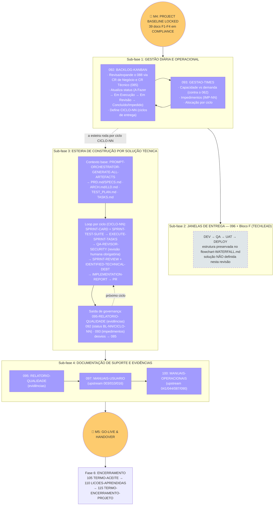
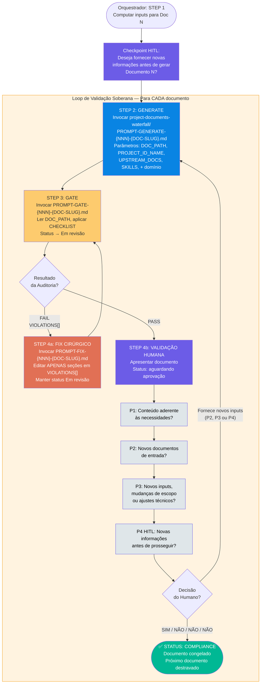
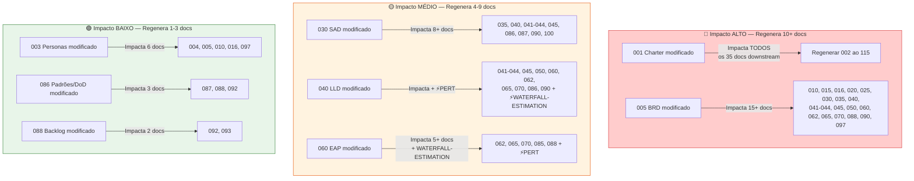
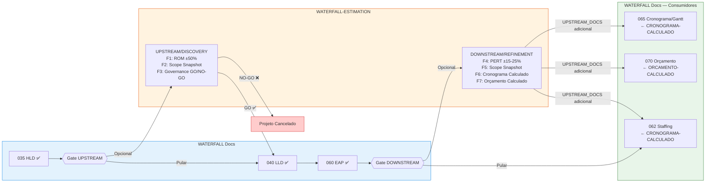
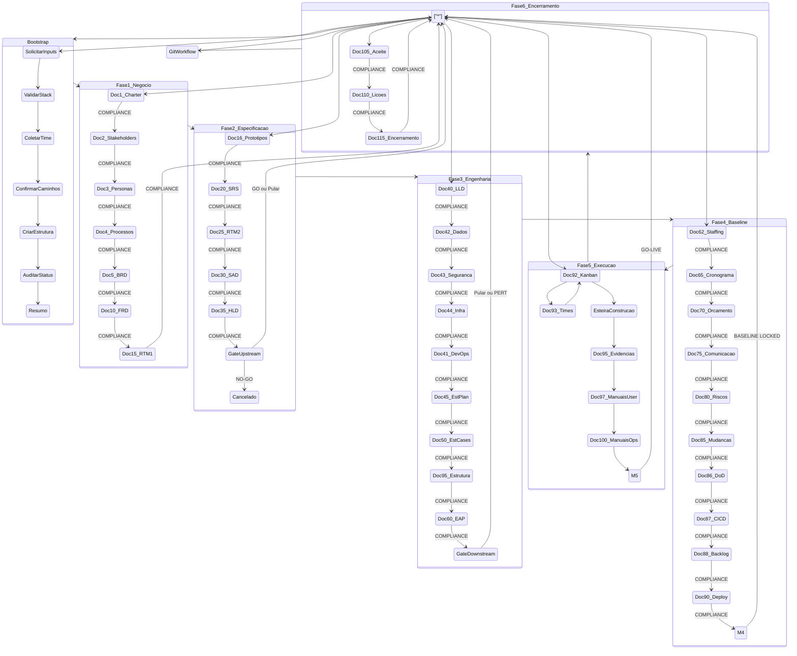

# FLOWCHART: ROADMAP DE DOCUMENTOS WATERFALL

## Versão: 3.1 — Visualização Gráfica das 6 Fases, 39 Documentos, Dupla RTM, Gates Estruturais e Janelas de Entrega (096)

> **Documento de referência:** `PROMPT-ROADMAP-GENERATE-PROJECT-DOCUMENTS-WATERFALL.md` (6 fases, 39 documentos)
>
> Este documento complementa o roadmap textual com diagramas Mermaid que visualizam o fluxo de execução das **6 fases WATERFALL**, os **39 documentos**, o mecanismo de orquestração Generate→Gate→Fix, a dupla RTM (Negócio + Sistema), a FASE 5 de EXECUÇÃO E CONSTRUÇÃO (roadmap dedicado) e a integração com WATERFALL-ESTIMATION.

---

## 1. Visão Macro — 6 Fases WATERFALL (39 Documentos)

```mermaid
flowchart TB
    START(["🚀 Início"]) --> F0["Fase 0: Bootstrap"]

    F0 --> FASE1

    subgraph FASE1["Fase 1: INICIAÇÃO E REQUISITOS DE NEGÓCIO"]
        direction LR
        D001["001: PROJECT-CHARTER<br/>001-PROJECT-CHARTER-{PROJECT_ID_NAME}.md"] --> D002["002: STAKEHOLDER-MAP<br/>002-STAKEHOLDER-MAP-{PROJECT_ID_NAME}.md"]
        D002 --> D003["003: PERSONAS-JORNADAS<br/>003-PERSONAS-JORNADAS-{PROJECT_ID_NAME}.md<br/>P-NN, J-NN"]
        D003 --> D004["004: MAPEAMENTO AS-IS/TO-BE<br/>004-MAPEAMENTO-AS-IS-TO-BE-{PROJECT_ID_NAME}.md<br/>PROC-NN, GAP-NN"]
        D004 --> D005["005: BRD<br/>005-BRD-{PROJECT_ID_NAME}.md<br/>REQ-NN"]
        D005 --> D010["010: FRD<br/>010-FRD-{PROJECT_ID_NAME}.md<br/>FEAT-NN, RN-NN, UC-NN"]
        D010 --> D015["015: RTM-FASE-1<br/>015-RTM-FASE-1-{PROJECT_ID_NAME}.md"]
    end

    FASE1 --> FASE2

    subgraph FASE2["Fase 2: ESPECIFICAÇÃO DE SISTEMA E ARQUITETURA MACRO"]
        direction LR
        D016["016: PROTOTIPOS-UX-UI<br/>016-PROTOTIPOS-UX-UI-{PROJECT_ID_NAME}.md<br/>PROTO-NN"] --> D020["020: SRS<br/>020-SRS-{PROJECT_ID_NAME}.md<br/>FR-NN, NFR-NN"]
        D020 --> D025["025: RTM-FASE-2<br/>025-RTM-FASE-2-{PROJECT_ID_NAME}.md"]
        D025 --> D030["030: SAD<br/>030-SAD-{PROJECT_ID_NAME}.md"]
        D030 --> D035["035: HLD<br/>035-HLD-{PROJECT_ID_NAME}.md"]
    end

    FASE2 --> EST_GATE_UP{{🎯 GATE 1: UPSTREAM<br/>após 035-HLD}}
    EST_GATE_UP -->|"Opcional"| EST_UP["WATERFALL-ESTIMATION<br/>UPSTREAM/DISCOVERY<br/>ROM ±50% + GO/NO-GO"]
    EST_GATE_UP -->|"Pular"| FASE3
    EST_UP -->|"GO ✅"| FASE3
    EST_UP -->|"NO-GO ❌"| CANCEL["Projeto Cancelado"]

    subgraph FASE3["Fase 3: ENGENHARIA DETALHADA, QUALIDADE E ENGENHARIAS TÉCNICAS"]
        direction TB
        subgraph ESTEIRA["Esteira de Engenharia (ciclo fechado: 040 → 042 → 043 → 044 → 041)"]
            direction LR
            D040["040: LLD<br/>040-LLD-{PROJECT_ID_NAME}.md"] --> D042["042: DATA-SETUP (DMD)<br/>042-DATA-SETUP-{PROJECT_ID_NAME}.md"]
            D042 --> D043["043: SEC-SETUP (SRD)<br/>043-SEC-SETUP-{PROJECT_ID_NAME}.md"]
            D043 --> D044["044: INFRA-SETUP (IDD)<br/>044-INFRA-SETUP-{PROJECT_ID_NAME}.md"]
            D044 --> D041["041: DEVOPS-SETUP (DED)<br/>041-DEVOPS-SETUP-{PROJECT_ID_NAME}.md"]
        end
        subgraph QUALIDADE["Esteira de Qualidade"]
            direction LR
            D045["045: TEST-PLAN<br/>045-TEST-PLAN-{PROJECT_ID_NAME}.md"] --> D050["050: TEST-CASES<br/>050-TEST-CASES-{PROJECT_ID_NAME}.md"]
        end
        D041 --> D045
        D050 --> D095E["095: RELATORIO-QUALIDADE<br/>095-RELATORIO-QUALIDADE-{PROJECT_ID_NAME}.md<br/>(estrutura)"]
        D095E --> D060["060: EAP-WBS<br/>060-EAP-WBS-{PROJECT_ID_NAME}.md"]
    end

    FASE3 --> EST_GATE_DOWN{{🎯 GATE 2: DOWNSTREAM<br/>após 060-EAP-WBS}}
    EST_GATE_DOWN -->|"Opcional"| EST_DOWN["WATERFALL-ESTIMATION<br/>DOWNSTREAM/REFINEMENT<br/>PERT ±15-25%<br/>→ Alimenta 065 + 070"]
    EST_GATE_DOWN -->|"Pular"| FASE4
    EST_DOWN --> FASE4

    subgraph FASE4["Fase 4: PLANEJAMENTO E BASELINE"]
        direction LR
        D062["062: STAFFING-PLAN<br/>062-STAFFING-PLAN-{PROJECT_ID_NAME}.md"] --> D065["065: CRONOGRAMA-GANTT<br/>065-CRONOGRAMA-GANTT-{PROJECT_ID_NAME}.md"]
        D065 --> D070["070: ORCAMENTO<br/>070-ORCAMENTO-{PROJECT_ID_NAME}.md"]
        D070 --> D075["075: PLANO-COMUNICACAO<br/>075-PLANO-COMUNICACAO-{PROJECT_ID_NAME}.md"]
        D075 --> D080["080: PLANO-RISCOS<br/>080-PLANO-RISCOS-{PROJECT_ID_NAME}.md"]
        D080 --> D085["085: PLANO-GESTAO-MUDANCAS<br/>085-PLANO-GESTAO-MUDANCAS-{PROJECT_ID_NAME}.md"]
        D085 --> D086["086: PADROES-CODIGO-DOD<br/>086-PADROES-CODIGO-DOD-{PROJECT_ID_NAME}.md"]
        D086 --> D087["087: PLANO-CI-CD-AMBIENTES<br/>087-PLANO-CI-CD-AMBIENTES-{PROJECT_ID_NAME}.md"]
        D087 --> D088["088: PRODUCT-BACKLOG-LIST<br/>088-PRODUCT-BACKLOG-LIST-{PROJECT_ID_NAME}.md"]
        D088 --> D090["090: STRATEGIC-IMPLEMENTATION-AND-DEPLOYMENT-PLAN<br/>090-STRATEGIC-IMPLEMENTATION-AND-DEPLOYMENT-PLAN-{PROJECT_ID_NAME}.md"]
    end

    FASE4 --> M4(("🚩 M4: PROJECT BASELINE LOCKED"))
    M4 --> FASE5

    subgraph FASE5["Fase 5: EXECUÇÃO E CONSTRUÇÃO (roadmap dedicado WATERFALL-EXECUTION)"]
        direction LR
        D092["092: BACKLOG-KANBAN<br/>092-BACKLOG-KANBAN-{PROJECT_ID_NAME}.md<br/>CRs Negócio/Técnico (085)<br/>Status · CICLO-NN"] --> D093["093: GESTAO-TIMES<br/>093-GESTAO-TIMES-{PROJECT_ID_NAME}.md<br/>Capacidade · IMP-NN"]
        D093 --> D092
        D092 --> ESTEIRA_DEV["Esteira de Construção por ciclo CICLO-NN<br/>(sprint-artefacts + sprint-tecnhnical-implementation)"]
        JANELAS["2. Janelas de Entrega<br/>096-DEFINICAO-JANELAS-ENTREGA-{PROJECT_ID_NAME}.md<br/>+ Bloco F (TECHLEAD v7.0)"]
        ESTEIRA_DEV -.->|"roda por ciclo CICLO-NN"| JANELAS
        ESTEIRA_DEV --> D095F["095: RELATORIO-QUALIDADE<br/>095-RELATORIO-QUALIDADE-{PROJECT_ID_NAME}.md<br/>(evidências por ciclo)"]
        D095F --> D097["097: MANUAIS-USUARIO<br/>097-MANUAIS-USUARIO-{PROJECT_ID_NAME}.md"]
        D097 --> D100["100: MANUAIS-OPERACIONAIS<br/>100-MANUAIS-OPERACIONAIS-{PROJECT_ID_NAME}.md"]
    end

    FASE5 --> M5(("🚩 M5: GO-LIVE & HANDOVER"))
    M5 --> FASE6

    subgraph FASE6["Fase 6: ENCERRAMENTO E OPERAÇÃO"]
        direction LR
        D105["105: TERMO-ACEITE<br/>105-TERMO-ACEITE-{PROJECT_ID_NAME}.md"] --> D110["110: LICOES-APRENDIDAS<br/>110-LICOES-APRENDIDAS-{PROJECT_ID_NAME}.md"]
        D110 --> D115["115: TERMO-ENCERRAMENTO-PROJETO<br/>115-TERMO-ENCERRAMENTO-PROJETO-{PROJECT_ID_NAME}.md"]
    end

    FASE6 --> END(["✅ Roadmap Concluído"])

    style F0 fill:#6c5ce7,color:#fff
    style D001 fill:#0984e3,color:#fff
    style D002 fill:#0984e3,color:#fff
    style D003 fill:#0984e3,color:#fff
    style D004 fill:#0984e3,color:#fff
    style D005 fill:#0984e3,color:#fff
    style D010 fill:#0984e3,color:#fff
    style D015 fill:#0984e3,color:#fff
    style D016 fill:#6c5ce7,color:#fff
    style D020 fill:#6c5ce7,color:#fff
    style D025 fill:#6c5ce7,color:#fff
    style D030 fill:#6c5ce7,color:#fff
    style D035 fill:#6c5ce7,color:#fff
    style D040 fill:#00b894,color:#fff
    style D041 fill:#00b894,color:#fff
    style D042 fill:#00b894,color:#fff
    style D043 fill:#00b894,color:#fff
    style D044 fill:#00b894,color:#fff
    style D045 fill:#00b894,color:#fff
    style D050 fill:#00b894,color:#fff
    style D095E fill:#00b894,color:#fff
    style D060 fill:#00b894,color:#fff
    style D062 fill:#e17055,color:#fff
    style D065 fill:#e17055,color:#fff
    style D070 fill:#e17055,color:#fff
    style D075 fill:#e17055,color:#fff
    style D080 fill:#e17055,color:#fff
    style D085 fill:#e17055,color:#fff
    style D086 fill:#e17055,color:#fff
    style D087 fill:#e17055,color:#fff
    style D088 fill:#e17055,color:#fff
    style D090 fill:#e17055,color:#fff
    style M4 fill:#fdcb6e,color:#333
    style M5 fill:#fdcb6e,color:#333
    style D092 fill:#a29bfe,color:#fff
    style D093 fill:#a29bfe,color:#fff
    style ESTEIRA_DEV fill:#a29bfe,color:#fff
    style JANELAS fill:#dfe6e9,color:#333,stroke-dasharray: 5 5
    style D095F fill:#a29bfe,color:#fff
    style D097 fill:#a29bfe,color:#fff
    style D100 fill:#a29bfe,color:#fff
    style D105 fill:#6c5ce7,color:#fff
    style D110 fill:#6c5ce7,color:#fff
    style D115 fill:#6c5ce7,color:#fff
    style EST_GATE_UP fill:#fdcb6e,color:#333
    style EST_GATE_DOWN fill:#fdcb6e,color:#333
    style EST_UP fill:#fff3e0,stroke:#e65100
    style EST_DOWN fill:#e8f5e9,stroke:#2e7d32
    style CANCEL fill:#d63031,color:#fff
```

---

## 2. Fase 0 — Bootstrap Inteligente (Detalhado)

---

## 3. Fases 1-2 — Iniciação, Requisitos e Especificação

Cada nó abaixo executa o **loop completo Generate→Gate→Fix + validação humana** (ver seção 5). O diagrama mostra a sequência de documentos; os gates de estimativa aparecem onde disparam.

```mermaid
flowchart TD
    subgraph F1["Fase 1: INICIAÇÃO E REQUISITOS DE NEGÓCIO"]
        direction TB
        D001_GEN["GENERATE 001: PROJECT-CHARTER<br/>Skills: draft-project-charter, senior-pm"] --> D001_GATE["GATE 001"]
        D001_GATE -->|FAIL| D001_FIX["FIX 001"]
        D001_FIX -.->|loop| D001_GATE
        D001_GATE -->|PASS| D001_OK["001: COMPLIANCE ✅"]

        D001_OK --> D002_GEN["GENERATE 002: STAKEHOLDER-MAP<br/>Skills: stakeholder-analysis, stakeholder-map"] --> D002_GATE["GATE 002"]
        D002_GATE -->|FAIL| D002_FIX["FIX 002"]
        D002_FIX -.->|loop| D002_GATE
        D002_GATE -->|PASS| D002_OK["002: COMPLIANCE ✅"]

        D002_OK --> D003_GEN["GENERATE 003: PERSONAS-JORNADAS<br/>Skills: proto-persona, customer-journey-map"] --> D003_GATE["GATE 003"]
        D003_GATE -->|FAIL| D003_FIX["FIX 003"]
        D003_FIX -.->|loop| D003_GATE
        D003_GATE -->|PASS| D003_OK["003: COMPLIANCE ✅"]

        D003_OK --> D004_GEN["GENERATE 004: MAPEAMENTO AS-IS/TO-BE<br/>Skills: process-mapping, gap-analysis"] --> D004_GATE["GATE 004"]
        D004_GATE -->|FAIL| D004_FIX["FIX 004"]
        D004_FIX -.->|loop| D004_GATE
        D004_GATE -->|PASS| D004_OK["004: COMPLIANCE ✅"]

        D004_OK --> D005_GEN["GENERATE 005: BRD<br/>Skills: brd-creation, business-analyst"] --> D005_GATE["GATE 005"]
        D005_GATE -->|FAIL| D005_FIX["FIX 005"]
        D005_FIX -.->|loop| D005_GATE
        D005_GATE -->|PASS| D005_OK["005: COMPLIANCE ✅"]

        D005_OK --> D010_GEN["GENERATE 010: FRD<br/>Skills: frs-creation, requirements-engineering"] --> D010_GATE["GATE 010"]
        D010_GATE -->|FAIL| D010_FIX["FIX 010"]
        D010_FIX -.->|loop| D010_GATE
        D010_GATE -->|PASS| D010_OK["010: COMPLIANCE ✅"]

        D010_OK --> D015_GEN["GENERATE 015: RTM-FASE-1<br/>Skills: requirements-modeling, requirements-validation"] --> D015_GATE["GATE 015"]
        D015_GATE -->|FAIL| D015_FIX["FIX 015"]
        D015_FIX -.->|loop| D015_GATE
        D015_GATE -->|PASS| D015_OK["015: COMPLIANCE ✅"]
    end

    D015_OK --> F2_START

    subgraph F2["Fase 2: ESPECIFICAÇÃO DE SISTEMA E ARQUITETURA MACRO"]
        direction TB
        D016_GEN["GENERATE 016: PROTOTIPOS-UX-UI<br/>Skills: ui-ux-designer, lean-ux-canvas"] --> D016_GATE["GATE 016"]
        D016_GATE -->|FAIL| D016_FIX["FIX 016"]
        D016_FIX -.->|loop| D016_GATE
        D016_GATE -->|PASS| D016_OK["016: COMPLIANCE ✅"]

        D016_OK --> D020_GEN["GENERATE 020: SRS<br/>Skills: frs-creation, requirements-engineering"] --> D020_GATE["GATE 020"]
        D020_GATE -->|FAIL| D020_FIX["FIX 020"]
        D020_FIX -.->|loop| D020_GATE
        D020_GATE -->|PASS| D020_OK["020: COMPLIANCE ✅"]

        D020_OK --> D025_GEN["GENERATE 025: RTM-FASE-2<br/>Skills: requirements-modeling, requirements-validation"] --> D025_GATE["GATE 025"]
        D025_GATE -->|FAIL| D025_FIX["FIX 025"]
        D025_FIX -.->|loop| D025_GATE
        D025_GATE -->|PASS| D025_OK["025: COMPLIANCE ✅"]

        D025_OK --> D030_GEN["GENERATE 030: SAD<br/>Skills: software-architecture, architecture-designer"] --> D030_GATE["GATE 030"]
        D030_GATE -->|FAIL| D030_FIX["FIX 030"]
        D030_FIX -.->|loop| D030_GATE
        D030_GATE -->|PASS| D030_OK["030: COMPLIANCE ✅"]

        D030_OK --> D035_GEN["GENERATE 035: HLD<br/>Skills: c4-container, system-design"] --> D035_GATE["GATE 035"]
        D035_GATE -->|FAIL| D035_FIX["FIX 035"]
        D035_FIX -.->|loop| D035_GATE
        D035_GATE -->|PASS| D035_OK["035: COMPLIANCE ✅"]

        D035_OK --> EST_CHECK_UP{{🎯 Após 035-HLD:<br/>Executar WATERFALL-ESTIMATION<br/>UPSTREAM/DISCOVERY?}}
    end

    F2_START --> D016_GEN

    style D001_GEN fill:#0984e3,color:#fff
    style D002_GEN fill:#0984e3,color:#fff
    style D003_GEN fill:#0984e3,color:#fff
    style D004_GEN fill:#0984e3,color:#fff
    style D005_GEN fill:#0984e3,color:#fff
    style D010_GEN fill:#0984e3,color:#fff
    style D015_GEN fill:#0984e3,color:#fff
    style D016_GEN fill:#6c5ce7,color:#fff
    style D020_GEN fill:#6c5ce7,color:#fff
    style D025_GEN fill:#6c5ce7,color:#fff
    style D030_GEN fill:#6c5ce7,color:#fff
    style D035_GEN fill:#6c5ce7,color:#fff
    style D001_OK fill:#00b894,color:#fff
    style D002_OK fill:#00b894,color:#fff
    style D003_OK fill:#00b894,color:#fff
    style D004_OK fill:#00b894,color:#fff
    style D005_OK fill:#00b894,color:#fff
    style D010_OK fill:#00b894,color:#fff
    style D015_OK fill:#00b894,color:#fff
    style D016_OK fill:#00b894,color:#fff
    style D020_OK fill:#00b894,color:#fff
    style D025_OK fill:#00b894,color:#fff
    style D030_OK fill:#00b894,color:#fff
    style D035_OK fill:#00b894,color:#fff
    style EST_CHECK_UP fill:#fdcb6e,color:#333
```

---

## 4. Fases 3-4 — Engenharia e Baseline

```mermaid
flowchart TD
    F3_START(["Após 035-HLD COMPLIANCE (GO ou Pular)"])

    subgraph F3["Fase 3: ENGENHARIA DETALHADA, QUALIDADE E ENGENHARIAS TÉCNICAS"]
        direction TB
        D040_GEN["GENERATE 040: LLD<br/>Skills: c4-component, ddd-tactical-patterns"] --> D040_OK["040: COMPLIANCE ✅"]

        D040_OK --> D042_GEN["GENERATE 042: DATA-SETUP (DMD)<br/>Skills: database-architect, data-modeling"] --> D042_OK["042: COMPLIANCE ✅"]

        D042_OK --> D043_GEN["GENERATE 043: SEC-SETUP (SRD)<br/>Skills: security-auditor, threat-modeling-expert"] --> D043_OK["043: COMPLIANCE ✅"]

        D043_OK --> D044_GEN["GENERATE 044: INFRA-SETUP (IDD)<br/>Skills: cloud-architect, terraform-specialist"] --> D044_OK["044: COMPLIANCE ✅"]

        D044_OK --> D041_GEN["GENERATE 041: DEVOPS-SETUP (DED)<br/>ÚLTIMO da esteira — após 042/043/044<br/>Skills: senior-devops, cicd-automation-workflow-automate"] --> D041_OK["041: COMPLIANCE ✅"]

        D041_OK --> D045_GEN["GENERATE 045: TEST-PLAN<br/>Skills: test-strategy-design, qa-test-planner"] --> D045_OK["045: COMPLIANCE ✅"]

        D045_OK --> D050_GEN["GENERATE 050: TEST-CASES<br/>Skills: test-case-creation, acceptance-criteria"] --> D050_OK["050: COMPLIANCE ✅"]

        D050_OK --> D095E_GEN["GENERATE 095: RELATORIO-QUALIDADE (estrutura)<br/>Skills: quality-documentation-manager, qa"] --> D095E_OK["095: COMPLIANCE ✅"]

        D095E_OK --> D060_GEN["GENERATE 060: EAP-WBS<br/>Skills: decomposition-planning-roadmap"] --> D060_OK["060: COMPLIANCE ✅"]

        D060_OK --> EST_CHECK_DOWN{{🎯 Após 060-EAP-WBS:<br/>Executar WATERFALL-ESTIMATION<br/>DOWNSTREAM/REFINEMENT?}}
    end

    F3_START --> D040_GEN

    EST_CHECK_DOWN --> F4_START

    subgraph F4["Fase 4: PLANEJAMENTO E BASELINE"]
        direction TB
        D062_GEN["GENERATE 062: STAFFING-PLAN<br/>Skills: team-composition-analysis, team-builder"] --> D062_OK["062: COMPLIANCE ✅"]

        D062_OK --> D065_GEN["GENERATE 065: CRONOGRAMA-GANTT<br/>+ CRONOGRAMA-CALCULADO se disponível"] --> D065_OK["065: COMPLIANCE ✅"]

        D065_OK --> D070_GEN["GENERATE 070: ORCAMENTO<br/>+ ORCAMENTO-CALCULADO se disponível"] --> D070_OK["070: COMPLIANCE ✅"]

        D070_OK --> D075_GEN["GENERATE 075: PLANO-COMUNICACAO"] --> D075_OK["075: COMPLIANCE ✅"]

        D075_OK --> D080_GEN["GENERATE 080: PLANO-RISCOS"] --> D080_OK["080: COMPLIANCE ✅"]

        D080_OK --> D085_GEN["GENERATE 085: PLANO-GESTAO-MUDANCAS"] --> D085_OK["085: COMPLIANCE ✅"]

        D085_OK --> D086_GEN["GENERATE 086: PADROES-CODIGO-DOD<br/>Skills: coding-guidelines, clean-code"] --> D086_OK["086: COMPLIANCE ✅"]

        D086_OK --> D087_GEN["GENERATE 087: PLANO-CI-CD-AMBIENTES<br/>Skills: deployment-pipeline-design"] --> D087_OK["087: COMPLIANCE ✅"]

        D087_OK --> D088_GEN["GENERATE 088: PRODUCT-BACKLOG-LIST<br/>Skills: backlog-management, senior-pm"] --> D088_OK["088: COMPLIANCE ✅"]

        D088_OK --> D090_GEN["GENERATE 090: STRATEGIC-IMPLEMENTATION-AND-DEPLOYMENT-PLAN<br/>Skills: deployment-engineer, devops-rollout-plan"] --> D090_OK["090: COMPLIANCE ✅"]

        D090_OK --> M4_OK(("🚩 M4: PROJECT BASELINE LOCKED"))
    end

    F4_START --> D062_GEN

    style D040_GEN fill:#00b894,color:#fff
    style D042_GEN fill:#00b894,color:#fff
    style D043_GEN fill:#00b894,color:#fff
    style D044_GEN fill:#00b894,color:#fff
    style D041_GEN fill:#00b894,color:#fff
    style D045_GEN fill:#00b894,color:#fff
    style D050_GEN fill:#00b894,color:#fff
    style D095E_GEN fill:#00b894,color:#fff
    style D060_GEN fill:#00b894,color:#fff
    style D062_GEN fill:#e17055,color:#fff
    style D065_GEN fill:#e17055,color:#fff
    style D070_GEN fill:#e17055,color:#fff
    style D075_GEN fill:#e17055,color:#fff
    style D080_GEN fill:#e17055,color:#fff
    style D085_GEN fill:#e17055,color:#fff
    style D086_GEN fill:#e17055,color:#fff
    style D087_GEN fill:#e17055,color:#fff
    style D088_GEN fill:#e17055,color:#fff
    style D090_GEN fill:#e17055,color:#fff
    style D040_OK fill:#00b894,color:#fff
    style D042_OK fill:#00b894,color:#fff
    style D043_OK fill:#00b894,color:#fff
    style D044_OK fill:#00b894,color:#fff
    style D041_OK fill:#00b894,color:#fff
    style D045_OK fill:#00b894,color:#fff
    style D050_OK fill:#00b894,color:#fff
    style D095E_OK fill:#00b894,color:#fff
    style D060_OK fill:#00b894,color:#fff
    style D062_OK fill:#00b894,color:#fff
    style D065_OK fill:#00b894,color:#fff
    style D070_OK fill:#00b894,color:#fff
    style D075_OK fill:#00b894,color:#fff
    style D080_OK fill:#00b894,color:#fff
    style D085_OK fill:#00b894,color:#fff
    style D086_OK fill:#00b894,color:#fff
    style D087_OK fill:#00b894,color:#fff
    style D088_OK fill:#00b894,color:#fff
    style D090_OK fill:#00b894,color:#fff
    style EST_CHECK_DOWN fill:#fdcb6e,color:#333
    style M4_OK fill:#fdcb6e,color:#333
```

> **Nota:** cada GENERATE acima executa o loop completo Generate→Gate→Fix (o diagrama mostra apenas o caminho feliz para legibilidade). A ordem da esteira F3 é fixa: `040 → 042 → 043 → 044 → 041` — o 041 só inicia após 042/043/044 em COMPLIANCE.

---

## 5. Fase 5 — EXECUÇÃO E CONSTRUÇÃO (roadmap dedicado)

---

## 6. Mecanismo de Orquestração — Loop Generate→Gate→Fix por Documento

---

## 7. Matriz de UPSTREAM_DOCS — Fluxo de Dependências (v3.0)

```mermaid
flowchart LR
    D001["001: Charter"] --> D002["002: Stakeholder Map"]
    D002 --> D003["003: Personas-Jornadas"]
    D002 --> D004["004: AS-IS/TO-BE"]
    D003 --> D004
    D003 --> D005["005: BRD"]
    D004 --> D005
    D002 --> D005
    D003 --> D010["010: FRD"]
    D004 --> D010
    D005 --> D010
    D002 --> D010
    D003 --> D015["015: RTM-F1"]
    D004 --> D015
    D005 --> D015
    D010 --> D015

    D003 --> D016["016: Protótipos UX/UI"]
    D004 --> D016
    D005 --> D016
    D010 --> D016
    D005 --> D020["020: SRS"]
    D010 --> D020
    D015 --> D020
    D016 --> D020
    D015 --> D025["025: RTM-F2"]
    D020 --> D025
    D016 --> D025

    D010 --> D030["030: SAD"]
    D020 --> D030
    D025 --> D030
    D030 --> D035["035: HLD"]
    D030 --> D040["040: LLD"]
    D035 --> D040

    D040 --> D042["042: DATA-SETUP"]
    D040 --> D043["043: SEC-SETUP"]
    D040 --> D044["044: INFRA-SETUP"]
    D042 --> D041["041: DEVOPS-SETUP"]
    D043 --> D041
    D044 --> D041
    D030 --> D041
    D030 --> D042
    D030 --> D043
    D030 --> D044
    D035 --> D041
    D035 --> D042
    D035 --> D043
    D035 --> D044

    D020 --> D045["045: TEST-PLAN"]
    D030 --> D045
    D040 --> D045
    D045 --> D050["050: TEST-CASES"]
    D010 --> D050
    D020 --> D050
    D045 --> D095E["095: RELATORIO-QUALIDADE"]
    D050 --> D095E
    D040 --> D060["060: EAP-WBS"]
    D050 --> D060

    D060 --> D062["062: STAFFING-PLAN"]
    D045 --> D062
    D050 --> D062
    D060 --> D065["065: Cronograma"]
    D050 --> D065
    D062 --> D065
    D060 --> D070["070: Orçamento"]
    D065 --> D070
    D045 --> D070
    D062 --> D070

    D002 --> D075["075: Comunicação"]
    D080["080: Riscos"]
    D060 --> D085["085: Gestão Mudanças"]
    D080 --> D085

    D030 --> D086["086: Padrões/DoD"]
    D035 --> D086
    D040 --> D086
    D043 --> D086
    D030 --> D087["087: CI-CD-Ambientes"]
    D035 --> D087
    D041 --> D087
    D044 --> D087

    D005 --> D088["088: Backlog"]
    D010 --> D088
    D020 --> D088
    D060 --> D088
    D062 --> D088
    D065 --> D088
    D070 --> D088
    D086 --> D088

    D030 --> D090["090: Strategic Deploy"]
    D035 --> D090
    D040 --> D090

    D088 --> D092["092: Backlog-Kanban"]
    D085 --> D092
    D062 --> D092
    D086 --> D092
    D087 --> D092
    D090 --> D092
    D062 --> D093["093: Gestão Times"]
    D065 --> D093
    D070 --> D093
    D092 --> D093

    D003 --> D097["097: Manuais Usuário"]
    D010 --> D097
    D016 --> D097
    D020 --> D097
    D030 --> D100["100: Manuais Ops"]
    D090 --> D100

    D045 --> D105["105: Termo Aceite"]
    D095E --> D105
    D105 --> D110["110: Lições"]
    D110 --> D115["115: Encerramento"]

    style D001 fill:#0984e3,color:#fff
    style D002 fill:#0984e3,color:#fff
    style D003 fill:#0984e3,color:#fff
    style D004 fill:#0984e3,color:#fff
    style D005 fill:#0984e3,color:#fff
    style D010 fill:#0984e3,color:#fff
    style D015 fill:#0984e3,color:#fff
    style D016 fill:#6c5ce7,color:#fff
    style D020 fill:#6c5ce7,color:#fff
    style D025 fill:#6c5ce7,color:#fff
    style D030 fill:#6c5ce7,color:#fff
    style D035 fill:#6c5ce7,color:#fff
    style D040 fill:#00b894,color:#fff
    style D041 fill:#00b894,color:#fff
    style D042 fill:#00b894,color:#fff
    style D043 fill:#00b894,color:#fff
    style D044 fill:#00b894,color:#fff
    style D045 fill:#00b894,color:#fff
    style D050 fill:#00b894,color:#fff
    style D095E fill:#00b894,color:#fff
    style D060 fill:#00b894,color:#fff
    style D062 fill:#e17055,color:#fff
    style D065 fill:#e17055,color:#fff
    style D070 fill:#e17055,color:#fff
    style D075 fill:#e17055,color:#fff
    style D080 fill:#e17055,color:#fff
    style D085 fill:#e17055,color:#fff
    style D086 fill:#e17055,color:#fff
    style D087 fill:#e17055,color:#fff
    style D088 fill:#e17055,color:#fff
    style D090 fill:#e17055,color:#fff
    style D092 fill:#a29bfe,color:#fff
    style D093 fill:#a29bfe,color:#fff
    style D097 fill:#a29bfe,color:#fff
    style D100 fill:#a29bfe,color:#fff
    style D105 fill:#6c5ce7,color:#fff
    style D110 fill:#6c5ce7,color:#fff
    style D115 fill:#6c5ce7,color:#fff
```

> **Nota:** a matriz reflete a tabela UPSTREAM_DOCS do roadmap master (v3.0). O nó 001 (Charter) é raiz e alimenta todos os documentos — as arestas foram omitidas para legibilidade onde o caminho passa por documentos intermediários.

---

## 8. Efeitos Cascata — Impacto de Modificações (v3.0)

> **Nota:** buckets representativos — a tabela EFEITOS CASCATA completa (39 linhas) está no roadmap master.

---

## 9. Integração com WATERFALL-ESTIMATION

---

## 10. Diagrama de Estados — Visão Unificada (6 Fases)

---

## 11. Git Workflow de Finalização

---

## 12. Tabela de Símbolos e Convenções

| Símbolo/Cor | Significado |
|-------------|-------------|
| 🟣 Roxo (`#6c5ce7`) | Bootstrap / Validação Humana / Git Workflow / Fase 2 (docs 016-035) / Fase 6 (105-115) |
| 🔵 Azul (`#0984e3`) | Fase 1: Requisitos de Negócio (docs 001-015) |
| 🟢 Verde (`#00b894`) | Fase 3: Engenharia Detalhada e Qualidade (docs 040-060) / Compliance |
| 🟠 Terracota (`#e17055`) | Fase 4: Planejamento e Baseline (docs 062-090) / Correções (FIX) |
| 🟣 Lilás (`#a29bfe`) | Fase 5: Execução e Construção (docs 092-100) |
| 🟡 Amarelo (`#fdcb6e`) | Gate / Decisões / Checkpoints / Milestones (M4, M5) |
| 🔴 Vermelho (`#d63031`) | Cancelado / Impacto ALTO |
| 🟤 Laranja escuro (`#e65100`) | WATERFALL-ESTIMATION UPSTREAM / Impacto MÉDIO |
| 🟢 Verde escuro (`#2e7d32`) | WATERFALL-ESTIMATION DOWNSTREAM / Impacto BAIXO |
| ⬜ Cinza tracejado | Sub-fase 2 — Janelas de Entrega (definidas no 096; orquestradas pelo Bloco F do TECHLEAD) |
| 🔲 Linha tracejada | Loop de retrabalho (GATE→FIX→GATE) / ciclo de esteira |
| 🔲 Linha sólida | Fluxo sequencial normal |
| 🎯 | Gate de Estimativa |
| ⚡ | Dispara WATERFALL-ESTIMATION |
| 📥 | Inputs consumidos |
| 📄 | Documento WATERFALL |
| NNN | Número do documento na sequência WATERFALL (001-115) |

---

## 13. Mapeamento de Cores por Fase

| Fase | Cor | Docs |
|------|-----|------|
| **Fase 1: Iniciação e Requisitos de Negócio** | 🔵 Azul | 001, 002, 003, 004, 005, 010, 015 |
| **Fase 2: Especificação de Sistema e Arquitetura Macro** | 🟣 Roxo | 016, 020, 025, 030, 035 |
| **Fase 3: Engenharia Detalhada e Qualidade** | 🟢 Verde | 040, 041, 042, 043, 044, 045, 050, 095 (estrutura), 060 |
| **Fase 4: Planejamento e Baseline** | 🟠 Terracota | 062, 065, 070, 075, 080, 085, 086, 087, 088, 090 |
| **Fase 5: Execução e Construção** | 🟣 Lilás | 092, 093, 095 (evidências), 097, 100 |
| **Fase 6: Encerramento e Operação** | 🟣 Roxo | 105, 110, 115 |

---

> **📁 Arquivos relacionados:**
> - `PROMPT-ROADMAP-GENERATE-PROJECT-DOCUMENTS-WATERFALL.md` — Documento fonte (6 fases, 39 docs)
> - `PROMPT-ROADMAP-GENERATE-WATERFALL-EXECUTION.md` — Roadmap dedicado da FASE 5 (Execução e Construção)
> - `../PROMPT-ROADMAP-GENERATE-WATERFALL-ESTIMATION.md` — Roadmap companion de estimativa
> - `../PROMPT-ROADMAP-GENERATE-SOURCING-FACTORY-BIDDING.md` — Roadmap de Sourcing (consome docs WATERFALL)
> - `../../../flowchart-WATERFALL.md` — Fluxo macro WATERFALL (visão de milestones e esteiras)
> - `PROMPT-GENERATE-*.md` — 38 prompts geradores
> - `PROMPT-GATE-*.md` — 38 prompts de auditoria
> - `PROMPT-FIX-*.md` — 38 prompts de correção
