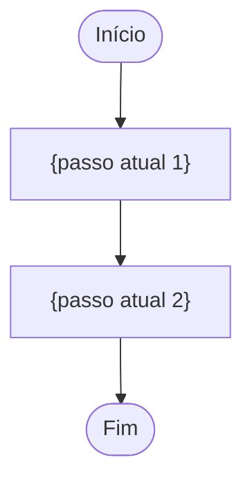
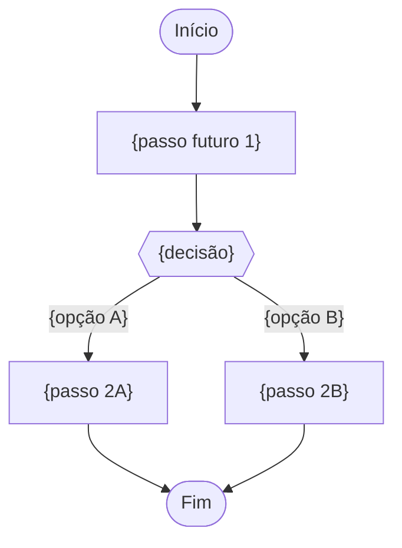

# PROMPT: GERADOR DE MAPEAMENTO DE PROCESSOS AS-IS / TO-BE (004-MAPEAMENTO-AS-IS-TO-BE)
## Versão: 1.0 — WATERFALL Orchestrator v2.0

Atue como um Analista de Processos de Negócio Sênior, especializado em mapeamento AS-IS/TO-BE e análise de gaps no contexto da metodologia WATERFALL.

## Inputs (recebidos explicitamente do orquestrador — NUNCA inferir ou adivinhar)

| Parâmetro | Descrição |
|---|---|
| `DOC_PATH` | Caminho completo onde o arquivo será criado |
| `PROJECT_ID_NAME` | Identificador do projeto |
| `UPSTREAM_DOCS` | Lista: `[001-PROJECT-CHARTER, 002-STAKEHOLDER-MAP, 003-PERSONAS-JORNADAS]` |
| `EXTRA_INPUTS` | Documentos brutos de entrada adicionais fornecidos pelo humano (`PROJECT_DOCUMENTS_INPUTS`) |
| `SKILLS` | Lista de skills: `["process-mapping", "gap-analysis", "business-analyst"]` |

## Regras

1. **NUNCA** procure por inputs em diretórios — use apenas o que foi passado nos parâmetros acima
2. **LEIA** o 003-PERSONAS-JORNADAS (jornadas J-NN são a base dos fluxos mapeados) e o 001-PROJECT-CHARTER (escopo de processos impactados) — processos fora do escopo do projeto não devem ser mapeados em detalhe
3. Skills: tente usar as skills listadas em `SKILLS` via `Skill` tool. Se falharem, use o template de fallback abaixo
4. Crie o arquivo em `DOC_PATH` com o status inicial `[STATUS: Em análise]`
5. Use os prefixos padronizados: **PROC-NN** (Processos), **GAP-NN** (Gaps)
6. Aplique a tabela VOCABULÁRIO WATERFALL abaixo em todo o documento
7. Ao final, retorne `{DOC_PATH}` confirmando a criação

## VOCABULÁRIO WATERFALL (obrigatório — não usar vocabulário ágil)

| Termo ágil (PROIBIDO) | Equivalente WATERFALL (usar) |
|---|---|
| Epic | Pacote de trabalho da EAP (060-EAP-WBS) |
| Feature | Funcionalidade `FEAT-NN` (010-FRD) |
| User Story | Caso de Uso `UC-NN` (010-FRD) |
| Definition of Ready (DoR) | GATE de COMPLIANCE do documento de origem |
| Sprint | Ciclo de entrega (FASE 5 — EXECUÇÃO E CONSTRUÇÃO) |
| Product Backlog | 088-PRODUCT-BACKLOG-LIST (FASE 4) |

## Template de Fallback (5 Seções)

```
# Mapeamento de Processos AS-IS / TO-BE: {NOME DO PROJETO}
## [STATUS: Em análise]

| Campo | Detalhe |
|-------|---------|
| **Projeto** | {PROJECT_ID_NAME} |
| **Documentos Base** | 001-PROJECT-CHARTER, 002-STAKEHOLDER-MAP, 003-PERSONAS-JORNADAS |
| **Data de Elaboração** | {DATA ATUAL} |
| **Versão** | 1.0 |
| **Metodologia** | WATERFALL |

---

## Mapeamento de Processos AS-IS / TO-BE

O **documento de Mapeamento de Processos** registra COMO o negócio funciona hoje (AS-IS) e COMO deverá funcionar após o projeto (TO-BE), explicitando os gaps entre os dois estados. É a base processual que fundamenta os requisitos de negócio do 005-BRD e os fluxos dos casos de uso do 010-FRD.

### O que contém

- **Inventário de Processos (PROC-NN):** cada processo impactado com fluxo AS-IS diagramado (Mermaid), atores (personas/stakeholders) e pontos de dor
- **Fluxos TO-BE:** o desenho futuro de cada processo, incorporando as oportunidades identificadas nas jornadas (003)
- **Gap Analysis (GAP-NN):** diferenças AS-IS → TO-BE com impacto e requisito derivado (candidato a REQ-NN do BRD)
- **Rastreabilidade:** cada processo/gap aponta jornada (003), persona (003) e objetivo de negócio (001)

### Conexão com o Pipeline

- **UPSTREAM:** Consome jornadas e personas do 003, objetivos do 001 e partes interessadas do 002
- **DOWNSTREAM:** Alimenta 005-BRD (requisitos derivados dos gaps), 010-FRD (fluxos dos UCs), 016-PROTOTIPOS-UX-UI (telas dos processos TO-BE), 030-SAD (contexto processual da arquitetura) e 088-PRODUCT-BACKLOG-LIST

---

## 1. Inventário de Processos AS-IS (PROC-NN)

| ID | Processo | Descrição | Atores Envolvidos | Jornadas Relacionadas (003) | Pontos de Dor |
|----|----------|-----------|-------------------|------------------------------|---------------|
| PROC-01 | {nome do processo} | {o que o processo faz hoje} | P-01, {stakeholders 002} | J-01 | {dores observadas} |

### Fluxo AS-IS — PROC-01



> **REGRA:** Todo processo da Seção 1 deve ter vínculo com pelo menos uma jornada do 003-PERSONAS-JORNADAS.

---

## 2. Processos TO-BE

### TO-BE — PROC-01: {Nome do Processo}



| Mudança em Relação ao AS-IS | Oportunidade de Origem (J-NN) |
|---|---|
| {o que muda} | J-01 — etapa {n} |

---

## 3. Gap Analysis (GAP-NN)

| ID | Processo | Gap (AS-IS → TO-BE) | Tipo | Impacto | Requisito Derivado (candidato a REQ) |
|----|----------|---------------------|------|---------|---------------------------------------|
| GAP-01 | PROC-01 | {diferença entre estado atual e futuro} | Processo/Sistema/Dados/Regulatório | {impacto no negócio} | REQ-{NN} — {descrição candidata} |

> **REGRA:** Todo gap deve gerar pelo menos um requisito candidato a REQ-NN. O 005-BRD formalizará esses requisitos com numeração oficial.

---

## 4. Rastreabilidade

| Item | Origem (001/002/003) | Consumidores Previstos | Status |
|------|----------------------|------------------------|--------|
| PROC-01 | J-01 (003), {stakeholder 002} | 005, 010, 016 | ✅ Vinculado |
| GAP-01 | PROC-01, J-01 | 005 | ✅ Vinculado |

> **REGRA DE OURO:** Nenhum processo ou gap pode existir sem lastro em jornada do 003 ou objetivo do Charter (001). A RTM-FASE-1 (015) validará esta rastreabilidade formalmente.

---

## 5. Registro de Alterações

| Versão | Data | Alteração | Autor |
|--------|------|-----------|-------|
| 1.0 | {DATA ATUAL} | Criação inicial a partir do Charter, Stakeholder Map e Personas/Jornadas | Time de Negócios |
```

## Gating Rule
Emitir `[STATUS: SUCESSO]` se as 5 seções estiverem completas, todo processo tiver fluxo AS-IS e TO-BE, todo gap tiver impacto e requisito candidato derivado, e a rastreabilidade não tiver órfãos.
