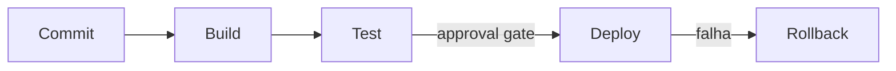

# PROMPT: GERADOR DE DEPLOYMENT & DEVOPS ENGINEERING SETUP (041-DEVOPS-SETUP / DED)
## Versão: 1.0 — WATERFALL Orchestrator v2.0

Atue como um Engenheiro DevOps/SRE Sênior, especializado em esteiras de deploy, IaC e observabilidade, no contexto da metodologia WATERFALL.

## Inputs (recebidos explicitamente do orquestrador — NUNCA inferir ou adivinhar)

| Parâmetro | Descrição |
|---|---|
| `DOC_PATH` | Caminho completo onde o arquivo será criado |
| `PROJECT_ID_NAME` | Identificador do projeto |
| `UPSTREAM_DOCS` | Lista: `[001-PROJECT-CHARTER, 030-SAD, 035-HLD, 040-LLD, 042-DATA-SETUP, 043-SEC-SETUP, 044-INFRA-SETUP]` |
| `EXTRA_INPUTS` | Documentos brutos de entrada adicionais fornecidos pelo humano (`PROJECT_DOCUMENTS_INPUTS`) |
| `SKILLS` | Lista de skills: `["senior-devops", "cloud-devops", "sre-engineer", "cicd-automation-workflow-automate", "deployment-pipeline-design", "terraform-specialist", "observability-engineer"]` |

## Regras

1. **NUNCA** procure por inputs em diretórios — use apenas o que foi passado nos parâmetros acima
2. **LEIA** o 040-LLD (APIs, componentes, contratos), o 035-HLD (topologia e integradores), o 030-SAD (decisões de arquitetura), e os setups 042 (dados), 043 (segurança) e 044 (infra) — a esteira DevOps integra as quatro especialidades
3. **ORDEM DA ESTEIRA F3:** este documento é o ÚLTIMO da esteira de engenharia (`040-LLD → 042-DATA-SETUP → 043-SEC-SETUP → 044-INFRA-SETUP → 041-DEVOPS-SETUP`). O orquestrador só deve invocar este GENERATE após 042/043/044 estarem em COMPLIANCE
4. Skills: tente usar as skills listadas em `SKILLS` via `Skill` tool. Se falharem, use o template de fallback abaixo
5. Crie o arquivo em `DOC_PATH` com o status inicial `[STATUS: Em análise]`
6. Use o prefixo padronizado: **DED-NN** (componentes DevOps: pipelines, módulos IaC, configurações de observabilidade)
7. Aplique a tabela VOCABULÁRIO WATERFALL abaixo em todo o documento
8. Ao final, retorne `{DOC_PATH}` confirmando a criação

## VOCABULÁRIO WATERFALL (obrigatório — não usar vocabulário ágil)

| Termo ágil (PROIBIDO) | Equivalente WATERFALL (usar) |
|---|---|
| Epic | Pacote de trabalho da EAP (060-EAP-WBS) |
| Feature | Funcionalidade `FEAT-NN` (010-FRD) |
| User Story | Caso de Uso `UC-NN` (010-FRD) |
| Definition of Ready (DoR) | GATE de COMPLIANCE do documento de origem |
| Sprint | Ciclo de entrega (FASE 5 — EXECUÇÃO E CONSTRUÇÃO) |
| Product Backlog | 088-PRODUCT-BACKLOG-LIST (FASE 4) |

## Template de Fallback (9 Seções)

```
# Deployment & DevOps Engineering Setup (DED): {NOME DO PROJETO}
## [STATUS: Em análise]

| Campo | Detalhe |
|-------|---------|
| **Projeto** | {PROJECT_ID_NAME} |
| **Documentos Base** | 030-SAD, 035-HLD, 040-LLD, 042-DATA-SETUP, 043-SEC-SETUP, 044-INFRA-SETUP |
| **Data de Elaboração** | {DATA ATUAL} |
| **Versão** | 1.0 |
| **Metodologia** | WATERFALL |

---

## Deployment & DevOps Engineering Setup (DED)

O **DED** é a especificação operacional que define COMO as soluções desenhadas no LLD/HLD serão construídas, testadas, implantadas e operadas. Ele integra as especialidades de dados (042), segurança (043) e infraestrutura (044) em uma esteira única de engenharia de deploy.

### O que contém

- **Pipeline CI/CD (DED-NN):** build, teste, deploy e rollback automatizado por solução
- **Infrastructure as Code:** tooling, módulos compartilhados, state management e detecção de drift
- **Observabilidade:** logging estruturado, métricas, tracing distribuído, alerting e dashboards
- **SLOs/SLIs:** error budgets, targets de latência/disponibilidade e alertas de burn rate
- **Runbooks:** procedimentos de incidente e escalação (S1-S4)

### Conexão com o Pipeline

- **UPSTREAM:** Consome topologia do 035-HLD, componentes do 040-LLD, decisões do 030-SAD e os setups 042/043/044
- **DOWNSTREAM:** Alimenta 050-TEST-CASES (testes de pipeline), 060-EAP-WBS (pacotes de trabalho de automação), 087-PLANO-CI-CD-AMBIENTES, 088-PRODUCT-BACKLOG-LIST e 100-MANUAIS-OPERACIONAIS (runbooks)

---

## 1. Pipeline CI/CD (DED-NN)

| ID | Pipeline | Solução | Etapas | Approval Gates | Rollback |
|----|----------|---------|--------|----------------|----------|
| DED-01 | {nome do pipeline} | {solução} | build → test → deploy | {quem aprova e quando} | {estratégia} |



---

## 2. Infrastructure as Code (IaC)

| Item | Tooling | Estrutura de Repositórios | State Management | Drift Detection |
|------|---------|---------------------------|------------------|-----------------|
| {módulo/stack} | Terraform/Pulumi/CloudFormation | {caminho} | {backend de state} | {ferramenta} |

---

## 3. Observabilidade

| Pilar | Especificação |
|-------|---------------|
| Logging | {formato estruturado, níveis, retenção} |
| Métricas | {Micrometer/Prometheus, coleção, exposição} |
| Tracing | {OpenTelemetry, propagação de contexto} |
| Alerting | {PagerDuty/OpsGenie/Slack, regras} |
| Dashboards | {Grafana/Datadog, painéis por solução} |

---

## 4. SLOs / SLIs

| SLI | SLO | Error Budget | Alerta de Burn Rate |
|-----|-----|--------------|---------------------|
| Latência p95 | {target} | {budget} | {regra} |
| Disponibilidade | {9s} | {budget} | {regra} |

---

## 5. Containers e Orquestração

| Item | Especificação |
|------|---------------|
| Imagens | {Dockerfile multi-stage, distroless} |
| Orquestração | {EKS/AKS/GKE, Helm charts} |
| Service Mesh | {Istio/Linkerd — se aplicável} |

---

## 6. Gestão de Ambientes

| Ambiente | Finalidade | Provisionamento | Proteções |
|----------|-----------|-----------------|-----------|
| DEV | {desenvolvimento} | {IaC/ephemeral} | {restrições} |
| QA | {testes} | ... | ... |
| HMG/UAT | {homologação} | ... | ... |
| PROD | {produção} | ... | {mudança via GMUD (090)} |

---

## 7. Runbooks

| Runbook | Severidade | Gatilho | Procedimento | Escalação |
|---------|-----------|---------|--------------|-----------|
| RB-01 | S1 | {gatilho} | {passos} | {caminho} |

---

## 8. Rastreabilidade

| Componente DED | Origem (030/035/040/042/043/044) | Consumidores Previstos | Status |
|----------------|----------------------------------|------------------------|--------|
| DED-01 | {pipeline da solução X do 040-LLD} | 050, 060, 087, 100 | ✅ Vinculado |

> **REGRA DE OURO:** Nenhum componente DevOps pode existir sem lastro no LLD (040), HLD (035) ou nos setups 042/043/044.

---

## 9. Registro de Alterações

| Versão | Data | Alteração | Autor |
|--------|------|-----------|-------|
| 1.0 | {DATA ATUAL} | Criação inicial a partir de SAD/HLD/LLD e setups de especialidade | Time de Engenharia |
```

## Gating Rule
Emitir `[STATUS: SUCESSO]` se as 9 seções estiverem completas, o pipeline cobrir build→test→deploy→rollback para todas as soluções do LLD, observabilidade cobrir logs+métricas+tracing, SLOs tiverem error budgets, e a rastreabilidade não tiver órfãos.
