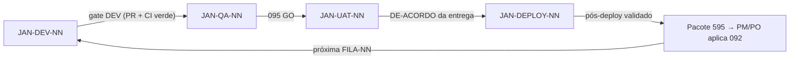

# PROMPT: GERADOR DE DEFINIÇÃO DE JANELAS DE ENTREGA (096-DEFINICAO-JANELAS-ENTREGA)
## Versão: 1.0 — WATERFALL Orchestrator v3.1 (6 Fases, 39 Documentos)

Atue como um Especialista em Gestão de Entregas e Processos (PM/PO Sênior), responsável por definir a estrutura das **Janelas de Entrega** da FASE 5 do fluxo WATERFALL.

## Inputs (recebidos explicitamente do orquestrador — NUNCA inferir ou adivinhar)

| Parâmetro | Descrição |
|---|---|
| `DOC_PATH` | Caminho completo onde o arquivo será criado |
| `PROJECT_ID_NAME` | Identificador do projeto |
| `UPSTREAM_DOCS` | Lista: `[092-BACKLOG-KANBAN, 085-PLANO-GESTAO-MUDANCAS, 045-EST-PLAN, 050-EST-CASES, 095-RELATORIO-QUALIDADE, 105-TERMO-ACEITE, 090-STRATEGIC-IMPLEMENTATION-AND-DEPLOYMENT-PLAN, 087-PLANO-CI-CD-AMBIENTES]` |
| `EXTRA_INPUTS` | Documentos brutos de entrada adicionais fornecidos pelo humano (`PROJECT_DOCUMENTS_INPUTS`) |
| `SKILLS` | Lista de skills: `["delivery-manager", "senior-pm"]` |

## Regras

1. **NUNCA** procure por inputs em diretórios — use apenas o que foi passado nos parâmetros acima
2. **LEIA** os upstreams — os critérios de cada janela derivam dos documentos existentes: DEV do Bloco E e do 086/087; QA do 045/050 e do 095 (GO/NO-GO); UAT do 105; DEPLOY do 090/087 (GMUD em PROD)
3. Skills: tente usar as skills listadas em `SKILLS` via `Skill` tool. Se falharem, use o template de fallback abaixo
4. Crie o arquivo em `DOC_PATH` com o status inicial `[STATUS: Em análise]`
5. Use os prefixos padronizados: **JAN-DEV-NN**, **JAN-QA-NN**, **JAN-UAT-NN**, **JAN-DEPLOY-NN** (NN = número da FILA-NN do 092)
6. Aplique a tabela VOCABULÁRIO WATERFALL abaixo em todo o documento
7. **FRONTEIRA DUPLA:** este documento define JANELAS (estrutura de passagem das entregas) e NUNCA define Filas/Ciclos (`FILA-NN`) — a atribuição de demanda a ciclo é exclusiva do 092. O 092, por sua vez, nunca define janelas
8. Ao final, retorne `{DOC_PATH}` confirmando a criação

## VOCABULÁRIO WATERFALL (obrigatório — não usar vocabulário ágil)

| Termo ágil (PROIBIDO) | Equivalente WATERFALL (usar) |
|---|---|
| Epic | Pacote de trabalho da EAP (060-EAP-WBS) |
| Feature | Funcionalidade `FEAT-NN` (010-FRD) |
| User Story | Caso de Uso `UC-NN` (010-FRD) |
| Definition of Ready (DoR) | GATE de COMPLIANCE do documento de origem |
| Sprint | Ciclo de entrega `FILA-NN` (definido pelo 092) |
| Product Backlog | 088-PRODUCT-BACKLOG-LIST (operado pelo 092) |

## Template de Fallback (5 Seções)

```
# Definição de Janelas de Entrega: {NOME DO PROJETO}
## [STATUS: Em análise]

| Campo | Detalhe |
|-------|---------|
| **Projeto** | {PROJECT_ID_NAME} |
| **Documentos Base** | 092, 085, 045, 050, 095, 105, 090, 087 |
| **Data de Elaboração** | {DATA ATUAL} |
| **Versão** | 1.0 |
| **Metodologia** | WATERFALL |

---

## Definição de Janelas de Entrega

O **096-DEFINICAO-JANELAS-ENTREGA** é a definição estrutural das 4 janelas pelas quais cada ciclo de entrega (`FILA-NN`) passa na FASE 5: **DEV → QA → UAT → DEPLOY**. É um documento de definição (não um registro operacional): os registros de execução vivem no 600-EXECUTION-HISTORY (TECHLEAD), no pacote 595 (retorno por ciclo), no 095 (verificação) e no 105 (aceite).

### Papel no fluxo

- **UPSTREAM:** consome 092 (FILA-NN), 045/050 (testes), 095 (GO/NO-GO), 105 (aceite), 090/087 (deploy/GMUD), 085 (mudanças)
- **DOWNSTREAM:** consumido pelo **Bloco F do PROJECT-TECHNICAL-DEFINITIONS v7.0** (orquestração TECHLEAD) — este documento define O QUÊ e QUEM; o Bloco F orquestra O COMO por ciclo

---

## 1. Definição das 4 Janelas

### JANELA-DEV — Desenvolvimento

| Campo | Detalhe |
|-------|---------|
| **Objetivo** | Construção da FILA-NN (Bloco E do TECHLEAD, steps 0–7) |
| **Dono da execução (frente)** | TECHLEAD (Bloco E) |
| **Dono do aceite** | TECHLEAD (GATE do ciclo) + revisor humano (086) |
| **Critérios de entrada** | FILA-NN ativa (092) + snapshot 092 + pacote de demanda F1–F4 |
| **Critérios de saída (gate)** | PR aprovado (086) + CI verde (087) + artefatos do ciclo no repositório da solução |
| **Evidências esperadas** | PRs, relatórios de execução, IMPLEMENTATION-REPORT, DT-XXX, pacote 595 (seções 2 e 4) |
| **Docs upstream** | 092, 086, 087, 045, 050 |

### JANELA-QA — Testes

| Campo | Detalhe |
|-------|---------|
| **Objetivo** | Verificação da entrega contra 045/050 — testes funcionais, carga e pentest |
| **Dono da execução (frente)** | TECHLEAD (execução do 050 + QA-REVISOR-SECURITY; frentes especializadas no futuro) |
| **Dono do aceite** | PM/PO (valida o 095 com resultado GO/NO-GO) |
| **Critérios de entrada** | Janela DEV concluída (gate DEV) + PR aprovado + CI verde (087) |
| **Critérios de saída (gate)** | 095-RELATORIO-QUALIDADE com GO registrado |
| **Evidências esperadas** | Execução do 050, relatório QA-REVISOR-SECURITY, 095 |
| **Docs upstream** | 045, 050, 095 |

### JANELA-UAT — Homologação

| Campo | Detalhe |
|-------|---------|
| **Objetivo** | Validação de negócio com Key Users |
| **Dono da execução (frente)** | PM/PO + usuários de negócio (validação humana — sem executor automatizado) |
| **Dono do aceite** | PM/PO + Key Users — registro de **DE-ACORDO/APROVAÇÃO por entrega** |
| **Critérios de entrada** | 095 com resultado GO |
| **Critérios de saída (gate)** | Registro de **DE-ACORDO/APROVAÇÃO da entrega** (Key Users + PM/PO) |
| **Evidências esperadas** | Registro de DE-ACORDO por entrega (alimenta o pacote 595 e pode ser refletido no 580-SPRINT-BACKLOG pelo TECHLEAD), registros de testes de aceite |
| **Docs upstream** | 095, 003/010 (jornadas e requisitos) |

> **NOTA:** o **105-TERMO-ACEITE** permanece como o aceite **FINAL do projeto (FASE 6)** — ele NÃO é usado como gate por entrega. O controle por entrega/ciclo é o registro de DE-ACORDO/APROVAÇÃO desta janela.

### JANELA-DEPLOY — Implantação

| Campo | Detalhe |
|-------|---------|
| **Objetivo** | Publicação em PROD (090 + 087, GMUD obrigatória) |
| **Dono da execução (frente)** | TECHLEAD (090 + 087; frente de deploy especializada no futuro) |
| **Dono do aceite** | PM/PO (valida checklist do 090 e a janela GMUD — go/no-go) |
| **Critérios de entrada** | DE-ACORDO/APROVAÇÃO da entrega registrado + janela GMUD aberta + CI/CD verde (087 CICD-02) |
| **Critérios de saída (gate)** | Deploy executado + validação pós-implantação registrada |
| **Evidências esperadas** | Runbooks do 090, evidências CI/CD do 087, registro no 600 |
| **Docs upstream** | 090, 087, 085 (se mudança), 600 |

---

## 2. Matriz de Transição (loop por FILA-NN)



**Tratativas de retorno:**
- **QA com NO-GO** → retorna à JANELA-DEV (retrabalho; evidências do 095 anexadas ao pacote 595)
- **UAT com divergência** → CR via 085 + retorno à JANELA-DEV
- **DEPLOY bloqueado** → `IMP-NN` (093) + tratativa via 085; novo ciclo só após resolução

---

## 3. Rastreabilidade

| Item | Origem | Registro de execução | Consumidor |
|------|--------|----------------------|------------|
| JAN-DEV-NN | FILA-NN (092) | 600-EXECUTION-HISTORY (TECHLEAD) | pacote 595 |
| JAN-QA-NN | gate DEV + 095 GO/NO-GO | 600 + coluna "Janela" do 595 | PM/PO (aceite via 095) |
| JAN-UAT-NN | DE-ACORDO/APROVAÇÃO da entrega registrado | pacote 595 (e/ou 580-SPRINT-BACKLOG) | 090 (entrada do deploy) |
| JAN-DEPLOY-NN | 090 + 087 (GMUD) | 600 + evidências do 087 | M5 (GO-LIVE) |

> **REGRA DE OURO:** a janela é atributo de RASTREIO da entrega — o status canônico do item permanece no 092 (`A Fazer → Em Execução → Em Revisão → Concluído/Impedido`). A janela nunca substitui o status.

---

## 4. Regras e Limites

1. **Vocabulário WATERFALL** obrigatório em todo o documento
2. **Fronteira dupla:** este documento não define Filas/Ciclos (exclusivo do 092); o 092 não define janelas (veto da regra 4 do GENERATE-092)
3. **M4 preservado:** mudança de escopo pós-M4 segue o 085
4. **Execução delegada:** este documento define estrutura e donos; a execução de cada frente será realizada por skills/agents/roadmaps especializados (fora do escopo desta definição)
5. **HITL:** toda transição entre janelas exige validação humana explícita
6. **Aceite por entrega × aceite final:** cada entrega/ciclo exige registro de **DE-ACORDO/APROVAÇÃO** (UAT, alimenta o 595 e/ou o 580); o **105-TERMO-ACEITE** permanece como aceite FINAL do projeto na FASE 6 — nunca como gate por entrega

---

## 5. Registro de Alterações

| Versão | Data | Alteração | Autor |
|--------|------|-----------|-------|
| 1.0 | {DATA ATUAL} | Criação inicial da definição estrutural das janelas de entrega | Time de Negócios |
```

## Gating Rule
Emitir `[STATUS: SUCESSO]` se as 5 seções estiverem completas, as 4 janelas tiverem objetivo/donos/critérios de entrada/saída/evidências/upstreams, a matriz de transição cobrir o loop com as 3 tratativas de retorno, a rastreabilidade não tiver órfãos, e nenhuma FILA/Ciclo tiver sido definida (fronteira dupla).
