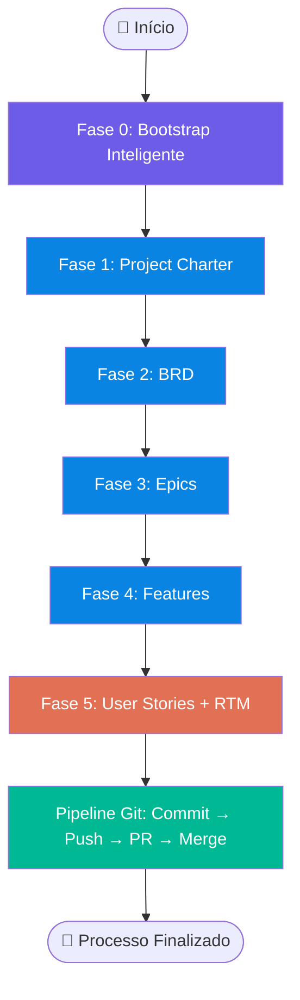
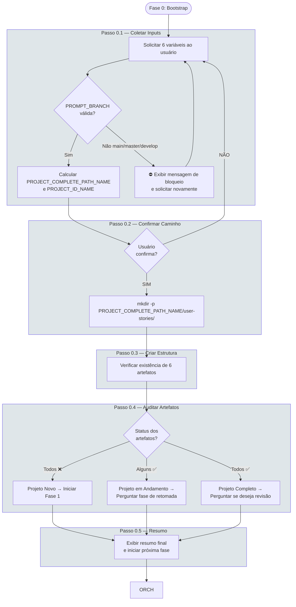
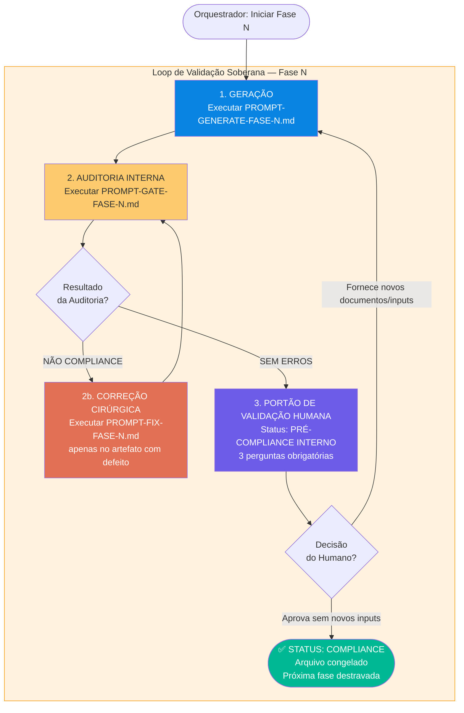
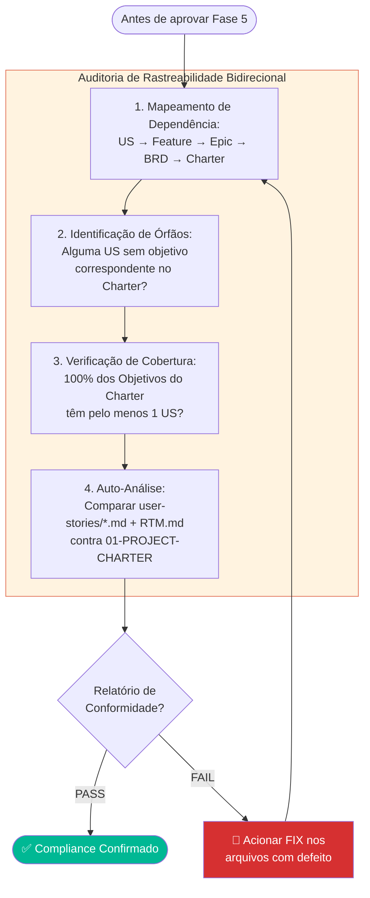
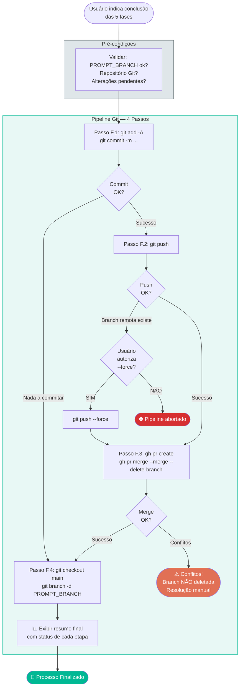
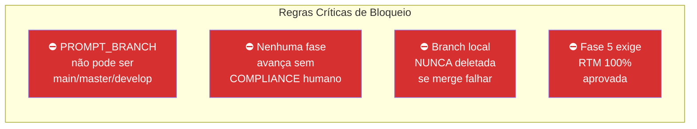

# FLOWCHART: ROADMAP DE EXECUÇÃO MACRO E GUIA DE ORQUESTRAÇÃO DE DOCUMENTOS

## Versão: 5.0 — Visualização Gráfica do Pipeline de Documentação

> **Documento de referência:** `PROMPT-ROADMAP-GENERATE-PROJECT-DOCUMENTS.md` v5.0
>
> Este documento complementa o roadmap textual com diagramas Mermaid que visualizam o fluxo de execução, os mecanismos de orquestração e as regras de gating.

---

## 1. Visão Macro do Pipeline Completo

---

## 2. Fase 0 — Bootstrap Inteligente (Detalhado)

---

## 3. Mecanismo de Orquestração Dinâmica (Loop Trifásico por Fase)

Este é o coração do roadmap. **TODAS** as fases 1-5 executam este mesmo loop.

### As 3 Perguntas do Portão de Validação Humana

| # | Pergunta | Propósito |
|---|----------|-----------|
| 1 | O documento está aderente às necessidades do negócio? | Validação de conteúdo |
| 2 | Você deseja anexar novos documentos de entrada? | Detecção de evolução incremental |
| 3 | Você deseja fornecer novos inputs textuais? | Captura de requisitos adicionais |

---

## 4. Fases 1-5 — Pipeline Sequencial com Dependências

```mermaid
flowchart LR
    subgraph F1[Fase 1: Project Charter]
        F1_GEN[GENERATE] --> F1_GATE[GATE] --> F1_FIX[FIX]
        F1_FIX -.->|loop| F1_GATE
        F1_GATE --> F1_OK[COMPLIANCE ✅]
    end

    subgraph F2[Fase 2: BRD]
        F2_GEN[GENERATE] --> F2_GATE[GATE] --> F2_FIX[FIX]
        F2_FIX -.->|loop| F2_GATE
        F2_GATE --> F2_OK[COMPLIANCE ✅]
    end

    subgraph F3[Fase 3: Epics]
        F3_GEN[GENERATE] --> F3_GATE[GATE] --> F3_FIX[FIX]
        F3_FIX -.->|loop| F3_GATE
        F3_GATE --> F3_OK[COMPLIANCE ✅]
    end

    subgraph F4[Fase 4: Features]
        F4_GEN[GENERATE] --> F4_GATE[GATE] --> F4_FIX[FIX]
        F4_FIX -.->|loop| F4_GATE
        F4_GATE --> F4_OK[COMPLIANCE ✅]
    end

    subgraph F5[Fase 5: User Stories + RTM]
        F5_GEN[GENERATE<br/>Modular] --> F5_GATE[GATE<br/>Valida arquivos<br/>+ links RTM] --> F5_FIX[FIX<br/>Isolado por<br/>arquivo]
        F5_FIX -.->|loop| F5_GATE
        F5_GATE --> F5_OK[COMPLIANCE ✅]
    end

    F1_OK -->|destrava| F2_GEN
    F2_OK -->|destrava| F3_GEN
    F3_OK -->|destrava| F4_GEN
    F4_OK -->|destrava| F5_GEN

    F1 --> INPUTS1[Inputs: docs brutos<br/>+ entrevistas]
    F2 --> INPUTS2[Inputs: 01-Charter<br/>+ stakeholders]
    F3 --> INPUTS3[Inputs: 02-BRD]
    F4 --> INPUTS4[Inputs: 03-Epics]
    F5 --> INPUTS5[Inputs: 04-Features<br/>+ 01-Charter original]

    style F1 fill:#0984e3,color:#fff
    style F2 fill:#0984e3,color:#fff
    style F3 fill:#0984e3,color:#fff
    style F4 fill:#0984e3,color:#fff
    style F5 fill:#e17055,color:#fff
```

### Artefatos Produzidos por Fase

| Fase | Arquivo Gerado | Conteúdo |
|------|----------------|----------|
| 1 | `01-PROJECT-CHARTER-{ID}.md` | 14 seções macro: escopo, objetivos, premissas, restrições, governança |
| 2 | `02-BRD-{ID}.md` | Requisitos de negócio detalhados, regras de atendimento |
| 3 | `03-EPICS-{ID}.md` | Grandes blocos de entrega de valor |
| 4 | `04-FEATURES-{ID}.md` | Funcionalidades tangíveis e implementáveis |
| 5 | `USER-STORIES-{PROJECT_ID_NAME}.md` + `user-stories/US-*.md` | Índice central + arquivos atômicos com Gherkin |

---

## 5. Matriz de Rastreabilidade (RTM) — Validação Cruzada Fase 5 vs Fase 1

---

## 6. Pipeline Git — Finalização Automatizada

---

## 7. Diagrama de Estados — Visão Unificada

```mermaid
stateDiagram-v2
    [*] --> Bootstrap: Início

    state Bootstrap {
        [*] --> ColetarInputs
        ColetarInputs --> ValidarBranch: PROMPT_BRANCH
        ValidarBranch --> ColetarInputs: main/master/develop
        ValidarBranch --> ConfirmarCaminho: branch válida
        ConfirmarCaminho --> ColetarInputs: NÃO confirma
        ConfirmarCaminho --> CriarEstrutura: SIM confirma
        CriarEstrutura --> AuditarArtefatos
        AuditarArtefatos --> ResumoInicial
    }

    Bootstrap --> Fase1_Charter

    state Fase1_Charter {
        [*] --> Charter_Gen
        Charter_Gen --> Charter_Gate
        Charter_Gate --> Charter_Fix: NÃO COMPLIANCE
        Charter_Fix --> Charter_Gate
        Charter_Gate --> Charter_Human: SEM ERROS
        Charter_Human --> Charter_Gen: Novos inputs
        Charter_Human --> Charter_Done: Aprovado
    }

    Fase1_Charter --> Fase2_BRD: COMPLIANCE

    state Fase2_BRD {
        [*] --> BRD_Gen
        BRD_Gen --> BRD_Gate
        BRD_Gate --> BRD_Fix: NÃO COMPLIANCE
        BRD_Fix --> BRD_Gate
        BRD_Gate --> BRD_Human: SEM ERROS
        BRD_Human --> BRD_Gen: Novos inputs
        BRD_Human --> BRD_Done: Aprovado
    }

    Fase2_BRD --> Fase3_Epics: COMPLIANCE

    state Fase3_Epics {
        [*] --> Epics_Gen
        Epics_Gen --> Epics_Gate
        Epics_Gate --> Epics_Fix: NÃO COMPLIANCE
        Epics_Fix --> Epics_Gate
        Epics_Gate --> Epics_Human: SEM ERROS
        Epics_Human --> Epics_Gen: Novos inputs
        Epics_Human --> Epics_Done: Aprovado
    }

    Fase3_Epics --> Fase4_Features: COMPLIANCE

    state Fase4_Features {
        [*] --> Features_Gen
        Features_Gen --> Features_Gate
        Features_Gate --> Features_Fix: NÃO COMPLIANCE
        Features_Fix --> Features_Gate
        Features_Gate --> Features_Human: SEM ERROS
        Features_Human --> Features_Gen: Novos inputs
        Features_Human --> Features_Done: Aprovado
    }

    Fase4_Features --> Fase5_UserStories: COMPLIANCE

    state Fase5_UserStories {
        [*] --> US_Gen
        US_Gen --> US_Gate
        US_Gate --> US_Fix: NÃO COMPLIANCE
        US_Fix --> US_Gate
        US_Gate --> RTM_Check: SEM ERROS
        RTM_Check --> US_Fix: FAIL na matriz
        RTM_Check --> US_Human: PASS na matriz
        US_Human --> US_Gen: Novos inputs
        US_Human --> US_Done: Aprovado
    }

    Fase5_UserStories --> GitWorkflow: Todas fases OK

    state GitWorkflow {
        [*] --> Commit
        Commit --> Push: Sucesso
        Commit --> Cleanup: Nada a commitar
        Push --> PR_Merge: Sucesso
        Push --> ForceDecision: Branch existe
        ForceDecision --> PR_Merge: --force autorizado
        ForceDecision --> [*]: Abortado
        PR_Merge --> Cleanup: Merge OK
        PR_Merge --> [*]: Conflitos
        Cleanup --> ResumoFinal
    }

    GitWorkflow --> [*]: 🎉 Finalizado
```

---

## 8. Tabela de Símbolos e Convenções

| Símbolo/Cor | Significado |
|-------------|-------------|
| 🟣 Roxo (`#6c5ce7`) | Bootstrap / Validação Humana |
| 🔵 Azul (`#0984e3`) | Fases de Geração (1-4) |
| 🟠 Laranja (`#e17055`) | Fase 5 (User Stories) / Correções |
| 🟢 Verde (`#00b894`) | Compliance / Pipeline Git |
| 🟡 Amarelo (`#fdcb6e`) | Auditoria Interna (Gate) |
| 🔴 Vermelho (`#d63031`) | Erro / Abort |
| 🔲 Linha tracejada | Loop de retrabalho |
| 🔲 Linha sólida | Fluxo sequencial normal |

---

## 9. Regras de Gating (Resumo Visual)

---

> **📁 Arquivos relacionados:**
> - `PROMPT-ROADMAP-GENERATE-PROJECT-DOCUMENTS.md` — Documento fonte (v5.0)
> - `PROMPT-ORCHESTRATOR-GENERATE-ALL-ARTEFACTS.md` — Orquestrador de geração
> - `FLUXO-SPEC-DRIVEN-DEVELOPMENT-V1.md` — Fluxo spec-driven complementar
