# FLOWCHART: ROADMAP DE DEFINIÇÕES TÉCNICAS DO PROJETO

## Versão: 7.3 — Modos de Execução (agile/waterfall-discovery) + 6 Disciplinas Técnicas + Discovery Contínuo + Bloco E (Esteira de Construção + Especialistas Pipeline/CVE/Stress) + Bloco F (Janelas de Entrega + Tooling de Ambiente) + Ciclos de Entrega CICLO-NN + 590-ciclo-NNN

> **Documento de referência:** `PROMPT-ROADMAP-GENERATE-PROJECT-TECHNICAL-DEFINITIONS.md` v5.0
>
> Este documento complementa o roadmap textual com diagramas Mermaid que visualizam o fluxo de execução, a arquitetura de blocos sequenciais com barreiras de sincronização, o mecanismo de orquestração e as regras de gating.

---

## 1. Visão Macro do Pipeline Completo

```mermaid
flowchart TB
    START([🚀 Início]) --> F0[Fase 0: Bootstrap]
    F0 --> BLOCO_0
    
    subgraph BLOCO_0[Bloco 0: Product Def & Backlog & PRD]
        F1[F1: INTAKE-LOG 🆕<br/>410-INTAKE-LOG.md] --> F2[F2: DOR-ASSESSMENT 🆕<br/>420-DOR-ASSESSMENT.md]
        F2 --> F3[F3: PRODUCT-BACKLOG-LIST 🆕<br/>430-PRODUCT-BACKLOG-LIST.md]
        F3 --> F4[F4: PRD-DEFINITION 🔄<br/>440-PRD-DEFINITION.md]
    end
    
    BLOCO_0 --> G0{{⛔ Barreira 0}}
    G0 --> BLOCO_A
    
    subgraph BLOCO_A[Bloco A: People & Solutions]
        F5[F5: TEAM-SKILLS-MAP<br/>450-TEAM-SKILLS-MAP.md] --> F6[F6: TEAM-CAPACITY<br/>460-TEAM-CAPACITY.md]
    end
    
    BLOCO_A --> GA{{⛔ Barreira A}}
    GA --> BLOCO_B
    
    subgraph BLOCO_B[Bloco B: Architecture & Security & Specialists]
        F7[F7: ARCHITECTURE<br/>470-ARCHITECTURE-DEFINITION.md] --> F8[F8: SECURITY<br/>480-SECURITY-DEFINITION.md]
        F8 --> F9[F9: DATA-ARCH 🆕<br/>490-DATA-ARCHITECTURE-DEFINITION.md]
        F9 --> F10[F10: DEVOPS-SRE 🆕<br/>500-DEVOPS-SRE-DEFINITION.md]
        F10 --> F11[F11: TEST-STRATEGY 🆕<br/>510-TEST-STRATEGY-DEFINITION.md]
        F11 --> F12[F12: INFRA-CLOUD 🆕<br/>520-INFRA-CLOUD-DEFINITION.md]
    end
    
    BLOCO_B --> GB{{⛔ Barreira B<br/>6 disciplinas}}
    GB --> BLOCO_C
    
    subgraph BLOCO_C[Bloco C: Catálogo, Matriz, Stack, Specs & Milestones]
        F13[F13: CATALOG<br/>530-SOLUTIONS-CATALOG.md] --> F14[F14: MATRIX<br/>540-SOLUTIONS-MATRIX.md]
        F14 --> F15[F15: STACK-MATRIX<br/>550-SOLUTIONS-STACK-MATRIX.md]
        F15 --> F16[F16: SPECS-DEFINITION<br/>560-SPECS-DEFINITION.md]
        F16 --> F17[F17: MILESTONES<br/>570-MILESTONES.md]
    end
    
    BLOCO_C --> GC{{⛔ Barreira C<br/>Skills-gap?}}
    GC -->|gap| BLOCO_A
    GC -->|OK| BLOCO_D
    
    subgraph BLOCO_D[Bloco D: Ciclos/Sprints — Technical Discovery]
        F18[F18: PACKAGE-BACKLOG 🆕<br/>technical-discovery/580-PACKAGE-BACKLOG-REFINED.md] --> F19[F19: DISCOVERY TÉCNICO 🆕<br/>technical-discovery/590-ciclo-NNN/]
        F19 -.->|iterativo| F19
    end
    
    BLOCO_D --> GD{{⛔ Barreira D}}

    subgraph BLOCO_E["Bloco E: Esteira de Construção (SOMENTE modo waterfall-discovery)"]
        E1[E1: Contexto Base<br/>PRD/ARCH/SPECS/TASKS/TEST_PLAN] --> E2["E2: Loop por ciclo CICLO-NN<br/>SPRINT-CARD → EXECUTE → QA → PR<br/>(3a CVE/SCA · 3b CI-CD · 4a STRESS)"]
        E2 --> E3["595-TECHLEAD-RETURN-PACKAGE<br/>595-RETURN-PACKAGE-{CICLO-NN}.md<br/>GENERATE → GATE → FIX"]
    end

    subgraph BLOCO_F["Bloco F: Janelas de Entrega (SOMENTE modo waterfall-discovery — consome o 096)"]
        JF0["TOOLING: IMPLEMENTATION-TOOLING v1.0<br/>610/620/630/640 — setup de ambiente"] --> JF1
        JF1[JANELA-DEV: Bloco E] --> JF2[JANELA-QA: 095 GO/NO-GO]
        JF2 --> JF3[JANELA-UAT: DE-ACORDO por entrega]
        JF3 --> JF4[JANELA-DEPLOY: 090 + 087 GMUD]
        JF1 -.->|definição| JAN096["096-DEFINICAO-JANELAS-ENTREGA-{PROJECT_ID_NAME}.md"]
    end

    GD -->|"modo waterfall-discovery"| BLOCO_E
    BLOCO_E --> BLOCO_F
    GD --> HIST[📊 EXECUTION-HISTORY<br/>600-EXECUTION-HISTORY.md]
    BLOCO_F -->|"entrega ao PM/PO"| PMPO([WATERFALL-EXECUTION v2.3<br/>recepção 3.3])
    HIST --> END([✅ Pipeline Completo])

    style F0 fill:#6c5ce7,color:#fff
    style F1 fill:#0984e3,color:#fff
    style F2 fill:#0984e3,color:#fff
    style F3 fill:#0984e3,color:#fff
    style F4 fill:#0984e3,color:#fff
    style F5 fill:#0984e3,color:#fff
    style F6 fill:#0984e3,color:#fff
    style F7 fill:#0984e3,color:#fff
    style F8 fill:#0984e3,color:#fff
    style F9 fill:#0984e3,color:#fff
    style F10 fill:#0984e3,color:#fff
    style F11 fill:#0984e3,color:#fff
    style F12 fill:#0984e3,color:#fff
    style F13 fill:#0984e3,color:#fff
    style F14 fill:#0984e3,color:#fff
    style F15 fill:#0984e3,color:#fff
    style F16 fill:#0984e3,color:#fff
    style F17 fill:#0984e3,color:#fff
    style F18 fill:#0984e3,color:#fff
    style F19 fill:#0984e3,color:#fff
    style G0 fill:#d63031,color:#fff
    style GA fill:#d63031,color:#fff
    style GB fill:#d63031,color:#fff
    style GC fill:#d63031,color:#fff
    style GD fill:#d63031,color:#fff
    style BLOCO_0 fill:#e3f2fd,stroke:#0984e3,color:#000000
    style BLOCO_A fill:#e3f2fd,stroke:#0984e3,color:#000000
    style BLOCO_B fill:#fff3e0,stroke:#e17055,color:#000000
    style BLOCO_C fill:#e8f5e9,stroke:#00b894,color:#000000
    style BLOCO_D fill:#f3e5f5,stroke:#6c5ce7,color:#000000
    style HIST fill:#00b894,color:#fff
    style BLOCO_E fill:#f3e5f5,stroke:#a29bfe,color:#000000
    style BLOCO_F fill:#f3e5f5,stroke:#6c5ce7,color:#000000
    style PMPO fill:#a29bfe,color:#fff
```

---

## 2. Fase 0 — Bootstrap Inteligente (Detalhado)

(Mantido — igual à v4.0)

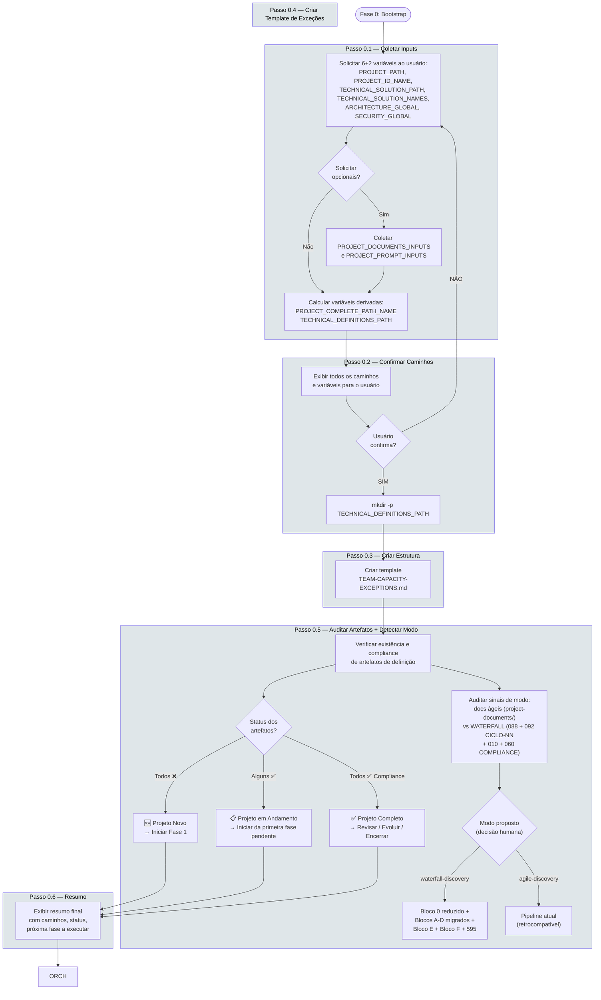

---

## 3. Mecanismo de Orquestração Dinâmica (Loop Trifásico)

Este é o coração do roadmap. **TODAS** as fases 1-19 executam este mesmo loop de validação. As fases especiais (F19 iterativa e EXECUTION-HISTORY) têm tratamento diferenciado (ver seção 6).

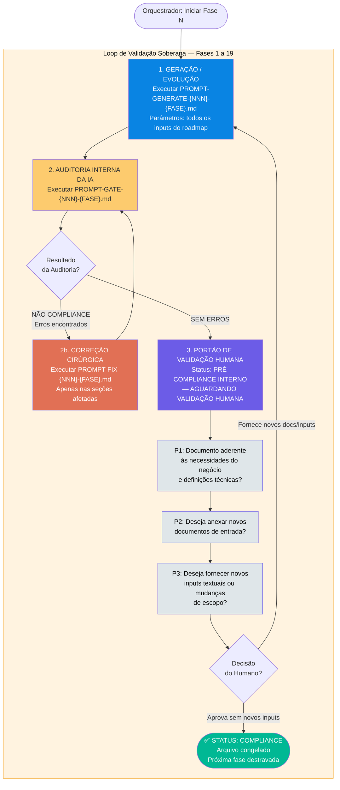

---

## 4. Fases 1-19 — Pipeline Sequencial com Blocos

```mermaid
flowchart TB
    subgraph F1[F1: INTAKE-LOG 🆕]
        direction TB
        F1_GEN[GENERATE<br/>Registro de Ingestão] --> F1_GATE[GATE<br/>Valida lote] --> F1_FIX[FIX<br/>Corrige entradas]
        F1_FIX -.->|loop| F1_GATE
        F1_GATE --> F1_OK[COMPLIANCE ✅]
    end

    subgraph F2[F2: DOR-ASSESSMENT 🆕]
        direction TB
        F2_GEN[GENERATE<br/>Avaliação DoR] --> F2_GATE[GATE<br/>Valida DoR] --> F2_FIX[FIX<br/>Corrige critérios]
        F2_FIX -.->|loop| F2_GATE
        F2_GATE --> F2_OK[COMPLIANCE ✅]
    end

    subgraph F3[F3: PRODUCT-BACKLOG-LIST 🆕]
        direction TB
        F3_GEN[GENERATE<br/>Backlog Consolidado] --> F3_GATE[GATE<br/>Valida backlog] --> F3_FIX[FIX<br/>Corrige itens]
        F3_FIX -.->|loop| F3_GATE
        F3_GATE --> F3_OK[COMPLIANCE ✅]
    end

    subgraph F4[F4: PRD-DEFINITION 🔄]
        direction TB
        F4_GEN[GENERATE<br/>PRD de Negócio] --> F4_GATE[GATE<br/>Valida PRD] --> F4_FIX[FIX<br/>Corrige PRD]
        F4_FIX -.->|loop| F4_GATE
        F4_GATE --> F4_OK[COMPLIANCE ✅]
    end

    subgraph F5[F5: TEAM-SKILLS-MAP]
        direction TB
        F5_GEN[GENERATE<br/>Discovery Team Skills] --> F5_GATE[GATE<br/>Valida skills] --> F5_FIX[FIX<br/>Corrige gaps]
        F5_FIX -.->|loop| F5_GATE
        F5_GATE --> F5_OK[COMPLIANCE ✅]
    end

    subgraph F6[F6: TEAM-CAPACITY]
        direction TB
        F6_GEN[GENERATE<br/>Capacidade] --> F6_GATE[GATE<br/>Valida capacidade vs skills] --> F6_FIX[FIX<br/>Corrige alocação]
        F6_FIX -.->|loop| F6_GATE
        F6_GATE --> F6_OK[COMPLIANCE ✅]
    end

    subgraph F7[F7: ARCHITECTURE]
        direction TB
        F7_GEN[GENERATE<br/>Arquitetura C4+ADRs] --> F7_GATE[GATE<br/>Valida arquitetura] --> F7_FIX[FIX<br/>Corrige ADRs]
        F7_FIX -.->|loop| F7_GATE
        F7_GATE --> F7_OK[COMPLIANCE ✅]
    end

    subgraph F8[F8: SECURITY]
        direction TB
        F8_GEN[GENERATE<br/>Segurança] --> F8_GATE[GATE<br/>Valida segurança] --> F8_FIX[FIX<br/>Corrige controles]
        F8_FIX -.->|loop| F8_GATE
        F8_GATE --> F8_OK[COMPLIANCE ✅]
    end

    subgraph F9[F9: DATA-ARCH 🆕]
        direction TB
        F9_GEN[GENERATE<br/>Modelagem+Storage] --> F9_GATE[GATE<br/>Valida data arch] --> F9_FIX[FIX<br/>Corrige modelo]
        F9_FIX -.->|loop| F9_GATE
        F9_GATE --> F9_OK[COMPLIANCE ✅]
    end

    subgraph F10[F10: DEVOPS-SRE 🆕]
        direction TB
        F10_GEN[GENERATE<br/>CI/CD+Observabilidade] --> F10_GATE[GATE<br/>Valida DevOps/SRE] --> F10_FIX[FIX<br/>Corrige pipeline]
        F10_FIX -.->|loop| F10_GATE
        F10_GATE --> F10_OK[COMPLIANCE ✅]
    end

    subgraph F11[F11: TEST-STRATEGY 🆕]
        direction TB
        F11_GEN[GENERATE<br/>Pirâmide+Automação] --> F11_GATE[GATE<br/>Valida test strategy] --> F11_FIX[FIX<br/>Corrige estratégia]
        F11_FIX -.->|loop| F11_GATE
        F11_GATE --> F11_OK[COMPLIANCE ✅]
    end

    subgraph F12[F12: INFRA-CLOUD 🆕]
        direction TB
        F12_GEN[GENERATE<br/>Topologia+Networking] --> F12_GATE[GATE<br/>Valida infra/cloud] --> F12_FIX[FIX<br/>Corrige topologia]
        F12_FIX -.->|loop| F12_GATE
        F12_GATE --> F12_OK[COMPLIANCE ✅]
    end

    subgraph F13[F13: CATALOG]
        direction TB
        F13_GEN[GENERATE<br/>Catálogo] --> F13_GATE[GATE<br/>Valida catálogo] --> F13_FIX[FIX<br/>Corrige entradas]
        F13_FIX -.->|loop| F13_GATE
        F13_GATE --> F13_OK[COMPLIANCE ✅]
    end

    subgraph F14[F14: MATRIX]
        direction TB
        F14_GEN[GENERATE<br/>Matriz] --> F14_GATE[GATE<br/>Valida matriz] --> F14_FIX[FIX<br/>Corrige matriz]
        F14_FIX -.->|loop| F14_GATE
        F14_GATE --> F14_OK[COMPLIANCE ✅]
    end

    subgraph F15[F15: STACK-MATRIX]
        direction TB
        F15_GEN[GENERATE<br/>Stacks] --> F15_GATE[GATE<br/>Valida stacks] --> F15_FIX[FIX<br/>Corrige stacks]
        F15_FIX -.->|loop| F15_GATE
        F15_GATE --> F15_OK[COMPLIANCE ✅]
    end

    subgraph F16[F16: SPECS-DEFINITION]
        direction TB
        F16_GEN[GENERATE<br/>Consolidação Técnica] --> F16_GATE[GATE<br/>Valida specs] --> F16_FIX[FIX<br/>Corrige specs]
        F16_FIX -.->|loop| F16_GATE
        F16_GATE --> F16_OK[COMPLIANCE ✅]
    end

    subgraph F17[F17: MILESTONES]
        direction TB
        F17_GEN[GENERATE<br/>Milestones] --> F17_GATE[GATE<br/>Valida milestones] --> F17_FIX[FIX<br/>Corrige milestones]
        F17_FIX -.->|loop| F17_GATE
        F17_GATE --> F17_OK[COMPLIANCE ✅]
    end

    subgraph F18[F18: PACKAGE-BACKLOG 🆕]
        direction TB
        F18_GEN[GENERATE<br/>Backlog Refinado] --> F18_GATE[GATE<br/>Valida backlog do ciclo/sprint] --> F18_FIX[FIX<br/>Corrige tarefas]
        F18_FIX -.->|loop| F18_GATE
        F18_GATE --> F18_OK[COMPLIANCE ✅]
    end

    subgraph F19[F19: DISCOVERY TÉCNICO 🆕]
        direction TB
        F19_GEN[GENERATE<br/>Contratos Técnicos] --> F19_GATE[GATE<br/>Valida contratos] --> F19_FIX[FIX<br/>Corrige contratos]
        F19_FIX -.->|loop| F19_GATE
        F19_GATE --> F19_OK[COMPLIANCE ✅]
        F19_OK -.->|iterativo| F19_GEN
    end

    F1_OK --> F2_GEN
    F2_OK --> F3_GEN
    F3_OK --> F4_GEN
    F4_OK -->|⛔ Barreira 0| F5_GEN
    F5_OK --> F6_GEN
    F6_OK -->|⛔ Barreira A| F7_GEN
    F7_OK --> F8_GEN
    F8_OK --> F9_GEN
    F9_OK --> F10_GEN
    F10_OK --> F11_GEN
    F11_OK --> F12_GEN
    F12_OK -->|⛔ Barreira B| F13_GEN
    F13_OK --> F14_GEN
    F14_OK --> F15_GEN
    F15_OK --> F16_GEN
    F16_OK --> F17_GEN
    F17_OK -->|⛔ Barreira C| F18_GEN
    F18_OK --> F19_GEN
    F19_OK -->|⛔ Barreira D| HIST

    style F1 fill:#0984e3,color:#fff
    style F2 fill:#0984e3,color:#fff
    style F3 fill:#0984e3,color:#fff
    style F4 fill:#0984e3,color:#fff
    style F5 fill:#0984e3,color:#fff
    style F6 fill:#0984e3,color:#fff
    style F7 fill:#0984e3,color:#fff
    style F8 fill:#0984e3,color:#fff
    style F9 fill:#0984e3,color:#fff
    style F10 fill:#0984e3,color:#fff
    style F11 fill:#0984e3,color:#fff
    style F12 fill:#0984e3,color:#fff
    style F13 fill:#0984e3,color:#fff
    style F14 fill:#0984e3,color:#fff
    style F15 fill:#0984e3,color:#fff
    style F16 fill:#0984e3,color:#fff
    style F17 fill:#0984e3,color:#fff
    style F18 fill:#0984e3,color:#fff
    style F19 fill:#0984e3,color:#fff
    style HIST fill:#00b894,color:#fff
```

### Artefatos Produzidos por Fase

| Fase | Arquivo Gerado | Conteúdo |
|------|----------------|----------|
| 1 🆕 | `410-INTAKE-LOG.md` | Registro versionado dos lotes de ingestão de requisitos |
| 2 🆕 | `420-DOR-ASSESSMENT.md` | Critérios de Definition of Ready aplicados pelo PO/PM |
| 3 🆕 | `430-PRODUCT-BACKLOG-LIST.md` | Backlog consolidado "Pronto para TI", priorizado |
| 4 🔄 | `440-PRD-DEFINITION.md` | PRD de Negócio — Visão, MVP Global, Glossário |
| 5 | `450-TEAM-SKILLS-MAP.md` | Skills matrix do Discovery Team |
| 6 | `460-TEAM-CAPACITY.md` | Capacidade de trabalho do time (horas/semana) |
| 7 | `470-ARCHITECTURE-DEFINITION.md` | Arquitetura — ADRs, diagramas C4, topologia |
| 8 | `480-SECURITY-DEFINITION.md` | Regras de segurança — threat model, IAM, compliance |
| 9 🆕 | `490-DATA-ARCHITECTURE-DEFINITION.md` | Data Architecture — modelagem, pipelines, storage strategy |
| 10 🆕 | `500-DEVOPS-SRE-DEFINITION.md` | DevOps/SRE — CI/CD, IaC, observabilidade, SLOs |
| 11 🆕 | `510-TEST-STRATEGY-DEFINITION.md` | Test Strategy — pirâmide, automação, performance, SAST/DAST |
| 12 🆕 | `520-INFRA-CLOUD-DEFINITION.md` | Infra/Cloud — topologia, compute, networking, DR |
| 13 | `530-SOLUTIONS-CATALOG.md` | Catálogo completo das soluções técnicas do projeto |
| 14 | `540-SOLUTIONS-MATRIX.md` | Matriz solução×disciplina×owner |
| 15 | `550-SOLUTIONS-STACK-MATRIX.md` | Stack tecnológica de cada solução |
| 16 | `560-SPECS-DEFINITION.md` | Consolidação técnica enxuta (sumariza + referencia) |
| 17 | `570-MILESTONES.md` | Roadmap alinhado ao negócio com milestones |
| 18 🆕 | `technical-discovery/580-PACKAGE-BACKLOG-REFINED.md` | Backlog refinado com tarefas T-NNN → US-ID → Ciclo/Sprint-Alvo → CONTRACTS |
| 19 🆕 | `technical-discovery/590-ciclo-NNN/` | Contratos técnicos por ciclo/sprint (API, Data, Security, SRE, Increments) |
| — | `600-EXECUTION-HISTORY.md` | Dashboard de controle com estado de todos os 20 artefatos |

---

## 5. Arquitetura de Blocos — Pipeline Totalmente Sequencial

Este roadmap adota uma arquitetura de **6 blocos sequenciais** com barreiras de sincronização. **Não há paralelismo** — cada bloco aguarda a conclusão do anterior.

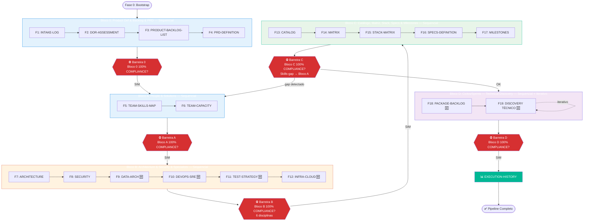

### Regras de Blocos

| Bloco | Fases | Modo | Dispara Quando |
|-------|-------|------|----------------|
| **0** 🆕 | 1, 2, 3, 4 | Sequencial | Imediatamente após Bootstrap |
| **A** | 5, 6 | Sequencial | Barreira 0: Bloco 0 100% COMPLIANCE |
| **B** 🔄 | 7, 8, 9, 10, 11, 12 | Sequencial | Barreira A: Bloco A 100% COMPLIANCE |
| **C** 🔄 | 13, 14, 15, 16, 17 | Sequencial | Barreira B: Bloco B 100% COMPLIANCE |
| **D** 🆕 | 18, 19 | Sequencial (iterativo) | Barreira C: Bloco C 100% COMPLIANCE |
| **History** | — | Standalone | Barreira D: Bloco D 100% COMPLIANCE |

> **Nota:** Diferentemente da v4.0, **não há paralelismo entre blocos**. Cada barreira libera exatamente um bloco seguinte. O fluxo é 100% sequencial.

---

## 6. Fases Especiais — Tratamento Diferenciado

As fases F19 (Discovery Técnico) e EXECUTION-HISTORY não seguem o loop trifásico padrão em sua totalidade.

```mermaid
flowchart TD
    subgraph STANDARD[Fases 1-18: Loop Trifásico Padrão]
        S_GEN[GENERATE] --> S_GATE[GATE] --> S_FIX[FIX]
        S_FIX -.->|loop| S_GATE
        S_GATE --> S_HUMAN[VALIDAÇÃO HUMANA]
        S_HUMAN --> S_COMP[COMPLIANCE ✅]
    end

    subgraph SPECIAL_F19[F19: Discovery Técnico — Iterativo]
        F19_START([F18 COMPLIANCE]) --> F19_GEN[GENERATE<br/>Contratos Técnicos]
        F19_GEN --> F19_GATE[GATE<br/>Auditoria]
        F19_GATE --> F19_FIX[FIX]
        F19_FIX -.->|loop| F19_GATE
        F19_GATE --> F19_HUMAN[VALIDAÇÃO HUMANA]
        F19_HUMAN --> F19_APPROVED[✅ COMPLIANCE]
        F19_APPROVED --> F19_NEXT{Próximo<br/>ciclo/sprint?}
        F19_NEXT -->|SIM| F19_GEN
        F19_NEXT -->|NÃO| F19_DONE
    end

    subgraph SPECIAL_HIST[EXECUTION-HISTORY — Dashboard]
        HIST_START([Barreira D Aprovada]) --> HIST_GEN[GENERATE<br/>Dashboard de Controle]
        HIST_GEN --> HIST_REVIEW[Revisão Humana Direta<br/>Sem gate automatizado]
        HIST_REVIEW --> HIST_DEC{Status<br/>aceitável?}
        HIST_DEC -->|SIM| HIST_DONE([✅ Dashboard atualizado<br/>Pipeline concluído])
        HIST_DEC -->|NÃO| HIST_GEN
    end

    style STANDARD fill:#e3f2fd,stroke:#0984e3,color:#ffffff
    style SPECIAL_F19 fill:#fff3e0,stroke:#fdcb6e,color:#ffffff
    style SPECIAL_HIST fill:#e8f5e9,stroke:#00b894,color:#ffffff
```

| Fase | Mecanismo | Motivo |
|------|-----------|--------|
| **F19** 🆕 | Generate → Gate → Fix → COMPLIANCE (loop iterativo por ciclo/sprint) | Discovery Técnico contínuo — ao final de cada sprint, orquestrador pergunta se continua |
| **EXECUTION-HISTORY** | Generate → Revisão humana (sem Gate/Fix) | Dashboard de controle consolidado — atualizado incrementalmente após cada fase |

---

## 7. Diagrama de Estados — Visão Unificada

```mermaid
stateDiagram-v2
    [*] --> Bootstrap: Início das Definições Técnicas

    state Bootstrap {
        [*] --> ColetarInputs
        ColetarInputs --> ColetarOpcionais: 6 inputs obrigatórios
        ColetarOpcionais --> ConfirmarCaminhos: inputs coletados
        ConfirmarCaminhos --> ColetarInputs: NÃO confirma
        ConfirmarCaminhos --> CriarEstrutura: SIM confirma
        CriarEstrutura --> CriarTemplateExcecoes
        CriarTemplateExcecoes --> AuditarArtefatos
        AuditarArtefatos --> ResumoInicial
    }

    Bootstrap --> Bloco0_F1

    state Bloco0_F1 {
        [*] --> F1_Gen
        F1_Gen --> F1_Gate
        F1_Gate --> F1_Fix: NÃO COMPLIANCE
        F1_Fix --> F1_Gate
        F1_Gate --> F1_Human: SEM ERROS
        F1_Human --> F1_Gen: Novos inputs
        F1_Human --> F1_Done: Aprovado
    }

    Bloco0_F1 --> Bloco0_F2: COMPLIANCE

    state Bloco0_F2 {
        [*] --> F2_Gen
        F2_Gen --> F2_Gate
        F2_Gate --> F2_Fix: NÃO COMPLIANCE
        F2_Fix --> F2_Gate
        F2_Gate --> F2_Human: SEM ERROS
        F2_Human --> F2_Gen: Novos inputs
        F2_Human --> F2_Done: Aprovado
    }

    Bloco0_F2 --> Bloco0_F3: COMPLIANCE

    state Bloco0_F3 {
        [*] --> F3_Gen
        F3_Gen --> F3_Gate
        F3_Gate --> F3_Fix: NÃO COMPLIANCE
        F3_Fix --> F3_Gate
        F3_Gate --> F3_Human: SEM ERROS
        F3_Human --> F3_Gen: Novos inputs
        F3_Human --> F3_Done: Aprovado
    }

    Bloco0_F3 --> Bloco0_F4: COMPLIANCE

    state Bloco0_F4 {
        [*] --> F4_Gen
        F4_Gen --> F4_Gate
        F4_Gate --> F4_Fix: NÃO COMPLIANCE
        F4_Fix --> F4_Gate
        F4_Gate --> F4_Human: SEM ERROS
        F4_Human --> F4_Gen: Novos inputs
        F4_Human --> F4_Done: Aprovado
    }

    Bloco0_F4 --> Barreira0: COMPLIANCE

    state Barreira0 {
        [*] --> Check0
        Check0 --> Bloco0_F1: Bloco 0 incompleto
        Check0 --> BlocoA_F5: Bloco 0 100% OK
    }

    Barreira0 --> BlocoA_F5

    state BlocoA_F5 {
        [*] --> F5_Gen
        F5_Gen --> F5_Gate
        F5_Gate --> F5_Fix: NÃO COMPLIANCE
        F5_Fix --> F5_Gate
        F5_Gate --> F5_Human: SEM ERROS
        F5_Human --> F5_Gen: Novos inputs
        F5_Human --> F5_Done: Aprovado
    }

    BlocoA_F5 --> BlocoA_F6: COMPLIANCE

    state BlocoA_F6 {
        [*] --> F6_Gen
        F6_Gen --> F6_Gate
        F6_Gate --> F6_Fix: NÃO COMPLIANCE
        F6_Fix --> F6_Gate
        F6_Gate --> F6_Human: SEM ERROS
        F6_Human --> F6_Gen: Novos inputs
        F6_Human --> F6_Done: Aprovado
    }

    BlocoA_F6 --> BarreiraA: COMPLIANCE

    state BarreiraA {
        [*] --> CheckA
        CheckA --> BlocoA_F5: Bloco A incompleto
        CheckA --> BlocoB_F7: Bloco A 100% OK
    }

    BarreiraA --> BlocoB_F7

    state BlocoB_F7 {
        [*] --> F7_Gen
        F7_Gen --> F7_Gate
        F7_Gate --> F7_Fix: NÃO COMPLIANCE
        F7_Fix --> F7_Gate
        F7_Gate --> F7_Human: SEM ERROS
        F7_Human --> F7_Gen: Novos inputs
        F7_Human --> F7_Done: Aprovado
    }

    BlocoB_F7 --> BlocoB_F8: COMPLIANCE

    state BlocoB_F8 {
        [*] --> F8_Gen
        F8_Gen --> F8_Gate
        F8_Gate --> F8_Fix: NÃO COMPLIANCE
        F8_Fix --> F8_Gate
        F8_Gate --> F8_Human: SEM ERROS
        F8_Human --> F8_Gen: Novos inputs
        F8_Human --> F8_Done: Aprovado
    }

    BlocoB_F8 --> BlocoB_F9: COMPLIANCE

    state BlocoB_F9 {
        [*] --> F9_Gen
        F9_Gen --> F9_Gate
        F9_Gate --> F9_Fix: NÃO COMPLIANCE
        F9_Fix --> F9_Gate
        F9_Gate --> F9_Human: SEM ERROS
        F9_Human --> F9_Gen: Novos inputs
        F9_Human --> F9_Done: Aprovado
    }

    BlocoB_F9 --> BlocoB_F10: COMPLIANCE

    state BlocoB_F10 {
        [*] --> F10_Gen
        F10_Gen --> F10_Gate
        F10_Gate --> F10_Fix: NÃO COMPLIANCE
        F10_Fix --> F10_Gate
        F10_Gate --> F10_Human: SEM ERROS
        F10_Human --> F10_Gen: Novos inputs
        F10_Human --> F10_Done: Aprovado
    }

    BlocoB_F10 --> BlocoB_F11: COMPLIANCE

    state BlocoB_F11 {
        [*] --> F11_Gen
        F11_Gen --> F11_Gate
        F11_Gate --> F11_Fix: NÃO COMPLIANCE
        F11_Fix --> F11_Gate
        F11_Gate --> F11_Human: SEM ERROS
        F11_Human --> F11_Gen: Novos inputs
        F11_Human --> F11_Done: Aprovado
    }

    BlocoB_F11 --> BlocoB_F12: COMPLIANCE

    state BlocoB_F12 {
        [*] --> F12_Gen
        F12_Gen --> F12_Gate
        F12_Gate --> F12_Fix: NÃO COMPLIANCE
        F12_Fix --> F12_Gate
        F12_Gate --> F12_Human: SEM ERROS
        F12_Human --> F12_Gen: Novos inputs
        F12_Human --> F12_Done: Aprovado
    }

    BlocoB_F12 --> BarreiraB: COMPLIANCE

    state BarreiraB {
        [*] --> CheckB
        CheckB --> BlocoB_F7: Bloco B incompleto
        CheckB --> BlocoC_F13: Bloco B 100% OK
    }

    BarreiraB --> BlocoC_F13

    state BlocoC_F13 {
        [*] --> F13_Gen
        F13_Gen --> F13_Gate
        F13_Gate --> F13_Fix: NÃO COMPLIANCE
        F13_Fix --> F13_Gate
        F13_Gate --> F13_Human: SEM ERROS
        F13_Human --> F13_Gen: Novos inputs
        F13_Human --> F13_Done: Aprovado
    }

    BlocoC_F13 --> BlocoC_F14: COMPLIANCE

    state BlocoC_F14 {
        [*] --> F14_Gen
        F14_Gen --> F14_Gate
        F14_Gate --> F14_Fix: NÃO COMPLIANCE
        F14_Fix --> F14_Gate
        F14_Gate --> F14_Human: SEM ERROS
        F14_Human --> F14_Gen: Novos inputs
        F14_Human --> F14_Done: Aprovado
    }

    BlocoC_F14 --> BlocoC_F15: COMPLIANCE

    state BlocoC_F15 {
        [*] --> F15_Gen
        F15_Gen --> F15_Gate
        F15_Gate --> F15_Fix: NÃO COMPLIANCE
        F15_Fix --> F15_Gate
        F15_Gate --> F15_Human: SEM ERROS
        F15_Human --> F15_Gen: Novos inputs
        F15_Human --> F15_Done: Aprovado
    }

    BlocoC_F15 --> BlocoC_F16: COMPLIANCE

    state BlocoC_F16 {
        [*] --> F16_Gen
        F16_Gen --> F16_Gate
        F16_Gate --> F16_Fix: NÃO COMPLIANCE
        F16_Fix --> F16_Gate
        F16_Gate --> F16_Human: SEM ERROS
        F16_Human --> F16_Gen: Novos inputs
        F16_Human --> F16_Done: Aprovado
    }

    BlocoC_F16 --> BlocoC_F17: COMPLIANCE

    state BlocoC_F17 {
        [*] --> F17_Gen
        F17_Gen --> F17_Gate
        F17_Gate --> F17_Fix: NÃO COMPLIANCE
        F17_Fix --> F17_Gate
        F17_Gate --> F17_Human: SEM ERROS
        F17_Human --> F17_Gen: Novos inputs
        F17_Human --> F17_Done: Aprovado
    }

    BlocoC_F17 --> BarreiraC: COMPLIANCE

    state BarreiraC {
        [*] --> CheckC
        CheckC --> BlocoC_F13: Bloco C incompleto
        CheckC --> CheckGap: Bloco C 100% OK
        CheckGap --> BlocoA_F5: Skills gap detectado
        CheckGap --> BlocoD_F18: Sem gaps
    }

    BarreiraC --> BlocoD_F18

    state BlocoD_F18 {
        [*] --> F18_Gen
        F18_Gen --> F18_Gate
        F18_Gate --> F18_Fix: NÃO COMPLIANCE
        F18_Fix --> F18_Gate
        F18_Gate --> F18_Human: SEM ERROS
        F18_Human --> F18_Gen: Novos inputs
        F18_Human --> F18_Done: Aprovado
    }

    BlocoD_F18 --> BlocoD_F19: COMPLIANCE

    state BlocoD_F19 {
        [*] --> F19_Gen
        F19_Gen --> F19_Gate
        F19_Gate --> F19_Fix: NÃO COMPLIANCE
        F19_Fix --> F19_Gate
        F19_Gate --> F19_Human: SEM ERROS
        F19_Human --> F19_Gen: Novos inputs
        F19_Human --> F19_Done: Aprovado
        F19_Done --> F19_Next: Ciclo/sprint concluído
        F19_Next --> F19_Gen: Continuar próximo ciclo/sprint
        F19_Next --> BarreiraD: Encerrar discovery
    }

    BarreiraD --> ExecutionHistory

    state ExecutionHistory {
        [*] --> HIST_Gen
        HIST_Gen --> HIST_Review
        HIST_Review --> HIST_Gen: Ajustes solicitados
        HIST_Review --> HIST_Done: OK
    }

    ExecutionHistory --> [*]: ✅ Pipeline Completo
```

---

## 8. Matriz de Consistência — Validação Cruzada entre Artefatos

Diferentemente dos roadmaps de negócio e soluções técnicas, este roadmap valida a **consistência horizontal** entre todos os artefatos de definição.

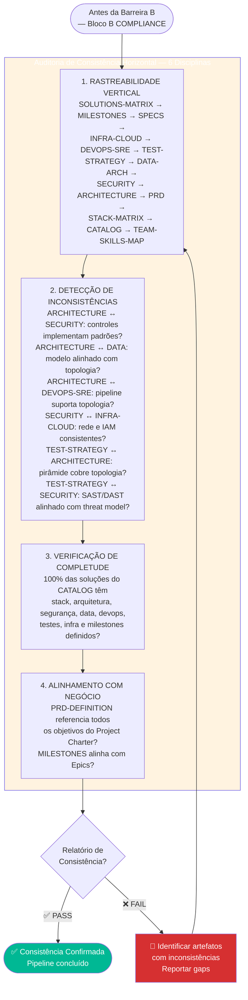

---

## 9. Integração com os Demais Roadmaps

Este roadmap preenche o **gap entre negócio e implementação**, conectando-se a dois outros pipelines. O **Bloco 0** é a ponte formal de entrada dos documentos de negócio.

```mermaid
flowchart LR
    subgraph NEGOCIO[Roadmap de Documentos de Negócio]
        direction TB
        N1[Project Charter] --> N2[BRD] --> N3[Epics] --> N4[Features] --> N5[User Stories + RTM]
    end

    subgraph DEFS[Roadmap de Definições Técnicas — Este Documento]
        direction TB
        D0[Fase 0: Bootstrap] --> D_BLOCOS[Bloco 0 → A → B → C → D]
        D_BLOCOS --> D_OUT[20 artefatos + technical-discovery/ + history]
    end

    subgraph TEC[Roadmap de Soluções Técnicas]
        direction TB
        T1[PRD.md] --> T2[ARCHITECTURE.md] --> T3[SECURITY.md] --> T4[SPECS.md] --> T5[TASKS.md] --> T6[TEST_PLAN.md]
    end

    N5 -->|"📥 Alimenta Bloco 0<br/>(INTAKE-LOG, DoR, Backlog)"| DEFS
    D_OUT -->|"📤 Baseline para<br/>cada solução técnica"| T1

    style NEGOCIO fill:#e3f2fd,stroke:#0984e3,color:#ffffff
    style DEFS fill:#fff3e0,stroke:#e17055,color:#ffffff
    style TEC fill:#e8f5e9,stroke:#00b894,color:#ffffff
```

### Contrato da FASE 5 WATERFALL — PM/PO × TECHLEAD (modo waterfall-discovery)

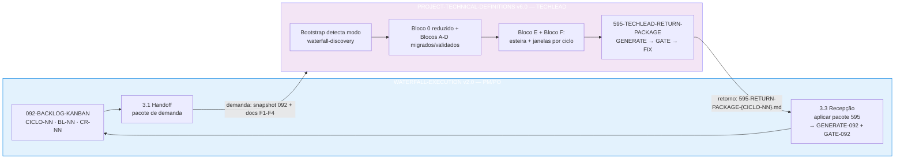

### Posicionamento na Cadeia de Valor

| Roadmap | Nível | Output | Consumido por |
|---------|-------|--------|---------------|
| **Project Documents** | Estratégico / Negócio | Charter, BRD, Epics, Features, US, RTM | → Definições Técnicas (Bloco 0) |
| **Technical Definitions** ← | Tático / Projeto | 20 artefatos + `technical-discovery/` + EXECUTION-HISTORY | → Soluções Técnicas |
| **Technical Solutions** | Tático / Implementação | PRD, ARCH, SEC, SPECS, TASKS, TEST_PLAN | → Times de Desenvolvimento |
| **WATERFALL-EXECUTION v2.0 (FASE 5)** | Operacional / PM-PO | 092/093 + pacote de demanda (CICLO-NN + docs F1–F4) | → Definições Técnicas (modo waterfall-discovery) |

---

## 10. Tabela de Símbolos e Convenções

| Símbolo/Cor | Significado |
|-------------|-------------|
| 🟣 Roxo (`#6c5ce7`) | Bootstrap / Validação Humana |
| 🔵 Azul (`#0984e3`) | Fases de Geração padrão (1-19) |
| 🟠 Laranja (`#e17055`) | Correções (FIX) / Alertas |
| 🟢 Verde (`#00b894`) | Compliance / EXECUTION-HISTORY / Pipeline concluído |
| 🟡 Amarelo (`#fdcb6e`) | Auditoria Interna (Gate) |
| 🔴 Vermelho (`#d63031`) | Barreiras de bloqueio (0, A, B, C, D) / Falhas |
| 🔲 Linha tracejada (`-.->`) | Loop de retrabalho (GATE→FIX→GATE) / Iterativo (F19) |
| 🔲 Linha sólida (`-->`) | Fluxo sequencial normal |
| 🆕 | Fase nova na v5.0 |
| 🔄 | Fase movida / repropositada |
| ⛔ | Barreira de bloqueio |
| ⚡ | Fase especial (não segue loop trifásico) |
| 📊 | Fase de documentação/controle |

---

## 11. Regras de Gating (Resumo Visual)

```mermaid
flowchart LR
    subgraph GATING["Regras Críticas de Bloqueio — Technical Definitions v7.0"]
        G1["⛔ Nenhuma fase<br/>avança sem<br/>COMPLIANCE humano"]
        G2["⛔ Barreira 0 —<br/>Bloco 0 100% antes<br/>do Bloco A"]
        G3["⛔ Barreira A —<br/>Bloco A 100% antes<br/>do Bloco B"]
        G4["⛔ Barreira B —<br/>6 disciplinas 100%<br/>antes do Bloco C"]
        G5["⛔ Barreira C —<br/>Skills-gap detection<br/>→ pode reabrir Bloco A"]
        G6["⛔ Barreira D —<br/>100% US com contratos<br/>antes do History"]
        G7["⛔ Modo waterfall —<br/>TECHLEAD propõe,<br/>PM/PO aplica"]
        G8["⛔ Janelas —<br/>HITL por transição<br/>(096 + Bloco F)"]
    end

    style G1 fill:#d63031,color:#fff
    style G2 fill:#d63031,color:#fff
    style G3 fill:#d63031,color:#fff
    style G4 fill:#d63031,color:#fff
    style G5 fill:#d63031,color:#fff
    style G6 fill:#d63031,color:#fff
    style G7 fill:#d63031,color:#fff
    style G8 fill:#d63031,color:#fff
```

---

> **📁 Arquivos relacionados:**
> - `PROMPT-ROADMAP-GENERATE-PROJECT-TECHNICAL-DEFINITIONS.md` — Documento fonte (v6.0)
> - `../PROMPT-ROADMAP-GENERATE-WATERFALL-EXECUTION.md` — Parceria PM/PO × TECHLEAD na FASE 5 do WATERFALL (v2.0)
> - `../project-documents/FLOWCHART-ROADMAP-GENERATE-PROJECT-DOCUMENTS.md` — Visualização do roadmap de negócio
> - `../technical-solutions/FLOWCHART-ROADMAP-GENERATE-TECHNICAL_SOLUTIONS.md` — Visualização do roadmap técnico
> - `PROMPT-GENERATE-{NNN}-*.md` — 21 prompts geradores (fases 1-19 + 595 + EXECUTION-HISTORY)
> - `PROMPT-GATE-{NNN}-*.md` — 20 prompts de auditoria (fases 1-19 + 595)
> - `PROMPT-FIX-{NNN}-*.md` — 20 prompts de correção (fases 1-19 + 595)
> - Especialistas reusados (sprint-tecnhnical-implementation/): `PROMPT-EXECUTE-CI-CD-PIPELINE`, `PROMPT-EXECUTE-CVE-SCA-SCAN`, `PROMPT-EXECUTE-STRESS-PERFORMANCE-TEST` (steps 3a/3b/4a do Bloco E)
> - Roadmap companion: `PROMPT-ROADMAP-GENERATE-IMPLEMENTATION-TOOLING.md` v1.0 (trios 610/620/630/640 em `implementation-tooling/` — invocado pelo Bloco F)
