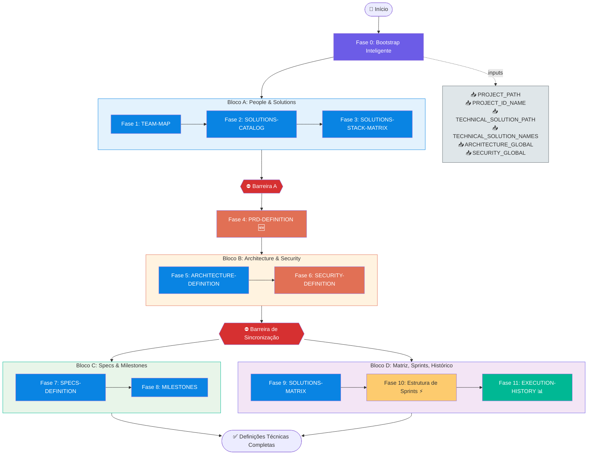
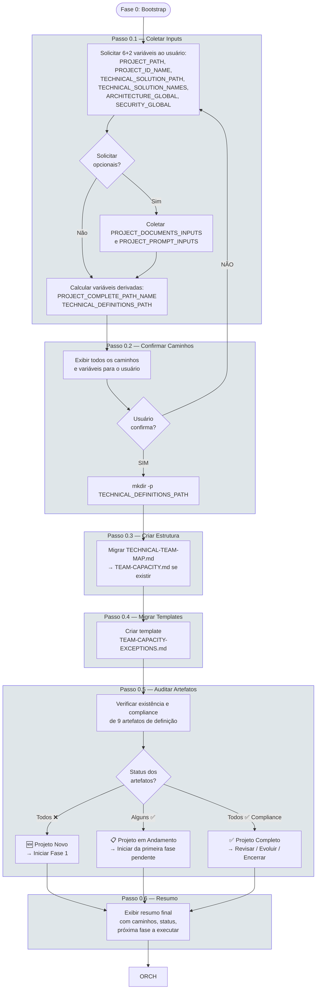
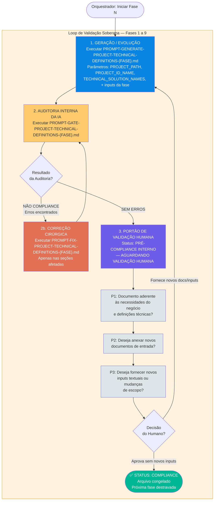
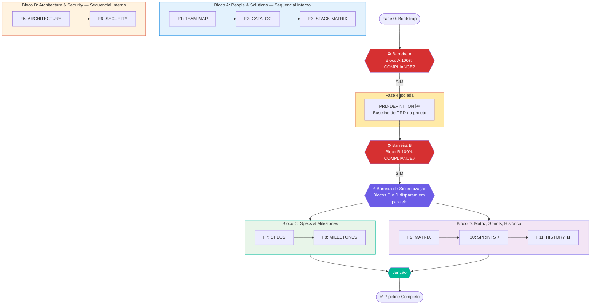
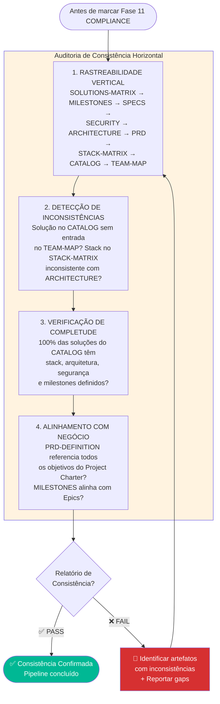
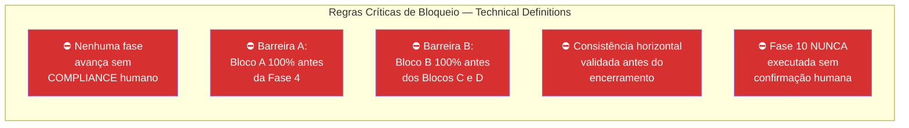

# FLOWCHART: ROADMAP DE DEFINIÇÕES TÉCNICAS DO PROJETO

## Versão: 1.0 — Visualização Gráfica do Pipeline de Definições Técnicas

> **Documento de referência:** `PROMPT-ROADMAP-GENERATE-PROJECT-TECHNICAL-DEFINITIONS.md` v1.0
>
> Este documento complementa o roadmap textual com diagramas Mermaid que visualizam o fluxo de execução, a arquitetura de blocos com barreiras de sincronização, o mecanismo de orquestração e as regras de gating.

---

## 1. Visão Macro do Pipeline Completo

---

## 2. Fase 0 — Bootstrap Inteligente (Detalhado)

---

## 3. Mecanismo de Orquestração Dinâmica (Loop Trifásico)

Este é o coração do roadmap. **TODAS** as fases 1-9 executam este mesmo loop de validação. As fases 10 e 11 têm tratamento especial (ver seção 5).

---

## 4. Fases 1-9 — Pipeline Sequencial com Blocos e Dependências

```mermaid
flowchart LR
    subgraph F1[Fase 1: TEAM-MAP]
        direction TB
        F1_GEN[GENERATE<br/>Skills Matrix] --> F1_GATE[GATE<br/>Valida skills] --> F1_FIX[FIX<br/>Corrige gaps]
        F1_FIX -.->|loop| F1_GATE
        F1_GATE --> F1_OK[COMPLIANCE ✅]
    end

    subgraph F2[Fase 2: SOLUTIONS-CATALOG]
        direction TB
        F2_GEN[GENERATE<br/>Catálogo] --> F2_GATE[GATE<br/>Valida catálogo] --> F2_FIX[FIX<br/>Corrige entradas]
        F2_FIX -.->|loop| F2_GATE
        F2_GATE --> F2_OK[COMPLIANCE ✅]
    end

    subgraph F3[Fase 3: STACK-MATRIX]
        direction TB
        F3_GEN[GENERATE<br/>Stacks] --> F3_GATE[GATE<br/>Valida stacks] --> F3_FIX[FIX<br/>Corrige stacks]
        F3_FIX -.->|loop| F3_GATE
        F3_GATE --> F3_OK[COMPLIANCE ✅]
    end

    subgraph F4[Fase 4: PRD-DEFINITION 🆕]
        direction TB
        F4_GEN[GENERATE<br/>Baseline PRD] --> F4_GATE[GATE<br/>Valida PRD] --> F4_FIX[FIX<br/>Corrige PRD]
        F4_FIX -.->|loop| F4_GATE
        F4_GATE --> F4_OK[COMPLIANCE ✅]
    end

    subgraph F5[Fase 5: ARCHITECTURE-DEFINITION]
        direction TB
        F5_GEN[GENERATE<br/>Integração] --> F5_GATE[GATE<br/>Valida arquitetura] --> F5_FIX[FIX<br/>Corrige ADRs]
        F5_FIX -.->|loop| F5_GATE
        F5_GATE --> F5_OK[COMPLIANCE ✅]
    end

    subgraph F6[Fase 6: SECURITY-DEFINITION]
        direction TB
        F6_GEN[GENERATE<br/>Segurança] --> F6_GATE[GATE<br/>Valida segurança] --> F6_FIX[FIX<br/>Corrige controles]
        F6_FIX -.->|loop| F6_GATE
        F6_GATE --> F6_OK[COMPLIANCE ✅]
    end

    subgraph F7[Fase 7: SPECS-DEFINITION]
        direction TB
        F7_GEN[GENERATE<br/>Especificações] --> F7_GATE[GATE<br/>Valida specs] --> F7_FIX[FIX<br/>Corrige specs]
        F7_FIX -.->|loop| F7_GATE
        F7_GATE --> F7_OK[COMPLIANCE ✅]
    end

    subgraph F8[Fase 8: MILESTONES]
        direction TB
        F8_GEN[GENERATE<br/>Roadmap] --> F8_GATE[GATE<br/>Valida milestones] --> F8_FIX[FIX<br/>Corrige milestones]
        F8_FIX -.->|loop| F8_GATE
        F8_GATE --> F8_OK[COMPLIANCE ✅]
    end

    subgraph F9[Fase 9: SOLUTIONS-MATRIX]
        direction TB
        F9_GEN[GENERATE<br/>Matriz] --> F9_GATE[GATE<br/>Valida matriz] --> F9_FIX[FIX<br/>Corrige matriz]
        F9_FIX -.->|loop| F9_GATE
        F9_GATE --> F9_OK[COMPLIANCE ✅]
    end

    F1_OK -->|destrava| F2_GEN
    F2_OK -->|destrava| F3_GEN
    F3_OK -->|barreira A| F4_GEN
    F4_OK -->|destrava| F5_GEN
    F5_OK -->|destrava| F6_GEN
    F6_OK -->|barreira sinc.| F7_GEN
    F6_OK -->|barreira sinc.| F9_GEN
    F7_OK -->|destrava| F8_GEN
    F9_OK -->|destrava| F10_ACTION

    F1 --> I1[📥 TEAM-CAPACITY.md<br/>+ Exceções]
    F2 --> I2[📥 TEAM-MAP.md<br/>+ TECHNICAL_SOLUTION_NAMES]
    F3 --> I3[📥 SOLUTIONS-CATALOG.md<br/>+ Stack definitions]
    F4 --> I4[📥 STACK-MATRIX.md<br/>+ Project Documents]
    F5 --> I5[📥 PRD-DEFINITION.md<br/>+ ARCHITECTURE_GLOBAL]
    F6 --> I6[📥 ARCHITECTURE-DEFINITION.md<br/>+ SECURITY_GLOBAL]
    F7 --> I7[📥 PRD + ARCH + SEC<br/>+ Stack definitions]
    F8 --> I8[📥 SPECS-DEFINITION.md<br/>+ Project Charter]
    F9 --> I9[📥 Todos os artefatos<br/>dos Blocos A e B]

    style F1 fill:#0984e3,color:#fff
    style F2 fill:#0984e3,color:#fff
    style F3 fill:#0984e3,color:#fff
    style F4 fill:#e17055,color:#fff
    style F5 fill:#0984e3,color:#fff
    style F6 fill:#e17055,color:#fff
    style F7 fill:#0984e3,color:#fff
    style F8 fill:#0984e3,color:#fff
    style F9 fill:#0984e3,color:#fff
```

### Artefatos Produzidos por Fase

| Fase | Arquivo Gerado | Conteúdo |
|------|----------------|----------|
| 1 | `PROJECT-TECHNICAL-DEFINITIONS-TEAM-MAP.md` | Skills matrix do time, papéis e responsabilidades técnicas |
| 2 | `PROJECT-TECHNICAL-DEFINITIONS-SOLUTIONS-CATALOG.md` | Catálogo completo das soluções técnicas do projeto |
| 3 | `PROJECT-TECHNICAL-DEFINITIONS-SOLUTIONS-STACK-MATRIX.md` | Stack tecnológica de cada solução |
| 4 | `PROJECT-TECHNICAL-DEFINITIONS-PRD-DEFINITION.md` | Baseline de PRD consolidando requisitos de negócio |
| 5 | `PROJECT-TECHNICAL-DEFINITIONS-ARCHITECTURE-DEFINITION.md` | Como as soluções se integram (ADRs, diagramas C4) |
| 6 | `PROJECT-TECHNICAL-DEFINITIONS-SECURITY-DEFINITION.md` | Regras de segurança transversais do projeto |
| 7 | `PROJECT-TECHNICAL-DEFINITIONS-SPECS-DEFINITION.md` | Baseline de especificações técnicas |
| 8 | `PROJECT-TECHNICAL-DEFINITIONS-MILESTONES.md` | Roadmap alinhado ao negócio com milestones |
| 9 | `PROJECT-TECHNICAL-DEFINITIONS-SOLUTIONS-MATRIX.md` | Matriz consolidada solução×stack×owner |
| 10 | `sprints/` (estrutura de pastas) | Pastas de sprint criadas em cada solução técnica |
| 11 | `PROJECT-TECHNICAL-DEFINITIONS-EXECUTION-HISTORY.md` | Dashboard de controle com estado de todos os documentos |

---

## 5. Arquitetura de Blocos e Regras de Paralelismo

Este roadmap introduz uma arquitetura de **5 blocos com barreiras de sincronização**, diferentemente dos pipelines puramente sequenciais.

### Regras de Paralelismo

| Bloco | Fases | Modo | Dispara Quando |
|-------|-------|------|----------------|
| **A** | 1, 2, 3 | Sequencial | Imediatamente após Bootstrap |
| **—** | 4 | Isolada | Barreira A: Bloco A 100% COMPLIANCE |
| **B** | 5, 6 | Sequencial | Fase 4 COMPLIANCE |
| **C** | 7, 8 | Sequencial | Barreira de Sincronização (Bloco B 100%) |
| **D** | 9, 10, 11 | Sequencial | Barreira de Sincronização (Bloco B 100%) |
| **C ∥ D** | — | **Paralelo** | Blocos C e D disparam simultaneamente |

---

## 6. Fases Especiais — Tratamento Diferenciado

As fases 10 e 11 não seguem o loop trifásico padrão (Generate→Gate→Fix).

```mermaid
flowchart TD
    subgraph STANDARD[Fases 1-9: Loop Trifásico Padrão]
        S_GEN[GENERATE] --> S_GATE[GATE] --> S_FIX[FIX]
        S_FIX -.->|loop| S_GATE
        S_GATE --> S_HUMAN[VALIDAÇÃO HUMANA]
        S_HUMAN --> S_COMP[COMPLIANCE ✅]
    end

    subgraph SPECIAL_10[Fase 10: Criação de Sprints — Ação Direta]
        F10_START([Fase 9 COMPLIANCE]) --> F10_PROP[Orquestrador exibe<br/>estrutura de pastas proposta<br/>para cada TECHNICAL_SOLUTION_NAME]
        F10_PROP --> F10_CONF{Usuário<br/>confirma?}
        F10_CONF -->|SIM| F10_EXEC["Bash: mkdir -p em cada<br/>solução técnica"]
        F10_CONF -->|NÃO| F10_ADJUST[Ajustar proposta<br/>conforme feedback]
        F10_ADJUST --> F10_PROP
        F10_EXEC --> F10_DONE([✅ Estrutura criada<br/>→ Destrava Fase 11])
    end

    subgraph SPECIAL_11[Fase 11: Execution History — Dashboard]
        F11_START([Fase 10 concluída]) --> F11_GEN[GENERATE<br/>PROMPT-GENERATE-...-EXECUTION-HISTORY.md]
        F11_GEN --> F11_REVIEW[Revisão Humana Direta<br/>Sem gate automatizado]
        F11_REVIEW --> F11_DEC{Status<br/>aceitável?}
        F11_DEC -->|SIM| F11_DONE([✅ Dashboard atualizado<br/>Pipeline concluído])
        F11_DEC -->|NÃO| F11_GEN
    end

    style STANDARD fill:#e3f2fd,stroke:#0984e3
    style SPECIAL_10 fill:#fff3e0,stroke:#fdcb6e
    style SPECIAL_11 fill:#e8f5e9,stroke:#00b894
```

| Fase | Mecanismo | Motivo |
|------|-----------|--------|
| **10** | Ação Bash direta com confirmação humana | Operação de filesystem, sem artefato documental para auditar |
| **11** | Generate → Revisão humana (sem Gate/Fix) | Dashboard de controle atualizado incrementalmente após cada fase |

---

## 7. Diagrama de Estados — Visão Unificada

```mermaid
stateDiagram-v2
    [*] --> Bootstrap: Início das Definições Técnicas

    state Bootstrap {
        [*] --> ColetarInputs
        ColetarInputs --> ColetarOpcionais: 6 inputs obrigatórios
        ColetarOpcionais --> ConfirmarCaminhos: inputs coletados
        ConfirmarCaminhos --> ColetarInputs: NÃO confirma
        ConfirmarCaminhos --> CriarEstrutura: SIM confirma
        CriarEstrutura --> MigrarTemplates
        MigrarTemplates --> AuditarArtefatos
        AuditarArtefatos --> ResumoInicial
    }

    Bootstrap --> BlocoA_F1

    state BlocoA_F1 {
        [*] --> F1_Gen
        F1_Gen --> F1_Gate
        F1_Gate --> F1_Fix: NÃO COMPLIANCE
        F1_Fix --> F1_Gate
        F1_Gate --> F1_Human: SEM ERROS
        F1_Human --> F1_Gen: Novos inputs
        F1_Human --> F1_Done: Aprovado
    }

    BlocoA_F1 --> BlocoA_F2: COMPLIANCE

    state BlocoA_F2 {
        [*] --> F2_Gen
        F2_Gen --> F2_Gate
        F2_Gate --> F2_Fix: NÃO COMPLIANCE
        F2_Fix --> F2_Gate
        F2_Gate --> F2_Human: SEM ERROS
        F2_Human --> F2_Gen: Novos inputs
        F2_Human --> F2_Done: Aprovado
    }

    BlocoA_F2 --> BlocoA_F3: COMPLIANCE

    state BlocoA_F3 {
        [*] --> F3_Gen
        F3_Gen --> F3_Gate
        F3_Gate --> F3_Fix: NÃO COMPLIANCE
        F3_Fix --> F3_Gate
        F3_Gate --> F3_Human: SEM ERROS
        F3_Human --> F3_Gen: Novos inputs
        F3_Human --> F3_Done: Aprovado
    }

    BlocoA_F3 --> BarreiraA: COMPLIANCE

    state BarreiraA {
        [*] --> CheckA
        CheckA --> BlocoA_F1: Bloco A incompleto
        CheckA --> Fase4_PRD: Bloco A 100% OK
    }

    BarreiraA --> Fase4_PRD

    state Fase4_PRD {
        [*] --> F4_Gen
        F4_Gen --> F4_Gate
        F4_Gate --> F4_Fix: NÃO COMPLIANCE
        F4_Fix --> F4_Gate
        F4_Gate --> F4_Human: SEM ERROS
        F4_Human --> F4_Gen: Novos inputs
        F4_Human --> F4_Done: Aprovado
    }

    Fase4_PRD --> BlocoB_F5: COMPLIANCE

    state BlocoB_F5 {
        [*] --> F5_Gen
        F5_Gen --> F5_Gate
        F5_Gate --> F5_Fix: NÃO COMPLIANCE
        F5_Fix --> F5_Gate
        F5_Gate --> F5_Human: SEM ERROS
        F5_Human --> F5_Gen: Novos inputs
        F5_Human --> F5_Done: Aprovado
    }

    BlocoB_F5 --> BlocoB_F6: COMPLIANCE

    state BlocoB_F6 {
        [*] --> F6_Gen
        F6_Gen --> F6_Gate
        F6_Gate --> F6_Fix: NÃO COMPLIANCE
        F6_Fix --> F6_Gate
        F6_Gate --> F6_Human: SEM ERROS
        F6_Human --> F6_Gen: Novos inputs
        F6_Human --> F6_Done: Aprovado
    }

    BlocoB_F6 --> BarreiraSync: COMPLIANCE

    state BarreiraSync {
        [*] --> CheckSync
        CheckSync --> BlocoB_F5: Bloco B incompleto
        CheckSync --> Fork: Bloco B 100% OK
    }

    BarreiraSync --> BlocoC_F7
    BarreiraSync --> BlocoD_F9

    state BlocoC_F7 {
        [*] --> F7_Gen
        F7_Gen --> F7_Gate
        F7_Gate --> F7_Fix: NÃO COMPLIANCE
        F7_Fix --> F7_Gate
        F7_Gate --> F7_Human: SEM ERROS
        F7_Human --> F7_Gen: Novos inputs
        F7_Human --> F7_Done: Aprovado
    }

    BlocoC_F7 --> BlocoC_F8: COMPLIANCE

    state BlocoC_F8 {
        [*] --> F8_Gen
        F8_Gen --> F8_Gate
        F8_Gate --> F8_Fix: NÃO COMPLIANCE
        F8_Fix --> F8_Gate
        F8_Gate --> F8_Human: SEM ERROS
        F8_Human --> F8_Gen: Novos inputs
        F8_Human --> F8_Done: Aprovado
    }

    state BlocoD_F9 {
        [*] --> F9_Gen
        F9_Gen --> F9_Gate
        F9_Gate --> F9_Fix: NÃO COMPLIANCE
        F9_Fix --> F9_Gate
        F9_Gate --> F9_Human: SEM ERROS
        F9_Human --> F9_Gen: Novos inputs
        F9_Human --> F9_Done: Aprovado
    }

    BlocoD_F9 --> BlocoD_F10: COMPLIANCE

    state BlocoD_F10 {
        [*] --> F10_Propor
        F10_Propor --> F10_Confirmar
        F10_Confirmar --> F10_Propor: NÃO confirma
        F10_Confirmar --> F10_Executar: SIM confirma
        F10_Executar --> F10_Done
    }

    BlocoD_F10 --> BlocoD_F11

    state BlocoD_F11 {
        [*] --> F11_Gen
        F11_Gen --> F11_Review
        F11_Review --> F11_Gen: Ajustes solicitados
        F11_Review --> F11_Done: OK
    }

    BlocoC_F8 --> Join
    BlocoD_F11 --> Join

    state Join {
        [*] --> WaitAll
        WaitAll --> Done: Blocos C e D concluídos
    }

    Join --> [*]: ✅ Definições Técnicas Completas
```

---

## 8. Matriz de Consistência — Validação Cruzada entre Artefatos

Diferentemente dos roadmaps de negócio e soluções técnicas, este roadmap valida a **consistência horizontal** entre todos os artefatos de definição.

---

## 9. Integração com os Demais Roadmaps

Este roadmap preenche o **gap entre negócio e implementação**, conectando-se a dois outros pipelines.

```mermaid
flowchart LR
    subgraph NEGOCIO[Roadmap de Documentos de Negócio]
        direction TB
        N1[Project Charter] --> N2[BRD] --> N3[Epics] --> N4[Features] --> N5[User Stories + RTM]
    end

    subgraph DEFS[Roadmap de Definições Técnicas — Este Documento]
        direction TB
        D0[Fase 0: Bootstrap] --> D_BLOCOS[Blocos A → 4 → B → C∥D]
        D_BLOCOS --> D_OUT[9 artefatos + sprints + history]
    end

    subgraph TEC[Roadmap de Soluções Técnicas]
        direction TB
        T1[PRD.md] --> T2[ARCHITECTURE.md] --> T3[SECURITY.md] --> T4[SPECS.md] --> T5[TASKS.md] --> T6[TEST_PLAN.md]
    end

    N5 -->|"📥 Alimenta Fase 4<br/>(PRD-DEFINITION)"| DEFS
    D_OUT -->|"📤 Baseline para<br/>cada solução técnica"| T1

    style NEGOCIO fill:#e3f2fd,stroke:#0984e3
    style DEFS fill:#fff3e0,stroke:#e17055
    style TEC fill:#e8f5e9,stroke:#00b894
```

### Posicionamento na Cadeia de Valor

| Roadmap | Nível | Output | Consumido por |
|---------|-------|--------|---------------|
| **Project Documents** | Estratégico / Negócio | Charter, BRD, Epics, Features, US, RTM | → Definições Técnicas (Fase 4) |
| **Technical Definitions** ← | Tático / Projeto | TEAM-MAP, CATALOG, STACK-MATRIX, PRD-DEF, ARCH-DEF, SEC-DEF, SPECS-DEF, MILESTONES, MATRIX | → Soluções Técnicas (Fase 1) |
| **Technical Solutions** | Tático / Implementação | PRD, ARCH, SEC, SPECS, TASKS, TEST_PLAN | → Times de Desenvolvimento |

---

## 10. Tabela de Símbolos e Convenções

| Símbolo/Cor | Significado |
|-------------|-------------|
| 🟣 Roxo (`#6c5ce7`) | Bootstrap / Validação Humana / Barreiras de Sincronização |
| 🔵 Azul (`#0984e3`) | Fases de Geração padrão (1, 2, 3, 5, 7, 8, 9) |
| 🟠 Laranja (`#e17055`) | Fases de transição (4: PRD-DEFINITION) / Segurança (6) / Correções |
| 🟢 Verde (`#00b894`) | Compliance / Fase 11 (Execution History) / Pipeline concluído |
| 🟡 Amarelo (`#fdcb6e`) | Auditoria Interna (Gate) / Fase 10 (Ação Bash) |
| 🔴 Vermelho (`#d63031`) | Barreiras de bloqueio / Falhas |
| 🔲 Linha tracejada | Loop de retrabalho (GATE→FIX→GATE) |
| 🔲 Linha sólida | Fluxo sequencial normal |
| ∥ | Execução paralela (Blocos C e D) |
| ⚡ | Fase especial (não segue loop trifásico) |
| 📊 | Fase de documentação/controle |

---

## 11. Regras de Gating (Resumo Visual)

---

> **📁 Arquivos relacionados:**
> - `PROMPT-ROADMAP-GENERATE-PROJECT-TECHNICAL-DEFINITIONS.md` — Documento fonte (v1.0)
> - `../project-documents/FLOWCHART-ROADMAP-GENERATE-PROJECT-DOCUMENTS.md` — Visualização do roadmap de negócio
> - `../technical-solutions/FLOWCHART-ROADMAP-GENERATE-TECHNICAL_SOLUTIONS.md` — Visualização do roadmap técnico
> - `PROMPT-GENERATE-PROJECT-TECHNICAL-DEFINITIONS-*.md` — 10 prompts geradores (fases 1-9 + 11)
> - `PROMPT-GATE-PROJECT-TECHNICAL-DEFINITIONS-*.md` — 9 prompts de auditoria (fases 1-9)
> - `PROMPT-FIX-PROJECT-TECHNICAL-DEFINITIONS-*.md` — 9 prompts de correção (fases 1-9)
