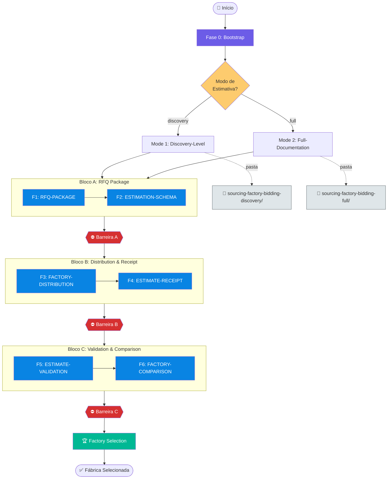
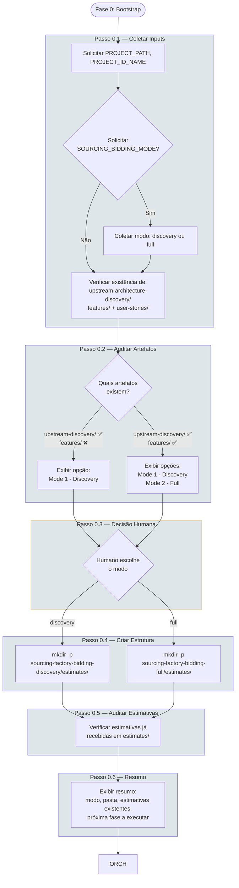
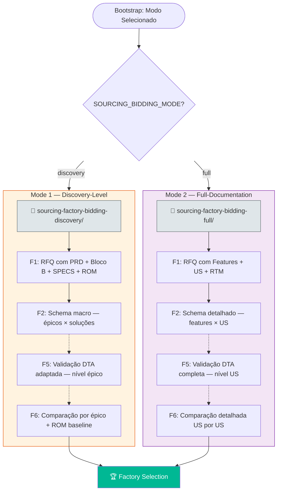
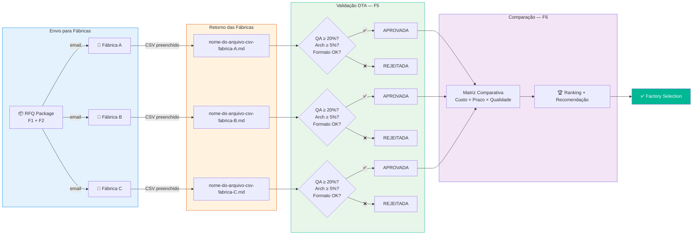

# FLOWCHART: ROADMAP DE SOURCING & FACTORY BIDDING

## Versão: 1.0 — Visualização Gráfica do Pipeline de Sourcing, Bidding e Seleção de Fábricas

> **Documento de referência:** `PROMPT-ROADMAP-GENERATE-SOURCING-FACTORY-BIDDING.md` v1.0
>
> Este documento complementa o roadmap textual com diagramas Mermaid que visualizam o fluxo de execução, os dois modos de operação e o mecanismo de orquestração.

---

## 1. Visão Macro do Pipeline Completo



---

## 2. Fase 0 — Bootstrap Inteligente (Detalhado)



---

## 3. Mecanismo de Orquestração Dinâmica (Loop Trifásico)

Todas as fases 1-6 executam este mesmo loop de validação:


---

## 4. Pipeline Sequencial — Fases 1-6 com Dependências

```mermaid
flowchart LR
    subgraph F1[Fase 1: RFQ-PACKAGE]
        direction TB
        F1_GEN[GENERATE<br/>Compila artefatos] --> F1_GATE[GATE<br/>Valida pacote] --> F1_FIX[FIX<br/>Corrige gaps]
        F1_FIX -.->|loop| F1_GATE
        F1_GATE --> F1_OK[COMPLIANCE ✅]
    end

    subgraph F2[Fase 2: ESTIMATION-SCHEMA]
        direction TB
        F2_GEN[GENERATE<br/>Template CSV] --> F2_GATE[GATE<br/>Valida schema] --> F2_FIX[FIX<br/>Corrige colunas]
        F2_FIX -.->|loop| F2_GATE
        F2_GATE --> F2_OK[COMPLIANCE ✅]
    end

    subgraph F3[Fase 3: FACTORY-DISTRIBUTION]
        direction TB
        F3_GEN[GENERATE<br/>Registra fábricas] --> F3_GATE[GATE<br/>Valida registros] --> F3_FIX[FIX<br/>Corrige dados]
        F3_FIX -.->|loop| F3_GATE
        F3_GATE --> F3_OK[COMPLIANCE ✅]
    end

    subgraph F4[Fase 4: ESTIMATE-RECEIPT]
        direction TB
        F4_GEN[GENERATE<br/>Guia recebimento] --> F4_GATE[GATE<br/>Valida estimativas<br/>em estimates/] --> F4_FIX[FIX<br/>Corrige formato]
        F4_FIX -.->|loop| F4_GATE
        F4_GATE --> F4_OK[COMPLIANCE ✅]
    end

    subgraph F5[Fase 5: ESTIMATE-VALIDATION]
        direction TB
        F5_GEN[GENERATE<br/>Valida regras DTA] --> F5_GATE[GATE<br/>Verifica QA, outliers] --> F5_FIX[FIX<br/>Corrige validação]
        F5_FIX -.->|loop| F5_GATE
        F5_GATE --> F5_OK[COMPLIANCE ✅]
    end

    subgraph F6[Fase 6: FACTORY-COMPARISON]
        direction TB
        F6_GEN[GENERATE<br/>Matriz comparativa] --> F6_GATE[GATE<br/>Valida ranking] --> F6_FIX[FIX<br/>Corrige análise]
        F6_FIX -.->|loop| F6_GATE
        F6_GATE --> F6_OK[COMPLIANCE ✅]
    end

    F1_OK -->|destrava| F2_GEN
    F2_OK -->|destrava| F3_GEN
    F3_OK -->|destrava| F4_GEN
    F4_OK -->|destrava| F5_GEN
    F5_OK -->|destrava| F6_GEN

    F1 --> I1[📥 upstream-architecture-discovery/<br/>PRD + Bloco B + SPECS + ROM]
    F2 --> I2[📥 DTA Estimation Schema<br/>+ BACKLOG-LIST.csv]
    F3 --> I3[📥 RFQ-PACKAGE.md<br/>+ ESTIMATION-SCHEMA.csv]
    F4 --> I4[📥 estimates/<br/>nome-do-arquivo-csv-{fabrica}.md]
    F5 --> I5[📥 DTA Validation Rules<br/>QA ≥ 20% · Arch ≥ 5% · Outliers]
    F6 --> I6[📥 Todas estimativas<br/>validadas (F5)]

    style F1 fill:#0984e3,color:#fff
    style F2 fill:#0984e3,color:#fff
    style F3 fill:#0984e3,color:#fff
    style F4 fill:#0984e3,color:#fff
    style F5 fill:#0984e3,color:#fff
    style F6 fill:#0984e3,color:#fff
```

---

## 5. Modos de Operação — Discovery vs Full



---

## 6. Fluxo de Estimativa — Da Fábrica à Seleção



---

## 7. Diagrama de Estados — Visão Unificada

```mermaid
stateDiagram-v2
    [*] --> Bootstrap: Início do Sourcing

    state Bootstrap {
        [*] --> ColetarInputs
        ColetarInputs --> AuditarArtefatos
        AuditarArtefatos --> EscolherModo
        EscolherModo --> CriarEstrutura
        CriarEstrutura --> AuditarEstimativas
        AuditarEstimativas --> ResumoInicial
    }

    Bootstrap --> F1_RFQ

    state F1_RFQ {
        [*] --> F1_Gen
        F1_Gen --> F1_Gate
        F1_Gate --> F1_Fix: NÃO COMPLIANCE
        F1_Fix --> F1_Gate
        F1_Gate --> F1_Human: SEM ERROS
        F1_Human --> F1_Gen: Novos inputs
        F1_Human --> F1_Done: Aprovado
    }

    F1_RFQ --> F2_Schema: COMPLIANCE

    state F2_Schema {
        [*] --> F2_Gen
        F2_Gen --> F2_Gate
        F2_Gate --> F2_Fix: NÃO COMPLIANCE
        F2_Fix --> F2_Gate
        F2_Gate --> F2_Human: SEM ERROS
        F2_Human --> F2_Gen: Novos inputs
        F2_Human --> F2_Done: Aprovado
    }

    F2_Schema --> BarreiraA: COMPLIANCE

    state BarreiraA {
        [*] --> CheckA
        CheckA --> F3_Dist: Bloco A 100% OK
    }

    BarreiraA --> F3_Dist

    state F3_Dist {
        [*] --> F3_Gen
        F3_Gen --> F3_Gate
        F3_Gate --> F3_Fix: NÃO COMPLIANCE
        F3_Fix --> F3_Gate
        F3_Gate --> F3_Human: SEM ERROS
        F3_Human --> F3_Gen: Novos inputs
        F3_Human --> F3_Done: Aprovado
    }

    F3_Dist --> F4_Receipt: COMPLIANCE

    state F4_Receipt {
        [*] --> F4_Gen
        F4_Gen --> F4_Gate
        F4_Gate --> F4_Fix: NÃO COMPLIANCE
        F4_Fix --> F4_Gate
        F4_Gate --> F4_Human: SEM ERROS
        F4_Human --> F4_Gen: Novos inputs
        F4_Human --> F4_Done: Aprovado
    }

    F4_Receipt --> BarreiraB: COMPLIANCE

    state BarreiraB {
        [*] --> CheckB
        CheckB --> F5_Valid: Bloco B 100% OK
    }

    BarreiraB --> F5_Valid

    state F5_Valid {
        [*] --> F5_Gen
        F5_Gen --> F5_Gate
        F5_Gate --> F5_Fix: NÃO COMPLIANCE
        F5_Fix --> F5_Gate
        F5_Gate --> F5_Human: SEM ERROS
        F5_Human --> F5_Gen: Novos inputs
        F5_Human --> F5_Done: Aprovado
    }

    F5_Valid --> F6_Compare: COMPLIANCE

    state F6_Compare {
        [*] --> F6_Gen
        F6_Gen --> F6_Gate
        F6_Gate --> F6_Fix: NÃO COMPLIANCE
        F6_Fix --> F6_Gate
        F6_Gate --> F6_Human: SEM ERROS
        F6_Human --> F6_Gen: Novos inputs
        F6_Human --> F6_Done: Aprovado
    }

    F6_Compare --> BarreiraC: COMPLIANCE

    state BarreiraC {
        [*] --> CheckC
        CheckC --> Selection: Bloco C 100% OK
    }

    BarreiraC --> Selection

    state Selection {
        [*] --> Choose
        Choose --> [*]: 🏆 Fábrica Selecionada
    }

    Selection --> [*]
```



---

## 8. Integração com os Demais Roadmaps

```mermaid
flowchart LR
    subgraph UPSTREAM[Upstream Architecture Discovery]
        direction TB
        U1[PRD + Bloco B] --> U2[SPECS + ROM]
        U2 --> U3[GO/NO-GO]
    end

    subgraph SOURCING[Sourcing & Factory Bidding — Este Documento]
        direction TB
        S1[RFQ Package] --> S2[Factory Distribution]
        S2 --> S3[Validation + Comparison]
        S3 --> S4[Factory Selection]
    end

    subgraph TECHDEF[Technical Definitions]
        direction TB
        T1[Bloco 0] --> T2[Bloco A → B]
        T2 --> T3[Bloco C → D]
    end

    U3 -->|"Go-Ahead ✅<br/>dispara sourcing"| S1
    S4 -->|"Fábrica selecionada<br/>dispara definições detalhadas"| T1

    style UPSTREAM fill:#e3f2fd,stroke:#0984e3
    style SOURCING fill:#fff3e0,stroke:#e65100
    style TECHDEF fill:#e8f5e9,stroke:#00b894
```



### Posicionamento na Cadeia de Valor

| Roadmap | Nível | Output | Consumido por |
|---------|-------|--------|---------------|
| **Upstream Architecture Discovery** | Estratégico / Viabilidade | PRD, 6 disciplinas, SPECS, ROM, GO/NO-GO | → Sourcing & Factory Bidding (RFQ) |
| **Sourcing & Factory Bidding** ← | Tático / Sourcing | RFQ Package, Matriz Comparativa, Factory Selection | → Technical Definitions (detalhamento) |
| **Technical Definitions** | Tático / Implementação | 20 fases de definições detalhadas | → Times de Desenvolvimento |

---

## 9. Tabela de Símbolos e Convenções

| Símbolo/Cor | Significado |
|-------------|-------------|
| 🟣 Roxo (`#6c5ce7`) | Bootstrap / Validação Humana / Barreiras |
| 🔵 Azul (`#0984e3`) | Fases de Geração padrão (1-6) |
| 🟠 Laranja (`#e17055`) | Correções (FIX) |
| 🟢 Verde (`#00b894`) | Compliance / Factory Selection |
| 🟡 Amarelo (`#fdcb6e`) | Gate / Decisões |
| 🔴 Vermelho (`#d63031`) | Barreiras de bloqueio |
| 🔲 Linha tracejada | Loop de retrabalho (GATE→FIX→GATE) |
| 🔲 Linha sólida | Fluxo sequencial normal |
| 📁 | Pasta de trabalho |
| 🏢 | Fábrica de software |
| 🏆 | Seleção / Vencedor |

---

> **📁 Arquivos relacionados:**
> - `PROMPT-ROADMAP-GENERATE-SOURCING-FACTORY-BIDDING.md` — Documento fonte (v1.0)
> - `../PROMPT-ROADMAP-GENERATE-UPSTREAM-ARCHITECTURE-DISCOVERY.md` — Roadmap upstream (alimenta o RFQ)
> - `../PROMPT-ROADMAP-GENERATE-PROJECT-TECHNICAL-DEFINITIONS.md` — Roadmap técnico (consumido após seleção)
> - `../../DTA-Engine-de-Bidding-e-Estimativas.md` — Engine de validação DTA
> - `PROMPT-GENERATE-SOURCING-FACTORY-BIDDING-*.md` — 6 prompts geradores (fases 1-6)
> - `PROMPT-GATE-SOURCING-FACTORY-BIDDING-*.md` — 6 prompts de auditoria (fases 1-6)
> - `PROMPT-FIX-SOURCING-FACTORY-BIDDING-*.md` — 6 prompts de correção (fases 1-6)
