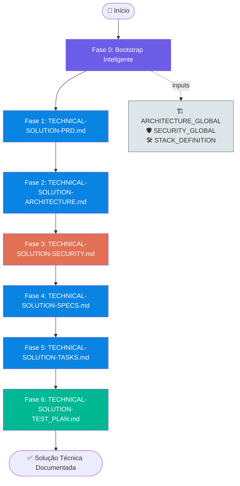
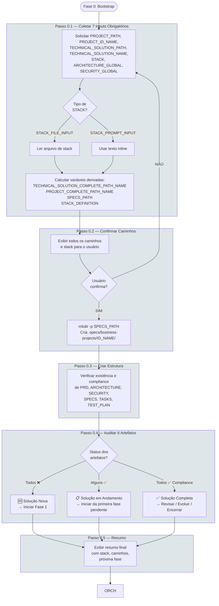
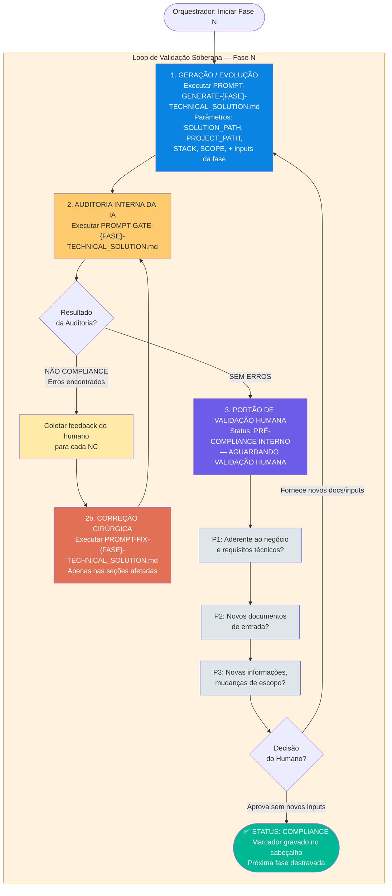
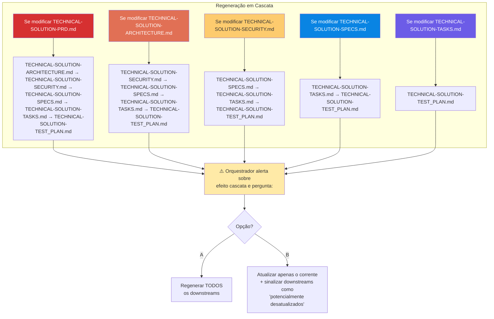
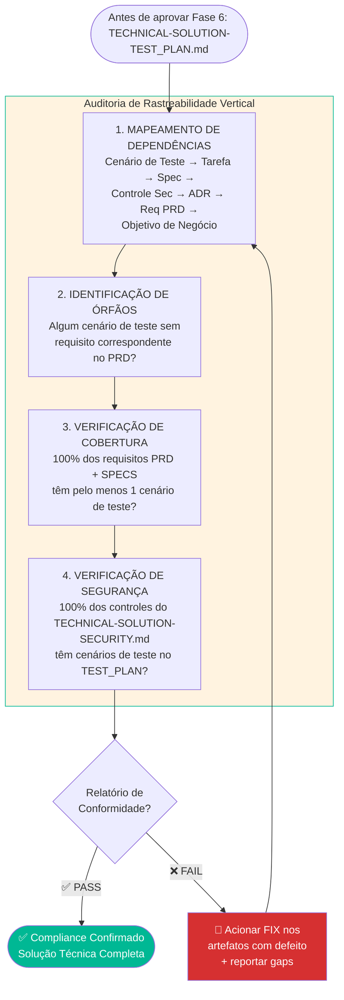
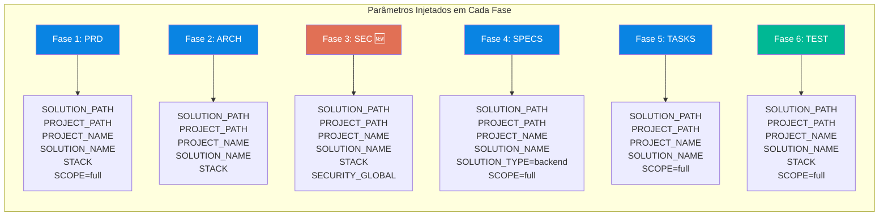

# FLOWCHART: ROADMAP DE EXECUÇÃO — SOLUÇÃO TÉCNICA

## Versão: 1.0 — Visualização Gráfica do Pipeline de Documentação Técnica

> **Documento de referência:** `PROMPT-ROADMAP-GENERATE-TECHNICAL_SOLUTIONS.md` v1.1
>
> Este documento complementa o roadmap textual com diagramas Mermaid que visualizam o fluxo de execução, os mecanismos de orquestração, as regras de cascata e a rastreabilidade vertical.

---

## 1. Visão Macro do Pipeline Completo



---

## 2. Fase 0 — Bootstrap Inteligente (Detalhado)



---

## 3. Mecanismo de Orquestração Dinâmica (Loop Trifásico)

Este é o coração do roadmap. **TODAS** as 6 fases executam este mesmo loop de validação.



---

## 4. Fases 1-6 — Pipeline Sequencial com Dependências e Inputs

```mermaid
flowchart LR
    subgraph F1[Fase 1: TECHNICAL-SOLUTION-PRD.md]
        direction TB
        F1_GEN[GENERATE<br/>PRD] --> F1_GATE[GATE<br/>PRD] --> F1_FIX[FIX<br/>PRD]
        F1_FIX -.->|loop| F1_GATE
        F1_GATE --> F1_OK[COMPLIANCE ✅]
    end

    subgraph F2[Fase 2: TECHNICAL-SOLUTION-ARCHITECTURE.md]
        direction TB
        F2_GEN[GENERATE<br/>ARCH] --> F2_GATE[GATE<br/>ARCH] --> F2_FIX[FIX<br/>ARCH]
        F2_FIX -.->|loop| F2_GATE
        F2_GATE --> F2_OK[COMPLIANCE ✅]
    end

    subgraph F3[Fase 3: TECHNICAL-SOLUTION-SECURITY.md 🆕]
        direction TB
        F3_GEN[GENERATE<br/>SEC] --> F3_GATE[GATE<br/>SEC] --> F3_FIX[FIX<br/>SEC]
        F3_FIX -.->|loop| F3_GATE
        F3_GATE --> F3_OK[COMPLIANCE ✅]
    end

    subgraph F4[Fase 4: TECHNICAL-SOLUTION-SPECS.md]
        direction TB
        F4_GEN[GENERATE<br/>SPECS] --> F4_GATE[GATE<br/>SPECS] --> F4_FIX[FIX<br/>SPECS]
        F4_FIX -.->|loop| F4_GATE
        F4_GATE --> F4_OK[COMPLIANCE ✅]
    end

    subgraph F5[Fase 5: TECHNICAL-SOLUTION-TASKS.md]
        direction TB
        F5_GEN[GENERATE<br/>TASKS] --> F5_GATE[GATE<br/>TASKS] --> F5_FIX[FIX<br/>TASKS]
        F5_FIX -.->|loop| F5_GATE
        F5_GATE --> F5_OK[COMPLIANCE ✅]
    end

    subgraph F6[Fase 6: TECHNICAL-SOLUTION-TEST_PLAN.md]
        direction TB
        F6_GEN[GENERATE<br/>TEST] --> F6_GATE[GATE<br/>TEST] --> F6_FIX[FIX<br/>TEST]
        F6_FIX -.->|loop| F6_GATE
        F6_GATE --> F6_OK[COMPLIANCE ✅]
    end

    F1_OK -->|destrava| F2_GEN
    F2_OK -->|destrava| F3_GEN
    F3_OK -->|destrava| F4_GEN
    F4_OK -->|destrava| F5_GEN
    F5_OK -->|destrava| F6_GEN

    F1 --> I1[📥 Projeto de Negócio<br/>+ Docs adicionais]
    F2 --> I2[📥 TECHNICAL-SOLUTION-PRD.md +<br/>ARCHITECTURE_GLOBAL]
    F3 --> I3[📥 TECHNICAL-SOLUTION-PRD.md + TECHNICAL-SOLUTION-ARCHITECTURE.md<br/>+ SECURITY_GLOBAL]
    F4 --> I4[📥 TECHNICAL-SOLUTION-PRD.md + TECHNICAL-SOLUTION-ARCHITECTURE.md<br/>+ TECHNICAL-SOLUTION-SECURITY.md]
    F5 --> I5[📥 TECHNICAL-SOLUTION-PRD.md + TECHNICAL-SOLUTION-ARCHITECTURE.md<br/>+ TECHNICAL-SOLUTION-SPECS.md]
    F6 --> I6[📥 TECHNICAL-SOLUTION-PRD.md + TECHNICAL-SOLUTION-ARCHITECTURE.md<br/>+ TECHNICAL-SOLUTION-SPECS.md + TECHNICAL-SOLUTION-TASKS.md]

    style F1 fill:#0984e3,color:#fff
    style F2 fill:#0984e3,color:#fff
    style F3 fill:#e17055,color:#fff
    style F4 fill:#0984e3,color:#fff
    style F5 fill:#0984e3,color:#fff
    style F6 fill:#00b894,color:#fff
```



---

## 5. Efeitos Cascata (Cascade Rules)

Quando um artefato é modificado após COMPLIANCE, todos os artefatos downstream devem ser regenerados.



### Matriz de Impacto Cascata

| Artefato Modificado | PRD | ARCH | SEC | SPECS | TASKS | TEST |
|---------------------|:---:|:---:|:---:|:---:|:---:|:---:|
| **TECHNICAL-SOLUTION-PRD.md** | — | 🔄 | 🔄 | 🔄 | 🔄 | 🔄 |
| **TECHNICAL-SOLUTION-ARCHITECTURE.md** | — | — | 🔄 | 🔄 | 🔄 | 🔄 |
| **TECHNICAL-SOLUTION-SECURITY.md** | — | — | — | 🔄 | 🔄 | 🔄 |
| **TECHNICAL-SOLUTION-SPECS.md** | — | — | — | — | 🔄 | 🔄 |
| **TECHNICAL-SOLUTION-TASKS.md** | — | — | — | — | — | 🔄 |
| **TECHNICAL-SOLUTION-TEST_PLAN.md** | — | — | — | — | — | — |

> 🔄 = Deve ser regenerado e revalidado

---

## 6. Matriz de Rastreabilidade — Validação Cruzada Fase 6 vs Fases 1-5



---

## 7. Diagrama de Estados — Visão Unificada

```mermaid
stateDiagram-v2
    [*] --> Bootstrap: Início da Solução Técnica

    state Bootstrap {
        [*] --> ColetarInputs
        ColetarInputs --> ColetarStack: 7 inputs + STACK
        ColetarStack --> ValidarStack: Stack fornecida?
        ValidarStack --> ColetarInputs: NÃO (Stack é obrigatória)
        ValidarStack --> ConfirmarCaminhos: SIM
        ConfirmarCaminhos --> ColetarInputs: NÃO confirma
        ConfirmarCaminhos --> CriarEstrutura: SIM confirma
        CriarEstrutura --> AuditarArtefatos
        AuditarArtefatos --> ResumoInicial
    }

    Bootstrap --> Fase1_PRD

    state Fase1_PRD {
        [*] --> PRD_Gen
        PRD_Gen --> PRD_Gate
        PRD_Gate --> PRD_Fix: NÃO COMPLIANCE
        PRD_Fix --> PRD_Gate
        PRD_Gate --> PRD_Human: SEM ERROS
        PRD_Human --> PRD_Gen: Novos inputs
        PRD_Human --> PRD_Done: Aprovado → gravar [STATUS: COMPLIANCE]
    }

    Fase1_PRD --> Fase2_ARCH: COMPLIANCE

    state Fase2_ARCH {
        [*] --> ARCH_Gen
        ARCH_Gen --> ARCH_Gate
        ARCH_Gate --> ARCH_Fix: NÃO COMPLIANCE
        ARCH_Fix --> ARCH_Gate
        ARCH_Gate --> ARCH_Human: SEM ERROS
        ARCH_Human --> ARCH_Gen: Novos inputs
        ARCH_Human --> ARCH_Done: Aprovado → gravar [STATUS: COMPLIANCE]
    }

    Fase2_ARCH --> Fase3_SEC: COMPLIANCE

    state Fase3_SEC {
        [*] --> SEC_Gen
        SEC_Gen --> SEC_Gate
        SEC_Gate --> SEC_Fix: NÃO COMPLIANCE
        SEC_Fix --> SEC_Gate
        SEC_Gate --> SEC_Human: SEM ERROS
        SEC_Human --> SEC_Gen: Novos inputs
        SEC_Human --> SEC_Done: Aprovado → gravar [STATUS: COMPLIANCE]
    }

    Fase3_SEC --> Fase4_SPECS: COMPLIANCE

    state Fase4_SPECS {
        [*] --> SPECS_Gen
        SPECS_Gen --> SPECS_Gate
        SPECS_Gate --> SPECS_Fix: NÃO COMPLIANCE
        SPECS_Fix --> SPECS_Gate
        SPECS_Gate --> SPECS_Human: SEM ERROS
        SPECS_Human --> SPECS_Gen: Novos inputs
        SPECS_Human --> SPECS_Done: Aprovado → gravar [STATUS: COMPLIANCE]
    }

    Fase4_SPECS --> Fase5_TASKS: COMPLIANCE

    state Fase5_TASKS {
        [*] --> TASKS_Gen
        TASKS_Gen --> TASKS_Gate
        TASKS_Gate --> TASKS_Fix: NÃO COMPLIANCE
        TASKS_Fix --> TASKS_Gate
        TASKS_Gate --> TASKS_Human: SEM ERROS
        TASKS_Human --> TASKS_Gen: Novos inputs
        TASKS_Human --> TASKS_Done: Aprovado → gravar [STATUS: COMPLIANCE]
    }

    Fase5_TASKS --> Fase6_TEST: COMPLIANCE

    state Fase6_TEST {
        [*] --> TEST_Gen
        TEST_Gen --> TEST_Gate
        TEST_Gate --> TEST_Fix: NÃO COMPLIANCE
        TEST_Fix --> TEST_Gate
        TEST_Gate --> RTM_Check: SEM ERROS
        RTM_Check --> TEST_Fix: FAIL na matriz
        RTM_Check --> TEST_Human: PASS na matriz
        TEST_Human --> TEST_Gen: Novos inputs
        TEST_Human --> TEST_Done: Aprovado → gravar [STATUS: COMPLIANCE]
    }

    Fase6_TEST --> [*]: ✅ Solução Técnica Completa
```



---

## 8. Fluxo de Decisão do Bootstrap — Detalhamento Lógico

```mermaid
flowchart TD
    subgraph BOOTSTRAP_LOGIC[Lógica de Decisão do Passo 0.4]
        CHECK_ALL[Verificar 6 arquivos em SPECS_PATH]

        ALL_NO[❌ Todos ausentes<br/>→ SOLUÇÃO NOVA]
        SOME_YES[⚠️ Alguns existem<br/>→ SOLUÇÃO EM ANDAMENTO]
        ALL_YES[✅ Todos existem<br/>+ COMPLIANCE]

        ALL_NO --> NEW[Iniciar Fase 1: TECHNICAL-SOLUTION-PRD.md]

        SOME_YES --> FIND[Encontrar primeiro artefato<br/>ausente ou não-Compliance<br/>na ordem 1→6]
        FIND --> REPORT[Reportar status completo:<br/>'Iniciando da Fase N — Nome<br/>(primeiro artefato pendente)']

        ALL_YES --> ASK[Perguntar: Revisar /<br/>Novo ciclo evolutivo /<br/>Encerrar?]
        ASK -->|Revisar| FIND
        ASK -->|Novo ciclo| NEW
        ASK -->|Encerrar| DONE
    end

    REPORT --> ORCH

    style ALL_NO fill:#d63031,color:#fff
    style SOME_YES fill:#fdcb6e,color:#333
    style ALL_YES fill:#00b894,color:#fff
    style NEW fill:#0984e3,color:#fff
    style DONE fill:#00b894,color:#fff
```

---

## 9. Parâmetros por Fase — Resumo Visual



---

## 10. Tabela de Símbolos e Convenções

| Símbolo/Cor | Significado |
|-------------|-------------|
| 🟣 Roxo (`#6c5ce7`) | Bootstrap / Validação Humana |
| 🔵 Azul (`#0984e3`) | Fases de Geração (1, 2, 4, 5) |
| 🟠 Laranja (`#e17055`) | Fase 3 (TECHNICAL-SOLUTION-SECURITY.md) / Correções |
| 🟢 Verde (`#00b894`) | Compliance / Fase 6 (TEST_PLAN) |
| 🟡 Amarelo (`#fdcb6e`) | Auditoria Interna (Gate) |
| 🔴 Vermelho (`#d63031`) | Erro / Falha / Bloqueio |
| 🔲 Linha tracejada | Loop de retrabalho |
| 🔲 Linha sólida | Fluxo sequencial normal |
| 🔄 | Regenerar em cascata |

---

## 11. Diferenças Chave: Roadmap de Negócio vs Roadmap Técnico

| Aspecto | Roadmap de Negócio | Roadmap Técnico |
|---------|-------------------|-----------------|
| **Fases** | 5 fases (Charter → BRD → Epics → Features → US) | 6 fases (PRD → ARCH → SEC → SPECS → TASKS → TEST) |
| **Fase de Segurança** | Integrada como NFR nos artefatos | Artefato dedicado (TECHNICAL-SOLUTION-SECURITY.md, Fase 3) |
| **Bootstrap** | 6 variáveis (com PROMPT_BRANCH) | 7+2 variáveis (com STACK e globais de arquitetura/segurança) |
| **Git Workflow** | Automatizado ao final (commit → push → PR → merge) | Não incluso (específico do projeto) |
| **Efeitos Cascata** | Revisão manual de downstreams | Regeneração automática com opção A/B |
| **RTM** | US → Feature → Epic → BRD → Charter | Teste → Tarefa → Spec → Sec → ADR → PRD → Negócio |
| **Nível** | Estratégico / Negócio | Tático / Implementação |
| **Output** | Pasta `user-stories/` + RTM central | 6 arquivos mestre em `SPECS_PATH` |

---

> **📁 Arquivos relacionados:**
> - `PROMPT-ROADMAP-GENERATE-TECHNICAL_SOLUTION.md` — Documento fonte (v1.0)
> - `PROMPT-ROADMAP-GENERATE-PROJECT-DOCUMENTS.md` — Roadmap de documentos de negócio (v5.0)
> - `FLOWCHART-ROADMAP-GENERATE-PROJECT-DOCUMENTS.md` — Visualização do roadmap de negócio
> - `PROMPT-ORCHESTRATOR-GENERATE-ALL-ARTEFACTS.md` — Orquestrador de geração
> - `FLUXO-SPEC-DRIVEN-DEVELOPMENT-V1.md` — Fluxo spec-driven complementar
