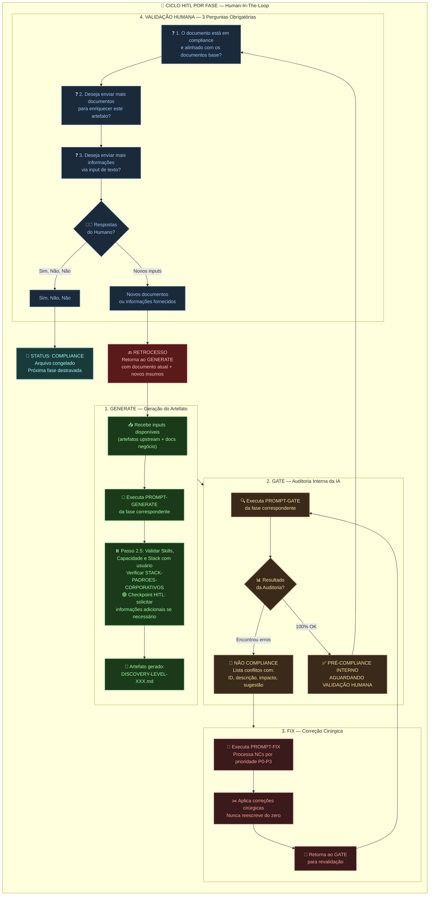
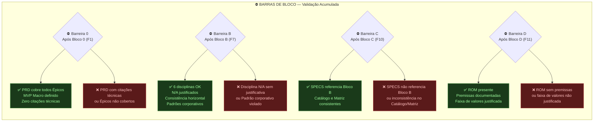
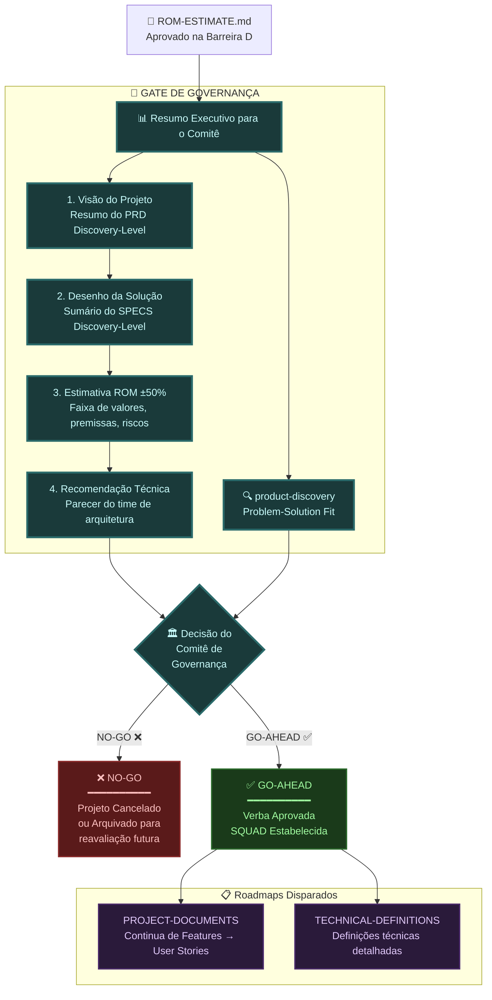

# Flowchart: Upstream Architecture Discovery

> Versão: 2.0 — Baseado no roadmap v2.0 (Skills Map + Team Capacity + Stack Validation + Checkpoint HITL)
> Este documento contém os diagramas de fluxo do processo de Upstream Architecture Discovery.

---

## 1. Diagrama Macro: Blocos, Fases e Barreiras

```mermaid
flowchart TB
    %% ═══════════════════════════════════════════
    %% ESTILOS GLOBAIS
    %% ═══════════════════════════════════════════
    classDef bootstrap fill:#1a1a2e,stroke:#16213e,color:#e0e0ff,stroke-width:2px
    classDef bloco0 fill:#1b3a1b,stroke:#2d5a2d,color:#c8ffc8,stroke-width:2px
    classDef blocoB fill:#1a2a3a,stroke:#2a4a6a,color:#c8e0ff,stroke-width:2px
    classDef blocoC fill:#2a1a3a,stroke:#4a2a6a,color:#e0c8ff,stroke-width:2px
    classDef blocoD fill:#3a2a1a,stroke:#6a4a2a,color:#ffe0c8,stroke-width:2px
    classDef barreira fill:#5a1a1a,stroke:#8a2a2a,color:#ffc8c8,stroke-width:3px
    classDef governanca fill:#1a3a3a,stroke:#2a6a6a,color:#c8ffff,stroke-width:3px
    classDef decisao fill:#3a3a1a,stroke:#6a6a2a,color:#ffffc8,stroke-width:2px
    classDef downstream fill:#1a3a1a,stroke:#2a6a2a,color:#a0ffa0,stroke-width:2px

    %% ═══════════════════════════════════════════
    %% PRÉ-CONDIÇÕES E BOOTSTRAP
    %% ═══════════════════════════════════════════
    subgraph PRECOND[" 📋 Pré-condições de Entrada "]
        direction TB
        CH[Project Charter<br/>01-PROJECT-CHARTER.md]
        BRD[BRD<br/>02-BRD.md]
        EP[Épicos<br/>03-EPICS.md + epics/*.md]
        INPUTS["Inputs do Usuário<br/>PROJECT_PATH, PROJECT_ID_NAME<br/>TECHNICAL_SOLUTION_PATH, etc."]
        STACK[Stack Corporativa FBSO<br/>STACK-PADROES-CORPORATIVOS.md<br/>DigitalOcean, Cloudflare, Kong<br/>Keycloak, PostgreSQL, K8s/Istio]
        HITL_IN["🟢 Checkpoint HITL<br/>PROJECT_PROMPT_INPUTS<br/>Sempre perguntar ao usuário<br/>se deseja adicionar informações"]
    end

    %% ═══════════════════════════════════════════
    %% FASE 0: BOOTSTRAP
    %% ═══════════════════════════════════════════
    subgraph F0[" 🔧 FASE 0: Bootstrap Inteligente "]
        direction TB
        F0A["1. Solicitar inputs ao usuário"] --> F0B["2. Validar pré-condição<br/>(Charter, BRD, Épicos)"]
        F0B --> F0C{"3. project-document-discovery<br/>Classificar projeto em 10 dimensões<br/>(4-signal algorithm)"}
        F0C --> F0D["4. discovery-process<br/>Framing → Synthesis → Experiments"]
        F0D --> F0E["5. Exibir caminhos derivados<br/>e solicitar confirmação"]
        F0E --> F0F["6. Criar estrutura:<br/>mkdir -p {UPSTREAM_DISCOVERY_PATH}"]
        F0F --> F0G["7. Auditar artefatos existentes<br/>em upstream-architecture-discovery/"]
        F0G --> F0H["8. Apresentar resumo e iniciar<br/>primeira fase pendente"]
        F0H --> F0I["9. Coletar Skills, Capacidade e Stack<br/>📋 PROJECT-TEAM-SKILLS-MAP<br/>👥 PROJECT-TEAM-CAPACITY<br/>🔧 PROJECT-STACK<br/>⏸️ Validar contra Stack Corporativa<br/>⏸️ Aguardar confirmação do usuário"]
    end

    %% ═══════════════════════════════════════════
    %% BLOCO 0: PRODUCT DEFINITION (F1)
    %% ═══════════════════════════════════════════
    subgraph B0[" 📦 BLOCO 0: Product Definition Discovery-Level "]
        direction TB
        F1["🏷️ FASE 1<br/>DISCOVERY-LEVEL-PRD.md"]
        F1CICLO["Ciclo HITL:<br/>GENERATE → GATE → FIX<br/>→ COMPLIANCE ✅"]
    end

    %% ═══════════════════════════════════════════
    %% BARREIRA 0
    %% ═══════════════════════════════════════════
    BARR0{"⛔ BARREIRA 0<br/>PRD cobre todos os Épicos?<br/>MVP Macro definido?<br/>Zero citações técnicas?"}

    %% ═══════════════════════════════════════════
    %% BLOCO B: 6 DISCIPLINAS (F2-F7)
    %% ═══════════════════════════════════════════
    subgraph BB[" 🏗️ BLOCO B: Architecture & Security & Specialists "]
        direction LR
        F2["🏗️ F2<br/>ARCHITECTURE<br/>DEFINITION<br/>⏸️ Passo 2.5: validar Stack"]
        F3["🔒 F3<br/>SECURITY<br/>DEFINITION<br/>⏸️ Passo 2.5: validar Stack"]
        F4["🗄️ F4<br/>DATA<br/>DEFINITION<br/>⏸️ Passo 2.5: validar Stack"]
        F5["🚀 F5<br/>DEVOPS-SRE<br/>DEFINITION<br/>⏸️ Passo 2.5: validar Stack"]
        F6["🧪 F6<br/>TEST-STRATEGY<br/>DEFINITION<br/>⏸️ Passo 2.5: validar Stack"]
        F7["☁️ F7<br/>INFRA-CLOUD<br/>DEFINITION<br/>⏸️ Passo 2.5: validar Stack"]
        F2 --> F3 --> F4 --> F5 --> F6 --> F7
    end

    %% ═══════════════════════════════════════════
    %% BARREIRA B
    %% ═══════════════════════════════════════════
    BARRB{"⛔ BARREIRA B<br/>6 disciplinas OK?<br/>Consistência horizontal?<br/>Padrões corporativos?"}

    %% ═══════════════════════════════════════════
    %% BLOCO C: CATÁLOGO, MATRIZ & SPECS (F8-F10)
    %% ═══════════════════════════════════════════
    subgraph BC[" 📊 BLOCO C: Catálogo, Matriz & Consolidação "]
        direction LR
        F8["📋 F8<br/>SOLUTIONS<br/>CATALOG"]
        F9["🔀 F9<br/>SOLUTIONS<br/>MATRIX"]
        F10["📝 F10<br/>SPECS"]
        F8 --> F9 --> F10
    end

    %% ═══════════════════════════════════════════
    %% BARREIRA C
    %% ═══════════════════════════════════════════
    BARRC{"⛔ BARREIRA C<br/>SPECS referencia Bloco B?<br/>Catálogo e Matriz consistentes?"}

    %% ═══════════════════════════════════════════
    %% BLOCO D: ROM ESTIMATE (F11)
    %% ═══════════════════════════════════════════
    subgraph BD[" 💰 BLOCO D: Estimativa & ROM "]
        direction TB
        F11["📐 FASE 11<br/>ROM-ESTIMATE.md<br/>Matriz de Esforço + Premissas<br/>+ Faixa de Valores ±50%"]
        F11CICLO["Ciclo HITL:<br/>GENERATE → GATE → FIX<br/>→ COMPLIANCE ✅"]
    end

    %% ═══════════════════════════════════════════
    %% BARREIRA D
    %% ═══════════════════════════════════════════
    BARRD{"⛔ BARREIRA D<br/>ROM presente?<br/>Premissas documentadas?<br/>Faixa de valores justificada?"}

    %% ═══════════════════════════════════════════
    %% GATE DE GOVERNANÇA
    %% ═══════════════════════════════════════════
    GOV["🚦 GATE DE GOVERNANÇA<br/>product-discovery<br/>Problem-Solution Fit<br/><br/>Resumo Executivo:<br/>1. Visão do Projeto (PRD)<br/>2. Desenho da Solução (SPECS)<br/>3. Estimativa ROM ±50%<br/>4. Recomendação Técnica"]
    
    DECISAO{"🏛️ DECISÃO DO COMITÊ<br/>GO ou NO-GO?"}
    
    NOGO["❌ NO-GO<br/>Projeto Cancelado<br/>ou Arquivado para<br/>Reavaliação Futura"]
    
    GO["✅ GO-AHEAD<br/>Verba Aprovada<br/>SQUAD Estabelecida"]
    
    DWN1["📋 Dispara Roadmap:<br/>PROJECT-DOCUMENTS<br/>(Features → User Stories)"]
    DWN2["🔧 Dispara Roadmap:<br/>TECHNICAL-DEFINITIONS<br/>(Definições Técnicas Detalhadas)"]

    %% ═══════════════════════════════════════════
    %% CONEXÕES PRINCIPAIS
    %% ═══════════════════════════════════════════
    INPUTS --> F0A
    CH --> F0B
    BRD --> F0B
    EP --> F0B
    STACK --> F0I
    HITL_IN --> F0A
    
    F0I --> F1
    F1 --> F1CICLO
    F1CICLO --> BARR0
    BARR0 -->|"✅ COMPLIANCE"| F2
    BARR0 -->|"❌ NÃO COMPLIANCE"| F1
    
    F7 --> BARRB
    BARRB -->|"✅ COMPLIANCE"| F8
    BARRB -->|"❌ NÃO COMPLIANCE"| F2
    
    F10 --> BARRC
    BARRC -->|"✅ COMPLIANCE"| F11
    BARRC -->|"❌ NÃO COMPLIANCE"| F8
    
    F11 --> F11CICLO
    F11CICLO --> BARRD
    BARRD -->|"✅ COMPLIANCE"| GOV
    BARRD -->|"❌ NÃO COMPLIANCE"| F11
    
    GOV --> DECISAO
    DECISAO -->|"NO-GO ❌"| NOGO
    DECISAO -->|"GO-AHEAD ✅"| GO
    GO --> DWN1
    GO --> DWN2

    %% ═══════════════════════════════════════════
    %% APLICAÇÃO DE ESTILOS
    %% ═══════════════════════════════════════════
    class F0,F0A,F0B,F0C,F0D,F0E,F0F,F0G,F0H,F0I bootstrap
    class B0,F1,F1CICLO bloco0
    class BB,F2,F3,F4,F5,F6,F7 blocoB
    class BC,F8,F9,F10 blocoC
    class BD,F11,F11CICLO blocoD
    class BARR0,BARRB,BARRC,BARRD barreira
    class GOV,GO,NOGO governanca
    class DECISAO decisao
    class DWN1,DWN2 downstream
    class PRECOND,CH,BRD,EP,INPUTS,STACK,HITL_IN bootstrap
```

---

## 2. Ciclo HITL por Fase (Generate → Gate → Fix → Human Validation)

Este ciclo se repete em **todas as 11 fases** (F1 a F11). Cada fase gera um artefato, que passa pelo gate, e se necessário pelo fix, até atingir COMPLIANCE com validação humana.

---

## 3. Barreiras de Bloco (Gating Rules)

Fluxo de decisão de cada barreira entre blocos:

---

## 4. Gate de Governança (GO / NO-GO)

Decisão final do Comitê de Governança:

---

## 5. Visão Consolidada: Entradas, Processo e Saídas (SIPOC)

```mermaid
flowchart LR
    classDef suppliers fill:#1a2a3a,stroke:#2a4a6a,color:#c8e0ff
    classDef inputs fill:#2a1a3a,stroke:#4a2a6a,color:#e0c8ff
    classDef process fill:#3a2a1a,stroke:#6a4a2a,color:#ffe0c8
    classDef outputs fill:#1a3a2a,stroke:#2a6a4a,color:#c8ffe0
    classDef customers fill:#2a3a1a,stroke:#4a6a2a,color:#e0ffc8

    subgraph SIPOC[" SIPOC: Upstream Architecture Discovery "]
        direction TB
        
        S["👥 SUPPLIERS<br/>━━━━━━━━━━<br/>Product Manager / PO<br/>Business Analyst<br/>Tech Lead / Arquiteto<br/>Comitê de Governança"]
        
        I["📥 INPUTS<br/>━━━━━━━━━━<br/>Project Charter + BRD + Épicos<br/>PROJECT_PATH / PROJECT_ID_NAME<br/>TECHNICAL_SOLUTION_PATH<br/>ARCHITECTURE_GLOBAL<br/>SECURITY_GLOBAL<br/>🟢 PROJECT_PROMPT_INPUTS (Checkpoint HITL)<br/>📋 PROJECT-TEAM-SKILLS-MAP<br/>👥 PROJECT-TEAM-CAPACITY<br/>🔧 PROJECT-STACK<br/>📚 STACK-PADROES-CORPORATIVOS.md"]
        
        P["⚙️ PROCESS<br/>━━━━━━━━━━<br/>Fase 0: Bootstrap Inteligente<br/>Bloco 0: PRD Discovery-Level (F1)<br/>Bloco B: 6 Disciplinas (F2-F7)<br/>Bloco C: Catálogo+Matriz+SPECS (F8-F10)<br/>Bloco D: ROM Estimate (F11)<br/>Ciclo HITL em cada fase<br/>4 Barreiras de Bloco<br/>Gate de Governança GO/NO-GO"]
        
        O["📤 OUTPUTS<br/>━━━━━━━━━━<br/>DISCOVERY-LEVEL-PRD.md<br/>DISCOVERY-LEVEL-ARCHITECTURE-DEFINITION.md<br/>DISCOVERY-LEVEL-SECURITY-DEFINITION.md<br/>DISCOVERY-LEVEL-DATA-ARCHITECTURE-DEFINITION.md<br/>DISCOVERY-LEVEL-DEVOPS-SRE-DEFINITION.md<br/>DISCOVERY-LEVEL-TEST-STRATEGY-DEFINITION.md<br/>DISCOVERY-LEVEL-INFRA-CLOUD-DEFINITION.md<br/>DISCOVERY-LEVEL-SOLUTIONS-CATALOG.md<br/>DISCOVERY-LEVEL-SOLUTIONS-MATRIX.md<br/>DISCOVERY-LEVEL-SPECS.md<br/>ROM-ESTIMATE.md (±50%)"]
        
        C["🎯 CUSTOMERS<br/>━━━━━━━━━━<br/>Comitê de Governança<br/>SQUAD de Desenvolvimento<br/>Tech Lead / Arquiteto<br/>Product Manager / PO<br/>Stakeholders do Projeto"]
    end
    
    S --> I --> P --> O --> C
    
    class S suppliers
    class I inputs
    class P process
    class O outputs
    class C customers
```

---

## Registro de Alterações

| Versão | Data | Alteração | Autor |
|:---|:---|:---|:---|
| 1.0 | 02/08/2026 | Criação inicial: 5 diagramas Mermaid cobrindo fluxo macro, ciclo HITL, barreiras, governança e SIPOC. Baseado no roadmap v1.1. | Time de Arquitetura |
| 2.0 | 02/08/2026 | Atualização para roadmap v2.0: adicionados novos inputs (PROJECT-TEAM-SKILLS-MAP, PROJECT-TEAM-CAPACITY, PROJECT-STACK), Stack Corporativa FBSO, Checkpoint HITL (PROJECT_PROMPT_INPUTS), Fase 0 step 9, Passo 2.5 no GENERATE e no Bloco B. SIPOC atualizado com novos inputs. | Time de Arquitetura |

---

🤖 *Diagramas gerados com Mermaid. Renderize em qualquer visualizador compatível (GitHub, Mermaid Live, VS Code).*
