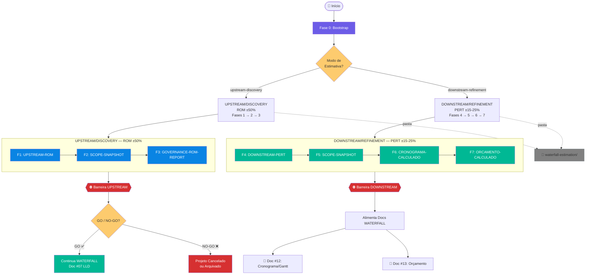
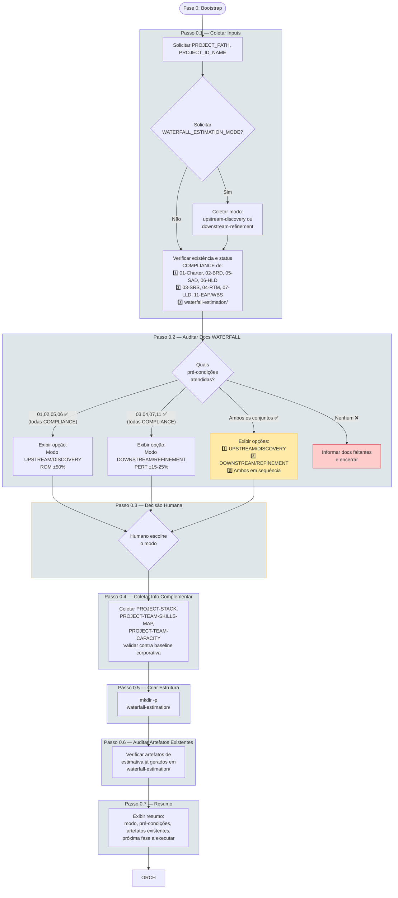
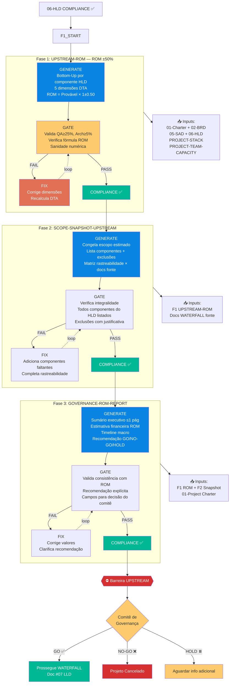
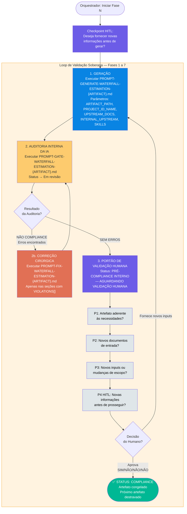
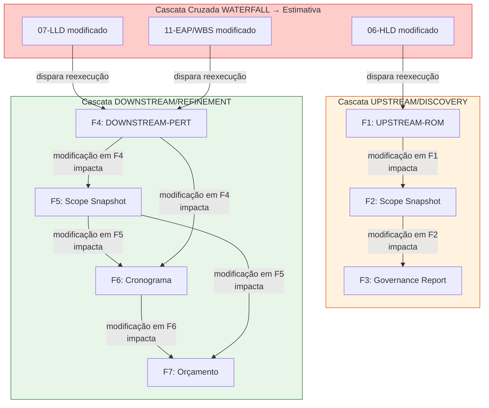
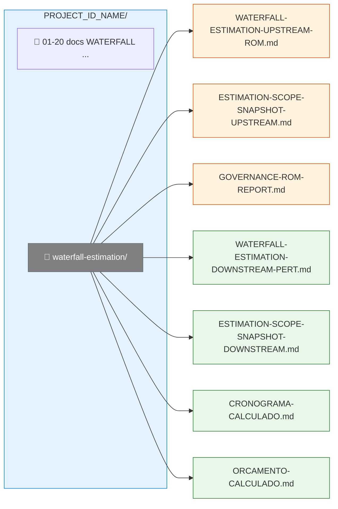

# FLOWCHART: ROADMAP DE WATERFALL-ESTIMATION

## Versão: 1.0 — Visualização Gráfica dos 2 Modos (UPSTREAM/DISCOVERY ROM ±50% + DOWNSTREAM/REFINEMENT PERT ±15-25%)

> **Documento de referência:** `PROMPT-ROADMAP-GENERATE-WATERFALL-ESTIMATION.md` v1.0
>
> Este documento complementa o roadmap textual com diagramas Mermaid que visualizam o fluxo de execução, os **dois modos** de estimativa, o mecanismo de orquestração e a integração com os documentos WATERFALL.

---

## 1. Visão Macro do Pipeline Completo

---

## 2. Fase 0 — Bootstrap Inteligente (Detalhado)

---

## 3. Modo UPSTREAM/DISCOVERY — ROM ±50% (Fases 1-3)

---

## 4. Modo DOWNSTREAM/REFINEMENT — PERT ±15-25% (Fases 4-7)

```mermaid
flowchart TD
    GATE_LLD_EAP["07-LLD + 11-EAP/WBS COMPLIANCE ✅"] --> F4_START

    subgraph F4_PERT["Fase 4: DOWNSTREAM-PERT"]
        direction TB
        F4_GEN["GENERATE<br/>Three-Point por pacote EAP<br/>E = O+4M+P/6 · σ = P−O/6<br/>σ_consolidado = √Σσ²<br/>Estimativa independente do ROM"] --> F4_GATE["GATE<br/>Valida O≤M≤P em todos<br/>QA≥25%, Arch≥5%<br/>Precisão ±15-25%<br/>Declaração independência"]
        F4_GATE -->|FAIL| F4_FIX["FIX<br/>Corrige Three-Point<br/>Recalcula DTA<br/>Refina pacotes com σ alto"]
        F4_FIX -.->|loop| F4_GATE
        F4_GATE -->|PASS| F4_OK["COMPLIANCE ✅"]
    end

    F4_START --> F4_GEN

    subgraph F5_SCOPE["Fase 5: SCOPE-SNAPSHOT-DOWNSTREAM"]
        direction TB
        F5_GEN["GENERATE<br/>Congela escopo detalhado<br/>Pacotes EAP + exclusões<br/>Rastreabilidade SRS×RTM×LLD×EAP<br/>Declaração independência"] --> F5_GATE["GATE<br/>Todos pacotes EAP listados<br/>Rastreabilidade completa<br/>Independência declarada"]
        F5_GATE -->|FAIL| F5_FIX["FIX<br/>Adiciona pacotes faltantes<br/>Completa rastreabilidade"]
        F5_FIX -.->|loop| F5_GATE
        F5_GATE -->|PASS| F5_OK["COMPLIANCE ✅"]
    end

    F4_OK --> F5_GEN

    subgraph F6_CRONO["Fase 6: CRONOGRAMA-CALCULADO"]
        direction TB
        F6_GEN["GENERATE<br/>dias = E_PERT / equipe×6h<br/>Caminho crítico<br/>Diagrama Gantt<br/>Marcos × Charter"] --> F6_GATE["GATE<br/>Durações derivadas do PERT<br/>Caminho crítico identificado<br/>Sem conflitos dependência<br/>Alocação ≤ capacidade"]
        F6_GATE -->|FAIL| F6_FIX["FIX<br/>Corrige durações<br/>Ajusta dependências"]
        F6_FIX -.->|loop| F6_GATE
        F6_GATE -->|PASS| F6_OK["COMPLIANCE ✅"]
    end

    F5_OK --> F6_GEN

    subgraph F7_ORC["Fase 7: ORCAMENTO-CALCULADO"]
        direction TB
        F7_GEN["GENERATE<br/>Custo RH = Horas_PERT × Taxa<br/>Curva S acumulada<br/>Contingência = fσ<br/>Fluxo de caixa"] --> F7_GATE["GATE<br/>Custos derivados do PERT<br/>Contingência baseada em σ<br/>Contingência ≤ 50% direto<br/>Somas consistentes"]
        F7_GATE -->|FAIL| F7_FIX["FIX<br/>Corrige custos<br/>Recalcula contingência"]
        F7_FIX -.->|loop| F7_GATE
        F7_GATE -->|PASS| F7_OK["COMPLIANCE ✅"]
    end

    F6_OK --> F7_GEN

    F7_OK --> BARREIRA_DOWN{{⛔ Barreira DOWNSTREAM}}

    BARREIRA_DOWN --> INTEGRACAO["Integração com WATERFALL"]

    INTEGRACAO --> DOC12_OUT["📄 Alimenta Doc #12<br/>Cronograma/Gantt<br/>via UPSTREAM_DOCS"]
    INTEGRACAO --> DOC13_OUT["📄 Alimenta Doc #13<br/>Orçamento<br/>via UPSTREAM_DOCS"]

    F4_PERT --> INPUTS4["📥 Inputs:<br/>03-SRS + 04-RTM<br/>07-LLD + 11-EAP/WBS<br/>PROJECT-STACK<br/>TEAM-SKILLS + CAPACITY"]
    F5_SCOPE --> INPUTS5["📥 Inputs:<br/>F4 DOWNSTREAM-PERT<br/>Docs WATERFALL fonte"]
    F6_CRONO --> INPUTS6["📥 Inputs:<br/>F4 PERT + F5 Snapshot<br/>01-Charter milestones<br/>TEAM-CAPACITY"]
    F7_ORC --> INPUTS7["📥 Inputs:<br/>F4 PERT + F6 Cronograma<br/>PROJECT-STACK<br/>TEAM-CAPACITY"]

    style F4_GEN fill:#00b894,color:#fff
    style F4_GATE fill:#fdcb6e,color:#333
    style F4_FIX fill:#e17055,color:#fff
    style F5_GEN fill:#00b894,color:#fff
    style F6_GEN fill:#00b894,color:#fff
    style F7_GEN fill:#00b894,color:#fff
    style F4_OK fill:#00b894,color:#fff
    style F5_OK fill:#00b894,color:#fff
    style F6_OK fill:#00b894,color:#fff
    style F7_OK fill:#00b894,color:#fff
    style BARREIRA_DOWN fill:#d63031,color:#fff
    style DOC12_OUT fill:#0984e3,color:#fff
    style DOC13_OUT fill:#0984e3,color:#fff
```

---

## 5. Mecanismo de Orquestração Dinâmica (Loop Trifásico)

Todas as fases (1-7) executam este mesmo loop de validação:

---

## 6. Integração com o Roadmap WATERFALL

```mermaid
flowchart LR
    subgraph WATERFALL_DOCS["WATERFALL Docs — Fase 3: Design e Arquitetura"]
        direction TB
        W5["05-SAD ✅"] --> W6["06-HLD ✅"]
    end

    subgraph EST_UPSTREAM["WATERFALL-ESTIMATION — UPSTREAM/DISCOVERY"]
        direction TB
        EU1["F1: ROM ±50%"] --> EU2["F2: Scope Snapshot"]
        EU2 --> EU3["F3: Governance GO/NO-GO"]
    end

    subgraph WATERFALL_DOCS2["WATERFALL Docs — Fase 3 + Fase 5"]
        direction TB
        W7["07-LLD ✅"] --> W11["11-EAP/WBS ✅"]
    end

    subgraph EST_DOWNSTREAM["WATERFALL-ESTIMATION — DOWNSTREAM/REFINEMENT"]
        direction TB
        ED4["F4: PERT ±15-25%"] --> ED5["F5: Scope Snapshot"]
        ED5 --> ED6["F6: Cronograma Calculado"]
        ED6 --> ED7["F7: Orçamento Calculado"]
    end

    subgraph WATERFALL_DOCS3["WATERFALL Docs — Fase 5: Planejamento"]
        direction TB
        W12["12-Cronograma/Gantt"]
        W13["13-Orçamento"]
    end

    W6 -->|"Gatilho UPSTREAM<br/>após HLD COMPLIANCE"| EU1
    EU3 -->|"GO ✅"| W7
    EU3 -->|"NO-GO ❌"| CANCEL["Projeto Cancelado"]

    W11 -->|"Gatilho DOWNSTREAM<br/>após LLD + EAP COMPLIANCE"| ED4
    ED6 -->|"UPSTREAM_DOC adicional"| W12
    ED7 -->|"UPSTREAM_DOC adicional"| W13

    style WATERFALL_DOCS fill:#e3f2fd,stroke:#0984e3
    style EST_UPSTREAM fill:#fff3e0,stroke:#e65100
    style WATERFALL_DOCS2 fill:#e3f2fd,stroke:#0984e3
    style EST_DOWNSTREAM fill:#e8f5e9,stroke:#2e7d32
    style WATERFALL_DOCS3 fill:#e3f2fd,stroke:#0984e3
    style CANCEL fill:#ffcccc,stroke:#d63031
```

---

## 7. Diagrama de Estados — Visão Unificada

```mermaid
stateDiagram-v2
    [*] --> Bootstrap: Início da Estimativa WATERFALL

    state Bootstrap {
        [*] --> ColetarInputs
        ColetarInputs --> AuditarDocsWATERFALL
        AuditarDocsWATERFALL --> DetectarModo: upstream-discovery | downstream-refinement | ambos
        DetectarModo --> EscolherModo
        EscolherModo --> ColetarStackETime
        ColetarStackETime --> CriarEstrutura
        CriarEstrutura --> ResumoInicial
    }

    Bootstrap --> ModoUpstream: upstream-discovery
    Bootstrap --> ModoDownstream: downstream-refinement

    state ModoUpstream {
        [*] --> F1_ROM
        state F1_ROM {
            [*] --> F1Gen
            F1Gen --> F1Gate
            F1Gate --> F1Fix: FAIL
            F1Fix --> F1Gate
            F1Gate --> F1Human: PASS
            F1Human --> F1Gen: Novos inputs
            F1Human --> F1Done: Aprovado
        }
        F1_ROM --> F2_SnapUp: COMPLIANCE
        state F2_SnapUp {
            [*] --> F2Gen
            F2Gen --> F2Gate
            F2Gate --> F2Fix: FAIL
            F2Fix --> F2Gate
            F2Gate --> F2Human: PASS
            F2Human --> F2Gen: Novos inputs
            F2Human --> F2Done: Aprovado
        }
        F2_SnapUp --> F3_Gov: COMPLIANCE
        state F3_Gov {
            [*] --> F3Gen
            F3Gen --> F3Gate
            F3Gate --> F3Fix: FAIL
            F3Fix --> F3Gate
            F3Gate --> F3Human: PASS
            F3Human --> F3Gen: Novos inputs
            F3Human --> F3Done: Aprovado
        }
        F3_Gov --> BarreiraUpstream: COMPLIANCE
    }

    state BarreiraUpstream {
        [*] --> Governanca
        Governanca --> GoAhead: GO ✅
        Governanca --> Cancelado: NO-GO ❌
        Governanca --> Aguardando: HOLD ⏸️
    }

    state ModoDownstream {
        [*] --> F4_PERT
        state F4_PERT {
            [*] --> F4Gen
            F4Gen --> F4Gate
            F4Gate --> F4Fix: FAIL
            F4Fix --> F4Gate
            F4Gate --> F4Human: PASS
            F4Human --> F4Gen: Novos inputs
            F4Human --> F4Done: Aprovado
        }
        F4_PERT --> F5_SnapDown: COMPLIANCE
        state F5_SnapDown {
            [*] --> F5Gen
            F5Gen --> F5Gate
            F5Gate --> F5Fix: FAIL
            F5Fix --> F5Gate
            F5Gate --> F5Human: PASS
            F5Human --> F5Gen: Novos inputs
            F5Human --> F5Done: Aprovado
        }
        F5_SnapDown --> F6_Crono: COMPLIANCE
        state F6_Crono {
            [*] --> F6Gen
            F6Gen --> F6Gate
            F6Gate --> F6Fix: FAIL
            F6Fix --> F6Gate
            F6Gate --> F6Human: PASS
            F6Human --> F6Gen: Novos inputs
            F6Human --> F6Done: Aprovado
        }
        F6_Crono --> F7_Orc: COMPLIANCE
        state F7_Orc {
            [*] --> F7Gen
            F7Gen --> F7Gate
            F7Gate --> F7Fix: FAIL
            F7Fix --> F7Gate
            F7Gate --> F7Human: PASS
            F7Human --> F7Gen: Novos inputs
            F7Human --> F7Done: Aprovado
        }
        F7_Orc --> BarreiraDownstream: COMPLIANCE
    }

    state BarreiraDownstream {
        [*] --> IntegrarWATERFALL
        IntegrarWATERFALL --> [*]: Cronograma → Doc #12 | Orçamento → Doc #13
    }

    GoAhead --> [*]
    Cancelado --> [*]
    Aguardando --> Governanca: Info recebida
```

---

## 8. Efeitos Cascata — Dependências entre Artefatos

---

## 9. Estrutura de Diretórios Gerada

---

## 10. Tabela de Símbolos e Convenções

| Símbolo/Cor | Significado |
|-------------|-------------|
| 🟣 Roxo (`#6c5ce7`) | Bootstrap / Validação Humana / HITL |
| 🔵 Azul (`#0984e3`) | Modo UPSTREAM/DISCOVERY (ROM) / Docs WATERFALL |
| 🟢 Verde (`#00b894`) | Modo DOWNSTREAM/REFINEMENT (PERT) / Compliance |
| 🟠 Laranja (`#e17055`) | Correções (FIX) |
| 🟡 Amarelo (`#fdcb6e`) | Gate / Decisões |
| 🔴 Vermelho (`#d63031`) | Barreiras / NO-GO / Cancelado |
| ⬜ Cinza (`#808080`) | Pastas de trabalho |
| 🟤 Laranja escuro (`#e65100`) | Artefatos UPSTREAM/DISCOVERY |
| 🟢 Verde escuro (`#2e7d32`) | Artefatos DOWNSTREAM/REFINEMENT |
| 🔲 Linha tracejada | Loop de retrabalho ou associação |
| 🔲 Linha sólida | Fluxo sequencial normal |
| 📁 | Pasta de trabalho |
| 📄 | Documento |
| 📥 | Inputs consumidos |
| ⛔ | Barreira de bloqueio |
| 1️⃣ 2️⃣ 3️⃣ | Passos do Bootstrap |
| ✅ | COMPLIANCE / Aprovado |
| ❌ | Cancelado / Rejeitado |
| ⏸️ | HOLD / Aguardando |

---

## 11. Métricas e Fórmulas Chave

| Métrica | Fórmula | Aplicação |
|---------|---------|-----------|
| **ROM** | `ROM = Provável × (1 ± 0.50)` | UPSTREAM F1 — por componente HLD |
| **PERT (E)** | `E = (O + 4M + P) / 6` | DOWNSTREAM F4 — por pacote EAP |
| **Desvio Padrão (σ)** | `σ = (P − O) / 6` | DOWNSTREAM F4 — incerteza por pacote |
| **σ Consolidado** | `σ_total = √(Σ σ²)` | DOWNSTREAM F4 — incerteza global |
| **Precisão PERT** | `Precisão = σ_total / E_total` | DOWNSTREAM F4 — esperado ≤ 25% |
| **DTA — QA Ratio** | `QA_Ratio = Σ horas_qa / Σ horas_dev` | UPSTREAM F1 + DOWNSTREAM F4 — ≥ 25% |
| **DTA — Arch Ratio** | `Arch_Ratio = Σ horas_arch / Σ total_horas` | UPSTREAM F1 + DOWNSTREAM F4 — ≥ 5% |
| **Duração (dias)** | `dias = E_PERT / (equipe × 6h)` | DOWNSTREAM F6 — conversão horas→cronograma |
| **Contingência** | `Contingência = f(σ, nível_confiança)` | DOWNSTREAM F7 — reserva financeira |

---

> **📁 Arquivos relacionados:**
> - `PROMPT-ROADMAP-GENERATE-WATERFALL-ESTIMATION.md` — Documento fonte (v1.0)
> - `../PROMPT-ROADMAP-GENERATE-PROJECT-DOCUMENTS-WATERFALL.md` — Roadmap WATERFALL Docs (integração Docs #12 e #13)
> - `../PROMPT-ROADMAP-GENERATE-UPSTREAM-ARCHITECTURE-DISCOVERY.md` — Roadmap Upstream Agile (referência metodológica)
> - `../PROMPT-ROADMAP-GENERATE-DOWNSTREAM-ARCHITECTURE-REFINEMENT.md` — Roadmap Downstream Agile (referência metodológica)
> - `../PROMPT-ROADMAP-GENERATE-SOURCING-FACTORY-BIDDING.md` — Roadmap Sourcing (consome baseline interna WATERFALL-ESTIMATION)
> - `../../standards/DTA-Engine-de-Bidding-e-Estimativas.md` — Engine de validação DTA
> - `../../standards/DTA-VALIDATION-STANDARDS.md` — Regras DTA, ROM, PERT e PIB
> - `PROMPT-GENERATE-WATERFALL-ESTIMATION-*.md` — 7 prompts geradores (F1-F7)
> - `PROMPT-GATE-WATERFALL-ESTIMATION-*.md` — 7 prompts de auditoria
> - `PROMPT-FIX-WATERFALL-ESTIMATION-*.md` — 7 prompts de correção
