# 📘 Tutorial: Entendendo o Fluxo de Adesão (Easy Adherence)

**Público-alvo:** Desenvolvedores (iniciantes e experientes), Arquitetos e Tech Leads  
**Pré-requisitos:** Conhecimento básico de mensageria (AMQP/RabbitMQ), HTTP/REST e arquitetura de microserviços  
**Tempo estimado:** 45–60 minutos  
**Objetivo:** Ao final deste tutorial, você será capaz de percorrer o fluxo completo de adesão, compreendendo cada etapa, componente e decisão de negócio.

---

## Índice

1. [Visão Geral do Sistema](#1-visão-geral-do-sistema)
2. [Etapa 1 — Ingestão e Gatilhos](#2-etapa-1--ingestão-e-gatilhos)
3. [Etapa 2 — Orquestração via-easy-jobs](#3-etapa-2--orquestração-via-easy-jobs)
4. [Etapa 3 — Processamento de Adesão por Tipo](#4-etapa-3--processamento-de-adesão-por-tipo)
5. [Etapa 4 — Validação de Vouchers e Assinatura Prime](#5-etapa-4--validação-de-vouchers-e-assinatura-prime)
6. [Etapa 5 — Bônus, Descontos e Ativação](#6-etapa-5--bônus-descontos-e-ativação)
7. [Etapa 6 — Finalização e Notificações](#7-etapa-6--finalização-e-notificações)
8. [Fluxo Alternativo — Tratamento de Falhas e Rollback](#8-fluxo-alternativo--tratamento-de-falhas-e-rollback)
9. [Diagrama Completo](#9-diagrama-completo)
10. [Resumo e Exercícios de Fixação](#10-resumo-e-exercícios-de-fixação)

---

## 1. Visão Geral do Sistema

### O que é o fluxo de adesão?

O fluxo de adesão (Easy Adherence) é o processo de ponta a ponta responsável por **ativar um novo cliente** em serviços de telefonia. Ele orquestra todas as etapas necessárias: desde o disparo inicial (seja por migração de sistema ou por obrigação contratual) até a ativação final da linha, passando por validação de vouchers, processamento de assinaturas premium, aplicação de bônus promocionais e notificação ao cliente.

### Por que ele existe?

Este fluxo resolve um problema comum em sistemas de telecomunicações: a ativação de um cliente envolve múltiplos sistemas externos (operadoras, gateways de pagamento, sistemas de voucher) que precisam ser coordenados de forma confiável. O uso de **mensageria assíncrona (AMQP)** garante que:

- Nenhuma etapa seja perdida, mesmo se um sistema externo estiver indisponível
- O fluxo possa ser retomado de onde parou em caso de falha
- Cada etapa seja processada de forma independente e escalável

> **★ Insight ─────────────────────────────────────**
> O padrão arquitetural usado aqui é o **Pipeline Orientado a Eventos (Event-Driven Pipeline)**. Cada etapa produz um evento em uma fila, e o consumer da etapa seguinte o consome. Isso desacopla completamente cada passo — você pode modificar a validação de voucher sem tocar no código de ativação, por exemplo.
>
> Outro ponto importante: o fluxo implementa o padrão **Dead Letter Queue implícito** através do arquivo `adherence-fail-recovery-bonus`. Em vez de descartar mensagens que falham, elas são encaminhadas para uma esteira de recuperação.
> `─────────────────────────────────────────────────`

### Arquitetura resumida

O fluxo é composto por 6 etapas principais:

```
Entrada → Orquestração → Processamento → Validação → Bônus/Ativação → Notificação
                                                          ↓
                                                    [Tratamento de Falhas]
```

Cada etapa é implementada como um conjunto de **Files** (filas AMQP) e **Consumers** (consumidores de fila), com alguns **Endpoints HTTP** para entrada de dados e **Jobs** para processamento em lote.

---

## 2. Etapa 1 — Ingestão e Gatilhos

> **Nesta seção você vai aprender:** Quais são as duas portas de entrada do fluxo e como os eventos externos são convertidos em mensagens internas.

O fluxo pode ser iniciado de duas formas distintas. Acompanhe o caminho de cada uma:

### 2.1 Entrada por Migração (Ator Migração)

Este é o caminho mais direto. Um sistema externo de migração envia uma requisição HTTP para iniciar o processo:

```
Ator Migração
    │
    └── HTTP POST ──→ Endpoint: /adherence/start
                           │
                           └── AMQP ──→ Fila: adherence-start
                                             │
                                             └── Consumer: AdherenceStartConsumer
```

| Componente | Tipo | Função |
|-----------|------|--------|
| `Endpoint POST /adherence/start` | HTTP Endpoint | Recebe a solicitação externa de início de adesão |
| `adherence-start` | Fila AMQP | Persiste a solicitação como mensagem assíncrona |
| `AdherenceStartConsumer` | Consumer | Consome a mensagem e a encaminha para o orquestrador |

> **❓ Ponto de atenção:** Por que usar uma fila intermediária em vez de chamar o orquestrador diretamente? A fila garante que a solicitação não será perdida se o orquestrador estiver momentaneamente indisponível — um princípio fundamental de **resiliência em mensageria**.

### 2.2 Entrada por Obrigação (Ator Obrigação)

O segundo gatilho vem de obrigações contratuais de canais e parceiros de fluxo:

```
Ator Obrigação
    │
    └── HTTP ──→ Endpoint: Obrigação de canais e parceiros de fluxo
                      │
                      └── HTTP ──→ Conversor: via-easy-AdherenceConversion
```

| Componente | Tipo | Função |
|-----------|------|--------|
| `Endpoint Obrigação` | HTTP Endpoint | Recebe dados de obrigações contratuais/parceiros |
| `via-easy-AdherenceConversion` | Conversor | Transforma o formato externo no formato interno esperado pelo orquestrador |

> **★ Insight ─────────────────────────────────────**
> O conversor `via-easy-AdherenceConversion` implementa o padrão **Anti-Corruption Layer** do Domain-Driven Design. Ele isola o formato de dados externo (que pode mudar por razões contratuais) do formato interno do sistema. Se um parceiro alterar seu schema, apenas o conversor precisa ser atualizado — o resto do fluxo permanece intacto.
> `─────────────────────────────────────────────────`

### 📋 Checkpoint da Etapa 1

- [ ] Consigo nomear as duas formas de iniciar o fluxo de adesão?
- [ ] Entendo por que existe uma fila entre o endpoint e o consumer?
- [ ] Sei qual é o papel do Conversor no fluxo de Obrigação?

---

## 3. Etapa 2 — Orquestração via-easy-jobs

> **Nesta seção você vai aprender:** Como o orquestrador central recebe as solicitações, gera lotes e decide a rota de processamento com base na origem do cliente.

### 3.1 Convergência no Orquestrador

Independentemente da porta de entrada, todas as solicitações convergem para o mesmo ponto:

```
AdherenceStartConsumer ────┐
                            │
                            ├── HTTP POST ──→ via-easy-jobs
                            │                 Endpoint POST:
Conversor                   │                 /bundle-adherence/
(via-easy-AdherenceConversion) ──┘             process-adherence-new-msisdn
```

| Componente | Tipo | Função |
|-----------|------|--------|
| `via-easy-jobs` | Microserviço | Orquestrador central do fluxo de adesão |
| `Endpoint POST /bundle-adherence/process-adherence-new-msisdn` | HTTP Endpoint | Ponto único de entrada para processamento de adesão |

> **❓ Por que unificar em um único endpoint?** Centralizar a entrada permite aplicar políticas consistentes de validação, logging e rate limiting, independentemente da origem da solicitação. Isso também simplifica o rastreamento (tracing) de uma adesão de ponta a ponta.

### 3.2 Job de Geração de Lote

Uma vez recebida a solicitação, o orquestrador dispara um job:

```
via-easy-jobs Endpoint
        │
        └── Job: bundle-adesao
                 │
                 └── Gera Lote ──→ Fila: decide-adherence-type
                                        │
                                        └── Consumer: DecideAdherenceTypeConsumer
```

| Componente | Tipo | Função |
|-----------|------|--------|
| `bundle-adesao` | Job | Agrupa solicitações em lote para processamento eficiente |
| `decide-adherence-type` | Fila AMQP | Fila que recebe o lote gerado |
| `DecideAdherenceTypeConsumer` | Consumer | Avalia cada registro e decide a rota de processamento |

### 3.3 Roteamento por Origem do Cliente

Esta é a **primeira grande decisão** do fluxo. O `DecideAdherenceTypeConsumer` classifica cada cliente em uma de três rotas, baseado no sistema de origem:

```
DecideAdherenceTypeConsumer
    │
    ├── Origem AMDOCS ──────→ Fila: origem-Amdocs
    │
    ├── Origem Pós/Controle
    │   Não AMDOCS ──────────→ Fila: origem-PosNaoAmdocs
    │
    └── Origem Pré ──────────→ Fila: origem-Pre
```

| Rota | Origem do Cliente | Significado |
|------|-------------------|-------------|
| `origem-Amdocs` | Sistema AMDOCS | Clientes do legado AMDOCS (sistema de billing tradicional) |
| `origem-PosNaoAmdocs` | Pós-pago / Controle fora do AMDOCS | Clientes pós-pagos ou controle em outros sistemas |
| `origem-Pre` | Pré-pago | Clientes da base pré-paga |

> **★ Insight ─────────────────────────────────────**
> Este é o padrão **Content-Based Router** — o consumer inspeciona o conteúdo da mensagem (campo de origem) e a encaminha para a fila correta. Essa separação é crucial porque clientes de origens diferentes têm regras de negócio distintas nas etapas seguintes (ex.: clientes AMDOCS podem ter validações de legacy que não se aplicam a clientes novos).
> `─────────────────────────────────────────────────`

### 📋 Checkpoint da Etapa 2

- [ ] Sei explicar o que é o `via-easy-jobs` e qual seu papel?
- [ ] Entendo o que o job `bundle-adesao` faz?
- [ ] Consigo listar as 3 rotas de origem e quando cada uma é usada?

---

## 4. Etapa 3 — Processamento de Adesão por Tipo

> **Nesta seção você vai aprender:** Como cada tipo de cliente é processado por um consumer especializado e como todos convergem para a validação de voucher.

### 4.1 Consumers Especializados

Cada rota definida na etapa anterior tem seu próprio consumer, otimizado para as regras daquela origem:

```
Fila: origem-Amdocs ────→ Consumer: AmdocsAdherenceConsumer
Fila: origem-PosNaoAmdocs ──→ Consumer: PosOrCtrlAdherenceConsumer
Fila: origem-Pre ──────────→ Consumer: PreAdherenceConsumer
```

| Consumer | Responsabilidade |
|----------|-----------------|
| `AmdocsAdherenceConsumer` | Processa regras específicas do legado AMDOCS |
| `PosOrCtrlAdherenceConsumer` | Processa clientes pós-pagos e controle não-AMDOCS |
| `PreAdherenceConsumer` | Processa clientes pré-pagos |

### 4.2 Convergência para Validação de Voucher

Após o processamento específico de cada origem, **todos os 3 consumers publicam na mesma fila**:

```
AmdocsAdherenceConsumer ──────────┐
PosOrCtrlAdherenceConsumer ───────┼── AMQP ──→ Fila: voucher-authorization-with-fail
PreAdherenceConsumer ─────────────┘
```

> **❓ Por que convergir aqui?** A validação de voucher é uma regra de negócio **universal** — não importa a origem do cliente, o voucher precisa ser verificado da mesma forma. Convergir neste ponto evita duplicação de lógica e garante consistência.

| Componente | Nome | Observação |
|-----------|------|------------|
| Fila unificada | `voucher-authorization-with-fail` | O nome indica que esta fila já contempla o tratamento de falha na autorização |

### 📋 Checkpoint da Etapa 3

- [ ] Consigo nomear os 3 consumers de processamento por origem?
- [ ] Entendo por que eles convergem para uma única fila?

---

## 5. Etapa 4 — Validação de Vouchers e Assinatura Prime

> **Nesta seção você vai aprender:** A sequência de validação do voucher, confirmação e processamento da assinatura Prime, incluindo a decisão condicional sobre dispositivos.

### 5.1 Autorização e Confirmação de Voucher

A validação de voucher ocorre em duas etapas — primeiro a autorização, depois a confirmação:

```
Fila: voucher-authorization-with-fail
        │
        └── Consumer: VoucherAuthorizationWithFailConsumer
                         │
                         └── AMQP ──→ Fila: voucher-confirmation
                                           │
                                           └── Consumer: VoucherConfirmationConsumer
```

| Componente | Função |
|-----------|--------|
| `VoucherAuthorizationWithFailConsumer` | Tenta autorizar o voucher; se falhar, já possui mecanismo de retry/fail embutido |
| `voucher-confirmation` | Fila que recebe vouchers autorizados, aguardando confirmação |
| `VoucherConfirmationConsumer` | Confirma o voucher junto ao sistema externo |

> **❓ Por que duas etapas (autorização + confirmação)?** Este é o padrão **Two-Phase Commit adaptado para mensageria**: a autorização reserva o voucher (garantindo que ele não seja usado por outro cliente), e a confirmação efetiva o consumo. Se algo falhar entre as duas etapas, o voucher pode ser estornado.

### 5.2 Processamento da Assinatura Prime

Com o voucher confirmado, o fluxo avança para a assinatura Prime:

```
VoucherConfirmationConsumer
        │
        └── AMQP ──→ Fila: process-prime-subscription
                           │
                           └── Consumer: ProcessPrimeSubscriptionConsumer
```

| Componente | Função |
|-----------|--------|
| `process-prime-subscription` | Fila para processamento de assinatura premium |
| `ProcessPrimeSubscriptionConsumer` | Processa a ativação da assinatura Prime do cliente |

### 5.3 Decisão Condicional: Device e Pagamento

**Esta é a segunda grande decisão do fluxo.** Após processar a assinatura Prime, o sistema avalia:

```
ProcessPrimeSubscriptionConsumer
        │
        └── Condição: "Alta com Device e
                       pagamento confirmado no
                       carrinho/cartão de crédito?"
                │
                ├── SIM ──→ Fila: apply-adherence-offer-bonus-black-friday
                │              (Cliente elegível para ofertas bônus)
                │
                └── NÃO / FALHA ──→ Fila: adherence-fail-recovery-bonus
                                      (Encaminhado para recuperação)
```

| Resultado | Significado | Próximo passo |
|-----------|-------------|---------------|
| **Sim** | Cliente contratou plano com device (aparelho) e pagamento já confirmado | Seguir para esteira de bônus (Etapa 5) |
| **Não / Falha** | Plano sem device OU pagamento não confirmado | Encaminhar para recuperação de bônus (Etapa 8) |

> **★ Insight ─────────────────────────────────────**
> Esta condicional implementa o que em análise de negócio se chama **Happy Path vs. Recovery Path**. O caminho feliz (SIM) segue para as ofertas promocionais. O caminho alternativo (NÃO/FALHA) vai para a esteira de recuperação. Note que "falha" aqui não significa um erro técnico — pode ser simplesmente que o cliente não contratou um plano com device elegível. O fluxo trata ambos os casos de forma unificada.
> `─────────────────────────────────────────────────`

### 📋 Checkpoint da Etapa 4

- [ ] Entendo a diferença entre autorização e confirmação de voucher?
- [ ] Sei o que o `ProcessPrimeSubscriptionConsumer` faz?
- [ ] Consigo explicar a condição "Alta com Device" e o que acontece em cada ramo?

---

## 6. Etapa 5 — Bônus, Descontos e Ativação

> **Nesta seção você vai aprender:** O caminho completo da esteira de ofertas — preparação de bônus, códigos promocionais, aplicação de descontos e ativação final do cliente.

### 6.1 Preparação de Ofertas (Caminho Paralelo)

Enquanto o fluxo principal avança, o `ProcessPrimeSubscriptionConsumer` também dispara uma esteira paralela de preparação de ofertas:

```
ProcessPrimeSubscriptionConsumer
        │
        └── AMQP ──→ Fila: start-prepare-offers-bonuses-black-friday
                           │
                           └── Consumer: StartPrepareOffersBonusesBlackFridayConsumer
                                            │
                                            └── Fila: apply-code-bonus
                                                     │
                                                     └── Consumer: ApplyCodeBonusConsumer
```

| Componente | Função |
|-----------|--------|
| `start-prepare-offers-bonuses-black-friday` | Fila que inicia a preparação de ofertas bônus (incluindo Black Friday) |
| `StartPrepareOffersBonusesBlackFridayConsumer` | Prepara as ofertas disponíveis para o cliente |
| `apply-code-bonus` | Fila para aplicação de código de bônus |
| `ApplyCodeBonusConsumer` | Aplica um código de bônus específico ao cliente |

> **❓ Por que este caminho é paralelo?** As ofertas promocionais podem ser preparadas independentemente do resultado da validação do device. Isso melhora a performance geral — quando o fluxo de device decidir, as ofertas já estarão prontas para serem aplicadas.

### 6.2 Aplicação de Oferta Bônus (Caminho do Device)

Paralelamente, o cliente que passou na condição do device segue por este caminho:

```
Fila: apply-adherence-offer-bonus-black-friday
        │
        └── Consumer: ApplyAdherenceOfferBonusBlackFridayConsumer
```

| Componente | Função |
|-----------|--------|
| `ApplyAdherenceOfferBonusBlackFridayConsumer` | Aplica ofertas bônus específicas para clientes com device elegível (ex.: promoções Black Friday) |

### 6.3 Convergência e Registro de Desconto

Os dois caminhos paralelos convergem para registrar o desconto:

```
ApplyCodeBonusConsumer ─────────────┐
                                    ├── AMQP ──→ Fila: register-adherence-discount-code
ApplyAdherenceOfferBonusBlackFridayConsumer ──┘
                                                    │
                                                    └── Consumer: RegisterAdherenceDiscountCodeConsumer
```

| Componente | Função |
|-----------|--------|
| `register-adherence-discount-code` | Fila unificada para registro de códigos de desconto |
| `RegisterAdherenceDiscountCodeConsumer` | Registra o código de desconto no sistema, unificando bônus de código e bônus de oferta |

### 6.4 Recuperação de Bônus e Ativação

Após o registro do desconto, o fluxo entra na reta final:

```
RegisterAdherenceDiscountCodeConsumer
        │
        └── Fila: apply-adherence-recovery-bonus
                     │
                     └── Consumer: ApplyAdherenceRecoveryBonusConsumer
                                      │
                                      └── AMQP ──→ Fila: update-client-to-active
                                                         │
                                                         └── Consumer: UpdateToActiveConsumer
```

| Componente | Função |
|-----------|--------|
| `apply-adherence-recovery-bonus` | Fila que tenta aplicar bônus de recuperação (tentativa final) |
| `ApplyAdherenceRecoveryBonusConsumer` | Última tentativa de aplicar algum bônus ao cliente antes da ativação |
| `update-client-to-active` | Fila para ativar o cliente |
| `UpdateToActiveConsumer` | Comunica-se com a operadora para ativar a linha do cliente |

> **★ Insight ─────────────────────────────────────**
> O nome `apply-adherence-recovery-bonus` revela um padrão importante: **Last-Resort Recovery**. Mesmo que ofertas anteriores não tenham sido aplicadas (por erro ou inelegibilidade), esta etapa tenta aplicar um bônus de recuperação como última tentativa antes da ativação. É uma rede de segurança para maximizar o valor entregue ao cliente.
> `─────────────────────────────────────────────────`

### 📋 Checkpoint da Etapa 5

- [ ] Entendo a diferença entre o caminho de código de bônus e o caminho de oferta bônus?
- [ ] Sei onde os dois caminhos convergem?
- [ ] Consigo listar todas as etapas entre o registro de desconto e a ativação?

---

## 7. Etapa 6 — Finalização e Notificações

> **Nesta seção você vai aprender:** Como o sistema valida o sucesso da ativação e dispara a comunicação com o cliente.

### 7.1 Validação Final

Após tentar ativar o cliente, o sistema verifica se a ativação foi bem-sucedida:

```
UpdateToActiveConsumer
        │
        └── Condição: "Status do Cliente
                       foi atualizado com Sucesso?"
                │
                ├── SUCESSO ──→ Fila: send-adherence-notification
                │
                └── ERRO CRÍTICO / FALHA DE INTEGRAÇÃO OPERADORA ──→ adherence-fail-recovery-bonus
```

Esta é a **terceira e última grande decisão** do fluxo. É o ponto de verificação final:

| Resultado | Significado | Próximo passo |
|-----------|-------------|---------------|
| **Sucesso** | Operadora confirmou a ativação da linha | Seguir para notificação (7.2) |
| **Erro Crítico** | Operadora rejeitou a ativação | Encaminhar para recuperação/rollback (Etapa 8) |

> **❓ Ponto de atenção:** Este é o ponto mais crítico de todo o fluxo. Se a operadora rejeitar a ativação, o voucher já foi consumido e o pagamento já foi processado. Por isso o caminho de falha leva a um **estorno completo**, como veremos na Etapa 8.

### 7.2 Notificação e Comunicação

Com a ativação confirmada, o cliente é notificado:

```
Fila: send-adherence-notification
        │
        └── Consumer: SendAdherenceNotificationConsumer
                         │
                         └── AMQP ──→ Fila: schedule-pushes-and-babysitting
                                           │
                                           └── Consumer: SchedulePushesAndBabysittingConsumer
                                                            │
                                                            └── [Fim do Fluxo / Concluído ✅]
```

| Componente | Função |
|-----------|--------|
| `send-adherence-notification` | Fila para disparo de notificação ao cliente |
| `SendAdherenceNotificationConsumer` | Envia notificação (SMS, push, e-mail) informando a ativação |
| `schedule-pushes-and-babysitting` | Fila para agendamento de comunicações futuras |
| `SchedulePushesAndBabysittingConsumer` | Agenda pushes de acompanhamento e monitora o engajamento inicial (babysitting) |

> **★ Insight ─────────────────────────────────────**
> O termo **babysitting** no contexto de telecomunicações refere-se ao período pós-ativação em que a operadora monitora ativamente o cliente: envia lembretes de uso, ofertas de boas-vindas, e verifica se o cliente está utilizando o serviço. Se o cliente não usar a linha nos primeiros dias, o babysitting dispara ações de reengajamento.
> `─────────────────────────────────────────────────`

### 📋 Checkpoint da Etapa 6

- [ ] Entendo as duas condições que determinam o sucesso ou falha na ativação?
- [ ] Sei listar os 2 consumers da etapa de notificação?
- [ ] Entendo o conceito de "babysitting" no contexto do fluxo?

---

## 8. Fluxo Alternativo — Tratamento de Falhas e Rollback

> **Nesta seção você vai aprender:** O que acontece quando algo dá errado — o caminho completo de recuperação, incluindo estorno de pagamento.

### 8.1 Origem das Falhas

O arquivo `adherence-fail-recovery-bonus` recebe mensagens de **dois pontos diferentes** do fluxo:

```
┌── Vindo da Etapa 4: Condição "Alta com Device" = NÃO/FALHA
│
├── Vindo da Etapa 6: Condição "Status do Cliente" = ERRO CRÍTICO
│
└──→ Fila: adherence-fail-recovery-bonus
```

Esta fila centraliza **todos os casos de falha recuperável** do fluxo.

> **❓ Por que dois pontos de entrada diferentes?** São naturezas de falha distintas: a primeira é uma **inelegibilidade** (cliente não qualificado para oferta), a segunda é uma **falha técnica/de integração** (operadora rejeitou). Ambas precisam de rollback, mas idealmente com logs e tratamento diferenciados.

### 8.2 Processamento de Rollback

```
Fila: adherence-fail-recovery-bonus
        │
        └── Consumer: AdherenceFailRecoveryBonusConsumer
                         │
                         └── AMQP ──→ [Estorno do pagamento /
                                       Exclusão de cartão na carteira 🚫]
```

| Componente | Função |
|-----------|--------|
| `AdherenceFailRecoveryBonusConsumer` | Processa a falha e determina as ações de rollback necessárias |
| Rollback | Estorna o pagamento e remove o cartão da carteira digital do cliente |

### 8.3 O que é revertido?

Quando o fluxo de falha é acionado, as seguintes ações ocorrem:

1. **Estorno do pagamento** — O valor pago pelo cliente é devolvido
2. **Exclusão do cartão na carteira** — O cartão de crédito registrado é removido da carteira digital
3. **Liberação do voucher** — O voucher que havia sido autorizado/confirmado é liberado para reuso (implícito na lógica do `VoucherAuthorizationWithFailConsumer`)

> **★ Insight ─────────────────────────────────────**
> Este fluxo implementa o padrão **Compensating Transaction** (Transação de Compensação). Em sistemas distribuídos, não existe um "ROLLBACK" atômico como em bancos de dados relacionais. Em vez disso, cada ação já realizada precisa de uma **ação compensatória** correspondente: o pagamento foi cobrado → estorna; o cartão foi salvo → remove; o voucher foi reservado → libera. Este é um dos padrões mais importantes em arquiteturas de microserviços.
> `─────────────────────────────────────────────────`

### 📋 Checkpoint da Etapa 8

- [ ] Sei identificar os 2 pontos do fluxo que podem levar à falha?
- [ ] Consigo listar as 3 ações de rollback?
- [ ] Entendo o conceito de Compensating Transaction?

---

## 9. Diagrama Completo

Abaixo está o diagrama completo do fluxo, unificando todas as etapas que estudamos:

```mermaid
graph TD
    %% Estilização
    classDef endpoint fill:#f06000,stroke:#b84a00,stroke-width:1px,color:#fff;
    classDef conversor fill:#ff9933,stroke:#cc7a29,stroke-width:1px,color:#fff;
    classDef job fill:#fc0,stroke:#cc9900,stroke-width:1px,color:#000;
    classDef file fill:#fff2cc,stroke:#d6b656,stroke-width:1px,color:#000;
    classDef consumer fill:#d5ebd5,stroke:#2b5b2b,stroke-width:1px,color:#000;
    classDef condicional fill:#ffffff,stroke:#000000,stroke-width:1px,color:#000;
    classDef erro fill:#f8cecc,stroke:#b85450,stroke-width:1px,color:#000;
    classDef finalizacao fill:#dae8fc,stroke:#6c8ebf,stroke-width:1px,color:#000;

    %% ETAPA 1
    subgraph Etapa_1 [Etapa 1: Ingestão & Gatilhos]
        Ator_Migracao([Ator Migração]) -->|HTTP| End_Migracao[Endpoint POST:<br>/adherence/start]:::endpoint
        End_Migracao -->|AMQP| Fila_Adherence_Start[File:<br>adherence-start]:::file
        Fila_Adherence_Start -->|AMQP| Cons_Adherence_Start[Consumer:<br>AdherenceStartConsumer]:::consumer
        
        Ator_Obrigacao([Ator Obrigação]) -->|HTTP| End_Obrigacao[Obrigação de canais e parceiros de fluxo]:::endpoint
        End_Obrigacao -->|HTTP| Conv_Easy_Adherence[Conversor:<br>via-easy-AdherenceConversion]:::conversor
    end

    %% ETAPA 2
    subgraph Etapa_2 [Etapa 2: Orquestração via-easy-jobs]
        Cons_Adherence_Start -->|HTTP POST| End_Easy_Jobs[via-easy-jobs<br>Endpoint POST:<br>/bundle-adherence/process-adherence-new-msisdn]:::endpoint
        Conv_Easy_Adherence -->|HTTP POST| End_Easy_Jobs
        
        End_Easy_Jobs --> Job_Bundle[via-easy-jobs<br>Job:<br>bundle-adesao]:::job
        Job_Bundle -->|Gera Lote| File_Decide_Type[File:<br>decide-adherence-type]:::file
        File_Decide_Type -->|AMQP| Cons_Decide_Type[Consumer:<br>DecideAdherenceTypeConsumer]:::consumer
    end

    Cons_Decide_Type -->|Origem AMDOCS| File_Origem_Amdocs[File:<br>origem-Amdocs]:::file
    Cons_Decide_Type -->|Origem Pós/Controle Não AMDOCS| File_Origem_Pos[File:<br>origem-PosNaoAmdocs]:::file
    Cons_Decide_Type -->|Origem Pré| File_Origem_Pre[File:<br>origem-Pre]:::file

    %% ETAPA 3
    subgraph Etapa_3 [Etapa 3: Processamento de Adesão por Tipo]
        File_Origem_Amdocs -->|AMQP| Cons_Amdocs[Consumer:<br>AmdocsAdherenceConsumer]:::consumer
        File_Origem_Pos -->|AMQP| Cons_Pos[Consumer:<br>PosOrCtrlAdherenceConsumer]:::consumer
        File_Origem_Pre -->|AMQP| Cons_Pre[Consumer:<br>PreAdherenceConsumer]:::consumer
    end

    Cons_Amdocs & Cons_Pos & Cons_Pre -->|AMQP| File_Voucher_Auth[File:<br>voucher-authorization-with-fail]:::file

    %% ETAPA 4
    subgraph Etapa_4 [Etapa 4: Validação de Vouchers e Assinaturas]
        File_Voucher_Auth -->|AMQP| Cons_Voucher_Auth[Consumer:<br>VoucherAuthorizationWithFailConsumer]:::consumer
        Cons_Voucher_Auth -->|AMQP| File_Voucher_Conf[File:<br>voucher-confirmation]:::file
        File_Voucher_Conf -->|AMQP| Cons_Voucher_Conf[Consumer:<br>VoucherConfirmationConsumer]:::consumer
        
        Cons_Voucher_Conf -->|AMQP| File_Process_Prime[File:<br>process-prime-subscription]:::file
        File_Process_Prime -->|AMQP| Cons_Process_Prime[Consumer:<br>ProcessPrimeSubscriptionConsumer]:::consumer
    end

    Cons_Process_Prime --> Cond_Device{Se for Alta com Device e<br>pagamento confirmado no<br>carrinho/cartão de crédito?}:::condicional

    %% ETAPA 5
    Cond_Device -->|Sim| File_Offer_Bonus[File:<br>apply-adherence-offer-bonus-black-friday]:::file
    Cond_Device -->|Não / Falha| File_Fail_Adherence[File:<br>adherence-fail-recovery-bonus]:::file

    Cons_Process_Prime -->|AMQP| File_Prepare_Offers[File:<br>start-prepare-offers-bonuses-black-friday]:::file
    File_Prepare_Offers -->|AMQP| Cons_Prepare_Offers[Consumer:<br>StartPrepareOffersBonusesBlackFridayConsumer]:::consumer
    
    Cons_Prepare_Offers --> File_Apply_Code[File:<br>apply-code-bonus]:::file
    File_Apply_Code -->|AMQP| Cons_Apply_Code[Consumer:<br>ApplyCodeBonusConsumer]:::consumer

    File_Offer_Bonus -->|AMQP| Cons_Offer_Bonus[Consumer:<br>ApplyAdherenceOfferBonusBlackFridayConsumer]:::consumer

    subgraph Etapa_5 [Etapa 5: Aplicação de Descontos e Ativação]
        Cons_Apply_Code & Cons_Offer_Bonus -->|AMQP| File_Reg_Discount[File:<br>register-adherence-discount-code]:::file
        File_Reg_Discount -->|AMQP| Cons_Reg_Discount[Consumer:<br>RegisterAdherenceDiscountCodeConsumer]:::consumer
        
        Cons_Reg_Discount --> File_Recovery_Bonus[File:<br>apply-adherence-recovery-bonus]:::file
        File_Recovery_Bonus -->|AMQP| Cons_Recovery_Bonus[Consumer:<br>ApplyAdherenceRecoveryBonusConsumer]:::consumer
        
        Cons_Recovery_Bonus -->|AMQP| File_Update_Active[File:<br>update-client-to-active]:::file
        File_Update_Active -->|AMQP| Cons_Update_Active[Consumer:<br>UpdateToActiveConsumer]:::consumer
    end

    Cons_Update_Active --> Cond_Status{Valida se Status do Cliente<br>foi atualizado com Sucesso?}:::condicional
    
    Cond_Status -->|Sucesso| File_Send_Notif[File:<br>send-adherence-notification]:::file
    Cond_Status -->|Erro Crítico / Falha de Integração Operadora| File_Fail_Adherence

    %% ETAPA 6
    subgraph Etapa_6 [Etapa 6: Finalização e Notificações]
        File_Send_Notif -->|AMQP| Cons_Send_Notif[Consumer:<br>SendAdherenceNotificationConsumer]:::consumer
        Cons_Send_Notif -->|AMQP| File_Schedule_Pushes[File:<br>schedule-pushes-and-babysitting]:::file
        File_Schedule_Pushes -->|AMQP| Cons_Schedule_Pushes[Consumer:<br>SchedulePushesAndBabysittingConsumer]:::consumer
        Cons_Schedule_Pushes --> Fim_Fluxo([Fim do Fluxo / Concluído]):::finalizacao
    end

    %% FLUXO DE FALHA
    File_Fail_Adherence -->|AMQP| Cons_Fail_Adherence[Consumer:<br>AdherenceFailRecoveryBonusConsumer]:::consumer
    Cons_Fail_Adherence -->|AMQP| File_Rollback[Estorno do pagamento /<br>Exclusão de cartão na carteira]:::erro
```



### Legenda Visual

| Cor | Tipo | Exemplos |
|-----|------|----------|
| 🟠 Laranja escuro | Endpoint HTTP | `/adherence/start`, `via-easy-jobs` |
| 🟠 Laranja | Conversor | `via-easy-AdherenceConversion` |
| 🟡 Amarelo | Job | `bundle-adesao` |
| 🟡 Amarelo claro | Fila AMQP (File) | `adherence-start`, `voucher-confirmation` |
| 🟢 Verde | Consumer | `AdherenceStartConsumer`, `UpdateToActiveConsumer` |
| ⬜ Branco | Decisão condicional | Losangos de decisão |
| 🔴 Vermelho claro | Rollback / Erro | Estorno de pagamento |
| 🔵 Azul claro | Finalização | Fim do fluxo |

---

## 10. Resumo e Exercícios de Fixação

### 📊 Estatísticas do Fluxo

| Métrica | Quantidade |
|---------|-----------|
| Endpoints HTTP | 3 |
| Conversores | 1 |
| Jobs | 1 |
| Filas AMQP (Files) | 18 |
| Consumers | 16 |
| Decisões condicionais | 2 |
| Etapas | 6 (+ 1 fluxo alternativo) |

### 🔑 Conceitos-Chave

1. **Event-Driven Pipeline** — Cada etapa produz eventos consumidos pela etapa seguinte
2. **Content-Based Router** — O `DecideAdherenceTypeConsumer` roteia por origem do cliente
3. **Anti-Corruption Layer** — O conversor isola formatos externos do modelo interno
4. **Two-Phase Validation** — Voucher passa por autorização e depois confirmação
5. **Happy Path / Recovery Path** — Fluxo principal e fluxo alternativo de falha
6. **Compensating Transaction** — Rollback via ações compensatórias (estorno, remoção de cartão)

### ✏️ Exercícios

**Exercício 1 — Rastreamento de fluxo**

Um cliente com origem **AMDOCS**, plano **com device**, pagamento **confirmado** inicia o processo. Trace o caminho completo que este cliente percorrerá, listando cada fila e consumer na ordem.

<details>
<summary>🔍 Ver resposta</summary>

1. `Endpoint POST /adherence/start`
2. `adherence-start` → `AdherenceStartConsumer`
3. `via-easy-jobs` endpoint → `bundle-adesao` job
4. `decide-adherence-type` → `DecideAdherenceTypeConsumer`
5. `origem-Amdocs` → `AmdocsAdherenceConsumer`
6. `voucher-authorization-with-fail` → `VoucherAuthorizationWithFailConsumer`
7. `voucher-confirmation` → `VoucherConfirmationConsumer`
8. `process-prime-subscription` → `ProcessPrimeSubscriptionConsumer`
9. Condição: **SIM** → `apply-adherence-offer-bonus-black-friday` → `ApplyAdherenceOfferBonusBlackFridayConsumer`
10. `register-adherence-discount-code` → `RegisterAdherenceDiscountCodeConsumer`
11. `apply-adherence-recovery-bonus` → `ApplyAdherenceRecoveryBonusConsumer`
12. `update-client-to-active` → `UpdateToActiveConsumer`
13. Condição: **SUCESSO** → `send-adherence-notification` → `SendAdherenceNotificationConsumer`
14. `schedule-pushes-and-babysitting` → `SchedulePushesAndBabysittingConsumer`
15. ✅ **Concluído**

</details>

**Exercício 2 — Identificando decisões**

Quais são as duas decisões condicionais do fluxo e o que determina cada uma?

<details>
<summary>🔍 Ver resposta</summary>

1. **"Alta com Device e pagamento confirmado?"** (Etapa 4) — Determina se o cliente segue para ofertas bônus (SIM) ou para recuperação (NÃO/FALHA). Avalia se o plano contratado inclui dispositivo (aparelho) com pagamento já confirmado.

2. **"Status do Cliente foi atualizado com Sucesso?"** (Etapa 6) — Determina se o cliente é notificado (SUCESSO) ou se entra em rollback (ERRO CRÍTICO). Avalia a resposta da operadora à solicitação de ativação.

</details>

**Exercício 3 — Fluxo de falha**

Se a operadora rejeitar a ativação na Etapa 6, quais ações de rollback são executadas?

<details>
<summary>🔍 Ver resposta</summary>

1. **Estorno do pagamento** — Devolução do valor pago pelo cliente
2. **Exclusão do cartão na carteira** — Remoção do cartão de crédito da carteira digital
3. **Liberação do voucher** — O voucher autorizado/confirmado é liberado (implícito no mecanismo de fail do `VoucherAuthorizationWithFailConsumer`)

O caminho percorrido é:
- `Cond_Status (Erro Crítico)` → `adherence-fail-recovery-bonus` → `AdherenceFailRecoveryBonusConsumer` → Rollback

</details>

**Exercício 4 — Complete as lacunas**

Preencha as lacunas no fluxo abaixo:

```
ProcessPrimeSubscriptionConsumer
    │
    ├── (A) ──→ Fila: start-prepare-offers-bonuses-black-friday
    │                │
    │                └── Consumer: (B)
    │
    └── Condição: (C)?
            │
            ├── SIM ──→ Fila: (D)
            └── NÃO ──→ Fila: (E)
```

<details>
<summary>🔍 Ver resposta</summary>

- (A) = **AMQP**
- (B) = **StartPrepareOffersBonusesBlackFridayConsumer**
- (C) = **"Se for Alta com Device e pagamento confirmado no carrinho/cartão de crédito"**
- (D) = **apply-adherence-offer-bonus-black-friday**
- (E) = **adherence-fail-recovery-bonus**

</details>

**Exercício 5 — Desenho arquitetural**

Desenhe (em papel ou ferramenta de diagramação) apenas as Etapas 5 e 6 do fluxo, da convergência `Cons_Apply_Code & Cons_Offer_Bonus` até o fim. Compare com o diagrama da Seção 9.

---

### 🎯 O que aprendemos

Ao concluir este tutorial, você agora é capaz de:

- ✅ Explicar o fluxo completo de adesão, da ingestão à notificação
- ✅ Identificar cada componente (endpoint, job, fila, consumer) e seu papel
- ✅ Entender as 3 grandes decisões do fluxo (roteamento por origem, elegibilidade de device, validação de ativação)
- ✅ Diferenciar o caminho feliz (Happy Path) do caminho de falha (Recovery Path)
- ✅ Explicar como o rollback funciona via Compensating Transactions
- ✅ Navegar pelo diagrama Mermaid completo e entender a legenda de cores
- ✅ Modificar ou estender o fluxo com confiança, sabendo onde cada mudança impacta

---

*Documentação gerada com base no fluxo descrito em `fluxo-easy.md`, seguindo os princípios do framework Diátaxis (diataxis.fr).*
