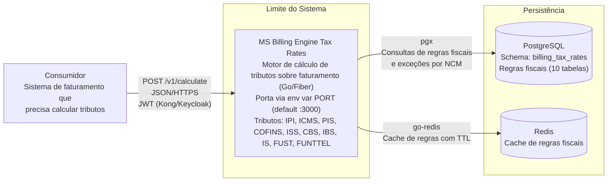

# Diagrama de Contexto — ms-billing-engine-tax-rates

## Atores e Sistemas

| Ator/Sistema | Tipo | Protocolo | Descrição |
|-------------|------|-----------|-----------|
| Consumidor (sistema de faturamento) | Sistema interno | HTTPS | Envia documentos fiscais para cálculo de tributos |
| MS Billing Engine Tax Rates | Sistema (este serviço) | — | Motor de cálculo fiscal Go/Fiber, pipeline SOP-013 7 fases |
| PostgreSQL | Banco de dados | pgx (TCP) | Persistência de regras fiscais (10 tabelas) |
| Redis | Cache | TCP | Cache de regras fiscais |

## Fluxo de Requisição

1. Sistema consumidor envia `POST /v1/calculate` com payload `DocumentoFiscalEntrada` (itens com SKU, NCM, valores, UFs origem/destino)
2. Middleware pipeline: `recover` → `requestid (W3C Trace Context)` → `ratelimit` → `auth (JWT Kong/Keycloak)` → `logger` → `metrics`
3. Handler faz parse e validação do payload (`input.Validate()`)
4. Engine executa pipeline SOP-013 de 7 fases:
   - **F0 (Seq):** IS — pré-filtro via `ncm_seletivo`
   - **F1 (Seq):** IPI — compõe base do ICMS
   - **F2 (Seq):** CBS — "por fora", não compõe base de outros
   - **F3 (Seq):** ICMS — antes do PIS/COFINS (Tese do Século)
   - **F4 (Par):** IBS + ISS + PIS/COFINS — com exclusão do ICMS
   - **F5 (Seq):** FUST — depende ICMS+PIS+COFINS
   - **F6 (Seq):** FUNTTEL — mesma base do FUST
5. `injectTributoValues()` injeta valores entre fases para dependências
6. Resposta `DocumentoFiscalSaida` com 11 tributos calculados e UUID de transação retorna ao consumidor

> **Deploy:** Docker multi-stage (`Dockerfile`), `docker-compose.yaml` (app+PG+Redis), Kubernetes (`deploy/k8s/`).
