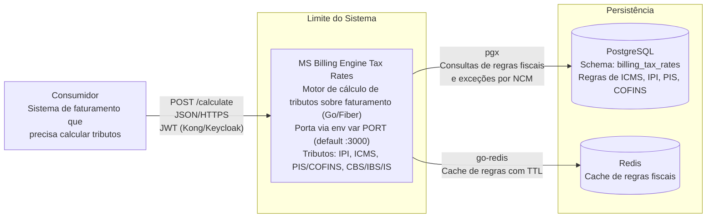

# Diagrama de Contexto — ms-billing-engine-tax-rates

## Atores e Sistemas

| Ator/Sistema | Tipo | Protocolo | Descrição |
|-------------|------|-----------|-----------|
| Consumidor (sistema de faturamento) | Sistema interno | HTTPS | Envia documentos fiscais para cálculo de tributos |
| MS Billing Engine Tax Rates | Sistema (este serviço) | — | Motor de cálculo fiscal Go/Fiber, execução bifásica |
| PostgreSQL | Banco de dados | pgx (TCP) | Persistência de regras fiscais (7 tabelas + log) |
| Redis | Cache | TCP | Cache de regras fiscais |

## Fluxo de Requisição

1. Sistema consumidor envia `POST /calculate` com payload `DocumentoFiscalEntrada` (itens com SKU, NCM, valores, UFs origem/destino)
2. Middleware pipeline: `recover` → `requestid (W3C Trace Context)` → `auth (JWT Kong/Keycloak)` → `logger` → `metrics`
3. Handler faz parse e validação do payload (`input.Validate()`)
4. Engine executa Fase 1 (sequencial): IPI para cada item
5. IPI calculado é injetado como `ITEM_IPI_VALOR` nos detalhes do item
6. Engine executa Fase 2 (paralela via goroutines): ICMS, PIS/COFINS e Reforma (CBS/IBS/IS) simultaneamente
7. ICMS utiliza valor do IPI como parte da base de cálculo; PIS/COFINS utiliza valor do ICMS para exclusão da base
8. Reforma Tributária calcula CBS, IBS (estadual+municipal) e IS via consulta à tabela `iva_dual_rules`
9. Resposta `DocumentoFiscalSaida` com tributos calculados e UUID de transação retorna ao consumidor
