# Modelo de Dados (ERD) — ms-billing-engine-tax-rates

> Schema: `billing_tax_rates`
> Fonte: `data/init.sql`
> Atualizado: 2026-07-02 (15 tabelas documentadas)
>
> 📋 **Dicionário de Dados:** Para descrições detalhadas da função de negócio, propósito, padrões de uso e regras associadas a cada tabela, consulte [data-dictionary.md](data-dictionary.md). Este documento foca na estrutura relacional; o dicionário complementa com a semântica.

## Diagrama Entidade-Relacionamento

```mermaid
erDiagram
    icms_rules ||--o{ product_tax_exceptions : "sobrescrito_por_ncm"
    iva_dual_rules ||--o{ iva_dual_rules_log : "auditado_por"
    iva_dual_rules }o--|| ncm_seletivo : "ncm_pode_ser_seletivo"
    iva_dual_rules }o--|| cst_reforma : "cst_aplicavel"

    %% ═══════════════════════════════════════════
    %% Regime ICMS
    %% ═══════════════════════════════════════════

    icms_rules {
        bigserial id PK
        varchar uf_origem "UF de origem"
        varchar uf_destino "UF de destino"
        decimal aliquota_interna "Alíquota interna do destino (%)"
        decimal aliquota_interestadual "Alíquota interestadual (%)"
        varchar cst_padrao "CST padrão (default 00)"
        decimal reducao_base "Redução de base (%)"
        decimal percentual_fcp "Percentual FCP adicional"
        decimal mva_padrao "MVA para ST"
        boolean possui_protocolo_st "Possui protocolo ST?"
        int motivo_desoneracao_icms "Motivo desoneração (código SEFAZ)"
        boolean possui_desoneracao "Há desoneração de ICMS?"
        date inicio_validade "Início da vigência"
        date final_validade "Fim da vigência (NULL = vigente)"
        date criado_em "Data de criação"
        date atualizado_em "Data de atualização"
    }

    product_tax_exceptions {
        bigserial id PK
        varchar ncm "NCM (completo ou 4 dígitos)"
        varchar uf_origem "UF origem (default **)"
        varchar uf_destino "UF destino"
        varchar cst_pis "CST PIS"
        varchar cst_cofins "CST COFINS"
        varchar cst_icms "CST ICMS"
        varchar csosn "CSOSN (Simples Nacional)"
        decimal mva_st "MVA para ST (%)"
        decimal aliquota_interna_destino "Alíquota interna destino"
        decimal aliquota_interestadual "Alíquota interestadual"
        decimal percentual_fcp "Percentual FCP"
        decimal reducao_base "Redução de base (%)"
        boolean possui_protocolo_st "Possui protocolo ST?"
        varchar motivo_desoneracao_icms "Motivo desoneração"
        boolean possui_desoneracao "Há desoneração?"
        varchar desoneracao_codigo_beneficio_fiscal "Código benefício fiscal"
        varchar regime_tributario_destino "Regime tributário destino"
        decimal aliquota_pis_unitario "Alíquota PIS unitária (CST 03)"
        decimal aliquota_cofins_unitario "Alíquota COFINS unitária (CST 03)"
        date inicio_validade "Início da vigência"
        date final_validade "Fim da vigência (NULL = vigente)"
        timestamp criado_em "Data de criação"
        timestamp atualizado_em "Data de atualização"
    }

    tax_equivalence {
        bigserial id PK
        varchar csosn "Código CSOSN (Simples Nacional)"
        varchar cst_equivalente "CST equivalente"
        boolean permite_credito "Permite crédito?"
        varchar descricao "Descrição"
        varchar tipo_operacao_fiscal "Tipo de operação"
        date inicio_validade "Início da vigência"
        date final_validade "Fim da vigência (NULL = vigente)"
        timestamp criado_em "Data de criação"
        timestamp atualizado_em "Data de atualização"
    }

    simples_nacional_rates {
        bigserial id PK
        varchar anexo "Anexo (ANEXO_I, ANEXO_II, etc.)"
        int faixa "Faixa (1 a 6)"
        decimal receita_min "Receita bruta mínima"
        decimal receita_max "Receita bruta máxima"
        decimal aliquota_nominal "Alíquota nominal (%)"
        decimal valor_deduzir "Valor a deduzir"
        decimal percentual_icms "Percentual ICMS no Simples (%)"
        decimal aliquota_repasse_credito "Alíquota repasse crédito"
        date inicio_validade "Início da vigência"
        date final_validade "Fim da vigência (NULL = vigente)"
        timestamp criado_em "Data de criação"
        timestamp atualizado_em "Data de atualização"
    }

    %% ═══════════════════════════════════════════
    %% Regime Federal (PIS/COFINS)
    %% ═══════════════════════════════════════════

    federal_tax_rules {
        bigserial id PK
        varchar regime_tributario "Regime (LUCRO_REAL, LUCRO_PRESUMIDO)"
        varchar cst_pis "CST PIS (01, 02, 03, etc.)"
        varchar cst_cofins "CST COFINS (01, 02, 03, etc.)"
        decimal aliquota_pis "Alíquota PIS (%)"
        decimal aliquota_cofins "Alíquota COFINS (%)"
        boolean exclui_icms_base "ICMS excluído da base?"
        date inicio_validade "Início da vigência"
        date final_validade "Fim da vigência (NULL = vigente)"
        timestamp criado_em "Data de criação"
        timestamp atualizado_em "Data de atualização"
    }

    %% ═══════════════════════════════════════════
    %% IPI
    %% ═══════════════════════════════════════════

    ipi_regras {
        bigserial id PK
        varchar ncm "NCM do produto (* = todos)"
        varchar ex_ipi "Código EX na TIPI (* = todos)"
        varchar crt_emitente "CRT emitente (* = todos)"
        varchar tipo_operacao_fiscal "Tipo operação fiscal"
        varchar perfil_comprador "Perfil do comprador"
        varchar uf_destino "UF destino (* = todas)"
        varchar zona_especial "Zona Franca ou ALC"
        decimal aliquota_ipi "Alíquota IPI (%)"
        decimal valor_pauta_ipi "Valor de pauta IPI"
        varchar cst_ipi "CST IPI"
        varchar c_enq "Código enquadramento legal"
        boolean possui_desoneracao "Há desoneração?"
        varchar motivo_desoneracao "Motivo desoneração"
        varchar desoneracao_codigo_beneficio_fiscal "Código benefício"
        varchar motivo_desoneracao_ipi "Motivo desoneração IPI"
        date inicio_validade "Início da vigência"
        date final_validade "Fim da vigência (NULL = vigente)"
        timestamp criado_em "Data de criação"
        timestamp atualizado_em "Data de atualização"
    }

    %% ═══════════════════════════════════════════
    %% ISS
    %% ═══════════════════════════════════════════

    iss_rates {
        bigserial id PK
        varchar codigo_ibge "Código IBGE do município (7 dígitos)"
        varchar municipio_nome "Nome do município"
        varchar uf "UF"
        decimal aliquota_iss "Alíquota ISS (%)"
        varchar item_lista_servico "Item da Lista LC 116/2003 (ex: 1.05)"
        varchar descricao "Descrição"
        date inicio_validade "Início da vigência"
        date final_validade "Fim da vigência (NULL = vigente)"
        timestamp criado_em "Data de criação"
        timestamp atualizado_em "Data de atualização"
    }

    %% ═══════════════════════════════════════════
    %% Reforma Tributária (IVA Dual)
    %% ═══════════════════════════════════════════

    reforma_tributaria_rules {
        bigserial id PK
        varchar ncm "NCM do produto"
        varchar tipo_aliquota "Tipo (padrao, reduzida_60, reduzida_100, seletivo)"
        decimal aliquota_cbs "Alíquota CBS (%)"
        decimal aliquota_ibs_estadual "Alíquota IBS estadual (%)"
        decimal aliquota_ibs_municipal "Alíquota IBS municipal (%)"
        decimal aliquota_is "Alíquota IS (%)"
        boolean permite_credito_amplo "Permite crédito amplo?"
        date inicio_validade "Início da vigência"
        date final_validade "Fim da vigência (NULL = vigente)"
    }

    iva_dual_rules {
        bigserial id PK
        varchar ncm "NCM do produto"
        varchar uf_destino "UF destino do imposto"
        varchar municipio_destino_ibge "Código IBGE município (NULL = regra estadual)"
        decimal aliquota_cbs "Alíquota CBS federal (%)"
        decimal aliquota_ibs_estadual "Alíquota IBS estadual (%)"
        decimal aliquota_ibs_municipal "Alíquota IBS municipal (%)"
        decimal percentual_reducao "Percentual de redução (0, 60, 100)"
        boolean is_imposto_seletivo "Incide Imposto Seletivo?"
        decimal aliquota_is "Alíquota IS (%)"
        date inicio_validade "Início da vigência"
        date final_validade "Fim da vigência (NULL = vigente)"
    }

    iva_dual_rules_log {
        bigserial log_id PK
        varchar operation_type "I, U ou D"
        varchar changed_by "Usuário que alterou"
        timestamp changed_at "Timestamp da alteração"
        int original_id FK "ID da regra original"
        varchar ncm "NCM snapshot"
        varchar uf_destino "UF destino snapshot"
        varchar municipio_destino_ibge "IBGE snapshot"
        decimal aliquota_cbs "CBS snapshot"
        decimal aliquota_ibs_estadual "IBS estadual snapshot"
        decimal aliquota_ibs_municipal "IBS municipal snapshot"
        decimal percentual_reducao "Redução snapshot"
        boolean is_imposto_seletivo "IS flag snapshot"
        decimal aliquota_is "IS snapshot"
        date inicio_validade "Início vigência snapshot"
        date final_validade "Fim vigência snapshot"
    }

    ncm_seletivo {
        bigserial id PK
        varchar ncm "NCM do produto"
        varchar categoria "Categoria (BEBIDAS_ALCOOLICAS, CIGARROS, etc.)"
        decimal aliquota_is "Alíquota IS (%)"
        varchar descricao "Descrição"
        date inicio_validade "Início da vigência"
        date final_validade "Fim da vigência (NULL = vigente)"
        timestamp criado_em "Data de criação"
        timestamp atualizado_em "Data de atualização"
    }

    cbs_rates {
        bigserial id PK
        varchar c_class_trib "Classe tributária CBS (TELECOM, GERAL, SAUDE)"
        decimal aliquota_cbs "Alíquota CBS (%)"
        varchar descricao "Descrição"
        date inicio_validade "Início da vigência"
        date final_validade "Fim da vigência (NULL = vigente)"
        timestamp criado_em "Data de criação"
        timestamp atualizado_em "Data de atualização"
    }

    cst_reforma {
        bigserial id PK
        varchar cst "CST (3 dígitos)"
        varchar cct "CCT único (6 dígitos)"
        varchar descricao_cst "Descrição do CST"
        varchar descricao_cct "Descrição do CCT"
        boolean exige_tributacao "Exige tributação?"
        boolean reducao_bc "Redução de base?"
        boolean reducao_aliquota "Redução de alíquota?"
        boolean transferencia_credito "Transferência de crédito?"
        boolean diferimento "Diferimento?"
        boolean monofasica "Monofásica?"
        boolean credito_presumido "Crédito presumido?"
        boolean ajuste_competencia "Ajuste de competência?"
        decimal percentual_reducao_ibs "Redução IBS (%)"
        decimal percentual_reducao_cbs "Redução CBS (%)"
        varchar tipo_aliquota "Tipo de alíquota"
        varchar url_legislacao "URL da legislação"
        varchar simples_nacional "Aplicabilidade Simples Nacional"
        timestamp created_at "Data de criação"
    }

    %% ═══════════════════════════════════════════
    %% Tabelas Operacionais
    %% ═══════════════════════════════════════════

    tax_tokens {
        uuid id PK
        varchar ncm "NCM do produto"
        varchar uf_origem "UF de origem"
        varchar uf_destino "UF destino"
        varchar municipio_ibge "Código IBGE município"
        decimal aliquota_cbs "Alíquota CBS (%)"
        decimal aliquota_ibs_estadual "Alíquota IBS estadual (%)"
        decimal aliquota_ibs_municipal "Alíquota IBS municipal (%)"
        decimal aliquota_is "Alíquota IS (%)"
        timestamp expires_at "Timestamp de expiração"
        timestamp created_at "Data de criação"
    }

    fornecedor_fiscal {
        varchar cnpj PK "CNPJ (14 dígitos)"
        varchar regime_tributario "Regime tributário"
        boolean certificado_regularidade "Certidão fiscal válida?"
        boolean permite_credito "Permite crédito?"
        timestamp data_qualificacao "Data de qualificação"
        timestamp data_validade "Data de validade"
        varchar status "Status (ATIVO, PENDENTE, BLOQUEADO)"
    }
```

## Resumo das 15 Tabelas

### Regime Atual (Pré-Reforma) — 7 tabelas

| # | Tabela | Tributo | Propósito |
|---|---|---|---|
| 1 | `icms_rules` | ICMS | Matriz de alíquotas por par (UF origem, UF destino) — regra geral |
| 2 | `federal_tax_rules` | PIS, COFINS | Alíquotas por regime tributário e CST |
| 3 | `product_tax_exceptions` | ICMS, PIS, COFINS | Exceções por NCM — sobrescreve regras gerais |
| 4 | `tax_equivalence` | ICMS | Mapeamento CSOSN → CST para Simples Nacional |
| 5 | `simples_nacional_rates` | ICMS | Faixas progressivas do Simples Nacional por anexo |
| 6 | `ipi_regras` | IPI | Regras com 7 dimensões de lookup (NCM, EX, CRT, operação, perfil, UF, zona) |
| 7 | `iss_rates` | ISS | Alíquotas municipais por código IBGE |

### Reforma Tributária (IVA Dual) — 6 tabelas

| # | Tabela | Tributo | Propósito |
|---|---|---|---|
| 8 | `iva_dual_rules` | CBS, IBS | Tabela mestra do IVA Dual — alíquotas por (NCM, UF, município) |
| 9 | `iva_dual_rules_log` | — | Auditoria de alterações na `iva_dual_rules` |
| 10 | `reforma_tributaria_rules` | CBS, IBS, IS | ⚠️ Legado — substituída por `iva_dual_rules` |
| 11 | `ncm_seletivo` | IS | Catálogo de NCMs sujeitos ao Imposto Seletivo |
| 12 | `cbs_rates` | CBS | Alíquotas CBS por classe tributária setorial |
| 13 | `cst_reforma` | CBS, IBS | 164 CCTs oficiais (LC 214/2025) — CST do regime IVA Dual |

### Operacional — 2 tabelas

| # | Tabela | Tributo | Propósito |
|---|---|---|---|
| 14 | `tax_tokens` | CBS, IBS, IS | Congelamento temporal de alíquotas (snapshot UUID) |
| 15 | `fornecedor_fiscal` | — | Qualificação fiscal de fornecedores para cálculo de créditos |

## Relacionamentos

| Origem | Destino | Cardinalidade | Significado |
|---|---|---|---|
| `icms_rules` | `product_tax_exceptions` | 1:N | Uma regra geral pode ter múltiplas exceções por NCM que a sobrescrevem |
| `iva_dual_rules` | `iva_dual_rules_log` | 1:N | Cada regra IVA Dual tem seu histórico de alterações auditado |
| `iva_dual_rules` | `ncm_seletivo` | N:1 | Um NCM na regra IVA Dual pode estar sujeito ao Imposto Seletivo |
| `iva_dual_rules` | `cst_reforma` | N:1 | Cada operação com IVA Dual resolve o CST oficial aplicável |

**Tabelas independentes (sem FK):** `tax_equivalence`, `simples_nacional_rates`, `federal_tax_rules`, `ipi_regras`, `iss_rates`, `reforma_tributaria_rules`, `cbs_rates`, `tax_tokens`, `fornecedor_fiscal` — são tabelas de lookup consultadas diretamente pelas calculadoras, sem relacionamentos formais de chave estrangeira entre si.

## Padrões Comuns

- **Vigência temporal:** Todas as tabelas usam `inicio_validade`/`final_validade` (NULL = vigente). Trigger `fechar_fim_validade_generica()` fecha automaticamente a regra anterior ao inserir uma nova.
- **Wildcard matching:** `*` como catch-all em campos de UF, NCM (4 dígitos para grupo). Match mais específico prevalece via `ORDER BY`.
- **Triggers PL/pgSQL:** `fechar_fim_validade_generica` (fecha vigência) e `atualizar_data_atualizacao_generica` (atualiza timestamp). `iva_dual_rules` tem trigger adicional de auditoria (`fn_log_iva_dual_rules`).
- **Unique indexes compostos:** Múltiplas colunas + `inicio_validade` com `WHERE final_validade IS NULL` para evitar duplicação de regras vigentes.
- **Cache Redis:** `CachedTaxRepository` aplica TTL 24h para `GetIvaDualRule`, `GetICMSRule`, `GetFederalTaxRule`.
