# Modelo de Dados (ERD) — ms-billing-engine-tax-rates

> Schema: `billing_tax_rates`
> Fonte: `data/init.sql`
> Atualizado: 2026-06-21 (adição de ipi_regras, reforma_tributaria_rules; correção de colunas em iva_dual_rules e icms_rules)

## Diagrama Entidade-Relacionamento

```mermaid
erDiagram
    icms_rules ||--o{ product_tax_exceptions : "referenciado_por_ncm"
    tax_equivalence ||--o{ icms_rules : "mapeia_csosn_para_cst"
    iva_dual_rules ||--o{ iva_dual_rules_log : "auditado_por"

    icms_rules {
        bigserial id PK
        varchar uf_origem "UF de origem"
        varchar uf_destino "UF de destino"
        decimal aliquota_interna "Alíquota interna do destino (%)"
        decimal aliquota_interestadual "Alíquota interestadual (%)"
        varchar cst_padrao "CST padrão (default 00)"
        decimal reducao_base "Redução de base (%)"
        decimal percentual_fcp "Percentual FCP adicional"
        decimal mva_padrao "MVA para ST"
        boolean possui_protocolo_st "Possui protocolo ST?"
        int motivo_desoneracao_icms "Motivo desoneração (código SEFAZ)"
        boolean possui_desoneracao "Há desoneração de ICMS?"
        date inicio_validade "Início da vigência"
        date final_validade "Fim da vigência (NULL = vigente)"
        date criado_em "Data de criação"
        date atualizado_em "Data de atualização"
    }

    federal_tax_rules {
        bigserial id PK
        varchar regime_tributario "Regime (LUCRO_REAL, LUCRO_PRESUMIDO)"
        varchar cst_pis "CST PIS (01, 02, 03, etc.)"
        varchar cst_cofins "CST COFINS (01, 02, 03, etc.)"
        decimal aliquota_pis "Alíquota PIS (%)"
        decimal aliquota_cofins "Alíquota COFINS (%)"
        boolean exclui_icms_base "ICMS excluído da base?"
        date inicio_validade "Início da vigência"
        date final_validade "Fim da vigência (NULL = vigente)"
        timestamp criado_em "Data de criação"
        timestamp atualizado_em "Data de atualização"
    }

    product_tax_exceptions {
        bigserial id PK
        varchar ncm "NCM (completo ou 4 dígitos)"
        varchar uf_origem "UF origem (default **)"
        varchar uf_destino "UF destino"
        varchar cst_pis "CST PIS"
        varchar cst_cofins "CST COFINS"
        varchar cst_icms "CST ICMS"
        varchar csosn "CSOSN (Simples Nacional)"
        decimal mva_st "MVA para ST (%)"
        decimal aliquota_interna_destino "Alíquota interna destino"
        decimal aliquota_interestadual "Alíquota interestadual"
        decimal percentual_fcp "Percentual FCP"
        decimal reducao_base "Redução de base (%)"
        boolean possui_protocolo_st "Possui protocolo ST?"
        varchar motivo_desoneracao_icms "Motivo desoneração"
        boolean possui_desoneracao "Há desoneração?"
        varchar desoneracao_codigo_beneficio_fiscal "Código benefício fiscal"
        varchar regime_tributario_destino "Regime tributário destino"
        decimal aliquota_pis_unitario "Alíquota PIS unitária (CST 03)"
        decimal aliquota_cofins_unitario "Alíquota COFINS unitária (CST 03)"
        date inicio_validade "Início da vigência"
        date final_validade "Fim da vigência (NULL = vigente)"
        timestamp criado_em "Data de criação"
        timestamp atualizado_em "Data de atualização"
    }

    tax_equivalence {
        bigserial id PK
        varchar csosn "Código CSOSN (Simples Nacional)"
        varchar cst_equivalente "CST equivalente"
        boolean permite_credito "Permite crédito?"
        varchar descricao "Descrição"
        varchar tipo_operacao_fiscal "Tipo de operação"
        date inicio_validade "Início da vigência"
        date final_validade "Fim da vigência (NULL = vigente)"
        timestamp criado_em "Data de criação"
        timestamp atualizado_em "Data de atualização"
    }

    simples_nacional_rates {
        bigserial id PK
        varchar anexo "Anexo (ANEXO_I, ANEXO_II, etc.)"
        int faixa "Faixa (1 a 6)"
        decimal receita_min "Receita bruta mínima"
        decimal receita_max "Receita bruta máxima"
        decimal aliquota_nominal "Alíquota nominal (%)"
        decimal valor_deduzir "Valor a deduzir"
        decimal percentual_icms "Percentual ICMS no Simples (%)"
        decimal aliquota_repasse_credito "Alíquota repasse crédito"
        date inicio_validade "Início da vigência"
        date final_validade "Fim da vigência (NULL = vigente)"
        timestamp criado_em "Data de criação"
        timestamp atualizado_em "Data de atualização"
    }

    ipi_regras {
        bigserial id PK
        varchar ncm "NCM do produto (* = todos)"
        varchar ex_ipi "Código EX na TIPI (* = todos)"
        varchar crt_emitente "CRT emitente (* = todos)"
        varchar tipo_operacao_fiscal "Tipo operação fiscal"
        varchar perfil_comprador "Perfil do comprador"
        varchar uf_destino "UF destino (* = todas)"
        varchar zona_especial "Zona Franca ou ALC"
        decimal aliquota_ipi "Alíquota IPI (%)"
        decimal valor_pauta_ipi "Valor de pauta IPI"
        varchar cst_ipi "CST IPI"
        varchar c_enq "Código enquadramento legal"
        boolean possui_desoneracao "Há desoneração?"
        varchar motivo_desoneracao "Motivo desoneração"
        varchar desoneracao_codigo_beneficio_fiscal "Código benefício"
        varchar motivo_desoneracao_ipi "Motivo desoneração IPI"
        date inicio_validade "Início da vigência"
        date final_validade "Fim da vigência (NULL = vigente)"
        timestamp criado_em "Data de criação"
        timestamp atualizado_em "Data de atualização"
    }

    reforma_tributaria_rules {
        bigserial id PK
        varchar ncm "NCM do produto"
        varchar tipo_aliquota "Tipo (padrao, reduzida_60, reduzida_100, seletivo)"
        decimal aliquota_cbs "Alíquota CBS (%)"
        decimal aliquota_ibs_estadual "Alíquota IBS estadual (%)"
        decimal aliquota_ibs_municipal "Alíquota IBS municipal (%)"
        decimal aliquota_is "Alíquota IS (%)"
        boolean permite_credito_amplo "Permite crédito amplo?"
        date inicio_validade "Início da vigência"
        date final_validade "Fim da vigência (NULL = vigente)"
    }

    iva_dual_rules {
        bigserial id PK
        varchar ncm "NCM do produto"
        varchar uf_destino "UF destino do imposto"
        varchar municipio_destino_ibge "Código IBGE município (NULL = regra estadual)"
        decimal aliquota_cbs "Alíquota CBS federal (%)"
        decimal aliquota_ibs_estadual "Alíquota IBS estadual (%)"
        decimal aliquota_ibs_municipal "Alíquota IBS municipal (%)"
        decimal percentual_reducao "Percentual de redução (0, 60, 100)"
        boolean is_imposto_seletivo "Incide Imposto Seletivo?"
        decimal aliquota_is "Alíquota IS (%)"
        date inicio_validade "Início da vigência"
        date final_validade "Fim da vigência (NULL = vigente)"
    }

    iva_dual_rules_log {
        bigserial log_id PK
        varchar operation_type "I, U ou D"
        varchar changed_by "Usuário que alterou"
        timestamp changed_at "Timestamp da alteração"
        int original_id FK "ID da regra original"
        varchar ncm "NCM snapshot"
        varchar uf_destino "UF destino snapshot"
        varchar municipio_destino_ibge "IBGE snapshot"
        decimal aliquota_cbs "CBS snapshot"
        decimal aliquota_ibs_estadual "IBS estadual snapshot"
        decimal aliquota_ibs_municipal "IBS municipal snapshot"
        decimal percentual_reducao "Redução snapshot"
        boolean is_imposto_seletivo "IS flag snapshot"
        decimal aliquota_is "IS snapshot"
        date inicio_validade "Início vigência snapshot"
        date final_validade "Fim vigência snapshot"
    }
```

## Padrões Comuns

- **Vigência temporal:** Todas as tabelas usam `inicio_validade`/`final_validade` (NULL = vigente)
- **Wildcard matching:** `*` como catch-all em campos de UF, NCM (4 dígitos)
- **Triggers PL/pgSQL:** `fechar_fim_validade_generica` e `atualizar_data_atualizacao_generica`
- **Unique indexes compostos:** Múltiplas colunas para evitar duplicação de regras por período
