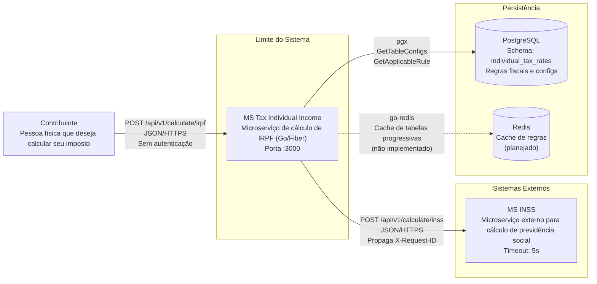

# Diagrama de Contexto — ms-tax-individual-income

## Atores e Sistemas

| Ator/Sistema | Tipo | Protocolo | Descrição |
|-------------|------|-----------|-----------|
| Contribuinte | Pessoa (usuário final) | HTTPS | Solicita cálculo de IRPF via API |
| MS Tax Individual Income | Sistema (este serviço) | — | Motor de cálculo fiscal Go/Fiber |
| MS INSS | Sistema externo | HTTPS | Microserviço de previdência social |
| PostgreSQL | Banco de dados | pgx (TCP) | Persistência de regras fiscais e configs |
| Redis | Cache | TCP | Cache de tabelas progressivas (planejado) |

## Fluxo de Requisição

1. Contribuinte envia `POST /api/v1/calculate/irpf` com dados financeiros
2. Middleware `requestid` gera `X-Request-ID`
3. Handler faz parse do body (`UniversalTaxRequest`), define `reference_date` default se ausente
4. Service carrega configurações fiscais do PostgreSQL (`GetTableConfigs`)
5. Service dispara goroutines para cálculos Completo e Simplificado em paralelo
6. Modelo Completo consulta INSS externo (com timeout 5s, propaga `X-Request-ID`)
7. Ambos os modelos executam `runTaxMath` com tabela progressiva e regras da Reforma 2026
8. Sistema compara resultados e marca `IsRecommended` no modelo mais barato
9. Resposta JSON com ambos os resultados retorna ao contribuinte
