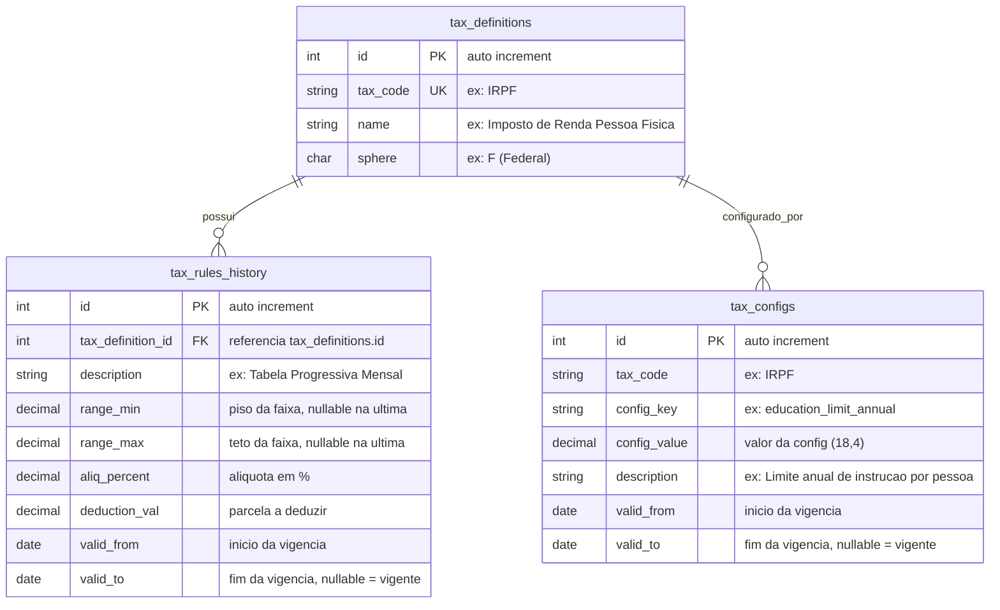

# Modelo de Dados (ERD) — ms-tax-individual-income

> Schema: `individual_tax_rates`
> Fonte: `data/init.sql`, `services/calculation_service.go`

## Diagrama Entidade-Relacionamento

## Tabelas

### tax_definitions
Cadastro de tributos suportados pelo motor de cálculo.

| Coluna | Tipo | Constraints | Descrição |
|--------|------|-------------|-----------|
| id | SERIAL | PK | Identificador único |
| tax_code | VARCHAR(20) | NOT NULL, UNIQUE | Código do tributo (ex: "IRPF") |
| name | VARCHAR | NOT NULL | Nome descritivo |
| sphere | CHAR(1) | NOT NULL | Esfera: F (Federal), E (Estadual), M (Municipal) |

### tax_rules_history
Tabela progressiva de alíquotas com versionamento por data.

| Coluna | Tipo | Constraints | Descrição |
|--------|------|-------------|-----------|
| id | SERIAL | PK | Identificador único |
| tax_definition_id | INT | FK → tax_definitions.id | Tributo associado |
| description | TEXT | NULLABLE | Descrição da faixa |
| range_min | DECIMAL | NOT NULL | Piso da faixa (inclusivo). NULL apenas na última faixa |
| range_max | DECIMAL | NULLABLE | Teto da faixa (inclusivo). NULL na última faixa (sem limite superior) |
| aliq_percent | DECIMAL | NOT NULL | Alíquota em percentual (ex: 7.5 = 7,5%) |
| deduction_val | DECIMAL | NOT NULL | Parcela a deduzir |
| valid_from | DATE | NOT NULL | Início da vigência |
| valid_to | DATE | NULLABLE | Fim da vigência. NULL = vigente |

### tax_configs
Configurações dinâmicas de regras fiscais (limites, tetos, percentuais).

| Coluna | Tipo | Constraints | Descrição |
|--------|------|-------------|-----------|
| id | SERIAL | PK | Identificador único |
| tax_code | VARCHAR(20) | NOT NULL | Código do tributo |
| config_key | VARCHAR(50) | NOT NULL | Chave da configuração |
| config_value | DECIMAL(18,4) | NOT NULL | Valor com precisão financeira |
| description | TEXT | NULLABLE | Descrição humana da config |
| valid_from | DATE | NOT NULL | Início da vigência |
| valid_to | DATE | NULLABLE | Fim da vigência. NULL = vigente |

**Unique constraint:** `(tax_code, config_key, valid_from)`

## Dados de Seed (init.sql)

### tax_definitions
| tax_code | name | sphere |
|----------|------|--------|
| IRPF | Imposto de Renda Pessoa Física | F |

### tax_rules_history (Tabela Progressiva Mensal vigente a partir de 02/2024)
| range_min | range_max | aliq_percent | deduction_val |
|-----------|-----------|-------------|---------------|
| 0.00 | 2.259,20 | 0,0% | 0,00 |
| 2.259,21 | 2.826,65 | 7,5% | 169,44 |
| 2.826,66 | 3.751,05 | 15,0% | 381,44 |
| 3.751,06 | 4.664,68 | 22,5% | 662,77 |
| 4.664,69 | ∞ (NULL) | 27,5% | 896,00 |

### tax_configs (vigentes a partir de 02/2024)
| config_key | config_value | description |
|------------|-------------|-------------|
| dependent_deduction_monthly | 189,59 | Valor mensal por dependente |
| dependent_deduction_annual | 2.275,08 | Valor anual por dependente |
| education_limit_annual | 3.561,50 | Limite anual de instrução por pessoa |
| simplified_discount_monthly_limit | 564,80 | Teto mensal do desconto simplificado (20%) |
| simplified_discount_annual_limit | 6.777,60 | Teto anual do desconto simplificado (20%) |
| pgbl_limit_percentage | 12,00 | Limite de dedução PGBL sobre renda bruta (%) |
| health_limit_annual | 999.999.999.999,99 | Limite de dedução em saúde (virtualmente ilimitado) |
