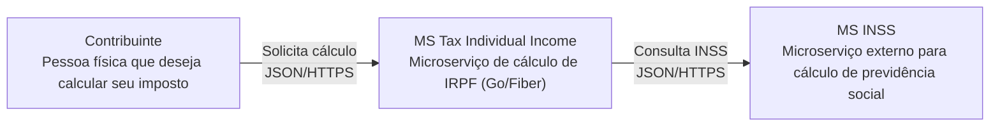
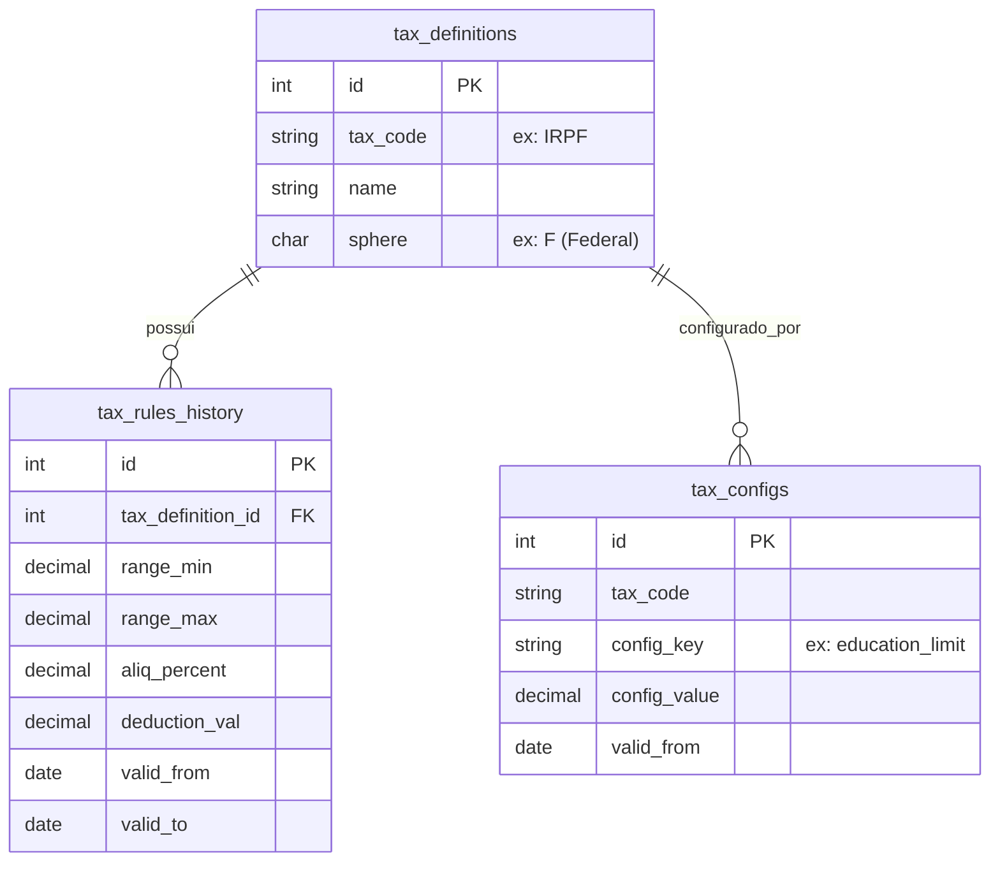

# Visão Geral Arquitetural — ms-tax-individual-income

Gerado pelo agente **Architect** em 2026-06-08.

## 🧱 Diagrama de Contexto (C4 Nível 1)

## 🗄️ Modelo de Dados (ERD)

O sistema utiliza um banco de dados relacional para armazenar regras e configurações.

## 🔌 Integrações e Protocolos

- **API Interna (Providenciada):**
    - `POST /api/v1/calculate/irpf`: Recebe dados financeiros e retorna cálculos Completo/Simplificado.
- **API Externa (Consumida):**
    - `POST {INSS_SERVICE_URL}/api/v1/calculate/inss`: Consulta valor de dedução previdenciária.
- **Persistência:** PostgreSQL (via `pgx`).
- **Cache:** Redis (para otimização de consultas de regras, embora a lógica atual mostre uso direto do repositório).

## ⚠️ Dívidas Técnicas Identificadas

1. **Ausência de Testes Automatizados:** Não foram encontrados arquivos `*_test.go`, o que é crítico para um serviço de cálculo financeiro.
2. **Dependência de Lib Local:** O uso de `replace` no `go.mod` para `taxnexus-individual-core-lib` indica uma dependência de ambiente de desenvolvimento que pode dificultar o build em CI/CD sem a estrutura de pastas correta.
3. **Tratamento de Erros Externos:** Se o serviço de INSS falha, o sistema apenas loga um aviso e continua. Pode ser necessário um comportamento mais rígido ou estratégia de fallback mais explícita conforme o negócio.
