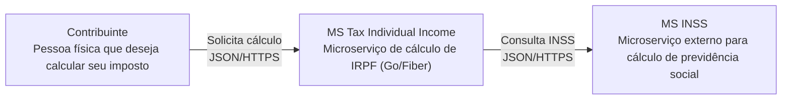

# Diagrama de Contexto — ms-tax-individual-income

```mermaid
flowchart LR
    contribuinte["Contribuinte\nPessoa física que deseja calcular seu imposto"]
    ms_tax["MS Tax Individual Income\nMicroserviço de cálculo de IRPF (Go/Fiber)"]
    ms_inss["MS INSS\nMicroserviço externo para cálculo de previdência social"]

    contribuinte -->|"Solicita cálculo\nJSON/HTTPS"| ms_tax
    ms_tax -->|"Consulta INSS\nJSON/HTTPS"| ms_inss
```
