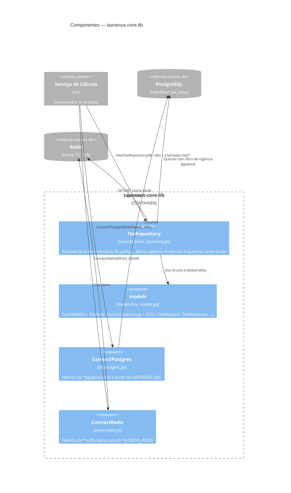

# C4 — Nível 3: Componentes (container `taxnexus-core-lib`)

> Gerado pelo **Arquiteto** (Reversa) em 2026-06-10 · `doc_level = completo`
> Confiança: 🟢 CONFIRMADO · 🟡 INFERIDO · 🔴 LACUNA

Detalhamento interno da biblioteca: o pacote `repository` é o componente com lógica; `db` e `cache` são fábricas de infraestrutura injetadas; `models` fornece os tipos.

## Componentes do `repository`

| Operação | Cache | Lógica chave | Confiança |
|----------|-------|--------------|-----------|
| `GetApplicableRule` | indireto (via `GetTaxRulesForPeriod`) | Seleção da **primeira** faixa cujo `[range_min, range_max]` contém a base; `range_max NULL` = faixa aberta; erro se nenhuma casa | 🟢 |
| `GetConfig` | **não** | Lê um `config_value` único por `config_key`; retorna `(Zero, err)` em falha | 🟢 |
| `GetTableConfigs` | sim (`tax_configs:<code>:<YYYY-MM-DD>`) | Mapa `config_key → config_value` vigente | 🟢 |
| `GetTaxRulesForPeriod` | sim (`tax_rules_list:<code>:<YYYY-MM-DD>`) | Lista faixas vigentes (JOIN `tax_definitions`), ordenadas por `range_min ASC` | 🟢 |

## Padrões transversais

- **Cache-aside** (A3): GET → miss → Postgres → SET (TTL 12h); erro de Redis não aborta (degradação graciosa). 🟢
- **Vigência temporal** (A2): `valid_from <= refDate AND (valid_to IS NULL OR valid_to >= refDate)` em todas as queries. 🟢
- **Decimal exato** (RN-08): todo valor monetário/alíquota é `decimal.Decimal`. 🟢
- **DI por construtor**: `NewTaxRepository(pool, client)`; `db`/`cache` são fábricas puras. 🟢

> Faixas garantidamente contíguas e sem sobreposição (🟢 D6) — premissa que valida a corretude do "primeiro match vence" em `GetApplicableRule`.
