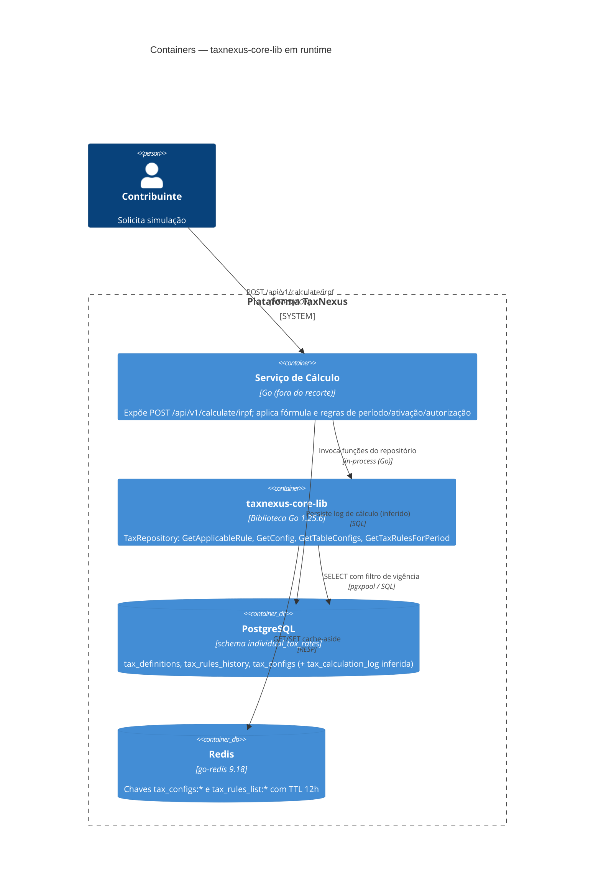

# C4 — Nível 2: Containers

> Gerado pelo **Arquiteto** (Reversa) em 2026-06-10 · `doc_level = completo`
> Confiança: 🟢 CONFIRMADO · 🟡 INFERIDO · 🔴 LACUNA

A biblioteca não é um container executável independente — ela é **linkada in-process** ao serviço de cálculo. Os containers de runtime relevantes são o serviço consumidor, os dois data stores e a própria lib como dependência compilada.

## Containers

| Container | Tecnologia | Responsabilidade | Confiança |
|-----------|------------|------------------|-----------|
| Serviço de Cálculo | Go (fora do recorte) | API REST, fórmula, cenários, período, autorização | 🟡 (existência 🟢) |
| **taxnexus-core-lib** | Go 1.25.6 (biblioteca) | Leitura versionada de parâmetros + cache | 🟢 |
| PostgreSQL | RDBMS, schema `individual_tax_rates` | Fonte de verdade dos parâmetros fiscais | 🟢 |
| Redis | Cache em memória | Aceleração de leitura (TTL 12h) | 🟢 |

## Configuração de runtime

| Variável | Consumida por | Uso | Confiança |
|----------|---------------|-----|-----------|
| `DATABASE_URL` | `db.ConnectPostgres` | String de conexão pgx | 🟢 |
| `REDIS_ADDR` | `cache.ConnectRedis` | Endereço do Redis | 🟢 |

> A escrita em `tax_calculation_log` (seta tracejada) é **inferida** — nenhuma query desta lib a executa (L2). Pertence ao serviço de cálculo.
