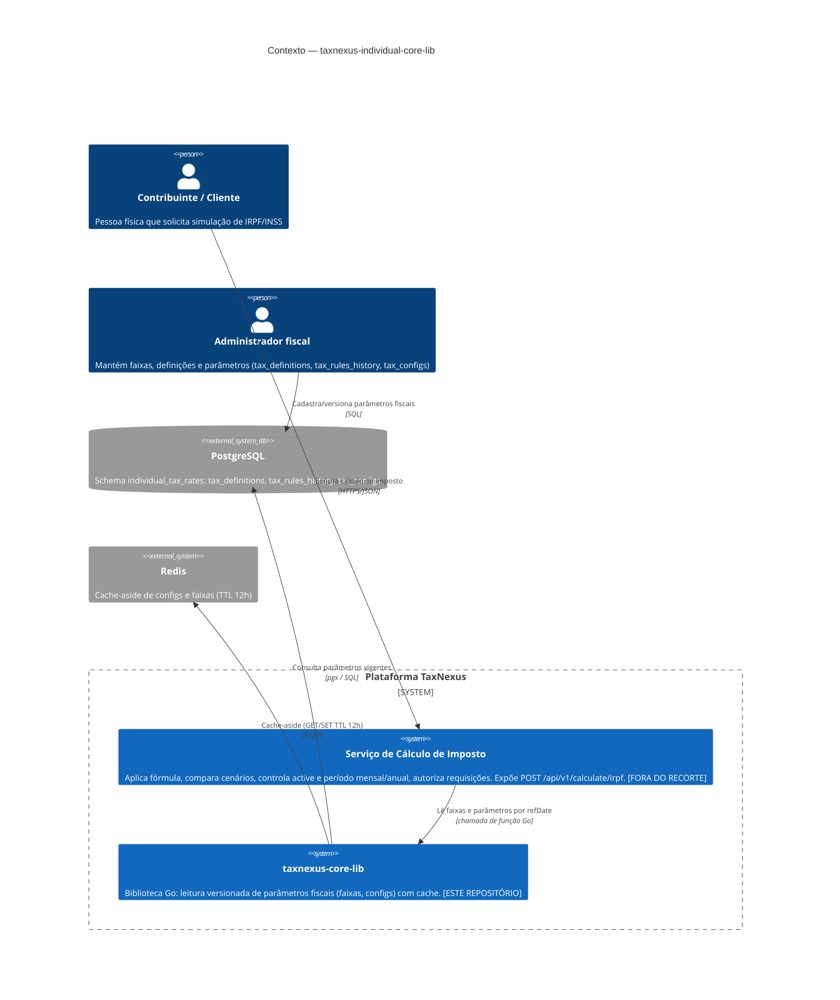

# C4 — Nível 1: Contexto

> Gerado pelo **Arquiteto** (Reversa) em 2026-06-10 · `doc_level = completo`
> Confiança: 🟢 CONFIRMADO · 🟡 INFERIDO · 🔴 LACUNA

O sistema central deste recorte é a biblioteca `taxnexus-core-lib`. Ela é consumida in-process por um **serviço de cálculo de imposto** (fora do recorte), que por sua vez expõe a API REST observada nos payloads de validação (`POST /api/v1/calculate/irpf` 🟢 D2).

## Atores e sistemas

| Elemento | Tipo | Papel | Confiança |
|----------|------|-------|-----------|
| Contribuinte / Cliente | Persona | Solicita simulação via serviço consumidor | 🟡 |
| Administrador fiscal | Persona | Mantém os dados de `individual_tax_rates` | 🟡 |
| Serviço de Cálculo de Imposto | Sistema (externo ao recorte) | Cálculo, comparação de cenários, `active`, período, autorização | 🟢 (existência confirmada por D2/D5/D7/D8) |
| **taxnexus-core-lib** | Sistema (este repo) | Leitura versionada de parâmetros fiscais com cache | 🟢 |
| PostgreSQL | Sistema externo | Persistência dos parâmetros | 🟢 |
| Redis | Sistema externo | Cache | 🟢 |

## Fronteira de responsabilidade (decisão central)

O que está **dentro** da lib: resolver faixa por base/data, ler configs, vigência temporal, cache.
O que está **fora** (no serviço consumidor): fórmula `base × alíquota − deduction_val` (🟢 D3), escolha do cenário recomendado de menor imposto (🟢 D4), bloqueio por `active` (🟢 D5), diferença mensal/anual (🟢 D7), autorização e multi-tenant (🟢 D8).
