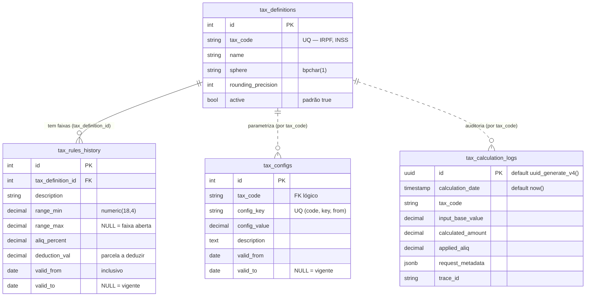

# ERD Completo — taxnexus-individual-core-lib

> Gerado pelo **Arquiteto** (Reversa) em 2026-06-10 · Atualizado pelo **Revisor** em 2026-06-12
> Fonte: `data-dictionary.md`, queries em `repository/tax_repository.go` e DDL real (A3).
> Confiança: 🟢 CONFIRMADO · 🟡 INFERIDO · 🔴 LACUNA

Schema PostgreSQL: **`individual_tax_rates`**.

## Entidades e cardinalidades

| Relacionamento | Cardinalidade | Chave | Confiança |
|----------------|---------------|-------|-----------|
| `tax_definitions` → `tax_rules_history` | 1 : N | `tax_rules_history.tax_definition_id` → `tax_definitions.id` | 🟢 |
| `tax_definitions` → `tax_configs` | 1 : N | associação lógica por `tax_code` | 🟢 |
| `tax_definitions` → `tax_calculation_logs` | 1 : N | associação lógica por `tax_code` | 🟢 |

## Invariantes de dados

| Invariante | Estado | Confiança |
|------------|--------|-----------|
| Faixas (`tax_rules_history`) contíguas e sem sobreposição por imposto/vigência | Garantido (Operacional) | 🟢 D6 |
| Último escalão com `range_max IS NULL` (faixa aberta superior) | Confirmado | 🟢 |
| Versionamento temporal: nunca apaga, encerra via `valid_to` (append-only) | Confirmado | 🟢 |
| `tax_code` único em `tax_definitions` | Confirmado (UQ no DDL) | 🟢 |

## Observações

- **Schema verificado:** O DDL confirmou a estrutura de schemas, tabelas, sequences e índices.
- **Tipagem exata:** Todos os campos monetários/percentuais são `numeric(18,4)`.
- **Auditoria:** A tabela `tax_calculation_logs` (plural) inclui `request_metadata jsonb`, confirmando sua vocação para evolução futura de auditoria detalhada.
