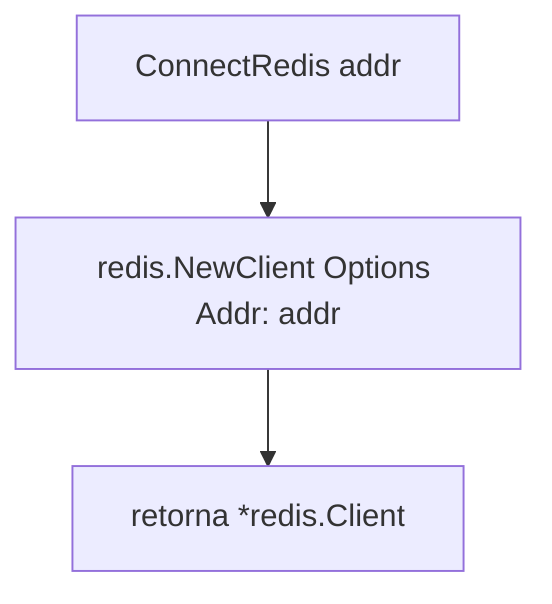

# Fluxograma — módulo `cache`

> Gerado pelo **Arqueólogo** (Reversa) em 2026-06-10
> Fonte: `cache/redis.go`

## `ConnectRedis`

> Observações:
> - Conexão **lazy**: não há `Ping`; falha só surge no primeiro comando. 🟡
> - Não retorna erro. 🟢
> - Sem password, sem DB index, sem TLS — `Addr` apenas. 🟡
> - `addr` provém de `REDIS_ADDR`. 🟢
