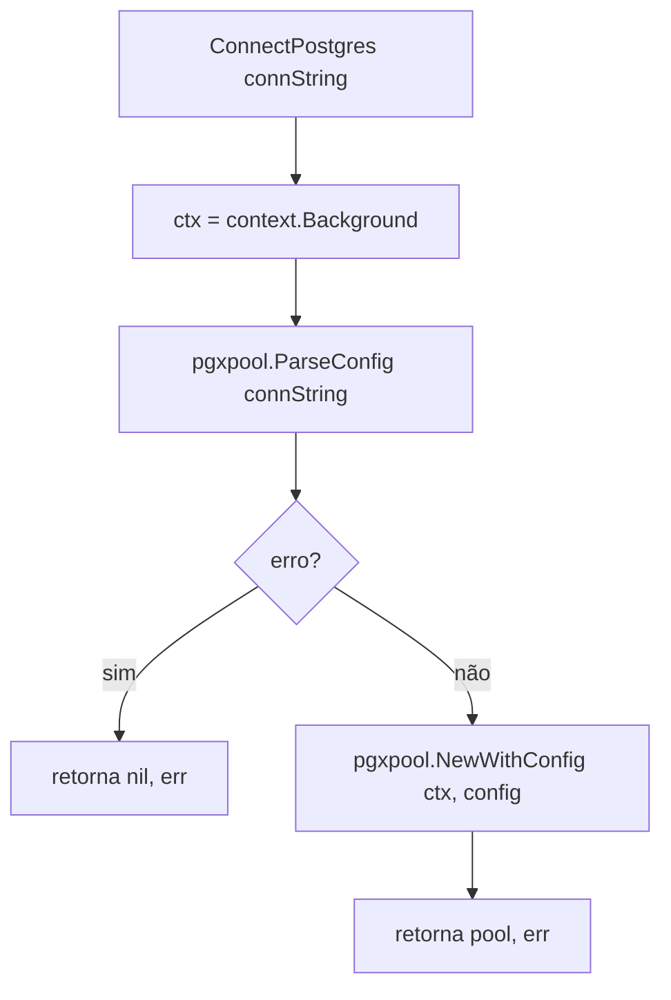

# Fluxograma — módulo `db`

> Gerado pelo **Arqueólogo** (Reversa) em 2026-06-10
> Fonte: `db/postgres.go`

## `ConnectPostgres`

> Observações:
> - Sem timeout/deadline no contexto de criação. 🟡
> - Sem ajuste de parâmetros de pool (usa defaults do pgx). 🟡
> - `connString` provém de `DATABASE_URL`. 🟢
