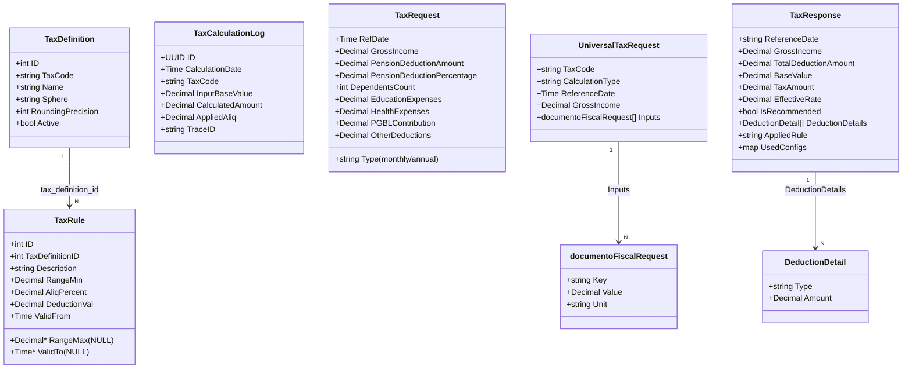

# Modelo de dados — módulo `models`

> Gerado pelo **Arqueólogo** (Reversa) em 2026-06-10
> Fonte: `models/tax_models.go` · Sem fluxo de controle (só definições de tipo)

## Relacionamento entre structs / tabelas

> Legenda: `Decimal*` / `Time*` = ponteiro = coluna NULL-ável.
> `TaxRequest`/`UniversalTaxRequest` (entrada) e `TaxResponse` (saída) são consumidos pela camada de **cálculo ausente** deste recorte (🔴 LACUNA).
