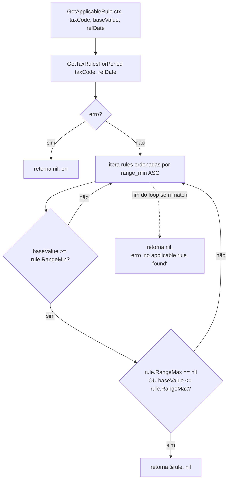
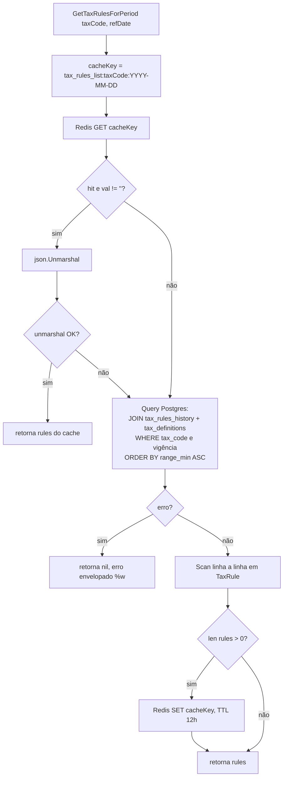
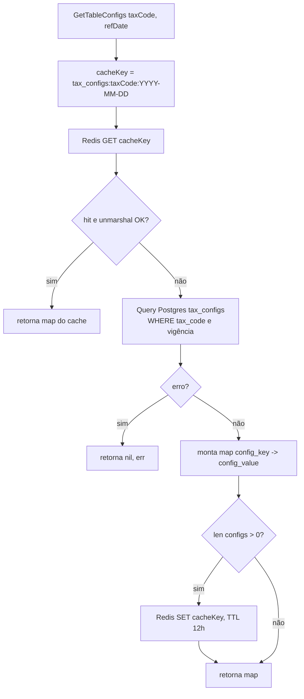
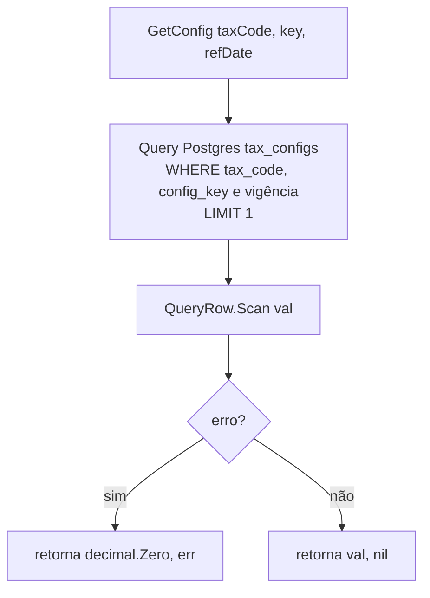

# Fluxogramas — módulo `repository`

> Gerado pelo **Arqueólogo** (Reversa) em 2026-06-10
> Fonte: `repository/tax_repository.go`

---

## `GetApplicableRule` — resolução de faixa progressiva

---

## `GetTaxRulesForPeriod` — cache-aside + query historizada

---

## `GetTableConfigs` — cache-aside de configs

---

## `GetConfig` — leitura de valor único (sem cache)

