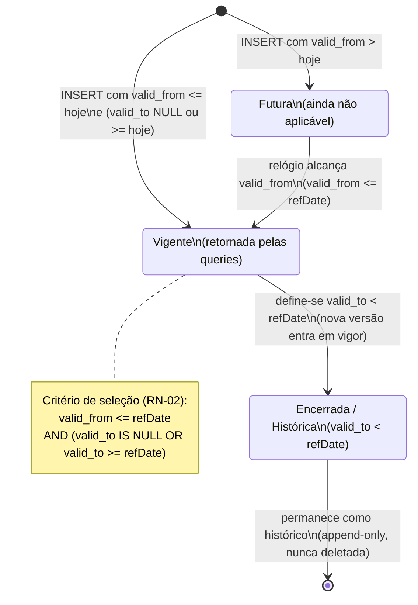
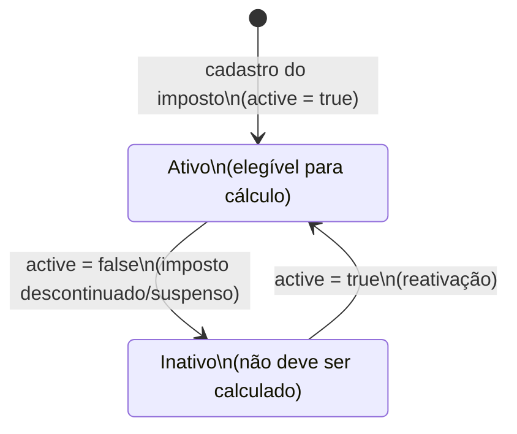

# Máquinas de Estado — taxnexus-individual-core-lib

> Gerado pelo **Detetive** (Reversa) em 2026-06-10 · `doc_level = completo`
> Confiança: 🟢 CONFIRMADO · 🟡 INFERIDO · 🔴 LACUNA

Este sistema **não tem máquinas de estado explícitas** (sem coluna `status` com transições disparadas por comandos). O que existe são **dois ciclos de vida implícitos**, derivados de campos de vigência temporal e da flag `active`. Ambos são modelados abaixo como máquinas de estado *temporais* — as transições não são acionadas por eventos de usuário, mas pelo **avanço do relógio** em relação a `valid_from`/`valid_to` e por **operações de manutenção** sobre os dados.

---

## SM-01 — Ciclo de vida de vigência (`TaxRule` e `tax_configs`) 🟢

Toda faixa de imposto e todo parâmetro de configuração tem uma janela `[valid_from, valid_to]`. Relativo a uma `refDate` de consulta, o registro está em um destes estados:

**Estados:**

| Estado | Condição (relativa a `refDate`) | Aparece nas queries? | Confiança |
|--------|----------------------------------|----------------------|-----------|
| **Futura** | `valid_from > refDate` | Não | 🟢 |
| **Vigente** | `valid_from <= refDate AND (valid_to IS NULL OR valid_to >= refDate)` | **Sim** | 🟢 |
| **Encerrada / Histórica** | `valid_to < refDate` | Não | 🟢 |

**Transições:**
- Não há comando de usuário; o estado é **função da `refDate` da consulta**. A mesma linha é "Futura", "Vigente" ou "Encerrada" dependendo da data perguntada. 🟢
- A transição **Vigente → Encerrada** ocorre na prática quando uma manutenção define `valid_to` (encerra a versão antiga) e insere a nova versão — padrão **append-only/historização** sugerido pelo nome `tax_rules_history`. 🟡
- Registros encerrados **nunca são apagados** — são preservados para cálculo retroativo (RN-02). 🟡
- **Fonte:** filtro temporal em `GetConfig:50`, `GetTableConfigs:77`, `GetTaxRulesForPeriod:123-124`.

> 🔴 **LACUNA:** o processo de manutenção (quem/como insere e encerra versões) está fora deste repositório — não há código de escrita (`INSERT`/`UPDATE`) aqui. Confirmar com o time o fluxo de atualização da tabela progressiva quando a lei muda.

---

## SM-02 — Ativação de imposto (`TaxDefinition.Active`) 🟡

| Estado | Condição | Confiança |
|--------|----------|-----------|
| **Ativo** | `active = true` | 🟡 |
| **Inativo** | `active = false` | 🟡 |

- 🟡 **INFERIDO** do campo `TaxDefinition.Active`. 🔴 **Nenhuma query neste repositório filtra por `active`** — a verificação (e portanto a transição efetiva de comportamento) ocorre na camada de cálculo ausente. Ver RN-09 e lacuna D5.
- Não há campos de auditoria (quem ativou/desativou, quando) neste recorte. 🔴

---

## Observações
- Não foram encontradas máquinas de estado de **processo de negócio** (ex.: status de uma declaração, fluxo de aprovação) — coerente com a natureza da biblioteca, que é **só leitura de parâmetros**. Qualquer máquina de estado de processo estaria na(s) camada(s) consumidora(s).
- O `TaxCalculationLog` é um registro de evento (imutável após escrita), não uma entidade com ciclo de vida. 🟡
