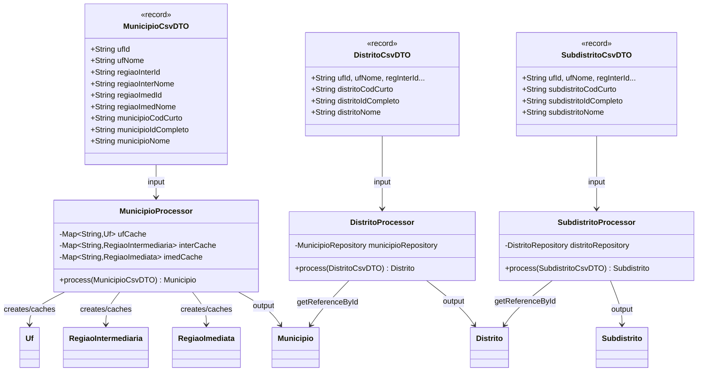
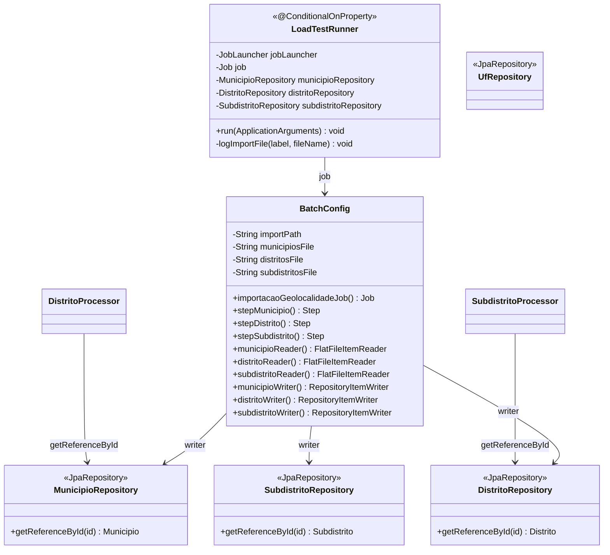

# C4 — Nível 4: Código (Diagrama de Classes)

## Diagrama de Entidades

```mermaid
classDiagram
    class Uf {
        <<Entity>>
        -String id
        -String sigla
        -String nome
        +Uf(id, sigla, nome)
        +getId() String
        +getSigla() String
        +getNome() String
    }

    class RegiaoIntermediaria {
        <<Entity>>
        -String id
        -String nome
        -Uf uf
        +RegiaoIntermediaria(id, nome, uf)
        +getId() String
        +getNome() String
        +getUf() Uf
    }

    class RegiaoImediata {
        <<Entity>>
        -String id
        -String nome
        -RegiaoIntermediaria regiaoIntermediaria
        +RegiaoImediata(id, nome, regiaoIntermediaria)
        +getId() String
        +getNome() String
        +getRegiaoIntermediaria() RegiaoIntermediaria
    }

    class Municipio {
        <<Entity>>
        -String id
        -String codigo
        -String nome
        -RegiaoImediata regiaoImediata
        +Municipio(id, codigo, nome, regiaoImediata)
        +getId() String
        +getCodigo() String
        +getNome() String
        +getRegiaoImediata() RegiaoImediata
        +getCodigoIbge7() String
        +getNomeMunicipio() String
        +getUfSigla() String
    }

    class Distrito {
        <<Entity>>
        -String id
        -String codigo
        -String nome
        -Municipio municipio
        +Distrito(id, codigo, nome, municipio)
        +getId() String
        +getCodigo() String
        +getNome() String
        +getMunicipio() Municipio
    }

    class Subdistrito {
        <<Entity>>
        -String id
        -String codigo
        -String nome
        -Distrito distrito
        +Subdistrito(id, codigo, nome, distrito)
        +getId() String
        +getCodigo() String
        +getNome() String
        +getDistrito() Distrito
        +getCodigoSubdistrito11() String
        +getNomeSubdistrito() String
    }

    Uf "1" --> "*" RegiaoIntermediaria : uf_id FK
    RegiaoIntermediaria "1" --> "*" RegiaoImediata : regiao_intermediaria_id FK
    RegiaoImediata "1" --> "*" Municipio : regiao_imediata_id FK
    Municipio "1" --> "*" Distrito : municipio_id FK
    Distrito "1" --> "*" Subdistrito : distrito_id FK
```

## Diagrama de Processors + DTOs

## Diagrama de Configuração (BatchConfig + LoadTestRunner)

## IDs e Cardinalidades

| Entidade | PK (String) | Tamanho | FK | Cascade |
|---|---|---|---|---|
| Uf | Código IBGE 2 dígitos | 2 | — | — |
| RegiaoIntermediaria | Código IBGE 4 dígitos | 4 | UF (uf_id) | MERGE |
| RegiaoImediata | Código IBGE 6 dígitos | 6 | RegiaoIntermediaria (regiao_intermediaria_id) | MERGE |
| Municipio | Código IBGE 7 dígitos | 7 | RegiaoImediata (regiao_imediata_id) | MERGE |
| Distrito | Código IBGE 9 dígitos | 9 | Municipio (municipio_id) | MERGE |
| Subdistrito | Código IBGE 11 dígitos | 11 | Distrito (distrito_id) | MERGE |

**Nota sobre CascadeType:** Todas as FKs usam `CascadeType.MERGE` (não `PERSIST` ou `ALL`). Isso é intencional no contexto Batch, onde entidades referenciadas (ex: `Uf`) podem já existir ou serem criadas no mesmo chunk. `MERGE` é mais seguro que `PERSIST` para evitar `DetachedEntityException`.

## Legacy Getters

`Municipio` e `Subdistrito` possuem getters com nomes alternativos mantidos para compatibilidade:

| Classe | Legacy Getter | Equivalente |
|---|---|---|
| Municipio | `getCodigoIbge7()` | `getId()` |
| Municipio | `getNomeMunicipio()` | `getNome()` |
| Municipio | `getUfSigla()` | Navegação: `getRegiaoImediata().getRegiaoIntermediaria().getUf().getSigla()` |
| Subdistrito | `getCodigoSubdistrito11()` | `getId()` |
| Subdistrito | `getNomeSubdistrito()` | `getNome()` |
