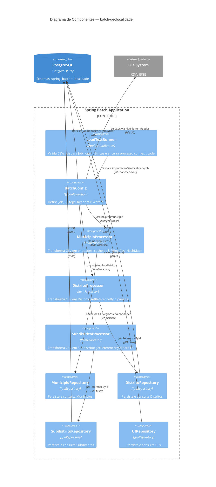

# C4 — Nível 3: Componentes

## Diagrama

## Elementos

| Nome | Tipo | Responsabilidade | Tecnologia |
|---|---|---|---|
| **LoadTestRunner** | ApplicationRunner | Validar existência dos CSVs, disparar Job, logar métricas, encerrar processo com exit code 0/1 | Spring Boot `ApplicationRunner` |
| **BatchConfig** | @Configuration | Definir Job (`importacaoGeolocalidadeJob`), 3 Steps, 3 Readers (FlatFileItemReader), 3 Writers (RepositoryItemWriter) | Spring Batch Java DSL |
| **MunicipioProcessor** | ItemProcessor<DTO, Entity> | Transformar CSV em entidades UF→RegInter→RegImed→Municipio com cache HashMap | Java, JPA CascadeType.MERGE |
| **DistritoProcessor** | ItemProcessor<DTO, Entity> | Transformar CSV em Distrito referenciando Municipio via `getReferenceById` | Java, JPA proxy |
| **SubdistritoProcessor** | ItemProcessor<DTO, Entity> | Transformar CSV em Subdistrito referenciando Distrito via `getReferenceById` | Java, JPA proxy |
| **Repositories** | JpaRepository | Persistência e consulta de entidades | Spring Data JPA |

## Fluxos Principais

### Fluxo: stepMunicipio (chunk de 100)

1. `FlatFileItemReader<MunicipioCsvDTO>` lê 100 linhas de `DTB_Municipios.csv` (pula 7 linhas de metadados)
2. Para cada linha, `MunicipioProcessor.process(item)`:
   - `ufCache.computeIfAbsent(id, ...)` → cria `Uf` com sigla do mapa estático `UF_SIGLAS`
   - `interCache.computeIfAbsent(id, ...)` → cria `RegiaoIntermediaria`
   - `imedCache.computeIfAbsent(id, ...)` → cria `RegiaoImediata`
   - Retorna `new Municipio(id, codigo, nome, imediata)`
3. `RepositoryItemWriter<Municipio>` persiste 100 entidades via `municipioRepository.save()`
4. Transação commitada; caches mantidos na memória até fim do step

### Fluxo: stepDistrito (chunk de 100)

1. `FlatFileItemReader<DistritoCsvDTO>` lê 100 linhas de `DTB_Distritos.csv`
2. Para cada linha, `DistritoProcessor.process(item)`:
   - `municipioRepository.getReferenceById(item.municipioId())` → proxy JPA (sem SELECT)
   - Retorna `new Distrito(id, codigo, nome, municipioRef)`
3. `RepositoryItemWriter<Distrito>` persiste 100 entidades

### Fluxo: stepSubdistrito (chunk de 100)

1. Idêntico ao stepDistrito, mas lendo `DTB_Subdistritos.csv` e referenciando `Distrito`
