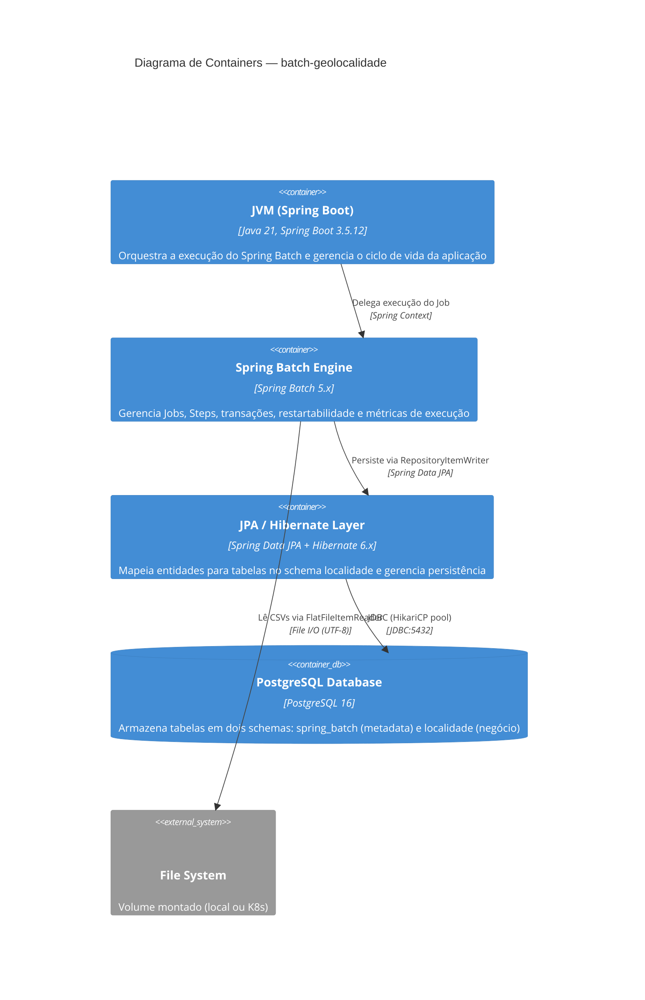

# C4 — Nível 2: Containers

## Diagrama

## Elementos

| Nome | Tipo | Responsabilidade | Tecnologia |
|---|---|---|---|
| JVM (Spring Boot) | Container | Application context, injeção de dependências, configuração, ciclo de vida | Java 21, Spring Boot 3.5.12 |
| Spring Batch Engine | Container | Orquestração de Jobs/Steps, gerenciamento transacional, chunk processing, métricas | Spring Batch 5.x |
| JPA / Hibernate Layer | Container | Mapeamento objeto-relacional, persistência de entidades, proxies lazy | Spring Data JPA, Hibernate 6.x |
| PostgreSQL Database | Container (Database) | Armazenamento durável em dois schemas | PostgreSQL 16 |
| File System | External System | Fonte de dados — arquivos CSV do IBGE | Volume (local ou K8s PV) |

## Fluxos Principais

### Fluxo: Chunk Processing (exemplo: Step Municípios)

1. `FlatFileItemReader` abre `DTB_Municipios.csv` do File System
2. Lê 100 linhas (1 chunk), pula 7 linhas de metadados
3. Para cada linha, `MunicipioProcessor` transforma `MunicipioCsvDTO` → `Municipio` (com cache de UF/Regiões)
4. `RepositoryItemWriter` persiste as 100 entidades via `MunicipioRepository.save()`
5. Spring Batch commita a transação
6. Repete até EOF

### Fluxo: Dual Schema

1. `init-postgres.sql` cria schemas `spring_batch` e `localidade` (idempotente)
2. Conexão JDBC usa `currentSchema=spring_batch` → tabelas `BATCH_*` criadas aqui
3. Hibernate usa `default_schema=localidade` → tabelas de negócio (`uf`, `municipio`, etc.) criadas aqui
