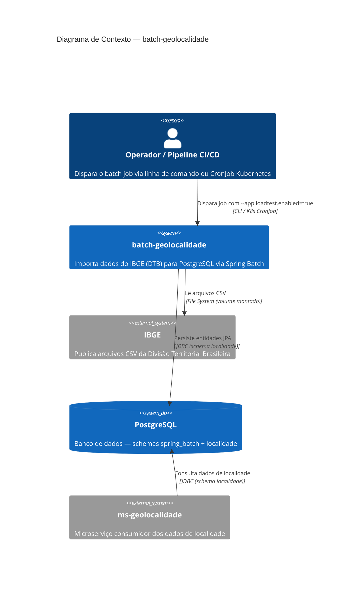

# C4 — Nível 1: Contexto do Sistema

## Diagrama

## Elementos

| Nome | Tipo | Responsabilidade | Tecnologia |
|---|---|---|---|
| Operador / Pipeline CI/CD | Person | Disparar a execução do batch em ambiente local ou cluster | CLI, Kubernetes CronJob |
| batch-geolocalidade | System | Ler CSVs do IBGE, processar e persistir hierarquia geopolítica brasileira | Java 21, Spring Boot 3.5.12, Spring Batch 5 |
| IBGE | External System | Fornecer arquivos CSV oficiais da Divisão Territorial Brasileira | Arquivos CSV (File System) |
| PostgreSQL | Database | Armazenar tabelas de metadata do batch e tabelas de negócio | PostgreSQL 16 |
| ms-geolocalidade | External System | Consultar dados de localidade para enriquecer respostas de API | Go/Fiber ou Java/Spring |

## Fluxos Principais

### Fluxo: Importação Completa da DTB

1. Operador (ou CronJob K8s) executa o JAR com `--app.loadtest.enabled=true`
2. `LoadTestRunner` valida existência dos arquivos CSV no path configurado
3. Job `importacaoGeolocalidadeJob` inicia
4. **Step 1** (`stepMunicipio`): Lê `DTB_Municipios.csv`, processa UF/Regiões/Municípios, escreve no PostgreSQL
5. **Step 2** (`stepDistrito`): Lê `DTB_Distritos.csv`, referencia Municípios existentes, escreve Distritos
6. **Step 3** (`stepSubdistrito`): Lê `DTB_Subdistritos.csv`, referencia Distritos existentes, escreve Subdistritos
7. `LoadTestRunner` loga contagens finais e encerra o processo com exit code 0 ou 1
8. `ms-geolocalidade` consulta as tabelas no schema `localidade` para servir dados de geolocalização
